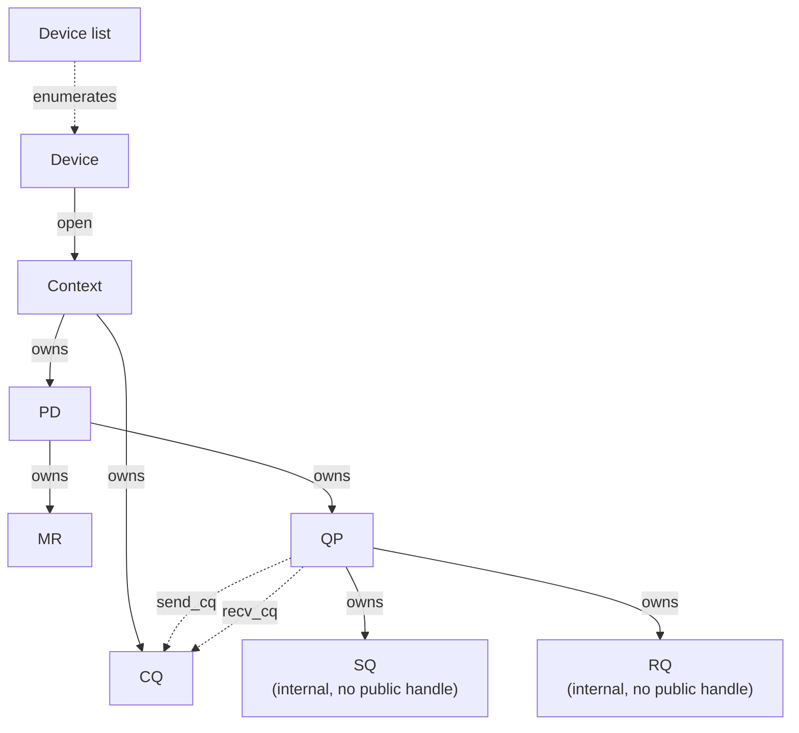

# Object Lifecycle

Sources:

- [reviewed F02-S02 revision 17](../v1_docs/F02_API_契约与对象模型/F02-S02_对象模型与生命周期契约_步骤文档.md)
- [reviewed F02-S04 revision 20](../v1_docs/F02_API_契约与对象模型/F02-S04_WR_WC_与完成语义契约_步骤文档.md)
- [reviewed F03-S03 revision 13](../v1_docs/F03_Daemon_控制面与对象生命周期/F03-S03_PD、MR、CQ_元数据与严格生命周期_步骤文档.md)
- [reviewed F03-S04 revision 7](../v1_docs/F03_Daemon_控制面与对象生命周期/F03-S04_QP、SQ、RQ_所有权与_CQ_关联_步骤文档.md)

This contract fixes the Client-visible ownership, reference, handle-lifetime, and failure behavior
for the v1 object subset. It does not prescribe daemon storage, reference-count implementation, IPC
encoding, or provider WQE/CQE layout.

## Object graph

The public object tree is strict child-first and has no cascade-destroy operation. A reference edge
blocks destruction of its target but does not transfer ownership. SQ and RQ are internal QP
components, not independently addressable public objects.

## Ownership and references

| Object | Parent or source | Ownership or reference contract | Lifetime boundary |
|-|-|-|-|
| Device list / Device | `ugdr_get_device_list` | The returned list owns its pointer array. A Device pointer may be used to open a Context while the list remains valid. | Freeing the list invalidates unopened Device pointers. A Context already opened from a Device remains valid. |
| Context | Opened from a Device | Owns PD and CQ public children. | Closing is rejected while any PD or CQ exists. There is no cascade cleanup. |
| PD | Context | Owns or constrains the protection-domain relationship of MR and QP. | Deallocation is rejected while any MR or QP exists. |
| MR | PD | Owns no other public object. Its public record is a Client snapshot with direct `lkey` and `rkey`; accepted WRs may retain a use reference. | Successful deregistration invalidates the handle. Deregistration returns `EBUSY` while any accepted incomplete WR references the MR. |
| CQ | Context | May be referenced as a QP's `send_cq`, `recv_cq`, or both. | Destruction is rejected while any QP references it. |
| QP | PD | Owns its internal SQ and RQ and references `send_cq` and `recv_cq`. The QP, PD, and both CQs belong to one Context. | Destruction removes the PD/CQ relationships, destroys SQ/RQ, and invalidates the QP. It creates no additional WC; unexecuted WRs stop accessing buffers, while WCs already in a CQ remain pollable. |
| SQ / RQ | QP | Internal queues owned by the QP. Applications post Send WRs to SQ and Receive WRs to RQ through QP operations. | No independent public handle, create operation, or destroy operation. Entering ERR flushes each incomplete WR; QP destruction itself does not synthesize completion. |

SRQ is unsupported in v1. Adding an independently managed shared receive queue requires a later
reviewed API and lifecycle contract.

## Create and destroy behavior

| Operation | Success precondition | Success result | Unreleased dependency |
|-|-|-|-|
| `ugdr_free_device_list` | The argument is a valid list returned by device enumeration. | Frees the list. Unopened Device pointers become invalid; opened Contexts are unaffected. | No child-object blocker. A repeated or invalid free is an invalid-handle case. |
| `ugdr_close_device` | The Context has no PD or CQ. | Returns 0 and invalidates only the Context handle. | Returns `-1`, sets `errno=EBUSY`, and changes no state. |
| `ugdr_dealloc_pd` | The PD has no MR or QP. | Returns 0, removes the Context relationship, and invalidates the PD handle. | Returns `EBUSY` and changes no state. |
| `ugdr_dereg_mr` | The MR handle is valid and no accepted incomplete WR references it. | Returns 0, removes the PD relationship, and invalidates the MR handle. | Returns `EBUSY` while an accepted incomplete WR references the MR; state and keys remain valid for retry. |
| `ugdr_destroy_cq` | No QP references the CQ through `send_cq` or `recv_cq`. | Returns 0, removes the Context relationship, and invalidates the CQ handle. | Returns `EBUSY` and changes no state. |
| `ugdr_destroy_qp` | The QP handle is valid. | Returns 0, destroys internal SQ/RQ, removes PD/CQ relationships, invalidates the QP, and creates no additional completion. Already queued WCs remain in their CQ. | No separate in-flight blocker. WRs flushed by an earlier ERR transition retain those WCs; unexecuted WRs cease buffer access when destroy returns. |

Every public destroy operation acts only on its target public object. It never recursively destroys
independent children. A failed operation leaves the target handle and all relationships unchanged so
the caller may release blockers and retry.

## Invalid handles and creation failures

| Condition | Observable result | State change |
|-|-|-|
| Null handle, wrong object type, stale handle, or repeated destroy | Returns `EINVAL`. `ugdr_close_device` returns `-1` and sets `errno=EINVAL`. | None |
| QP creation receives a PD, `send_cq`, and `recv_cq` that do not belong to one Context | Returns null and sets `errno=EINVAL`. | No partial QP and no new relationship |
| Parent or CQ still has a Client-visible dependency | Reports `EBUSY` in the corresponding function's standard return domain. | None; the original handle remains valid |
| Operation is not yet implemented beyond QP lifecycle metadata | The corresponding state, connection, or data-path public entry point reports `EOPNOTSUPP`. | No partial state or successful placeholder result |

The daemon may use registries, generations, reference counts, or another internal technique to meet
these results. Those mechanisms are not Client-visible contract.

## CUDA MR mapping boundary

v1 MR registration accepts only a nonempty interval inside a `cudaMalloc` device allocation. The
Client keeps its own address in `mr->addr`; the daemon opens the allocation by opaque CUDA IPC
handle under the physical GPU selected by UUID, and records a separate daemon address. Successful
deregistration closes that mapping before removing the PD relationship, keys, and identity. A close
failure preserves the complete live MR so the caller can retry. Session disconnect force-reclaims
MR mappings before PD/CQ and Context metadata.

## Queue-reference boundary

Accepted WR descriptors are copied during posting, but their non-inline buffers and referenced MRs
remain live until completion. Entering QP ERR generates one flush WC for every incomplete SQ/RQ WR,
including unsignaled Send WRs. Destroying the QP does not generate a second WC or discard WCs already
queued in a CQ. These rules are detailed in [WR/WC and Completion Semantics](wr-wc-semantics.md).
