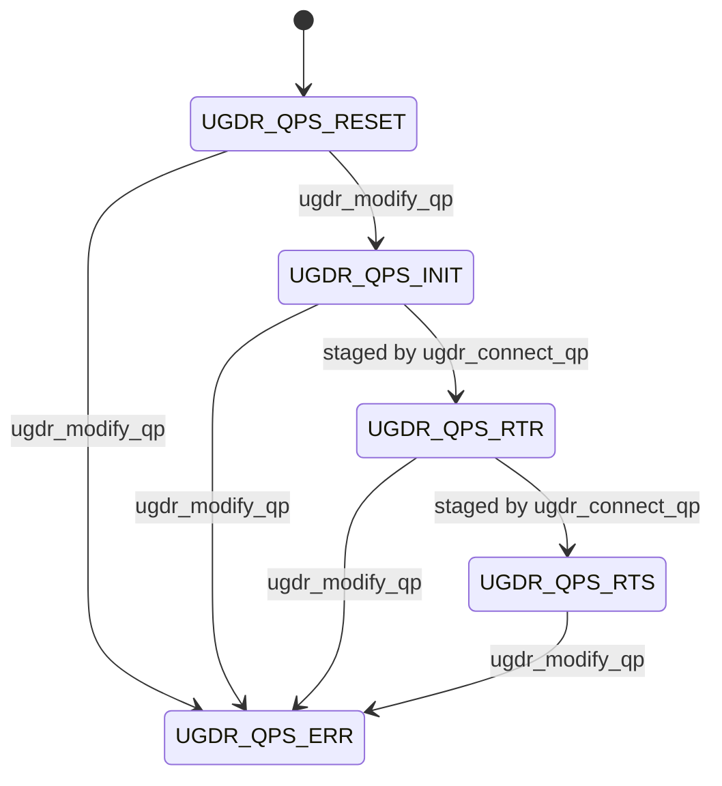

# RC QP State Machine

Sources:

- [reviewed F02-S03 revision 7](../v1_docs/F02_API_契约与对象模型/F02-S03_RC_QP_建连与状态机契约_步骤文档.md)
- [reviewed F02-S04 revision 20](../v1_docs/F02_API_契约与对象模型/F02-S04_WR_WC_与完成语义契约_步骤文档.md)

This contract fixes the Client-visible v1 RC QP creation attributes, query records, connection
identity, legal state changes, failure results, and atomic connection helper. F02 still provides
linkable placeholders only: no operation in this document implies that daemon objects, IPC, queues,
or data movement are implemented.

## Public records and mask

The declarations in `include/ugdr/api.hpp` use the following field order:

| Record | Field | Type | Contract |
|-|-|-|-|
| `ugdr_qp_init_attr` | `send_cq` | `ugdr_cq *` | Send completion queue; same Context as the PD and receive CQ. |
|  | `recv_cq` | `ugdr_cq *` | Receive completion queue; may equal `send_cq`. |
|  | `max_send_wr` | `uint32_t` | Requested nonzero SQ WR capacity. |
|  | `max_recv_wr` | `uint32_t` | Requested nonzero RQ WR capacity. |
|  | `max_send_sge` | `uint32_t` | Requested nonzero maximum Send WR SGE count. |
|  | `max_recv_sge` | `uint32_t` | Requested nonzero maximum Receive WR SGE count. |
|  | `qp_type` | `ugdr_qp_type` | Must be `UGDR_QPT_RC`. |
|  | `sq_sig_all` | `int` | Must be 0 or 1. |
| `ugdr_qp_attr` | `qp_state` | `ugdr_qp_state` | Requested target state on modify; observed state on query. |
|  | `cur_qp_state` | `ugdr_qp_state` | Optional expected-state guard on modify; same snapshot as `qp_state` on query. |
|  | `qp_access_flags` | `int` | v1 QP access value; RESET to INIT requires exactly `UGDR_ACCESS_REMOTE_WRITE`. |
|  | `timeout` | `uint8_t` | Standard RC requester ACK-timeout encoding. |
|  | `retry_cnt` | `uint8_t` | Standard RC transport retry-count encoding. |
|  | `rnr_retry` | `uint8_t` | Standard RNR retry encoding; value 7 means infinite retry. |
|  | `min_rnr_timer` | `uint8_t` | Standard responder minimum RNR timer encoding. |
| `ugdr_qp_conn_info` | `qp_num` | `uint32_t` | Standard-style QP number in the daemon control domain. |
|  | `endpoint_id` | `uint64_t` | Opaque generation-safe endpoint resolution key. |

v1 exposes no SRQ or inline-data field. It also exposes no GID, LID, MTU, PSN, IP address, port,
or other hardware/network path attribute. The four retry attributes are the only standard RC timing
fields exposed and are supplied to the same-daemon connect extension.

`ugdr_qp_attr_mask` contains the following libibverbs-aligned values:

| Name | Value | Use |
|-|-|-|
| `UGDR_QP_STATE` | `1U << 0U` | Select `qp_state`. |
| `UGDR_QP_CUR_STATE` | `1U << 1U` | Select the expected/current state guard. |
| `UGDR_QP_ACCESS_FLAGS` | `1U << 3U` | Select `qp_access_flags`. |
| `UGDR_QP_TIMEOUT` | `1U << 9U` | Select `timeout`. |
| `UGDR_QP_RETRY_CNT` | `1U << 10U` | Select `retry_cnt`. |
| `UGDR_QP_RNR_RETRY` | `1U << 11U` | Select `rnr_retry`. |
| `UGDR_QP_MIN_RNR_TIMER` | `1U << 15U` | Select `min_rnr_timer`. |

Any bit outside this set is invalid and produces `EINVAL` without writing output or changing QP
state.

## Creation and identity

The eventual runtime `ugdr_create_qp` contract requires a valid PD, both CQs in the PD's Context,
nonzero WR capacities, nonzero SGE maxima, `UGDR_QPT_RC`, and `sq_sig_all` equal to 0 or 1. Invalid
pointers, cross-Context relationships, or invalid fields return null with `errno=EINVAL` and create
no partial object. Provider resource limits and any capacity adjustment are deferred to the runtime
implementation and are not simulated by F02.

A successfully created QP starts in `UGDR_QPS_RESET` and has both identity fields. `qp_num` is
Client-visible and may follow the daemon's allocation policy. `endpoint_id`, not `qp_num` alone, is
the generation-safe resolution key: after destruction, stale connection information must never
resolve to a newly allocated QP that reused a number.

Connection information is exchanged only between Clients in the same daemon control domain. It is
an in-memory public record, not a network or persistent wire format; this contract defines no byte
order or serialization.

## Query contract

`ugdr_query_qp` writes the creation attributes and only the state attributes selected by the mask.
If both state fields are selected, `qp_state` and `cur_qp_state` report one consistent snapshot.
Invalid handles, null required output pointers, or unknown mask bits return `EINVAL` and leave all
outputs unchanged.

`ugdr_query_qp_conn_info` succeeds for a live QP in any state and returns its local identity. The
record does not assert that a peer is bound or that the QP is ready. An invalid or stale QP handle
returns `EINVAL` and leaves the output unchanged.

## State model

The numeric `ugdr_qp_state` values remain aligned with `IBV_QPS_*`. The supported v1 path is:



| Entry point | Start | Target | Required mask and fields | Result |
|-|-|-|-|-|
| `ugdr_modify_qp` | `UGDR_QPS_RESET` | `UGDR_QPS_INIT` | `UGDR_QP_STATE \| UGDR_QP_ACCESS_FLAGS`, optionally `UGDR_QP_CUR_STATE`; target INIT; access exactly Remote Write; guard, when present, RESET. | Enter INIT. |
| `ugdr_connect_qp` | `UGDR_QPS_INIT` | `UGDR_QPS_RTS` | Remote identity resolves in the same daemon to a live RC QP in INIT, RTR, or RTS; local QP is not bound to another peer; attr mask contains exactly the required timeout, retry-count, RNR-retry, and minimum-RNR-timer fields. | Apply the four retry attributes, atomically stage INIT to RTR to RTS, and bind the peer. |
| `ugdr_modify_qp` | RESET, INIT, RTR, or RTS | `UGDR_QPS_ERR` | `UGDR_QP_STATE`, optionally `UGDR_QP_CUR_STATE`; no unrelated selected fields; guard, when present, equals the start state. | Enter ERR. |
| `ugdr_modify_qp` | Any | `UGDR_QPS_SQD` or `UGDR_QPS_SQE` | Any otherwise well-formed request. | Return `EOPNOTSUPP`; no change. |
| Either transition entry | Any other combination | Any | Not listed above. | Return `EINVAL`; no change. |

ERR is terminal in v1. ERR to RESET, ERR to INIT, and direct public modification to RTR or RTS are
invalid. Entering ERR generates one `UGDR_WC_WR_FLUSH_ERR` for every incomplete SQ or RQ WR,
including unsignaled Send WRs; WCs already in a CQ remain available to poll.

## Atomic connection helper

`ugdr_connect_qp` is a UGDR extension that replaces the two externally issued
`ibv_modify_qp`-style INIT to RTR and RTR to RTS calls for the supported same-daemon loop. The
implementation validates and stages both transitions before one Client-visible commit:

```python
def connect(local_qp, remote_info, attr, attr_mask):
    validate_local_handle_remote_record_and_attr()
    require(attr_mask == TIMEOUT | RETRY_CNT | RNR_RETRY | MIN_RNR_TIMER, EINVAL)
    if local_qp.is_bound_to_different_peer(remote_info):
        return EBUSY
    require(local_qp.state == INIT, EINVAL)
    remote_qp = resolve_in_same_daemon(remote_info.endpoint_id)
    require(remote_qp exists and remote_qp.qp_num == remote_info.qp_num, ENOENT)
    require(remote_qp.type == RC and remote_qp.state in {INIT, RTR, RTS}, EINVAL)

    staged_retry_policy = validate_retry_encodings(attr)
    staged_peer = remote_qp.identity
    staged_state = apply_INIT_to_RTR_to_RTS_offline()
    commit_peer_retry_policy_and_state_once(staged_peer, staged_retry_policy, staged_state)
    return 0
```

The helper never advances the remote QP. A second Client must connect its own QP independently.
After success, a query observes RTS and the recorded peer. No failure may expose RTR, a partial peer
binding, or a modified remote QP.

## Failure results and precedence

| Condition | Result | Side effects |
|-|-|-|
| Invalid handle, null required pointer, malformed field, unknown mask bit, state-guard mismatch, or unsupported normal-state combination | `EINVAL` | None |
| Remote `endpoint_id` is unknown, stale, outside the daemon control domain, or resolves with a different `qp_num` | `ENOENT` | None |
| The local QP is already bound to a different peer | `EBUSY` | None |
| Target state is SQD or SQE | `EOPNOTSUPP` | None |

For `ugdr_connect_qp`, validate the local handle, remote record, attribute pointer, required mask,
and retry encodings first; then report an existing different-peer binding, require local INIT,
resolve the endpoint, and validate the remote RC type and state. Reconnecting the same peer is not
idempotent: after the first success the local QP is RTS, so the repeated call returns `EINVAL`.

All failures are atomic. They preserve the local state, existing peer binding, remote QP, and caller
outputs.

## F02 placeholder and runtime boundary

F02 defines records and contracts but retains the existing linkable placeholder results:

- `ugdr_create_qp` returns null and sets `errno=EOPNOTSUPP` without modifying init attributes.
- `ugdr_modify_qp`, `ugdr_query_qp`, `ugdr_query_qp_conn_info`, and the four-argument
  `ugdr_connect_qp` return `EOPNOTSUPP`.
- Query placeholders do not write `ugdr_qp_attr`, `ugdr_qp_init_attr`, or
  `ugdr_qp_conn_info`.

Runtime handle validation, endpoint registration, IPC, control-plane storage, SQ/RQ allocation, WR
processing, completion production, and ERR-flush execution are not implemented in F02. Their
Client-visible results are fixed by F02-S04 and later runtime features must implement them without
expanding the public surface.
