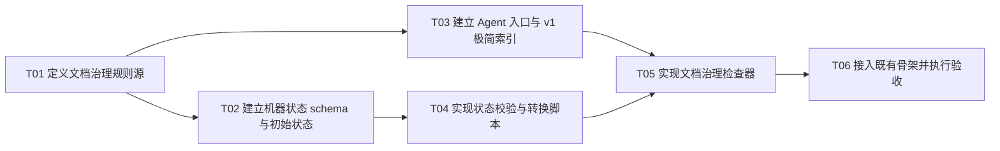

# F01-S02_项目文档、状态与进度交接体系 步骤文档

**所属版本：** v1

**所属版本文档：** [UGDR_v1 版本文档](../UGDR_v1_版本文档.md)

**所属功能文档：** [F01_项目初始化与开发 Harness 功能文档](F01_项目初始化与开发_Harness_功能文档.md)

**功能标识：** F01-项目初始化与开发 Harness

**步骤标识：** F01-S02-项目文档、状态与进度交接体系

- [x] 已实现

## 一、目标与完成条件

建立以飞书审阅文档为决策源、以仓库 Markdown 快照和机器状态为执行入口的交接体系。完成时，`AGENTS.md`、`docs/status/current.json`、`docs/v1_docs` 极简索引与已审阅文档快照各有唯一职责；状态只使用五个稳定状态，`next_actions` 支持并行功能/步骤，`tools/project_state.py` 能机械校验状态并按合法转换矩阵、人工门禁和原子写入规则受控更新状态。

## 二、实现设计

### 边界与责任

| 载体 | 唯一职责 | 禁止承载 |
|-|-|-|
| `AGENTS.md` | 项目地图、长期约束、文档入口和固定验证入口 | 当前步骤、下一动作、执行进度和临时计划 |
| `docs/status/current.json` | 当前版本、功能、步骤、稳定状态、并行下一动作、阻塞和更新时间的机器事实源 | 过程阶段、人工确认字段、验证证据流水、设计论证和决策记录 |
| `docs/v1_docs` | 已审阅飞书版本、功能和步骤文档的 Agent 执行快照；`README.md` 只做低频极简索引 | 未经人工审阅的设计草稿、独立决策源和频繁变动进度 |

S02 建立状态 schema、文档载体、极简索引、独立机械检查，以及 `tools/project_state.py` 的状态校验与受控转换核心。S04 将这些能力接入统一 `tools/ugdr state` 和 `tools/ugdr lint`；S05 只实现下一动作判定、调用时机和自然语言编排，不重复实现或绕过状态转换规则。

### 文件与模块改动

| 位置 | 交付内容 | 约束 |
|-|-|-|
| `AGENTS.md` | 精简项目地图、关键约束、文档入口和固定验证入口 | 不超过 150 行；不得设置“当前状态”“下一动作”“执行进度”或“临时计划”标题 |
| `docs/v1_docs/README.md` | 低频极简索引，链接 v1 版本文档、F01 功能文档和已同步步骤文档 | 只引用已完成审阅后同步到仓库内的 Markdown；不记录执行流水 |
| `docs/status/current.schema.json` | 定义当前状态字段、类型、五个状态枚举和必填项 | schema 版本固定为 1；未知字段拒绝通过 |
| `docs/status/current.json` | 保存唯一机器状态和并行 `next_actions` | JSON 必须符合 schema；不保存人工确认字段、可读摘要或验证证据数组 |
| `docs/governance/document-policy.json` | 声明必需路径、最大行数、必需标题、禁止标题和链接检查范围 | 只保留能机械判断且确有价值的规则 |
| `tools/project_state.py` | 提供 validate 与 transition，校验 current JSON、状态枚举、next_actions 和阻塞规则，并执行受控状态转换 | 所有写入先检查合法转换与人工门禁，并通过同目录临时文件原子替换 current.json；不生成或检查可读摘要 |
| `tools/check_project_docs.py` | 检查治理规则、内部链接、长度、标题职责和状态文件合法性 | 错误逐项输出并返回非零；成功返回零 |
| `tests/integration` | 加入正常仓库和负向 fixture 检查 | 覆盖非法状态、非法 `next_actions`、失效链接和超长 `AGENTS.md` |
| `tools/module-boundaries.json`、`docs/architecture/repository-skeleton.md` | 把新增文档与工具路径纳入既有骨架规则和生成说明 | 保持 S01 的规则源、实际骨架和说明文档一致 |

### 当前状态 schema

| 字段 | 类型或取值 | 语义与规则 |
|-|-|-|
| `schema_version` | 整数 `1` | 不支持的版本立即报错 |
| `version`、`feature`、`step` | 字符串；功能或步骤允许为空 | 标识当前工作范围；非空时必须符合 `vN`、`Fxx`、`Fxx-Sxx` |
| `state` | `awaiting_review`、`ready_for_implementation`、`awaiting_acceptance`、`blocked`、`completed` | 表示项目所处的稳定位置，不表示执行过程 |
| `next_actions` | 对象；键为功能标识，值为步骤标识数组或步骤动作对象数组 | 表达可并行推进的功能/步骤；所有非空步骤必须符合 `Fxx-Sxx` |
| `blockers` | 字符串数组 | `state=blocked` 时至少一项；其他状态为空数组，不使用占位文本 |
| `updated_at`、`updated_by` | RFC 3339 时间；`human` 或 `agent` | 记录最后一次状态变更的时间与执行主体 |

### 状态枚举

| 状态 | 含义 | 退出条件 |
|-|-|-|
| `awaiting_review` | 飞书设计文档等待用户审阅 | 用户完成审阅并触发同步，或退回继续修改 |
| `ready_for_implementation` | 已审阅内容已同步为 Agent 可执行 Markdown，可以开始实现 | 并行实现启动、进入验收等待，或出现阻塞 |
| `awaiting_acceptance` | 实现与验证已提交，等待人工验收 | 用户验收通过、退回调整，或出现阻塞 |
| `blocked` | 权限、环境、外部依赖或决策阻断推进 | 阻塞解除后恢复到对应稳定状态 |
| `completed` | 当前层级已经人工验收完成 | 只由明确验收进入，不由 Agent 自行宣布 |

### 合法状态转换与门禁

| 当前状态 | 允许目标状态 | 转换门禁 |
|-|-|-|
| `awaiting_review` | `ready_for_implementation`、`blocked` | 进入可实现状态时，所有 `--reviewed-doc` 必须存在且 frontmatter 为 `review_status: reviewed`；进入阻塞状态时至少提供一个 blocker。 |
| `ready_for_implementation` | `awaiting_review`、`awaiting_acceptance`、`blocked` | 设计失效时退回审阅；进入验收等待必须显式提供 `--verification-passed`，且 blockers 为空。 |
| `awaiting_acceptance` | `ready_for_implementation`、`completed`、`blocked` | 退回调整时回到可实现状态；进入完成必须同时提供 `--human-confirmed` 且 `updated_by=human`。 |
| `blocked` | `awaiting_review`、`ready_for_implementation`、`awaiting_acceptance` | 必须显式给出恢复目标并清空 blockers；恢复目标仍执行对应目标状态的门禁。 |
| `completed` | 无 | 终态不可由脚本自动重开；需要返工时先由用户明确决定新的工作范围。 |

`transition` 接受 `--to`、`--updated-by`、可选范围字段、`--next-actions-file`、可重复的 `--blocker`、门禁参数和 `--dry-run`。脚本先构造候选状态，检查转换矩阵、目标门禁和完整 schema；任一检查失败时输出当前状态、目标状态与原因并保持文件不变。成功时先输出差异，再通过同目录临时文件和 `os.replace` 原子更新 `current.json`。

### 状态更新责任与执行流程

| 动作 | 责任主体 | 约束 |
|-|-|-|
| 更新当前范围、稳定状态、`next_actions` 和阻塞 | Agent 调用确定性 Python 脚本 | 只能通过 transition 子命令修改；必须基于实际上下文，先通过完整校验再原子写入 |
| 记录人工审阅、实现确认和验收结果 | 用户在飞书明确确认；Agent 只同步结果 | 不得从测试通过、提交存在或上下文推断人工确认 |
| 形成或调整设计决策 | 飞书设计文档审阅流程 | 决策先在飞书完成，再同步到对应版本、功能或步骤 Markdown |
| 维护并行下一动作 | Agent 根据已审阅 Markdown 与当前状态整理 | 只表达可继续推进的功能/步骤，不记录流水账 |

**设计伪代码：**

```python
def validate(root):
    policy = load_json(root / "docs/governance/document-policy.json")
    state = load_json(root / "docs/status/current.json")
    errors = []

    errors += validate_schema(root / "docs/status/current.schema.json", state)
    errors += validate_scope_ids(state["version"], state.get("feature"), state.get("step"))
    errors += validate_state_enum(state["state"])
    errors += validate_next_actions(state["next_actions"])
    errors += validate_blockers(state["state"], state["blockers"])
    errors += validate_document_policy(root, policy)

    emit_errors(errors)
    return 1 if errors else 0
```

**状态转换设计伪代码：**

```python
def transition(root, args):
    current = load_and_validate(root)
    if args.to not in ALLOWED_TRANSITIONS[current["state"]]:
        return reject("illegal transition", current["state"], args.to)

    candidate = build_candidate(current, args)
    errors = validate_schema_and_invariants(candidate)
    errors += validate_target_gate(candidate, args)
    if errors:
        emit_errors(errors)
        return 3

    emit_diff(current, candidate)
    if args.dry_run:
        return 0

    atomic_write_json(root / "docs/status/current.json", candidate)
    return 0
```

`validate` 只检查字段组合、路径、长度和链接等机械规则；`transition` 只按当前状态、目标状态、结构化参数和显式门禁执行确定性转换。两者都不生成可读摘要，不保存验证证据流水，也不根据构建或测试结果自行推断人工确认完成。

### 文档治理检查

| 检查 | 通过条件 | 失败输出 |
|-|-|-|
| 必需路径与标题 | policy 声明的文件存在且包含必需标题 | 路径和缺失标题 |
| 最大长度 | `AGENTS.md` 和索引文档未超限 | 路径、实际行数和上限 |
| 职责边界 | `AGENTS.md` 不包含禁止标题；状态文件不记录进度、决策、人工确认字段或验证证据 | 路径和违反的规则 |
| 内部链接 | 仓库内相对 Markdown 链接解析后存在且不越出仓库 | 来源文件、链接文本和目标路径 |
| 机器状态 | JSON 符合 schema，状态枚举、`next_actions` 和 `blockers` 组合合法 | 字段路径、错误原因和违规值 |
| 退出状态 | 全部检查通过输出明确 OK 并返回零 | 任一违规逐项输出并返回非零 |

### 实现任务拆分

| 任务标识 | 任务 | 交付 | 依赖 |
|-|-|-|-|
| T01 | 定义文档治理规则源 | `document-policy.json` 固定必需路径、长度、链接和职责边界 | 无 |
| T02 | 建立机器状态 schema 与初始状态 | `current.schema.json`、`current.json`、五个状态枚举和 `next_actions` | T01 |
| T03 | 建立 Agent 入口与 v1 极简索引 | `AGENTS.md`、`docs/v1_docs/README.md` | T01 |
| T04 | 实现状态校验与转换脚本 | `tools/project_state.py` validate、transition、原子写入，以及状态和转换负向 fixture | T02 |
| T05 | 实现文档治理检查器 | `check_project_docs.py` 与链接、长度、职责边界负向 fixture | T03、T04 |
| T06 | 接入既有骨架并执行验收 | 更新模块边界与骨架说明，完成正反向验证 | T05 |

**实现任务依赖 DAG：**



当前可并行启动的任务为 T01。T01 完成后，T02 与 T03 可并行推进；T02 完成后执行 T04；T03 与 T04 完成后执行 T05；T05 完成后执行 T06。

## 三、验证与验收

| 顺序 | 验证动作 | 预期结果 | 失败判定 |
|-|-|-|-|
| 1 | `python3 tools/project_state.py validate --root .` | `current.json` 符合 schema，状态、`next_actions` 和阻塞组合有效 | 命令非零，或任一非法字段未被拒绝 |
| 2 | 在临时 fixture 上执行 `transition --dry-run`、合法转换和非法转换 | 合法转换原子更新；dry-run 不写文件；非法边、缺失审阅/验证/人工确认门禁和终态重开均被拒绝 | 非法转换返回零、文件发生部分写入，或门禁可被缺省参数绕过 |
| 3 | `python3 tools/check_project_docs.py --root .` | 必需入口、长度、标题职责、内部链接和机器状态全部通过 | 命令非零，或失效链接、超限文档、职责混写未被识别 |
| 4 | `cmake -S . -B build -G Ninja`<br>`ctest --test-dir build --output-on-failure` | 既有 S01 测试继续通过；负向 fixture 拒绝非法状态、非法转换、非法 `next_actions`、失效链接和超长 `AGENTS.md` | 任一测试失败，或负向 fixture 未得到预期诊断 |
| 5 | 从不带历史聊天的新 shell 只读取 `AGENTS.md`、`docs/v1_docs/README.md` 和 `docs/status/current.json` | 能够确定当前为 F01-S02、所处稳定状态、可并行 `next_actions` 和阻塞情况 | 必须依赖聊天历史、飞书搜索或猜测才能继续 |

验证命令的外层结果必须为零；负向用例只有在被测检查器或转换命令返回非零并包含当前状态、目标状态、字段路径与违规原因时，测试本身才返回零。S02 交付可独立运行的状态校验与转换核心；`tools/ugdr state`、`tools/ugdr lint` 的统一接入和“继续项目”自然语言编排仍分别由 S04、S05 完成。
