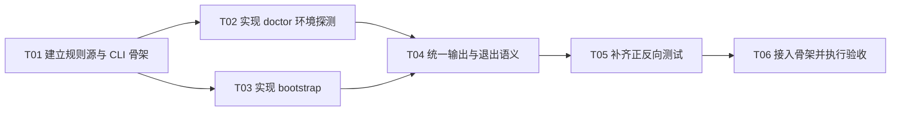

# F01-S03_Bootstrap 与环境诊断 步骤文档

**所属版本：** v1

**所属版本文档：** [UGDR_v1 版本文档](../UGDR_v1_版本文档.md)

**所属功能文档：** [F01_项目初始化与开发 Harness 功能文档](F01_项目初始化与开发_Harness_功能文档.md)

**功能标识：** F01-项目初始化与开发 Harness

**步骤标识：** F01-S03-Bootstrap 与环境诊断

- [ ] 已实现

## 一、目标与完成条件

实现稳定的 `tools/ugdr bootstrap` 与 `tools/ugdr doctor`，检查基础工具命令、CUDA Toolkit 和真实 GPU 是否可用，并提供明确诊断。完成时，基础工具只检查是否存在，CUDA 版本必须满足 `12 < version < 13`，驱动或 GPU 不可用不得报告成功；其他工具版本不在本步骤处理。

## 二、实现设计

### 环境检查规则

`tools/ugdr` 是稳定且 Agent 中立的 Python 3 入口。本步骤只实现 `bootstrap` 与 `doctor`，不提前实现 S04 的 format、lint、build、test、smoke，也不实现 S05 的状态转换和自动编排。

| 检查 | 通过条件 | 失败处理 |
|-|-|-|
| 基础工具 | `python3`、`cmake`、`ninja`、`gcc`、`g++`、`clang`、`clang-format`、`clang-tidy` 命令存在且可执行 | 缺少任一命令时列出名称并返回 10；不读取、不比较版本，版本问题由用户处理 |
| CUDA Toolkit | `nvcc --version` 可执行且解析出的版本满足 `12 < version < 13` | `nvcc` 缺失、版本无法解析或不在范围内时返回 12 |
| NVIDIA 驱动与 GPU | `nvidia-smi` 能与驱动通信并至少发现一张 GPU | 驱动不可通信或未发现 GPU 时返回 13；不检查驱动或 GPU 型号版本 |

本步骤只对 CUDA Toolkit 做版本判断，范围固定为 `12 < version < 13`。其他基础工具不读取、不比较版本；只检查命令是否存在且可执行，具体版本兼容问题由用户在实际构建或使用时处理。所有外部命令均以参数数组调用，禁止 `shell=True`，并使用固定超时。

### 命令契约

| 命令 | 行为 | 允许写入 | 禁止行为 |
|-|-|-|-|
| `tools/ugdr doctor [--json]` | 按固定顺序检查基础命令、CUDA 版本和 GPU，收集全部失败后统一输出；人类模式输出逐项 PASS/FAIL，JSON 模式输出稳定字段 | 无 | 不得安装或修改环境，不得检查 CUDA 以外的工具版本 |
| `tools/ugdr bootstrap [--json] [--build-dir PATH]` | 确认仓库根目录，调用同一组检查，并幂等创建 CMake File API 的 `codemodel-v2` query | 仅目标构建目录内的 `.cmake/api/v1/query/codemodel-v2` 及必要父目录 | 不得执行 `sudo`、`apt`、联网安装、修改用户配置或运行构建 |

bootstrap 不安装依赖，也不提供基础工具的版本选择或兼容建议。缺少命令时只列出名称并停止，由用户自行安装或调整；CUDA 失败时额外显示检测到的版本和要求范围 `12 < version < 13`。

### 文件与模块改动

| 位置 | 交付内容 | 约束 |
|-|-|-|
| `tools/ugdr` | Python 3 可执行入口、参数解析和子命令分派 | 未知命令或非法参数返回 2；不包含具体探测实现 |
| `tools/ugdr_cli/environment.py` | 固定定义 `REQUIRED_BASE_COMMANDS` 与 CUDA 开区间 `(12, 13)`，并实现基础命令存在性、CUDA 版本、GPU 可用性检查和结果聚合 | 规则直接保存在模块内，不读取外部环境检查配置；除 CUDA 外不解析版本；允许注入命令执行器构造测试场景 |
| `tools/ugdr_cli/bootstrap.py` | 仓库根检查、构建目录约束、CMake File API query 幂等创建和修复建议 | 目标路径必须位于仓库内；写入失败返回 20 |
| `tests/integration/test_ugdr_environment.py` | 基础命令缺失、CUDA 范围、GPU、超时、重复执行和路径越界测试 | 使用受控 fake runner 或临时 PATH，不依赖执行测试主机是否真的有 GPU |
| `tools/module-boundaries.json`、`docs/architecture/repository-skeleton.md` | 登记新增工具路径并同步骨架说明 | 保持 S01 的规则源、实际骨架和说明文档一致 |

### 诊断结果与退出码

JSON 输出固定包含 `command`、`ok`、`checks`、`summary` 和 `exit_code`。每个 check 包含 `id`、`required`、`status`、`path`、`diagnostic` 与 `remediation`；仅 CUDA check 额外包含 `observed_version` 和要求范围。状态只有 PASS 或 FAIL，输出不包含时间戳、临时目录等漂移字段。

| 退出码 | 语义 | 选择规则 |
|-|-|-|
| 0 | 基础命令、CUDA 版本和 GPU 检查全部通过；bootstrap 本地初始化成功 | 不存在失败时使用 |
| 2 | 未知命令或非法参数 | 进入环境检查前返回 |
| 10 | 一个或多个基础工具命令缺失或不可执行 | 无 bootstrap 自身错误时优先于 12、13 |
| 12 | CUDA Toolkit 缺失、版本无法解析或不满足 `12 < version < 13` | 无 10 时优先于 13 |
| 13 | NVIDIA 驱动不可通信或未发现 GPU | 基础工具和 CUDA 检查通过时使用 |
| 20 | bootstrap 仓库根无效、目标路径越界或本地初始化写入失败 | bootstrap 自身动作失败时优先返回 |

存在多个问题时必须输出全部检查结果；退出码按上表选择主失败类别。除 CUDA 外，不得因为工具版本产生失败或额外状态。

**设计伪代码：**

```python
def run_environment_command(command, root, build_dir, json_mode):
    checks = []

    for name in REQUIRED_BASE_COMMANDS:
        checks.append(check_command_exists(name))  # 不执行版本检测

    cuda_version = read_nvcc_version()
    checks.append(check_cuda_version(cuda_version, lower=12, upper=13))
    checks.append(check_nvidia_smi_and_gpu())

    if command == "bootstrap":
        bootstrap_error = validate_repo_local_path(root, build_dir)
        if bootstrap_error is None:
            bootstrap_error = ensure_cmake_file_api_query(build_dir)
    else:
        bootstrap_error = None

    exit_code = select_exit_code(checks, bootstrap_error)
    emit(build_stable_payload(command, checks, exit_code), json_mode)
    return exit_code
```

### 实现任务拆分

| 任务标识 | 任务 | 交付 | 依赖 |
|-|-|-|-|
| T01 | 建立规则源与 CLI 骨架 | `tools/ugdr` 参数解析与子命令分派，以及 `environment.py` 内的固定检查常量 | 无 |
| T02 | 实现 doctor 环境探测 | 基础命令存在性、CUDA 版本和 GPU 可用性的可注入检查器 | T01 |
| T03 | 实现 bootstrap | 仓库根与目标路径校验、CMake File API query 幂等创建和修复建议 | T01 |
| T04 | 统一输出与退出语义 | 人类/JSON 输出、全量错误聚合和确定性退出码选择 | T02、T03 |
| T05 | 补齐正反向测试 | 基础命令缺失、CUDA 范围、GPU、超时、幂等和路径越界测试 | T04 |
| T06 | 接入骨架并执行验收 | 同步模块边界与骨架文档，运行全部步骤级验证并记录偏差 | T05 |

**实现任务依赖 DAG：**



当前可并行启动的任务为 T01。T01 完成后可并行推进 T02 与 T03；二者完成后依次推进 T04、T05 和 T06。

## 三、验证与验收

| 顺序 | 验证动作 | 预期结果 | 失败判定 |
|-|-|-|-|
| 1 | `python3 -m unittest tests.integration.test_ugdr_environment` | 覆盖基础命令齐全与缺失、CUDA 12.3、CUDA 12.0、CUDA 13.0、CUDA 版本无法解析、GPU 不可用、重复执行和路径越界；全部测试通过 | 任一场景失败；CUDA 12.3 未通过；CUDA 12.0 或 13.0 未返回 12；或基础工具版本变化影响结果 |
| 2 | `tools/ugdr doctor --json` | 基础工具只报告是否存在；仅 CUDA 输出版本并检查 `12 < version < 13`；GPU 输出可用性；结果可解析 | 读取或比较其他工具版本、遗漏真实缺失，或 CUDA 范围判断错误 |
| 3 | 在相同环境连续两次执行 `tools/ugdr doctor --json` | 两次 JSON 内容和退出码一致，不含时间戳或临时路径导致的漂移 | 相同环境产生不同检查顺序、内容或退出码 |
| 4 | 连续两次执行 `tools/ugdr bootstrap --json --build-dir build` | 仅幂等创建或保留 `build/.cmake/api/v1/query/codemodel-v2`；第二次不产生额外变化 | 修改仓库外路径、执行系统安装、运行构建或第二次失败 |
| 5 | 对 bootstrap 传入仓库外构建目录的负向用例 | 拒绝写入，输出目标路径越界诊断并返回 20 | 发生仓库外写入，或返回 0 |
| 6 | `cmake -S . -B build -G Ninja`<br/>`ctest --test-dir build --output-on-failure`<br/>`python3 tools/check_module_boundaries.py --root . --build-dir build` | S01 既有配置、CTest 与边界检查继续通过；新增工具路径与骨架说明一致 | 任一外层命令非零，或 `environment.py` 固定规则、实际骨架和说明文档不一致 |

步骤验收只关心基础命令是否存在、CUDA 是否满足 `12 < version < 13`、GPU 是否可用，以及 bootstrap 是否幂等且只写仓库内目标路径。其他工具版本不属于 doctor 或 bootstrap 的验收内容。
