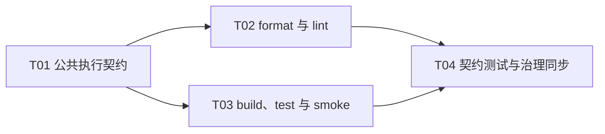

# F01-S04_统一质量命令与基础门禁 步骤文档

**所属版本：** v1

**所属版本文档：** [UGDR_v1 版本文档](../UGDR_v1_版本文档.md)

**所属功能文档：** [F01_项目初始化与开发 Harness 功能文档](F01_项目初始化与开发_Harness_功能文档.md)

**功能标识：** F01-项目初始化与开发 Harness

**步骤标识：** F01-S04-统一质量命令与基础门禁

- [ ] 已实现

## 一、目标与完成条件

在现有 `tools/ugdr` 中新增 `format`、`lint`、`build`、`test` 和 `smoke` 子命令，统一编排 clang-format、clang-tidy、CMake/Ninja、CTest，以及模块边界、文档治理和项目状态检查。完成时，五个命令具有稳定退出状态和可操作诊断；正常路径可重复通过，任一子检查失败均返回非零；`smoke` 只覆盖新会话继续工作所需的最小生存路径，不承载完整文档治理。

## 二、实现设计

本步骤沿用 S03 已建立的中性 CLI 入口与结果模型，不新增工具版本门禁，不绑定具体 CI 平台，也不实现 S05 的自动编排或 checkpoint 能力。所有外部进程都使用参数数组、固定工作目录且禁止 `shell=True`；缺少工具、配置错误和子检查失败都必须保留原始诊断并由所属命令返回非零。

### 命令契约

| 命令 | 行为 | 选项与边界 | 失败退出码 |
|-|-|-|-|
| `format` | 默认就地格式化受管 C/C++/CUDA 文件；`--check` 只检查、不修改。 | 支持 `--json`；文件集合由仓库规则确定且顺序稳定。 | 30 |
| `lint` | 依次执行 format check、clang-tidy、模块边界、文档治理、仓库骨架和项目状态检查。 | 全程只读；支持 `--build-dir`（默认 `build`）和 `--json`。 | 31 |
| `build` | 使用 CMake/Ninja 完成配置与编译。 | 支持 `--build-dir`（默认 `build`）和 `--json`。 | 32 |
| `test` | 确保目标构建目录已配置并完成必要构建，然后运行完整 CTest。 | 支持 `--build-dir`（默认 `build`）和 `--json`。 | 33 |
| `smoke` | 确保所需目标可用，只运行 handoff、client、daemon 的最小检查。 | 支持 `--build-dir`（默认 `build`）和 `--json`；不运行完整 lint 或文档治理。 | 34 |

参数错误统一返回 2。人类输出必须说明失败检查、原始诊断和建议动作；`--json` 沿用 S03 的稳定顶层字段 `command`、`ok`、`checks`、`summary`、`exit_code`，检查项使用稳定标识并携带状态、路径、诊断和修复提示，不写入时间戳或临时路径等非确定值。

### 文件与模块改动

| 位置 | 交付物 | 约束 |
|-|-|-|
| `tools/ugdr` | 注册五个子命令及公共参数。 | 保持仓库中性入口；命令只负责解析、调用和退出码映射。 |
| `tools/ugdr_cli/result.py` | 提炼 S03 结果对象、人类/JSON 渲染与子进程执行契约。 | 不得改变既有 `bootstrap`、`env` 行为。 |
| `tools/ugdr_cli/quality.py` | format 与 lint 的受管文件发现和检查编排。 | 路径排序稳定；lint 不修改仓库。 |
| `tools/ugdr_cli/build.py` | 配置、构建、完整测试和最小 smoke 编排。 | 构建目录必须位于仓库允许范围内；拒绝仓库根目录、源码目录或外部目录。 |
| `CMakeLists.txt` 及相关测试定义 | 为 handoff、client、daemon 最小生存检查提供稳定标签或等价选择条件。 | smoke 选择集可被契约测试直接证明。 |
| `tests/integration/test_ugdr_quality.py` | 五个命令的正向、负向、JSON、退出码和路径测试。 | 外部工具使用可控替身，另保留真实配置后的集成验证。 |
| `tools/module-boundaries.json`、`docs/architecture/repository-skeleton.md` | 登记新增工具文件并同步生成区段。 | 二者必须保持同步。 |

### 关键流程

```python
def execute(command, options):
    validate_arguments(options)              # 失败返回 2
    checks = plan_checks(command, options)
    results = []
    for check in checks:
        result = run_argv(check.argv, cwd=repository_root)
        results.append(normalize(result))
        if not result.ok and check.fail_fast:
            break
    render(results, json=options.json)
    return 0 if all(item.ok for item in results) else command.failure_code
```

`format` 的默认模式是唯一允许修改受管源文件的路径；其余四个命令不得修改源码或治理文档。子检查被跳过时必须产生带原因的显式结果，不能被当作通过。构建相关命令可以复用有效配置，但需要能够从空构建目录稳定启动。

### 实现任务

| 任务 | 内容 | 依赖 | 完成判定 |
|-|-|-|-|
| T01 公共执行契约 | 抽取公共结果、子进程 runner、JSON/人类渲染和退出码映射；扩展 `tools/ugdr` 参数框架。 | 无 | S03 既有命令行为不变，公共结果可被新命令复用。 |
| T02 format 与 lint | 实现受管文件发现、clang-format、clang-tidy，以及模块边界、文档治理、骨架和状态检查编排。 | T01 | 检查顺序与输出稳定，format 模式边界和 lint 只读属性有自动化证明。 |
| T03 build、test 与 smoke | 实现 CMake/Ninja、CTest 编排和最小 smoke 选择集。 | T01 | 空目录与复用配置均成功；smoke 只包含 handoff/client/daemon 最小检查。 |
| T04 契约测试与治理同步 | 补齐正负路径、退出码、JSON、路径和 smoke 范围测试，并同步模块边界与仓库骨架。 | T02、T03 | 完整配置测试无回归，所有构造失败都映射为约定非零退出码。 |

**实现任务依赖 DAG：**



当前可启动任务为 T01。T01 完成后，T02 与 T03 可以并行；二者完成后再进入 T04。合并时以契约测试、治理校验和完整 CTest 的结果决定是否可进入人工验收，不能由单个 worktree 的局部通过直接调整项目稳定状态。

## 三、验证与验收

验收以命令契约、失败传播、可重复性和 smoke 范围为核心。实现者需要在 `docs/progress/` 中记录实际命令、关键输出摘要与证据位置；自动检查通过只构成实现证据，不替代“已完成审阅”或“已实现”的人工确认。

| 验证项 | 执行方式 | 通过标准 | 失败判定 |
|-|-|-|-|
| 格式检查 | `tools/ugdr format --check --json`，并在隔离样例中运行默认 format。 | 已格式化仓库重复执行结果一致；默认模式只修改受管文件。 | 未格式化文件未被识别、越界修改或失败返回码不是 30。 |
| 完整 lint | `tools/ugdr lint --build-dir build --json`。 | 各子检查顺序、标识与诊断稳定，命令不修改仓库。 | format、tidy、模块、文档、骨架或状态任一构造失败未令命令返回 31。 |
| 构建 | 从空目录及已有有效配置分别运行 `tools/ugdr build --build-dir build --json`。 | CMake/Ninja 配置与编译成功且重复执行稳定。 | 配置或编译失败未保留诊断，或未返回 32。 |
| 完整测试 | `tools/ugdr test --build-dir build --json`。 | 必要构建完成后运行完整 CTest，现有测试无回归。 | 构建或任一 CTest 失败未返回 33。 |
| 最小 smoke | `tools/ugdr smoke --build-dir build --json`，同时枚举实际选择的测试。 | 只运行 handoff、client、daemon 最小生存路径，重复执行稳定。 | 包含完整 lint/文档治理、遗漏任一最小路径，或失败未返回 34。 |
| 参数与路径 | 构造未知参数、外部构建目录、仓库根目录和源码目录目标。 | 参数错误返回 2；危险或越界路径在执行外部进程前被拒绝。 | 接受危险路径、产生部分副作用或输出缺少修复提示。 |
| 治理回归 | `python3 tools/project_state.py validate --root .`、`python3 tools/check_project_docs.py --root .`、配置后模块边界检查和 `ctest --test-dir build --output-on-failure`。 | 状态、文档、骨架、模块边界与完整测试全部通过。 | 任一治理检查失败，或相关配置变化未同步。 |
