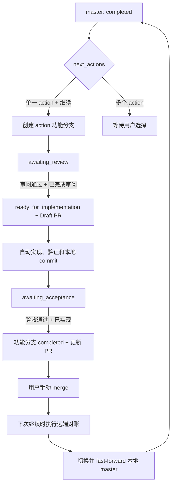
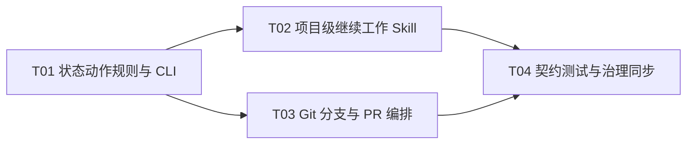

# F01-S05_Agent 协作工作流与自动编排 步骤文档

**所属版本文档：** [UGDR_v1 版本文档](../UGDR_v1_版本文档.md)

**所属功能文档：** [F01_项目初始化与开发 Harness 功能文档](F01_项目初始化与开发_Harness_功能文档.md)

**所属版本：** v1

**功能标识：** F01-项目初始化与开发 Harness

**步骤标识：** F01-S05-Agent 协作工作流与自动编排

# 一、目标与完成条件

基于 S02 的稳定状态体系和 S04 的统一机械命令，实现项目级编排 Skill 与 `tools/ugdr` 工作流入口。完成时，新 Agent 会话收到“继续项目”等简单意图后，能够从仓库状态和 Git 上下文确定下一动作，并连续推进范围选择、飞书设计、审阅等待、同步、实现、验证、本地提交、PR 交接和合并后对账，直到遇到设计决策、权限、人工审阅、不可自动修复的失败或最终人工验收；不得自动 merge、不得绕过飞书门禁，也不得把 F01-S06 的干净 workspace 独立验收纳入本步骤。

# 二、实现设计

本步骤沿用 S02 已确认的五个稳定状态和受控转换核心，不新增 `awaiting_merge` 等 Git 专属状态。项目状态只表达设计、实现、阻塞和人工验收位置；分支、PR 与远端合并属于编排上下文，由项目级 Skill 在调用确定性状态命令前后检查。`tools/ugdr` 保持 Agent 中立，GitHub PR 的创建、查询与更新不得成为状态机的唯一事实源。

## 职责与文件边界

| 位置 | 交付 | 责任与禁止事项 |
|-|-|-|
| `.agents/skills/ugdr-continue-project/` | 项目级编排 Skill 与“继续项目”等简单意图入口。 | 理解用户意图、调用既有文档填充/同步 Skills、机械命令和 GitHub PR 能力；不得直接编辑 `current.json`，不得自行越过人工门禁。 |
| `tools/workflow-rules.json` | 稳定状态到基础动作、人工门禁和停止原因的机器可读规则。 | 只描述确定性映射，不保存执行进度、PR 编号或聊天上下文。 |
| `tools/ugdr_cli/workflow.py` | 状态读取、规则加载、下一动作判定和稳定 JSON 结果。 | 只读判定不访问飞书或 GitHub，不根据测试、commit 或上下文推断人工确认。 |
| `tools/ugdr` | 新增 `state show`、`state next`、`state transition` 和 `state advance-scope` 入口。 | 转换入口复用 `tools/project_state.py` 的 schema、矩阵、门禁和原子写入，不复制另一套状态逻辑。 |
| `docs/progress/Fxx-Sxx.md` | 确有跨会话价值时记录来源、实际交付、验证、偏差和剩余事项。 | 不保存当前状态、聊天流水或临时计划；只有用户明确验收后才记录 Acceptance。 |
| `tests/integration/test_ugdr_workflow.py` | 状态动作、Git 分支/远端对账、提交边界和停止条件的契约测试。 | PR 状态使用可控替身；F01-S06 才执行干净 workspace 与无聊天历史的最终独立验收。 |

## 确定性命令契约

| 命令 | 行为 | 输出与边界 |
|-|-|-|
| `tools/ugdr state show --json` | 校验并读取 `docs/status/current.json`。 | 输出当前 scope、稳定状态、next_actions、blockers 和校验结果；不修改仓库。 |
| `tools/ugdr state next --json` | 按照机器规则判定基础动作。 | 稳定字段为 command、ok、state、action、requires_human、reason、next_actions、exit_code；等待人工、没有下一动作和多 action 待选择均为可解释的正常结果。 |
| `tools/ugdr state transition ...` | 在同一 scope 内执行受控转换。 | 完整透传审阅文档、验证、人工确认、blocker 和 dry-run 门禁；非法转换保持文件不变。 |
| `tools/ugdr state advance-scope ...` | 从 `completed` 进入用户明确选择的新 scope。 | 继续要求当前 scope 已完成、目标不同、用户确认、updated_by=human 及显式 next_actions 处理。 |

参数错误继续返回 2；状态、规则文件或转换核心无效返回工作流失败码 35。`state next` 返回“等待人工”不属于命令失败；Skill 必须根据 `requires_human` 停止，而不能用循环重试绕过。

## 状态与 Git/PR 生命周期

| 状态与 Git 上下文 | 下一动作 | 自动化边界 | 退出门禁 |
|-|-|-|-|
| `completed`，位于已同步的 `master` | 读取 next_actions；单一 action 下“继续”视为选择，多 action 必须由用户指定。基于最新 `master` 创建 `codex/<step>-<slug>` 功能分支。 | 分支已存在时只恢复，不创建重名分支；分支被其他 worktree 使用时报告位置，不抢占或删除。 | action 已明确且 Git 预检通过后，才可进入新 scope 的 `awaiting_review`。 |
| `awaiting_review`，位于功能分支 | 完善飞书设计并等待审阅。 | 用户明确审阅通过且飞书“已完成审阅”已勾选后，同步 Markdown、转换到 `ready_for_implementation`、提交该交接、推送功能分支并向 `master` 创建 Draft PR。 | 没有用户确认、待办未勾选、同步失败或审阅快照不合格时停止。 |
| `ready_for_implementation`，Draft PR 已建立 | 按已审阅 Markdown 实现，执行验证，写入精简 progress，并转换到 `awaiting_acceptance`。 | 改动边界明确且验证通过后自动创建本地 commit，并 push 当前功能分支以更新已有 Draft PR；Draft PR 保持未合并。 | 验证失败先在 scope 内修复；混杂改动、权限或不可修复失败必须停止。 |
| `awaiting_acceptance`，位于功能分支 | 停止并提交差异、验证和 progress 摘要供用户验收。 | 用户明确验收通过且飞书“已实现”已勾选后，转换到 `completed`、补充 Acceptance、创建最终 commit、推送并更新同一 PR；仍停留在功能分支。 | 不得从测试通过、commit 存在或 PR 审核状态推断人工验收。 |
| `completed`，功能分支 PR 尚未合并 | 等待用户手动 merge。 | 不得自动 merge，不得在该分支直接开始下一个 action，也不得提前切换本地 `master`。 | 只有远端明确显示 PR 已合入 `master` 才进入合并后对账。 |
| PR 已合并，用户再次说“继续”或“已合并” | 执行合并后 Git 对账，再从本地 `master` 读取状态。 | 确认无未提交或未推送改动后 fetch、切换 `master`、fast-forward 更新并校验状态；此过程不新增项目状态转换。 | PR 未合并、工作区不干净、存在未推送提交、分支分叉或状态校验失败时停止。 |
| `blocked` | 报告 blockers、恢复目标和需要的外部动作。 | 不得自行清空 blocker；用户或外部条件解除后，仍通过受控转换恢复。 | 恢复目标对应的审阅、验证或人工门禁仍必须满足。 |



## 合并后对账

合并后同步是每次编排入口的 Git 预检动作，不是新的稳定状态。项目级 Skill 先查询当前功能分支对应 PR，只有其 base 为 `master` 且状态为 merged 才继续；随后确认工作区干净且没有未推送提交，执行 fetch，切换本地 `master` 并仅允许 fast-forward 更新。更新后必须运行 `tools/ugdr state show --json` 和项目状态校验，确认远端合入的 `completed` 及 next_actions 与本地一致，再允许选择新 action。任何分叉都不得自动 rebase、reset 或覆盖用户改动。

## 编排循环与停止条件

```python
def continue_project(user_intent):
    git_context = inspect_branch_remote_and_pr()
    if git_context.pr_is_merged:
        reconcile_master_fast_forward(git_context)

    state = ugdr_state_show()
    action = ugdr_state_next(state)

    while action.can_run_without_human:
        result = execute_action_with_existing_skill_or_command(action)
        if not result.ok:
            return stop_with_diagnostics(result)
        state = ugdr_state_show()
        action = ugdr_state_next(state)

    return handoff(action.reason, state, git_context)
```

循环只能调用已确认 scope 内的动作。遇到多 action 选择、产品或实现设计决策、飞书人工审阅、最终人工验收、认证或权限、工作区混杂改动、远端分叉、未推送提交、不可自动修复失败或需要改变已审阅范围时必须停止。普通可定位的实现错误可以在当前 scope 内修复并重新验证，但重试必须有界且保留失败诊断。

## 提交、push、PR 与 progress 规则

| 时点 | 允许动作 | 禁止事项 |
|-|-|-|
| 审阅通过 | 提交同步后的设计和 `ready_for_implementation` 状态；推送功能分支并创建以 `master` 为 base 的 Draft PR。 | 待办未确认时提交审阅结论；创建非 Draft PR；立即 merge。 |
| 实现验证通过 | 更新 docs/progress/Fxx-Sxx.md 的 Source、Delivered、Verification、Deviations/Remaining，转换到 awaiting_acceptance，自动创建本地 commit，并 push 当前功能分支更新已有 Draft PR。 | 自动 merge、直接 push master；记录未经用户确认的 Acceptance；提交无法区分的其他工作。 |
| 最终人工验收通过 | 确认飞书“已实现”，补充 Acceptance，转换到 `completed`，创建最终 commit，推送并更新同一 PR。 | 自动 merge；在 PR 合并前切换到 `master` 或开始下一个 action。 |
| PR 合并后 | 在下一次明确继续时对账远端并 fast-forward 本地 `master`。 | 为 merge 新增项目状态；自动 reset、rebase、强推或删除分支。 |

自动 commit 前必须枚举待提交路径和 diff，确认其属于当前 scope，并运行约定验证。只暂存明确属于本步骤的文件；若同一文件包含无法可靠拆分的用户改动，则停止。progress 只保存持久的实施与验证摘要，不复制完整日志；Git commit 保存版本快照，`current.json` 保存当前机器状态，三者不得互相替代。

## 实现任务

| 任务 | 内容 | 依赖 | 完成判定 |
|-|-|-|-|
| T01 状态动作规则与 CLI | 建立 workflow rules、结果模型和 `tools/ugdr state show/next/transition/advance-scope`，复用现有状态核心。 | 无 | 五个稳定状态、零/单/多 next_actions、非法规则和全部门禁均有确定输出与负向测试。 |
| T02 项目级继续工作 Skill | 实现简单意图路由、既有文档 Skills/机械命令调用、循环推进和停止交接。 | T01 | 用户不需逐项点名原子 Skill；循环只在允许范围自动推进，并在所有人工门禁停止。 |
| T03 Git 分支与 PR 编排 | 实现 action 分支恢复/创建、提交边界、Draft PR 生命周期、合并状态查询和 fast-forward 对账。 | T01 | 不自动 merge、不直接 push master；实现 commit 只 push 当前功能分支以更新已有 Draft PR；dirty、unpushed、open/closed/merged PR 和分叉场景均安全停止或对账。 |
| T04 契约测试与治理同步 | 覆盖状态动作、Skill 路由、Git/PR 生命周期、progress 边界和失败诊断，并同步模块边界与仓库骨架。 | T02、T03 | 完整质量命令与 CTest 通过，构造门禁和 Git 异常均不能被误报为成功。 |

**实现任务依赖 DAG：**



当前可启动任务为 T01。T01 完成后，T02 与 T03 可以并行；二者完成后进入 T04。单个分支、worktree 或局部测试的通过不得直接修改项目稳定状态，所有状态更新仍以受控命令和已确认门禁为准。

# 三、验证与验收

验收以状态动作确定性、简单意图连续推进、人工门禁、分支/PR 生命周期和失败安全为核心。自动检查通过只构成实现证据，不替代飞书“已完成审阅”“已实现”或最终人工验收；干净 workspace 和无历史聊天的新会话端到端验收保留给 F01-S06。

| 验证项 | 执行方式 | 通过标准 | 失败判定 |
|-|-|-|-|
| 状态命令与规则 | 运行 `tools/ugdr state show --json`、`tools/ugdr state next --json` 和 `python3 -m unittest tests.integration.test_ugdr_workflow`，覆盖五个稳定状态及零/单/多 next_actions。 | 输出字段、动作、requires_human、原因和退出码稳定；transition/advance-scope 完整复用现有门禁。 | 规则无效未返回 35，等待人工被误报为失败，或非法转换修改了状态文件。 |
| 简单意图编排 | 在可控 fixture 中以“继续项目”启动项目级 Skill，依次模拟设计、审阅、同步、实现、验证和交接。 | 不要求用户逐项点名原子 Skill；可自动动作连续执行，遇到人工门禁立即停止。 | 依赖聊天历史、漏掉必要动作、无限重试，或越过选择、设计、审阅和验收门禁。 |
| 范围选择与分支 | 在临时 Git 仓库模拟单一、多 action、已有分支、重名分支和其他 worktree 占用。 | 单一 action 下“继续”可选择；多 action 要求用户指定；从最新 master 创建或恢复唯一功能分支。 | 从陈旧 master 建分支、创建重复分支、抢占其他 worktree，或在功能分支开始下一 action。 |
| 审阅与 Draft PR | 构造未确认、待办未勾选、同步失败和审阅通过场景，并替换 GitHub PR 创建接口。 | 只有用户明确审阅通过且“已完成审阅”已勾选后，才同步、进入 ready_for_implementation、commit、push 并创建 base=master 的 Draft PR。 | 根据聊天历史、测试或文档存在推断审阅；创建非 Draft PR；审阅后立即 merge。 |
| 实现提交边界 | 构造纯当前 scope 改动、混杂文件、同文件混杂修改、验证失败和成功路径。 | ready_for_implementation 下验证通过可自动创建只含当前 scope 的 commit、push 当前功能分支更新已有 Draft PR，并进入 awaiting_acceptance；不自动 merge。 | 提交其他工作、验证失败仍提交、直接 push master、自动 merge，或把 commit/PR 更新当作人工验收。 |
| 最终验收与 PR 更新 | 构造未验收、飞书“已实现”未勾选和完整验收路径。 | 只有用户明确验收且待办已勾选后，才补充 progress Acceptance、进入 completed、创建最终 commit 并更新同一 PR；不自动 merge。 | 自行宣布 completed、创建第二个 action PR、自动 merge，或在合并前切换 master。 |
| 合并后对账 | 模拟 open、closed-unmerged、merged PR，以及 dirty、unpushed、diverged 和可 fast-forward 的本地仓库。 | 仅 merged 且本地安全时 fetch、切换 master、fast-forward 并校验 completed；对账不产生新的项目状态。 | PR 未合并仍更新 master，自动 reset/rebase/强推，覆盖用户改动，或分叉后继续选择 action。 |
| 项目治理回归 | 运行 `tools/ugdr lint --build-dir build --json`、`tools/ugdr test --build-dir build --json`、`tools/ugdr smoke --build-dir build --json`、模块边界、项目状态、文档治理和 `git diff --check`。 | 全部命令通过；新增 Skill、规则、工具和测试已纳入模块边界与仓库骨架说明。 | 任一命令失败、smoke 范围扩张、治理声明未同步，或失败被降级为成功。 |

实现完成后，在 `docs/progress/F01-S05.md` 记录使用的已审阅 revision、实际交付、验证命令与结果、偏差和剩余事项。用户明确验收前不得填写 Acceptance；PR merge 后的远端对账结果可作为后续交接事实补充，但不得改写已经确认的设计。
