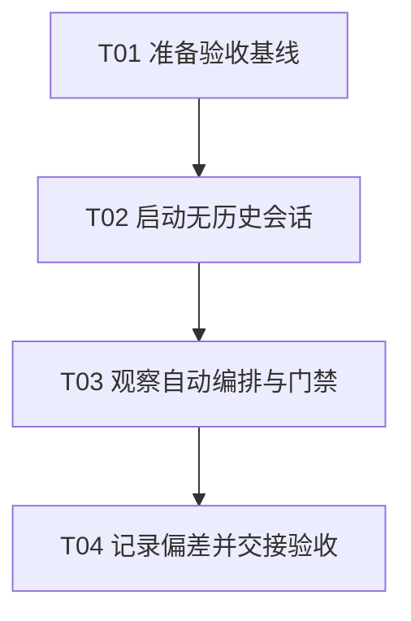

# F01-S06_干净 workspace 与新 Agent 会话验收 步骤文档

**所属版本文档：** [UGDR_v1 版本文档](../UGDR_v1_版本文档.md)

**所属功能文档：** [F01_项目初始化与开发 Harness 功能文档](F01_项目初始化与开发_Harness_功能文档.md)

**所属版本：** v1

**功能标识：** F01-项目初始化与开发 Harness

**步骤标识：** F01-S06-干净 workspace 与新 Agent 会话验收

# 一、目标与完成条件

在干净、隔离的 workspace 和无历史聊天的新 Agent 会话中，仅依赖仓库机器状态与简单指令“继续项目”恢复 F01-S06 上下文、选择下一动作并执行必要质量门禁。完成条件是全部必需检查通过，结果、偏差与下一步形成可追溯记录，且只有在人工验收后才允许结束 F01 并进入 F02。

# 二、实现设计

## 已确认约束

- 验收对象是仓库中已经合入的 F01 能力及其状态驱动工作流；本步骤不新增业务功能。
- 验收会话不得继承当前聊天历史，只能读取隔离 workspace 中的仓库文件，并以“继续项目”作为启动指令。
- 隔离 workspace 必须基于明确的验收基线 commit，初始工作区无未提交变更；使用专用临时测试分支，避免与主工作区的分支占用和状态互相影响。
- Agent 必须从 `docs/status/current.json`、Git 分支与远端 PR 状态恢复上下文，并遵守人工审阅、最终验收和合并门禁；不得直接修改或推送 `master`，不得自动合并 PR。
- F01 的 lint、test 与 smoke 必须完整执行。环境能力不足时应给出诊断并记录偏差，不能把“未执行”当作通过。

## 执行任务

| 任务 | 输入与操作 | 完成证据 |
|-|-|-|
| T01 准备验收基线 | 确认 F01-S01 至 F01-S05 已合入；记录基线 commit；从该基线创建隔离、干净的 workspace 和专用临时测试分支。 | 基线 commit、分支、workspace 状态与初始 `git status` 被记录。 |
| T02 启动无历史会话 | 创建不携带既有聊天上下文的新 Agent 会话，只提供隔离 workspace，并发送“继续项目”。 | 启动输入、会话标识及首次恢复出的 scope、state、next action 被记录。 |
| T03 观察自动编排与门禁 | 允许 Agent 读取仓库状态、选择唯一下一动作并推进；执行必要 lint、完整 test 与 F01 smoke；核对其在人工门禁处停止。 | 命令、退出码、关键输出、状态变化及是否正确停门禁被记录。 |
| T04 记录偏差并交接验收 | 把结果、偏差、遗留问题和下一步写入 `docs/progress/F01-S06.md`。若发现缺陷，在 F01-S06 分支修复并重新执行受影响检查；若无法安全修复则明确阻塞。 | 进度记录可从新会话复现，工作区改动边界清晰，并提交最终人工验收。 |

## 任务依赖

## 状态与证据约定

- 步骤文档审阅通过后，才把 F01-S06 从 `awaiting_review` 推进到 `ready_for_implementation`；执行完成后进入 `awaiting_acceptance`，等待人工验收。
- `docs/status/current.json` 只记录当前稳定状态、下一动作和阻塞；执行命令、输出摘要、偏差与复现信息写入 `docs/progress/F01-S06.md`。
- 临时 workspace 不作为长期事实来源。保留其基线 commit 和必要日志引用后，最终以 F01-S06 分支中的进度记录、状态 checkpoint 和提交历史作为交接依据。
- 只有人工明确表示验收通过，且飞书文档“已实现”待办已确认后，才提交最终状态、更新 Draft PR；PR 合并并与 `master` 对账后，才可进入 F02。

# 三、验证与验收

## 自动验证

| 检查 | 预期结果 |
|-|-|
| `python3 tools/project_state.py validate --root .` | 当前 scope、状态、next actions 和字段约束合法。 |
| `python3 tools/check_project_docs.py --root .` | 文档治理、目录边界和来源信息无违规。 |
| `tools/ugdr lint --build-dir build --json` | 必要静态检查全部通过；输出可被机器读取。 |
| `tools/ugdr test --build-dir build --json` | 完整配置测试通过；失败项和环境诊断不被吞掉。 |
| `tools/ugdr smoke --build-dir build --json` | F01 smoke 全部通过，覆盖 bootstrap、状态恢复、质量命令与 Agent 工作流。 |
| `ctest --test-dir build --output-on-failure` | 配置后的完整测试套件退出码为 0；若工具封装已经输出同一轮完整结果，进度记录应明确对应关系。 |

## 人工验收

- 确认新会话没有收到历史聊天、人工整理的上下文或隐藏步骤指令。
- 确认 Agent 仅凭仓库状态与“继续项目”恢复到正确 scope，能解释所选动作并持续推进，而不是把可自动完成的原子操作逐项退回给用户。
- 确认分支、提交、推送、Draft PR、人工审阅、最终验收与合并后的 `master` 对账符合既定状态机，不越过人工门禁。
- 确认 `docs/progress/F01-S06.md` 包含基线、环境、实际命令、退出码、关键结果、偏差、遗留问题与下一步，足以让另一个新会话复查。
- 人工验收前不得把步骤标为 `completed`，也不得进入 F02。

## 失败判定

出现以下任一情况即不通过：初始 workspace 不干净；会话依赖历史聊天才能继续；恢复了错误 scope 或动作；必需检查未执行或失败却被报告为通过；直接修改 `master`、自动合并或越过人工门禁；证据不足以复现；环境限制未被明确记录。
