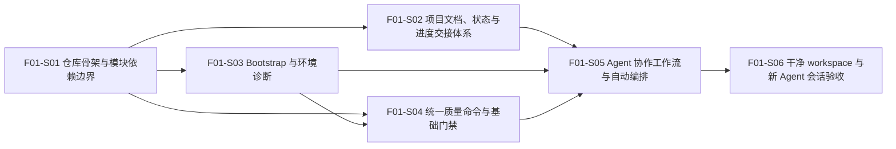

# F01_项目初始化与开发 Harness 功能文档

**所属版本：** UGDR_v1

**所属版本文档：** [UGDR_v1 版本文档](../UGDR_v1_版本文档.md)

**功能标识：** F01

**功能名称：** 项目初始化与开发 Harness

## 一、功能目标

该功能完成后，UGDR 开发者和新的 Agent 会话能够在干净 workspace 中快速识别项目结构与当前阶段，通过统一入口完成环境诊断、格式检查、静态检查、构建、测试和 smoke check，并能以“继续项目”等简单意图让 Agent 基于独立状态载体自动选择和推进下一动作，直到遇到明确的人工门禁。目标以仓库骨架可编译、命令退出状态稳定、失败信息可操作，以及新会话无需依赖聊天历史或人工逐项指定原子操作即可执行基础验证和持续推进为完成判断。

## 二、背景与版本关系

F01 是 UGDR_v1 的开发前置层，承接版本文档中“先建立可重复执行的项目初始化与开发 Harness”的目标。当前 workspace 尚无业务代码；若直接进入 API、控制面或数据路径实现，模块边界、项目知识、状态交接和验证入口会在不同步骤中漂移。F01 先建立人和 Agent 都能读取、执行、验证和持续交接的工程基础，完成人工验收后，F02-F07 才进入正式实现。

该功能只负责开发环境与仓库级 Harness，不属于两个 client 加一个 daemon 的 UGDR 运行时数据路径。

## 三、功能范围

- 建立与 v1 功能边界一致的可编译仓库骨架：公共接口位于 include/ugdr，业务模块按 api、control、queues、worker、gpu 分区，运行入口按 client、daemon 分区，测试按 unit、integration、smoke 分层；F01 只建立边界和最小占位，不实现后续功能。
- 固定基础工具链为 C++20、CUDA C++、CMake、Ninja、CTest、clang-format 和 clang-tidy，并通过统一入口屏蔽具体命令组合。
- 提供精简 AGENTS.md 项目地图、docs/v1_docs 版本设计入口、docs/status/current.md 当前状态、docs/decisions 决策记录和 docs/progress 执行进度，使长期规则、当前状态、过程记录和临时计划相互分离。
- 提供 Agent 中立的 Python CLI tools/ugdr，统一暴露 bootstrap、doctor、format、lint、build、test、smoke，以及工作流状态读取、下一动作判定和受控转换入口；Agent 专属 Skills 或配置只作为自然语言适配与语义编排入口，不得成为状态或硬门禁的唯一实现。
- 所有统一命令具有稳定退出状态和可操作的失败信息；doctor 能区分缺少工具、版本不满足、CUDA 不可用和 GPU 不可用。
- 建立基础质量门禁，包括格式检查、静态检查、最小构建、CTest、模块依赖方向、目录边界、文档规范和骨架同步检查。完整文档治理放入 lint；smoke 只执行新会话继续工作所需的最小生存检查。
- 建立仓库级可复用工作流和新会话交接路径，使新的 Agent 会话只需“继续项目”等简单指令，即可定位当前阶段并在规划、审阅等待、文档同步、实现、验证、commit、Draft PR 创建与更新、最终验收、Ready for review 和交接之间自动推进，直到遇到设计决策、权限、人工审阅或最终验收门禁。

## 四、非目标

- 不实现 UGDR verbs-like API、对象模型、daemon 管理逻辑、WQ/RQ/CQ、loop worker、GPU memcpy kernel 或运行时数据路径。
- 不在 F01 中确定后续功能的接口字段、线程模型、队列内存序、datagram 布局、文件、类或函数实现。
- 不要求生产级 CI/CD、性能 benchmark、双机环境、daemon crash 或 peer disconnect 故障注入；这些能力由后续功能按需补充。
- 不把完整项目知识、可变状态或执行进度堆入 AGENTS.md，也不让 Codex 或其他单一 Agent 的专属配置成为唯一入口。
- bootstrap 和 doctor 不承诺自动修复所有系统依赖；无法自动处理的环境问题必须给出明确诊断和人工操作方向。

## 五、依赖与约束

- 来源依赖：已审阅的 UGDR_v1 版本文档、UGDR 项目Agent coding 工作明细和 UGDRv1 项目设计。
- 前置关系：F01 是 F02-F07 的正式实现前置；F01 未通过人工验收时，不进入后续功能实现。
- 工具链约束：使用 C++20、CUDA C++、CMake、Ninja、CTest、clang-format、clang-tidy 和 Python 3；具体最低版本和安装方式在对应步骤文档确认。
- 环境约束：目标环境为当前 Linux 开发 workspace，v1 以本机环境为依据，不建立跨 Linux 主机的支持矩阵。doctor 必须区分主机工具链、CUDA Toolkit 和真实 GPU 的可用状态；缺少 GPU/CUDA 时不得伪造通过。
- 知识约束：仓库中的可版本化内容是 Agent 执行知识源；飞书文档经人工确认后同步到 Markdown，再作为编码依据。
- 状态约束：长期规则、当前状态、执行进度和临时计划分别维护；状态载体和命令输出必须便于新会话恢复。工作流状态转换由机器可读规则和确定性命令约束，Agent Skill 不得绕过飞书审阅、权限和最终人工验收门禁，也不得自行把等待验收状态标记为完成。
- 兼容性约束：tools/ugdr 是稳定用户入口，底层 CMake、Ninja、CTest 或 lint 参数可以演进，但不得要求使用者记忆多套内部命令。

## 六、功能设计与模块边界

F01 由仓库骨架、统一命令层、知识与状态层、质量 Harness 和协作编排层五个边界组成。它们只提供后续功能可依赖的结构、执行契约和人机协作入口，不包含 UGDR 运行时业务实现。

| 边界 | 职责 | 输入 | 输出与失败语义 |
|-|-|-|-|
| 仓库骨架 | 建立 include/ugdr、api、control、queues、worker、gpu、client、daemon 和测试分层的允许边界、最小占位与依赖方向，不固化后续运行时实现细节。 | UGDR_v1 功能划分和骨架说明文档。 | 可配置、可编译的最小目标和边界检查；实际骨架与文档声明不一致，或出现越界依赖时，lint 失败。 |
| 统一命令层 | 由 Python CLI tools/ugdr 编排 bootstrap、doctor、format、lint、build、test、smoke 和工作流状态操作。lint 承载完整静态一致性检查；smoke 只执行新会话继续工作所需的最小生存检查。 | 子命令、workspace 状态和环境能力。 | 稳定退出码、清晰日志和可操作诊断；未知命令、缺少依赖、lint 违规、非法状态转换或执行失败返回非零。 |
| 知识与状态层 | 用精简 AGENTS.md 导航版本文档、当前状态、决策和进度记录，分离长期规则与可变状态，并为文档长度、必需内容、职责边界和工作流阶段提供可检查声明。 | 已确认飞书文档、同步 Markdown、执行结果和人工决策。 | 新会话能够定位当前阶段与下一步；关键入口缺失由 smoke 生存检查报告，完整文档和状态治理问题由 lint 报告。 |
| 质量 Harness | 统一调用 clang-format、clang-tidy、CMake、Ninja、CTest，并执行模块结构、文档规范、链接有效性、状态职责和骨架文档同步检查。 | 源码骨架、测试、工具链、环境探测结果、文档规范和文档声明清单。 | 可重复验证结果；跳过项必须说明原因，失败不得被降级为成功。 |
| 协作编排层 | 将“继续项目”等简单意图映射为下一动作，基于确定性状态和硬门禁循环推进；项目级 Skill 负责语义判断和交互，tools/ugdr 负责状态读取、判定和受控转换。 | 当前状态、已审阅设计、命令结果和用户意图。 | 自动推进到下一个人工门禁；设计决策、权限、审阅或最终验收必须暂停，非法转换被拒绝，Agent 不得自行宣布完成。 |

典型控制流为：开发者或 Agent 直接调用 tools/ugdr，或以“继续项目”等简单意图进入项目级编排 Skill；编排层读取机器可读状态并由确定性命令判定下一动作，再按当前阶段执行规划、等待审阅、同步、实现、验证、commit、Draft PR 创建与更新、最终验收、Ready for review 或交接。doctor、bootstrap、format、lint、build、test 和 smoke 继续承担各自机械职责；工作流持续推进，直到遇到设计决策、权限、人工审阅、无法自行修复的失败或最终验收门禁，并以退出码、状态转换、日志和验证证据形成可观察结果。

**已确认设计：** 使用 C++20 与 CUDA C++；使用 CMake/Ninja、CTest、clang-format、clang-tidy 和 Python 3；采用 include/ugdr、src/api、src/control、src/queues、src/worker、src/gpu、apps/client、apps/daemon、tests/unit、tests/integration、tests/smoke、tools 和 docs 分层；tools/ugdr 是稳定且 Agent 中立的统一入口；docs/status/current.md、docs/decisions 和 docs/progress 分别承载当前状态、关键决策和执行进度；项目级编排 Skill 只负责自然语言适配、语义判断和交互，状态判定与转换由 tools/ugdr 和机器可读规则约束；工作流自动推进到人工门禁，审阅通过且文档门禁满足后创建以 master 为 base 的 Draft PR；实现验证通过后可以自动创建本地 commit、push 当前功能分支并更新同一 Draft PR；最终人工验收通过且“已实现”已勾选后，更新同一 PR 并标记 Ready for review；不得自动 merge、不得直接 push master，也不得自行把等待验收状态标记为完成；完整文档治理归入 lint，smoke 只做最小生存检查；骨架变更必须同步骨架说明文档并接受 lint 一致性检查。

**下沉到步骤文档：** 具体最低工具版本、安装命令、CMake target 名称、状态 schema、阶段枚举、转换命令、自动 commit、push、Draft PR 创建与 Ready 转换条件、退出码枚举、脚本内部结构、CI 环境和每项检查的实现细节。v1 暂以当前本机开发环境为依据，不建立跨 Linux 主机的支持矩阵；步骤文档不得改变上述功能级边界；确需调整时先回到本功能文档确认。

## 七、步骤划分

将功能拆分为可独立设计、实现和验收的步骤。此处只定义步骤目标、交付、依赖和验收边界，不展开具体实现。

| 步骤标识 | 步骤名称 | 目标与交付 | 依赖 | 验收边界 |
|-|-|-|-|-|
| F01-S01 | 仓库骨架与模块依赖边界 | 建立已确认的目录分层、最小 CMake/CUDA 工程、占位 target、模块依赖说明、骨架说明文档和机械边界检查。 | UGDR_v1 版本文档；C++/CUDA 工具链。 | 干净 workspace 可完成配置与最小构建；允许依赖方向有文档说明；实际骨架与文档声明一致；构造的越界依赖能被检查拒绝。 |
| F01-S02 | 项目文档、状态与进度交接体系 | 建立精简 AGENTS.md、v1 文档入口、机器可读的 current 状态、决策记录、进度记录和文档治理规范，并定义状态字段、阶段和更新责任。 | F01-S01；已确认飞书和 Markdown 文档。 | 所有入口链接有效；长期规则与可变状态分离；文档最大长度、必需内容和职责边界可由 lint 检查；新会话能确定当前阶段、下一动作、验证证据和人工门禁。 |
| F01-S03 | Bootstrap 与环境诊断 | 实现 tools/ugdr bootstrap 和 doctor，探测主机工具链、Python、CMake/Ninja、clang、CUDA Toolkit 与 GPU。 | F01-S01；目标 Linux 环境。 | 重复执行结果稳定；缺失工具、版本不满足、CUDA 不可用和 GPU 不可用均有不同且可操作的诊断；不得伪造通过。具体最低版本和安装方式在步骤文档确认，v1 以本机环境为准。 |
| F01-S04 | 统一质量命令与基础门禁 | 实现 format、lint、build、test 和 smoke 子命令，接入 clang-format、clang-tidy、CMake/Ninja、CTest、结构检查、文档治理检查、工作流状态校验与受控转换，以及 smoke 最小生存检查。 | F01-S01、F01-S03。 | 每个命令有稳定退出状态；正常路径可重复通过；格式、静态检查、构建、测试、结构、文档治理、骨架同步或非法状态转换失败均能传播为非零结果；smoke 不承载完整文档治理。 |
| F01-S05 | Agent 协作工作流与自动编排 | 基于 S02 的状态体系和 S04 的机械命令，实现项目级编排 Skill 与“继续项目”等简单意图入口，自动选择并推进规划、审阅等待、同步、实现、验证、commit、Draft PR 创建与更新、最终验收、Ready for review 和交接动作。 | F01-S02 至 F01-S04；既有文档填充与同步 Skills；Git。 | 新会话无需用户逐项指定原子 Skill；工作流持续推进到设计决策、权限、人工审阅、无法自行修复的失败或最终验收门禁；审阅通过且文档门禁满足后创建 Draft PR，实施验证通过后自动 commit、push 并更新同一 Draft PR；最终人工验收通过且“已实现”已勾选后，将同一 PR 标记 Ready for review；不得自动 merge、直接 push master 或自行标记人工验收完成。 |
| F01-S06 | 干净 workspace 与新 Agent 会话验收 | 在干净 workspace 和无历史聊天的新会话中以“继续项目”启动自动编排，执行必要 lint 和完整 F01 smoke，记录结果、偏差和下一步。 | F01-S01 至 F01-S05。 | 新会话能只依赖仓库状态和简单指令恢复上下文、选择下一动作并运行基础验证；全部必需门禁通过；环境限制和遗留问题被明确记录；人工验收后才进入 F02。 |

**步骤依赖 DAG：**

当前剩余图中入度为 0 的步骤为 F01-S01。F01-S01 完成后，F01-S02 与 F01-S03 可以并行推进；F01-S04 在 F01-S03 完成后推进；F01-S05 在 F01-S02 至 F01-S04 完成后推进；F01-S06 最后验收。

## 八、验证与功能验收标准

- 仓库具有与 F02-F07 边界一致的可编译骨架，公共接口、api、control、queues、worker、gpu、client、daemon 和测试分层清晰；模块依赖方向有文档说明并可机械检查；实际骨架与骨架说明文档声明一致。精简 AGENTS.md、v1 文档入口、当前状态、决策和进度载体均存在且链接有效，新 Agent 会话无需依赖历史聊天即可识别当前阶段和下一项工作。
- 在干净 workspace 中可通过 tools/ugdr 执行 bootstrap 或 doctor，并可执行 format、lint、build、test 和 smoke。命令具有稳定退出状态，CMake/Ninja 最小构建、CTest、格式检查、静态检查、模块边界检查、文档入口检查、文档长度与必需内容检查、状态职责边界检查和骨架文档同步检查均可重复运行。smoke 只覆盖新会话继续工作的最小生存路径。
- 在无历史聊天的新 Agent 会话中，用户只需“继续项目”等简单指令，编排层即可从仓库状态确定当前步骤和下一动作，并连续推进到明确的人工门禁；不得要求用户依次点名文档填充、同步、实现、构建、测试或提交等原子操作。审阅通过且文档门禁满足后允许创建以 master 为 base 的 Draft PR；实现验证通过后允许自动创建可追溯的 commit、push 当前功能分支并更新同一 Draft PR；最终人工验收通过且“已实现”已勾选后，将同一 PR 标记 Ready for review；不得自动 merge、直接 push master，也不得代替用户完成最终验收。
- 缺少必需工具、工具版本不满足、CUDA Toolkit 不可用、GPU 不可用、构建失败、测试失败、格式或静态检查失败、越界依赖、失效文档链接、文档超出长度约束、文档职责混写、骨架与文档声明不一致、工作流状态无效、非法状态转换或人工门禁未满足，均不得报告成功。允许跳过的检查必须输出原因和影响；bootstrap 无法自动处理的依赖必须给出人工修复方向。F01 未经人工验收不得进入 F02-F07 正式实现。

## 九、风险与待确认事项

| 类型 | 内容 | 影响 | 状态 |
|-|-|-|-|
| 已确认 | 采用 C++20、CUDA C++、CMake/Ninja、CTest、clang-format、clang-tidy、Python 3、既定目录分层和 tools/ugdr 统一入口。 | 作为 F01 各步骤的共同功能级约束。 | 已确认 |
| 已确认 | AGENTS.md 过大、文档链接失效，或规则、状态与进度混写会导致新会话获得错误上下文。 | 影响可交接性并引起实现偏离。 | 完整规则放入 lint；smoke 只跑最小生存检查；F01-S02、S04、S05 实现。 |
| 已接受约束 | 不同 Linux 主机的编译器、CMake、CUDA Toolkit 和 GPU 能力不一致。 | 可能使 bootstrap、构建或 GPU 检查在跨环境场景下不可重复。 | v1 以当前本机环境为依据，不建立跨环境支持矩阵。 |
| 待步骤确认 | 各工具最低版本、依赖安装方式、CMake target 名称、状态 schema、阶段枚举、退出码枚举和 CI 环境。 | 影响命令与工作流实现和后续可扩展性，但不改变功能目标与边界。 | 下沉到 F01-S03、S04、S05 步骤文档确认。 |
| 已确认 | 仓库骨架过早固化后续运行时实现细节。 | 可能限制 F02-F07 的设计空间。 | 骨架只固定模块边界、最小占位和依赖方向；骨架变更必须同步骨架说明文档，并由 lint 检查实际骨架与文档声明一致；语义合理性由 skill 或人工审查。 |
| 已确认 | 若只用 Agent Skill 保存状态、判断硬门禁和决定完成状态，不同 Agent 或新旧会话可能产生不一致结果。 | 简单指令可能触发错误阶段、绕过审阅或形成虚假完成状态。 | 机器可读状态和 tools/ugdr 是事实与转换依据；Skill 只做语义编排；F01-S02、S04、S05 实现，S06 验收。 |

## 十、变更记录

| 日期 | 变更内容 | 变更原因 | 影响范围 |
|-|-|-|-|
| 2026-07-18 | 基于 UGDR_v1 版本文档下沉并创建 F01 功能文档草稿，确认工具链、目录边界、状态载体、统一入口和最初五个步骤。 | 在进入 F02-F07 前建立人和 Agent 都能读取、执行、验证和持续交接的工程基础。 | 原 F01-S01 至 F01-S05；后续全部功能的仓库与验证前置。 |
| 2026-07-19 | 新增 F01-S05“Agent 协作工作流与自动编排”，将原新 Agent 会话验收顺延为 F01-S06，并补充简单意图入口、确定性状态转换、人工门禁和本地 checkpoint 边界。 | 减少用户逐项指定原子 Skill 和命令的调度负担，使 Agent 能根据项目状态自主推进到需要人工介入的位置。 | 功能目标、功能范围、依赖与约束、功能设计、步骤划分、验收标准和风险。 |
| 2026-07-20 | 明确实现与验证通过后自动 commit，并 push 当前功能分支更新已有 Draft PR；仍禁止自动 merge 和直接 push master。 | 使实现阶段的提交结果及时进入同一审阅入口，同时保留最终人工验收与人工合并门禁。 | F01-S05 功能边界、步骤划分、验收标准与 Git/PR 生命周期。 |
| 2026-07-20 | 将实际 PR 创建从审阅通过阶段延后到最终人工验收之后；审阅通过和实现验证通过阶段只 push 功能分支并返回 PR 创建链接。 | 避免在实现和验收前提前建立 PR，同时保留分支可追溯性和最终人工 merge 门禁。 | F01-S05 功能边界、验收标准与 Git/PR 生命周期。 |
| 2026-07-20 | 恢复审阅通过后创建 Draft PR、实现阶段更新同一 Draft PR，并在最终人工验收后将同一 PR 标记为 Ready for review。 | 在实现期间提供持续可见的审阅入口，同时保持最终人工验收与人工 merge 门禁。 | F01-S05 功能边界、验收标准与 Git/PR 生命周期。 |
