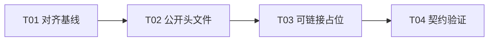

# F02-S01_v1 公开 API 表面与对齐基线 步骤文档

**所属版本文档：** [UGDR_v1 版本文档](../UGDR_v1_版本文档.md)

**所属功能文档：** [F02_API 契约与对象模型 功能文档](F02_API_契约与对象模型_功能文档.md)

**所属版本：** v1

**功能标识：** F02-API 契约与对象模型

**步骤标识：** F02-S01-v1 公开 API 表面与对齐基线

# 一、目标与完成条件

冻结 UGDR v1 的最小 Client 公开 API 表面及其 RDMA/libibverbs 对齐基线：以可编译的公开类型、枚举、函数签名和必要的显式失败占位入口覆盖 RC QP 建连、RDMA Write、RDMA Write With Immediate、Receive WR 与 WC polling 所需能力。完成时，每个公开项都在对齐矩阵中标明标准对应项、支持状态和偏离理由；公开 API 可编译、链接，尚未实现的入口不返回成功或产生运行时副作用。

# 二、实现设计

仓库已有 `include/ugdr/api.hpp`、`src/api/api.cpp`、静态库 target `ugdr_api` 和 `tests/unit`。现有 `api_placeholder` 返回成功，只是 F01 骨架占位。已审阅 F02 功能文档要求用代码固定 Client API 形状，用 `docs/contracts/` 固定可观察契约，并让未实现入口显式失败。

## 文件与职责

| 位置 | 改动 | 职责与边界 |
|-|-|-|
| `include/ugdr/api.hpp` | 替换 `api_placeholder`，声明 v1 公开对象、属性、WR/WC、枚举和函数。 | 只固定 Client 编译依赖的 API 形状；不暴露 IPC、WQE/CQE 或 GPU 内部布局。 |
| `src/api/api.cpp` | 为尚未实现的公开入口提供可链接占位。 | 占位入口显式失败、无运行时状态和副作用；F03-F06 后续替换实现。 |
| `docs/contracts/README.md` | 建立契约目录索引和来源规则。 | 记录飞书来源与 revision；只导航已审阅契约。 |
| `docs/contracts/public-api.md` | 记录 v1 API 清单、参数与返回约定。 | 作为公开头文件的可读规范，不重复内部实现。 |
| `docs/contracts/libibverbs-alignment.md` | 记录每项标准映射、支持状态和偏离理由。 | 状态只允许 aligned、UGDR extension、unsupported、pending。 |
| `tests/unit/api_contract_test.cpp` 与 `tests/unit/CMakeLists.txt` | 增加编译、链接、类型和显式失败占位测试。 | 不启动 daemon，不依赖真实队列、RDMA 网卡或 GPU。 |

## 公开对象与数据类型

| 类别 | UGDR 类型 | libibverbs 对应 | v1 用途 |
|-|-|-|-|
| 不透明对象 | `ugdr_device`、`ugdr_context`、`ugdr_pd`、`ugdr_mr`、`ugdr_cq`、`ugdr_qp` | `ibv_device`、`ibv_context`、`ibv_pd`、`ibv_mr`、`ibv_cq`、`ibv_qp` | 资源句柄与对象关系；生命周期细节在 F02-S02 固化。 |
| 创建与状态属性 | `ugdr_qp_init_attr`、`ugdr_qp_attr`、`ugdr_qp_conn_info` | `ibv_qp_init_attr`、`ibv_qp_attr`；连接信息交换为 UGDR extension | 创建 RC QP、状态转换和连接信息；字段细节在 F02-S02/S03 固化。 |
| 工作请求 | `ugdr_sge`、`ugdr_send_wr`、`ugdr_recv_wr` | `ibv_sge`、`ibv_send_wr`、`ibv_recv_wr` | RDMA Write、Write With Immediate 和 Receive WR；细节在 F02-S04 固化。 |
| 完成 | `ugdr_wc` | `ibv_wc` | 发送与接收 completion；字段和错误语义在 F02-S04 固化。 |
| 枚举与 flags | `ugdr_qp_type`、`ugdr_qp_state`、`ugdr_wr_opcode`、`ugdr_send_flags`、`ugdr_wc_status`、`ugdr_wc_opcode`、`ugdr_access_flags` | 对应 `ibv_*` 枚举与 flags | 只纳入 v1 支持子集；未固化数值继续标记 pending，有意不一致必须记录理由。 |

## 公开操作与对齐基线

| 能力 | UGDR 操作 | libibverbs 基线 | v1 状态 |
|-|-|-|-|
| 设备枚举 | `ugdr_get_device_list`、`ugdr_free_device_list` | `ibv_get_device_list`、`ibv_free_device_list` | aligned；`query_device` 是否进入 v1 仍作为 pending 记录。 |
| Context | `ugdr_open_device`、`ugdr_close_device` | `ibv_open_device`、`ibv_close_device` | aligned |
| PD | `ugdr_alloc_pd`、`ugdr_dealloc_pd` | `ibv_alloc_pd`、`ibv_dealloc_pd` | aligned |
| MR | `ugdr_reg_mr`、`ugdr_dereg_mr` | `ibv_reg_mr`、`ibv_dereg_mr` | aligned；只保留 v1 access flags。 |
| CQ | `ugdr_create_cq`、`ugdr_destroy_cq`、`ugdr_poll_cq` | `ibv_create_cq`、`ibv_destroy_cq`、`ibv_poll_cq` | aligned；CQ runtime 在 F04。 |
| QP | `ugdr_create_qp`、`ugdr_destroy_qp`、`ugdr_modify_qp`、`ugdr_query_qp` | 对应 `ibv_*` 操作 | RC-only；精确 attr 在 F02-S02/S03 固化。 |
| 连接信息 | `ugdr_query_qp_conn_info`、`ugdr_connect_qp` | 无单一 verbs 对应；应用通常交换信息并调用 `ibv_modify_qp` | UGDR extension；精确字段、编码与状态序列在 F02-S03 确认。 |
| 提交发送 WR | `ugdr_post_send` | `ibv_post_send` | 只接受 RDMA_WRITE、RDMA_WRITE_WITH_IMM；runtime 在 F04-F06。 |
| 提交接收 WR | `ugdr_post_recv` | `ibv_post_recv` | 为 Write With Immediate 提供 Receive WR；runtime 在 F04。 |

## ABI、错误与占位规则

- 采用 C 兼容 ABI 和 `ugdr_*` 符号，替换只用于骨架验证的 C++ `namespace ugdr` 占位入口。
- 逐项对齐对应 `ibv_*` 接口的返回域和符号约定，不假设所有接口共用一种正负号规则。
- 指针返回接口在未实现时返回 `nullptr`，并按对应 libibverbs 约定设置 `errno` 为统一的未实现错误；不得分配半初始化对象、注册资源或返回非空假句柄。
- 返回 `int` 的创建后操作、销毁或提交接口，在该接口允许的错误域内返回统一未实现错误；正负号按对应 libibverbs 约定逐项确定。不得返回 0、修改对象、消费 WR 或生成 WC。
- 输出参数只按已确认的标准错误契约写入；未确认前保持无副作用。未实现的 post 调用不得伪造已消费 WR，`bad_wr` 只按经确认的标准契约写入。
- 连接辅助接口作为明确标注的 UGDR extension；精确字段和状态序列留给 F02-S03。
- 枚举与 flag 数值尽量与 libibverbs 常量一致；任何不一致必须在对齐矩阵记录理由。

## 实现任务

| 任务 | 交付 | 依赖 |
|-|-|-|
| T01 对齐基线 | 冻结 `public-api.md` 和 `libibverbs-alignment.md` 中的类型、操作、支持状态及错误约定。 | 无 |
| T02 公开头文件 | 用已确认类型、枚举和函数签名替换 `api_placeholder` 声明。 | T01 |
| T03 可链接占位 | 实现显式失败且无副作用的占位符号，并接入 `ugdr_api`。 | T02 |
| T04 契约验证 | 增加编译、链接、对齐矩阵完整性与负向占位测试。 | T03 |

当前可启动任务为 T01。F02-S01 不实现 IPC、对象生命周期管理、QP 实际转换、真实队列或 completion；这些能力由 F02-S02 至 F02-S04 继续细化，并在 F03-F06 实现。

# 三、验证与验收

| 验证动作 | 预期结果 | 失败判定 |
|-|-|-|
| `tools/ugdr format --check` | 新增公开头文件和测试均满足格式检查 | 命令非零退出或产生格式差异 |
| `tools/ugdr lint` | 文档治理、模块边界、契约索引与对齐矩阵检查通过 | 缺少链接、出现禁止依赖、遗留旧占位或矩阵不完整 |
| `tools/ugdr build` | `ugdr_api` 与 API 契约测试在不依赖 RDMA/GPU 运行时的条件下编译并链接 | 编译或链接失败，或公开符号未定义 |
| `tools/ugdr test` | 完整测试集及新增 `ugdr_api_contract` 通过 | 任一测试失败，或占位入口返回成功、制造句柄或产生状态副作用 |
| 人工审阅对齐矩阵 | 每个公开类型、函数均标记 aligned、extension、unsupported 或 pending，并记录有意偏离理由 | 存在未归类公开项、无理由偏离或可观察语义歧义 |
| 公开表面审计 | 公开头文件不暴露 IPC、WQE/CQE 内部布局、worker 或 GPU 实现细节 | 任何内部表示进入 Client 可见 ABI |

本步骤的验收只证明公开 API 能够编译、链接，公开项均被对齐矩阵覆盖，尚未实现的调用会显式失败且不产生状态；不证明 F03-F06 的运行时能力已经实现。

# 四、审阅结论与后续细化

整篇步骤文档已完成审阅，因此 C 兼容 ABI、`ugdr_*` 符号、逐函数对齐错误域、显式失败占位、UGDR 连接辅助 extension 及 `bad_wr` 不伪造消费的方向构成 F02-S01 基线。尚需 F02-S02 至 F02-S04 细化的字段、数值和运行时语义继续以 pending 标记，不在本步骤中预先固定。
