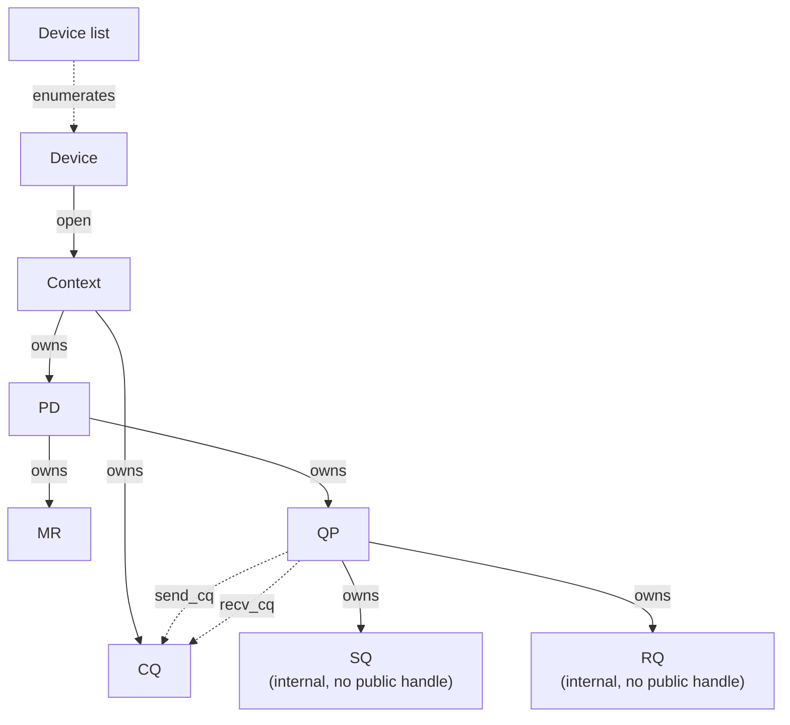
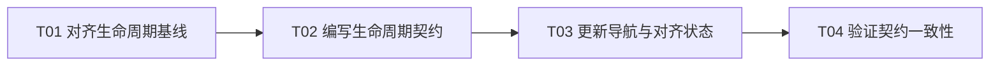

# F02-S02_对象模型与生命周期契约 步骤文档

**所属版本文档：** [UGDR_v1 版本文档](../UGDR_v1_版本文档.md)

**所属功能文档：** [F02_API 契约与对象模型 功能文档](F02_API_契约与对象模型_功能文档.md)

**所属版本：** v1

**功能标识：** F02-API 契约与对象模型

**步骤标识：** F02-S02-对象模型与生命周期契约

# 一、目标与完成条件

定义 Context、PD、MR、CQ、QP 以及 QP 内部 SQ/RQ 的 Client 可观察对象关系、所有权、创建与销毁顺序、句柄有效期及依赖仍存在时的失败行为，并在 `docs/contracts/object-lifecycle.md` 固化对象图、生命周期矩阵和错误结果。完成时，相关生命周期规则与 RDMA/libibverbs 对齐状态、UGDR 严格保证和后续步骤边界均可审阅、可追踪、可由文档治理检查验证；本步骤不实现运行时对象管理。

# 二、实现设计

本步骤采用已确认的“严格 child-first、无级联销毁”模型。PD 与 CQ 的依赖约束沿用 libibverbs；Context 仍有子对象时拒绝关闭、已销毁句柄返回确定错误，是 UGDR 为 daemon 资源安全和可验证性提供的严格保证，必须同时记录在对齐矩阵和持久决策中。

## 对象关系与所有权



| 对象 | 父对象或来源 | 持有或引用关系 | 本步骤边界 |
|-|-|-|-|
| Device list / Device | `ugdr_get_device_list` | 列表拥有返回数组；Device 指针在列表释放前可用于打开 Context。 | 列表释放后，未被打开的 Device 指针失效；已打开的 Context 独立存续。 |
| Context | 由 Device 打开 | 作为 PD 与 CQ 的对象树根。 | 不拥有级联销毁能力；必须先释放全部 PD 与 CQ。 |
| PD | Context | 拥有或约束 MR 与 QP 的保护域关系。 | 仍有 MR 或 QP 时不得释放。 |
| MR | PD | 不直接拥有其他公开对象。 | 成功注销后句柄失效；在途 WR 引用留给 F02-S04。 |
| CQ | Context | 被 QP 的 send_cq、recv_cq 引用；同一 CQ 可同时承担两者。 | 仍被任一 QP 引用时不得销毁。 |
| QP | PD | 包含 SQ 与 RQ，并引用 send_cq 与 recv_cq；QP、PD 与两个 CQ 必须属于同一 Context。 | 销毁时一并销毁 SQ/RQ，并解除对 PD 与 CQ 的关系；在途 WR/WC 行为留给 F02-S04。 |
| SQ / RQ | QP | 作为 QP 内部组成部分，由 QP 持有；应用分别向 SQ/RQ 提交 Send/Receive WR。 | 不提供独立公开 handle 或独立创建、销毁操作；容量、WR 提交与完成语义由 F02-S03/F02-S04 展开。 |

## 创建与销毁契约

| 操作 | 成功前置条件 | 成功结果 | 依赖未清理时 |
|-|-|-|-|
| `ugdr_free_device_list` | 传入由设备枚举返回的有效列表。 | 释放列表；未打开的 Device 指针失效，已打开 Context 不受影响。 | 无父子对象阻塞；重复或无效释放属于无效句柄。 |
| `ugdr_close_device` | Context 下不存在 PD 或 CQ。 | 关闭 Context，仅使该句柄失效。 | 返回 `-1`，设置 `errno=EBUSY`，无副作用。 |
| `ugdr_dealloc_pd` | PD 下不存在 MR 或 QP。 | 返回 0，解除与 Context 的关系并使句柄失效。 | 返回 `EBUSY`，无副作用。 |
| `ugdr_dereg_mr` | MR 句柄有效。 | 返回 0，解除与 PD 的关系并使句柄失效。 | 在途 WR 依赖不在本步骤决定，由 F02-S04 固化。 |
| `ugdr_destroy_cq` | 没有 QP 的 send_cq 或 recv_cq 引用该 CQ。 | 返回 0，解除与 Context 的关系并使句柄失效。 | 返回 `EBUSY`，无副作用。 |
| `ugdr_destroy_qp` | QP 句柄有效。 | 返回 0，销毁 QP 内部 SQ/RQ，解除对 PD、send_cq、recv_cq 的关系并使 QP 句柄失效。 | 在途 WR/WC 的 flush 与完成行为由 F02-S04 固化。 |

SQ 与 RQ 随 QP 创建并随 QP 销毁，不具有独立公开 handle 或独立生命周期操作。所有公开销毁操作都只处理目标公开对象，不自动递归销毁其独立子对象；销毁失败时对象及全部关系保持不变，调用方清理依赖后可以重试。

## 错误与句柄规则

| 条件 | 可观察结果 | 状态变化 |
|-|-|-|
| 空指针、错误对象类型、已销毁句柄或重复销毁 | 返回 `EINVAL`；`ugdr_close_device` 使用 `-1` 并设置 `errno=EINVAL`。 | 无 |
| 创建 QP 时 PD、send_cq、recv_cq 不属于同一 Context | 返回空指针并设置 `errno=EINVAL`。 | 不创建部分对象，不增加引用。 |
| 父对象或 CQ 仍被依赖 | 按对应接口返回域报告 `EBUSY`。 | 无；原句柄保持有效。 |
| F02-S02 完成但运行时尚未实现 | 现有公开入口继续显式返回 `EOPNOTSUPP`。 | 不得用成功占位或部分状态冒充运行时能力。 |

**设计伪代码：**

```python
def destroy(handle, expected_type, blockers):
    if not is_valid(handle, expected_type):
        return EINVAL
    if blockers(handle):
        return EBUSY
    detach_public_relationships(handle)
    invalidate(handle)
    return 0
```

具体句柄注册表、引用计数、IPC 编码、daemon 对象布局和内存回收策略不属于公开契约，F03 可以在满足上述可观察结果的前提下自行实现。

## 交付文件

| 位置 | 改动 | 职责 |
|-|-|-|
| `docs/contracts/object-lifecycle.md` | 新增 | 记录来源 revision、对象图、生命周期矩阵、错误结果和后续步骤边界。 |
| `docs/contracts/README.md` | 更新 | 把已审阅生命周期契约加入索引。 |
| `docs/contracts/libibverbs-alignment.md` | 更新 | 将 F02-S02 所有项从 pending 收敛为 aligned 或明确的 UGDR 严格保证。 |
| `docs/decisions/0002-strict-object-lifecycle.md` | 新增 | 记录 Context 关闭和失效句柄处理相对 libibverbs 的确定性收紧及其后果。 |

本步骤不修改 `include/ugdr/api.hpp`、`src/api/api.cpp` 或运行时测试，不实现 Context、PD、MR、CQ、QP 的真实创建与销毁。

## 实现任务

| 任务 | 交付 | 依赖 |
|-|-|-|
| T01 对齐生命周期基线 | 逐项核对 F02-S01 API、libibverbs 对象关系和本步骤已确认的严格保证。 | 无 |
| T02 编写生命周期契约 | 完成 `object-lifecycle.md` 与持久决策记录。 | T01 |
| T03 更新契约导航与对齐状态 | 更新契约索引和 libibverbs 对齐矩阵。 | T02 |
| T04 验证契约一致性 | 运行文档治理、状态和差异检查，并完成人工边界审计。 | T03 |



当前可启动任务为 T01。

# 三、验证与验收

| 验证动作 | 预期结果 | 失败判定 |
|-|-|-|
| 对象关系与生命周期人工审计 | Device list、Device、Context、PD、MR、CQ、QP 以及 QP 内部 SQ/RQ 的来源、父子关系、引用和销毁顺序均有唯一且一致的定义。 | 存在遗漏对象、环形所有权、未说明引用或销毁顺序歧义。 |
| libibverbs 对齐审计 | PD 与 CQ 的依赖约束标为 aligned；Context 关闭和失效句柄的严格保证有明确偏离理由和持久决策链接。 | 对齐状态仍为 pending，或有意收紧未记录理由。 |
| `python3 tools/check_project_docs.py --root .` | 契约索引、来源、决策记录和文档治理检查通过。 | 命令非零退出，出现缺失索引、无来源契约或治理冲突。 |
| `python3 tools/project_state.py validate --root .` | F02-S02 项目状态结构有效。 | 命令非零退出或状态与当前 scope 不一致。 |
| `tools/ugdr lint` | 仓库静态检查与文档治理全部通过。 | 任一检查失败。 |
| `git diff --check` | Markdown 无空白错误。 | 命令报告错误。 |
| 公开边界审计 | 契约只描述 Client 可观察行为，不固定引用计数、IPC、daemon 存储或队列实现；不提前决定 F02-S03/S04 语义。 | 内部实现布局泄漏，或把 QP 状态机、在途 WR/WC 行为提前写成已确认事实。 |

本步骤为文档契约交付，不要求构建运行时代码，也不以占位入口测试通过证明对象生命周期已经实现。人工验收只确认契约完整、对齐差异明确且边界可用于 F03-F04 后续实现。

# 四、审阅结论

整篇步骤文档已完成审阅。“QP owns SQ/RQ”作为 UGDR v1 的对象模型表述保持不变：SQ/RQ 是 QP 内部组成部分并随 QP 生命周期存在，不提供独立公开 handle；具体队列容量、WR 提交、完成和在途行为继续由 F02-S03/F02-S04 固化。
