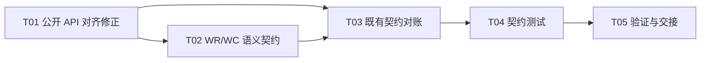

# F02-S04_WR/WC 与完成语义契约 步骤文档

**所属版本文档：** [UGDR_v1 版本文档](../UGDR_v1_版本文档.md)

**所属功能文档：** [F02_API 契约与对象模型 功能文档](F02_API_契约与对象模型_功能文档.md)

**所属版本：** v1

**功能标识：** F02-API 契约与对象模型

**步骤标识：** F02-S04-WR/WC 与完成语义契约

# 一、目标与完成条件

冻结 UGDR v1 在 RDMA Write 与 RDMA Write With Immediate 子集中的 MR key、SGE、Send/Receive WR、WC、posting、signaling、顺序、RNR、错误与 flush 契约，并修正此前公开 API 中与 libibverbs 不一致且会阻断正常使用的形状。完成时，Client 能按 verbs 习惯直接读取 `mr->lkey`/`mr->rkey`、填写 `wr.wr.rdma`、解析标准风格 WC；所有保留差异都在对齐矩阵中显式分类，F02 仍不实现真实队列或数据路径。

# 二、实现设计

## 2.1 对齐判定与范围

本步骤以 rdma-core 的 `infiniband/verbs.h`、`ibv_reg_mr(3)`、`ibv_post_send(3)`、`ibv_post_recv(3)` 和 `ibv_poll_cq(3)` 为直接基线。只有相关字段的名称、类型、顺序、嵌套层级、枚举数值、返回域和可观察语义都一致时，契约才可标为 aligned；裁剪、扁平化、隐藏配置或 UGDR helper 均须标为 subset adaptation、unsupported 或 UGDR extension。

v1 只支持 RC QP 上的 RDMA Write 与 RDMA Write With Immediate。Send/Recv、RDMA Read、Atomic、SRQ、inline、solicited、fence、completion event 和网络寻址字段仍不支持；不得为了结构看似完整而宣称这些操作可用。

## 2.2 MR 与公开记录

| 公开记录 | 字段与顺序 | 对齐约束 |
|-|-|-|
| `ugdr_mr` | `context`、`pd`、`addr`、`length`、`handle`、`lkey`、`rkey` | 与 `ibv_mr` 的公开字段顺序和类型对齐。`ugdr_reg_mr` 成功后，调用者直接读取 `mr->lkey` 和 `mr->rkey`；不新增 query/getter extension。公开字段是 Client snapshot，不暴露 daemon 内部对象布局。 |
| `ugdr_sge` | `uint64_t addr`、`uint32_t length`、`uint32_t lkey` | 字段、顺序和类型与 `ibv_sge` 对齐。 |
| `ugdr_send_wr` | `wr_id`、`next`、`sg_list`、`num_sge`、`opcode`、`send_flags`、匿名 union 中的 `imm_data`、`wr.rdma.remote_addr`、`wr.rdma.rkey` | 保留标准字段访问路径和 relevant prefix；只裁掉未支持 opcode 专属 union。`imm_data` 是网络字节序的 32 位值。 |
| `ugdr_recv_wr` | `wr_id`、`next`、`sg_list`、`num_sge` | 字段、顺序和类型与 `ibv_recv_wr` 对齐。 |
| `ugdr_wc` | `wr_id`、`status`、`opcode`、`vendor_err`、`byte_len`、匿名 union 中的 `imm_data`、`qp_num`、`src_qp`、`wc_flags`、`pkey_index`、`slid`、`sl`、`dlid_path_bits` | 采用标准基础 WC 形状；v1 不适用字段置零。非 SUCCESS 时仅 `wr_id`、`status`、`qp_num`、`vendor_err` 有效。 |
| `ugdr_wc_flags` | `UGDR_WC_WITH_IMM = 1U << 1U` | 数值对齐 `IBV_WC_WITH_IMM`；其他 WC flag 不属于 v1。 |

## 2.3 Posting 与 bad_wr

| 条件 | 结果 | 副作用 |
|-|-|-|
| 整个链表成功提交 | 返回 0；`bad_wr` 的值未定义，调用者不得依赖它被清零。 | 按链表顺序把全部 WR 接收到对应 SQ/RQ。 |
| 提交时可立即检测到首个失败 WR | 返回正 errno，并令 `*bad_wr` 指向该 WR。 | 失败 WR 及其后继未提交；此前成功前缀保持已提交，不生成回滚。 |
| 空必需参数、未知 opcode/flag、负 `num_sge`、SGE 数量超过 QP 能力或状态不允许 | `EINVAL` | 按上面的成功前缀规则处理。 |
| SQ/RQ 无法再接收当前 WR | `ENOMEM` | `*bad_wr` 指向第一个因容量未提交的 WR。 |
| F02 占位实现 | `EOPNOTSUPP` | 不消费任何 WR，也不修改调用者传入的 `bad_wr`。 |

WR record 和 SGE array 只需保持有效到 post 调用返回；实现必须复制提交所需描述。非 inline 数据 buffer 必须保持有效到 WR 完成。unsignaled WR 没有成功 WC，调用者通过同一 SQ 中后续 signaled WR 的成功 completion 证明其之前的 WR 已完成。

## 2.4 Write、Write With Immediate 与 completion

| 操作 | 远端 RQ | 发送侧 completion | 接收侧 completion |
|-|-|-|-|
| `UGDR_WR_RDMA_WRITE` | 不检查、不消费 Receive WR。 | `sq_sig_all=1` 或 WR 带 `UGDR_SEND_SIGNALED` 时，在远端写入成功且可见后生成 `UGDR_WC_RDMA_WRITE`。 | 不生成。 |
| `UGDR_WR_RDMA_WRITE_WITH_IMM` | 按 FIFO 消费一个 Receive WR；Receive WR 只提供 `wr_id` 和接收通知，不承载 RDMA Write payload。 | signaling 规则与普通 Write 相同。 | 成功时总是生成 `UGDR_WC_RECV_RDMA_WITH_IMM`；带 `UGDR_WC_WITH_IMM`，返回网络字节序 `imm_data`，`byte_len` 为 RDMA Write 总长度。 |

零 SGE Receive WR 是 v1 的有效通知 WR：`num_sge=0` 且 `sg_list=null`。非零 SGE Receive WR 仍按标准记录形状和 QP 上限接受，但 Write With Immediate 不向这些 SGE 写 payload；其内容保持不变。

successful receive WC 和 successful send WC 都只能在远端目标数据可见后生成；两端独立 polling 之间不承诺额外的全局先后关系。

## 2.5 RNR、错误 WC 与 ERR flush

Write With Immediate 到达时没有可消费 Receive WR，responder 返回 RNR。requester 按 RC 的 `rnr_retry`/`min_rnr_timer` 语义重试；有限预算耗尽后，即使原 WR unsignaled 也生成 `UGDR_WC_RNR_RETRY_EXC_ERR`，requester QP 进入 ERR。失败路径不消费远端 Receive WR、不生成接收 WC；RDMA Write 不是原子操作，调用者不得把失败或重试期间的远端目标内容视为保持不变，只有 successful completion 后的数据才可依赖。`rnr_retry=7` 保持标准的无限重试语义。

现有 F02-S03 API 未暴露影响 RNR 的标准配置，不能以隐藏固定值冒充 aligned。本步骤将修正 `ugdr_qp_attr` 和连接入口；`ugdr_qp_attr` 整体仍是裁剪后的 subset adaptation，但下列字段、mask 和编码逐项对齐 libibverbs。

| 字段 | 类型 | mask | 约束 |
|-|-|-|-|
| `timeout` | `uint8_t` | `UGDR_QP_TIMEOUT = 1U << 9U` | RC requester ACK timeout 编码。 |
| `retry_cnt` | `uint8_t` | `UGDR_QP_RETRY_CNT = 1U << 10U` | RC transport retry 编码。 |
| `rnr_retry` | `uint8_t` | `UGDR_QP_RNR_RETRY = 1U << 11U` | RNR retry 编码；值 7 表示无限重试。 |
| `min_rnr_timer` | `uint8_t` | `UGDR_QP_MIN_RNR_TIMER = 1U << 15U` | responder 最小 RNR timer 编码。 |

```c
int ugdr_connect_qp(
    ugdr_qp *qp,
    const ugdr_qp_conn_info *remote_info,
    const ugdr_qp_attr *attr,
    int attr_mask);
```

`ugdr_connect_qp` 必须要求上述四个 mask，并按 attr 配置本地 requester/responder retry 属性后再原子完成 INIT→RTR→RTS。该 helper 继续标为 UGDR extension；不得把扩展签名本身标为标准 API。

| 执行期条件 | WC status | 状态与数据结果 |
|-|-|-|
| 本地 SGE 长度或总长度非法 | `UGDR_WC_LOC_LEN_ERR` | 失败 WC 后 requester 进入 ERR。 |
| lkey 无效、过期、跨 PD 或 SGE 超出本地 MR | `UGDR_WC_LOC_PROT_ERR` | 失败 WC 后 requester 进入 ERR。 |
| rkey 无效、过期、跨 PD、缺少 Remote Write 权限或目标范围越界 | `UGDR_WC_REM_ACCESS_ERR` | 失败 WC 后 requester 进入 ERR；responder QP 不因 requester 的访问错误改变状态。 |
| peer 不可达或 RC retry budget 耗尽 | `UGDR_WC_RETRY_EXC_ERR` | 失败 WC 后 requester 进入 ERR。 |
| RNR retry budget 耗尽 | `UGDR_WC_RNR_RETRY_EXC_ERR` | 失败 WC 后 requester 进入 ERR；远端不消费 Receive WR、不生成接收 WC，目标数据不保证保持不变。 |
| QP 进入 ERR 时尚未完成的 WR | `UGDR_WC_WR_FLUSH_ERR` | SQ/RQ 中每个未完成 WR 各生成一个 flush WC，包括 unsignaled Send WR；已生成且未 poll 的 WC 保留。 |

error WC 不受 signaling 抑制。对 non-SUCCESS WC，除标准规定有效的四个字段外，其余字段不参与判断。F02 不承诺 RDMA Write 多 SGE payload 的原子更新；发生执行期错误时，除明确的 RNR 前置失败外，远端目标可能已部分更新。

## 2.6 顺序、polling 与销毁边界

- 同一 QP 的 SQ 按 WR posting 顺序执行；RQ 按 Receive WR posting 顺序消费。
- 同一 QP、同一方向生成的 WC 保持 WR 顺序。多个 QP 或 send/recv 共用一个 CQ 时，只保证各来源内部顺序与因果关系，不定义跨来源全局顺序。
- `ugdr_poll_cq` 最多返回 `num_entries` 个最早 WC，返回数量为非负数，并从 CQ 中移除这些 WC；失败返回负 errno 且不写输出。
- 进入 ERR 负责生成 flush WC。`ugdr_destroy_qp` 不额外伪造 completion；销毁返回后尚未执行的 WR 不再访问 buffer，已进入 CQ 的 WC 仍可从 CQ poll。
- MR 在仍被已提交且未完成 WR 引用时不得注销；UGDR 以 `EBUSY` 提供确定性保护，这是强于标准的 lifecycle guarantee，必须在对齐矩阵中显式标记。

## 2.7 设计伪代码

```python
def execute_send(qp, wr):
    validate_local_sges_or_complete_error(qp, wr)
    validate_remote_mr_or_complete_error(qp, wr)

    if wr.opcode == UGDR_WR_RDMA_WRITE_WITH_IMM:
        while True:
            outcome = attempt_write_with_imm(qp.peer, wr)
            if outcome.success:
                recv_wr = outcome.consumed_recv_wr
                break
            if outcome.is_rnr and qp.rnr_policy.can_retry():
                wait_for_min_rnr_timer(qp.rnr_policy)
                continue
            complete_error_and_enter_err(qp, wr, UGDR_WC_RNR_RETRY_EXC_ERR)
            return
    else:
        perform_rdma_write_in_sq_order(wr)

    make_remote_data_visible()
    if wr.opcode == UGDR_WR_RDMA_WRITE_WITH_IMM:
        emit_receive_wc(qp.peer.recv_cq, recv_wr, wr)
    if qp.sq_sig_all or wr.send_flags & UGDR_SEND_SIGNALED:
        emit_send_wc(qp.send_cq, wr, UGDR_WC_SUCCESS)
```

## 2.8 文件与实现任务

| Txx | 任务 | 交付 | 依赖 |
|-|-|-|-|
| T01 | 公开 API 对齐修正 | 更新 `include/ugdr/api.hpp`：公开 `ugdr_mr` 标准字段，补齐 SGE/WR/WC/WC flag，并修正 RC retry attr 与 connect helper 输入。 | 无 |
| T02 | WR/WC 语义契约 | 新增 `docs/contracts/wr-wc-semantics.md`，固化 posting、bad_wr、Write/Immediate、RNR、signaling、ordering、error WC、flush 和 polling。 | T01 |
| T03 | 既有契约对账 | 更新 public-api、libibverbs-alignment、object-lifecycle、rc-qp-state-machine 与相关 decision，纠正错误的 aligned 分类和 F02-S03 retry 输入。 | T01、T02 |
| T04 | 契约测试 | 扩展 `api_contract_test`，编译验证 `mr->lkey/rkey`、`wr.wr.rdma`、WC 字段/数值/偏移和所有占位入口无副作用。 | T03 |
| T05 | 验证与交接 | 运行构建、测试、状态和文档治理检查，记录实现证据；人工验收前不勾选“已实现”。 | T04 |



# 三、验证与验收

| 验证动作 | 预期结果 | 失败判定 |
|-|-|-|
| 构建并运行 `api_contract_test`；加入直接使用 `mr->lkey`/`mr->rkey`、`wr.wr.rdma`、`wc.imm_data` 的 C/C++ 编译片段。 | 字段访问、类型、顺序、嵌套和标准枚举数值全部通过；不需要 daemon、GPU 或 RDMA 设备。 | 必须通过额外 getter、非标准字段路径或类型转换才能编译，或 static assertion 失败。 |
| 逐项对照 rdma-core `verbs.h` 与相关 man page 审计 alignment matrix。 | 每一项明确标为 aligned、subset adaptation、UGDR extension 或 unsupported；不存在“名字相同即 aligned”。 | 裁剪、扁平化、隐藏 retry policy 或 extension 被误标为 aligned。 |
| 审计 `docs/contracts/wr-wc-semantics.md` 的行为矩阵。 | 普通 Write、Write With Immediate、零 SGE Receive WR、RNR retry、signaled/unsignaled、error WC、ERR flush、ordering 和 polling 均有唯一结果。 | 普通 Write 消费 RQ、Immediate 不生成接收 WC、RNR 立即失败、error WC 被 signaling 抑制或顺序边界未定义。 |
| 运行 F02 占位入口负向测试。 | `ugdr_post_send`/`ugdr_post_recv` 返回 `EOPNOTSUPP` 且不修改 `bad_wr`；`ugdr_poll_cq` 返回 `-EOPNOTSUPP` 且不写 WC。 | 返回成功、消费 WR、生成 WC 或改写 sentinel。 |
| 运行 `cmake --build build` 与 `ctest --test-dir build --output-on-failure`。 | 全部构建和测试通过。 | 任一 target 或测试失败。 |
| 运行 `python3 tools/project_state.py validate --root .`、`python3 tools/check_project_docs.py --root .` 与 `git diff --check`。 | 状态、文档治理和 diff 检查全部通过；实现证据写入本步骤 progress 记录。 | 任何检查失败或证据缺失。 |

测试通过不能替代人工审阅或实现验收。只有整篇步骤文档人工审阅通过后才能同步为 reviewed Markdown 并进入实现；实现完成且验证通过后仍需人工确认“已实现”。
