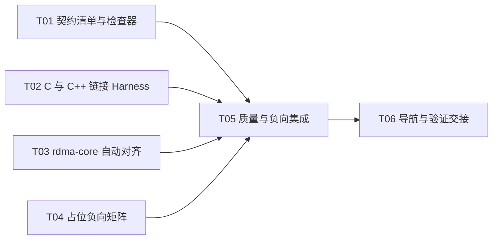

# F02-S05_契约集成、占位入口与验证 Harness 步骤文档

**所属版本文档：** [UGDR_v1 版本文档](../UGDR_v1_版本文档.md)

**所属功能文档：** [F02_API 契约与对象模型 功能文档](F02_API_契约与对象模型_功能文档.md)

**所属版本：** v1

**功能标识：** F02-API 契约与对象模型

**步骤标识：** F02-S05-契约集成、占位入口与验证 Harness

# 一、目标与完成条件

整合 F02-S01 至 F02-S04 已审阅的公开 API、Client 可观察契约和显式失败占位入口，形成不依赖 daemon、RDMA 设备或 GPU 的确定性验证 Harness。完成时 C11 与 C++ Client 均可编译、链接并覆盖全部公开符号，rdma-core 对齐项、契约索引与来源、AGENTS.md 文档地图和占位入口无副作用均由自动检查固定，且没有 mock 或成功占位冒充运行时能力。

# 二、实现设计

## 集成边界

本步骤只集成已经审阅的 F02-S01 至 F02-S04 产物，不新增公开操作、修改已冻结语义或实现 daemon、对象、队列、重试、completion 与数据路径。验证可以依赖 rdma-core 开发头文件，但不得链接或调用 libibverbs 运行时，也不得要求 RDMA 设备或 GPU。

飞书文档继续作为设计与审阅来源，仓库 reviewed snapshot 和 `docs/contracts/` 继续作为实现输入。新增机器清单只记录文件、来源 revision、公开符号和验证入口，不复制或改写契约正文。

## 文件与职责

| 位置 | 改动 | 职责与边界 |
|-|-|-|
| `tools/client-contracts.json` | 新增机器清单 | 列出公开头文件、library target、全部 `ugdr_*` 符号、必需契约文档及 reviewed snapshot revision；不成为语义来源。 |
| `tools/check_client_contracts.py` | 新增确定性检查器 | 校验清单结构、路径、revision、契约索引、AGENTS.md 文档地图以及公开符号在头文件和对齐矩阵中的覆盖；失败返回非零且逐项报告。 |
| `tests/integration/check_client_contract_failures.py` | 新增负向 fixture | 覆盖缺失契约、过期 revision、未索引契约、缺失 AGENTS.md 路由和公开符号漏项；fixture 必须证明检查器拒绝错误仓库。 |
| `tests/unit/api_contract_c_test.c` | 拆为独立 C11 Client | 从 C 编译并链接 `ugdr_api`，直接使用公开结构并引用全部公开函数；不得通过 C++ wrapper 掩盖 C ABI 问题。 |
| `tests/unit/api_contract_test.cpp` | 收敛 C++ 契约测试 | 验证 C++ 签名、结构、数值、占位返回域、errno 和所有输出 sentinel 不变；不把字符串命中当作行为证明。 |
| `tests/unit/libibverbs_alignment_test.cpp` | 新增编译期对齐测试 | 同时包含 UGDR 头文件和 `<infiniband/verbs.h>`，按对齐分类执行数值、类型、偏移和布局断言；只编译运行本地断言，不访问设备。 |
| `tests/unit/CMakeLists.txt` | 注册 Harness | 分别注册 C link、C++ API、rdma-core alignment 与占位负向测试，并使用 `ugdr_contract` label。 |
| `tools/ugdr_cli/quality.py` | 集成检查器 | 让 `tools/ugdr lint` 运行 Client 契约检查；保持现有退出码聚合与结果格式。 |
| `AGENTS.md`、`docs/contracts/README.md`、`tools/module-boundaries.json` | 对账导航与治理入口 | 文档地图继续指向契约目录，索引覆盖完整契约集，新增 checker、policy 和 fixture 纳入仓库必需路径；不改变生产 target 依赖图。 |

## 机器清单与一致性规则

| 清单字段 | 内容 | 检查规则 |
|-|-|-|
| `schema_version` | 固定为 1 | 未知字段、缺失字段或错误版本均失败。 |
| `public_header`、`library_target` | `include/ugdr/api.hpp`、`ugdr_api` | 路径和 CMake target 必须存在。 |
| `public_symbols` | F02-S01 冻结并由 S03、S04 修正签名后的全部公开函数 | 每项必须同时出现在公开头文件和 `libibverbs-alignment.md`；重复和未知项失败。 |
| `reviewed_sources` | F02 功能文档与 S01 至 S04 snapshot 路径和 revision | 读取 front matter，路径、`review_status=reviewed` 与 revision 必须一致。 |
| `required_contracts` | README、public API、alignment、lifecycle、RC QP、WR/WC | 文件必须存在并由 `docs/contracts/README.md` 索引；契约中的本地来源链接必须通过文档治理。 |

检查器只验证机器可判定的一致性，不宣称自动证明自然语言语义正确。行为语义仍由 reviewed snapshot、契约正文、编译期断言和占位负向测试共同约束。

## rdma-core 对齐规则

| 分类 | 自动断言 | 禁止断言 |
|-|-|-|
| aligned 完整记录 | MR 的对象指针字段比较指针类别、宽度和偏移，标量字段比较精确类型；SGE 与 Receive WR 比较对应字段类型。三者均比较 `sizeof`、`alignof` 和逐字段 `offsetof`。 | 不得只比较名称或相对顺序。 |
| subset adaptation 记录 | Send WR 与 WC 比较已暴露 relevant prefix、访问路径、字段类型和逐字段偏移；QP attr 仅比较公开字段类型、mask 与编码，不比较相对完整 `ibv_qp_attr` 的偏移或整体布局。 | 不得要求裁剪记录与完整 `ibv_*` 结构 `sizeof` 相等，也不得把裁剪重新标为 aligned。 |
| 枚举与 mask | 所有公开 QP、WR、WC、access 数值逐项与对应 `IBV_*` 常量比较。 | 不得用手写重复常量作为对照源。 |
| UGDR extension 与 strict guarantee | 由 UGDR 签名断言、文档清单和负向行为测试覆盖。 | 不得寻找不存在的一对一 verbs ABI 或把扩展标为 aligned。 |
| unsupported | 检查公开表面没有对应操作，已有占位入口不得成功。 | 不得增加 mock、假 handle、假 WC 或隐式运行时状态。 |

配置阶段找不到 rdma-core `infiniband/verbs.h` 时必须以明确诊断失败，不得静默跳过 alignment target。该依赖仅用于开发期编译验证，不引入生产链接边。

## 占位入口与执行流程

**设计伪代码：**

```python
def verify_f02_contracts(repo, build):
    manifest = load_and_validate_manifest(repo)
    verify_reviewed_sources_and_revisions(manifest)
    verify_contract_index_and_agents_map(manifest)
    verify_public_symbol_inventory(manifest)

    require_header("infiniband/verbs.h")
    build_c11_client_and_link_ugdr_api()
    build_cpp_client_and_link_ugdr_api()
    compile_and_run_rdma_core_static_assertions()

    for call in all_public_placeholder_calls():
        before = snapshot_inputs_outputs_and_errno(call)
        result = invoke(call)
        require_expected_unsupported_domain(call, result)
        require_no_handle_state_wr_or_wc_was_created(before, call)

    return success_only_if_every_check_passed()
```

指针返回入口必须返回 null 并设置 `errno=EOPNOTSUPP`；`ugdr_close_device` 返回 -1 并设置 errno；`ugdr_poll_cq` 返回 `-EOPNOTSUPP`；其余整数入口返回正 `EOPNOTSUPP`。void 入口只允许设置已审阅的 errno。所有输入结构、查询输出、`bad_wr`、WC、计数和 sentinel 保持不变。

## 实现任务

| Txx | 任务 | 交付 | 依赖 |
|-|-|-|-|
| T01 | 契约机器清单与检查器 | 新增 policy、checker 及来源、索引、AGENTS.md、符号覆盖规则。 | 无 |
| T02 | C11 与 C++ 编译链接 Harness | 独立 Client targets 引用全部公开记录和符号并链接 `ugdr_api`。 | 无 |
| T03 | rdma-core 自动对齐 | 新增 direct-header static assertion target，按 aligned 与 subset adaptation 分界比较。 | 无 |
| T04 | 占位入口负向矩阵 | 覆盖全部返回域、errno、sentinel 与零副作用，移除 mock 式成功断言和文本命中替代。 | 无 |
| T05 | 集成质量与负向 fixture | 接入 CMake、CTest 和 `tools/ugdr lint`，加入 checker 失败 fixture。 | T01、T02、T03、T04 |
| T06 | 导航对账与验证交接 | 更新必要路径和索引，执行全套验证并记录 progress；不宣称运行时已实现。 | T05 |



当前可并行启动 T01、T02、T03 和 T04；T05 在四项全部完成后启动，T06 最后执行。

# 三、验证与验收

实现完成后按下表验证。任一必需 target、负向 fixture、治理检查或 sentinel 判定失败，都视为本步骤未完成；测试通过不代表 F03 及后续运行时能力已经存在。

| 验证动作 | 预期结果 | 失败判定 |
|-|-|-|
| 运行 Client 契约检查器及其负向 fixture | 当前仓库通过；缺失契约、revision 不符、索引或 AGENTS.md 路由缺失、符号漏项的 fixture 均被确定拒绝。 | 错误 fixture 被接受、错误信息不能定位条目，或检查器修改仓库状态。 |
| 构建并运行独立 C11 Client | 只包含 `ugdr/api.hpp` 即可直接使用 MR key、SGE、WR/WC 字段，引用全部公开函数并链接 `ugdr_api`。 | 需要 C++ wrapper、额外 getter、非标准字段路径、符号缺失或链接失败。 |
| 构建并运行 C++ API contract target | 公开签名、字段、枚举、mask、返回域与 sentinel 断言全部通过。 | 签名或布局漂移、返回成功、输入输出被改写或生成部分状态。 |
| 构建并运行 rdma-core alignment target | 直接对照 `infiniband/verbs.h`；完整记录与 relevant subset 按各自边界通过类型、数值、偏移和布局断言。 | 缺少 header 时静默跳过、手写镜像常量代替标准头、裁剪结构被误要求完整 ABI 相等，或任何断言失败。 |
| 逐入口运行占位负向矩阵 | 全部入口按 reviewed 返回域报告 `EOPNOTSUPP`，不创建 handle、不消费 WR、不生成 WC、不修改 caller 输出。 | 任何入口返回 0 或非空假对象，或 errno、sentinel、结构体、计数发生未约定变化。 |
| `tools/ugdr format --check` | 新增 C、C++、Python 和 CMake 文件满足仓库格式规则。 | 命令非零或报告格式差异。 |
| `tools/ugdr lint` | 格式、clang-tidy、Client 契约、模块边界、文档治理、skeleton 和状态全部通过。 | 任一子检查失败，或 Client checker 未进入 lint。 |
| `tools/ugdr build` 与 `tools/ugdr test` | 全部生产 target 与 Harness 编译、链接，完整 CTest 通过；无需 daemon 会话、RDMA 设备或 GPU 数据路径。 | 任一 target 或测试失败，或测试依赖真实运行时才能通过。 |
| `python3 tools/check_module_boundaries.py --root . --build-dir build` | 生产 target 与允许边保持不变，验证 Harness 只位于测试和工具边界。 | `ugdr_api` 新增 libibverbs 或其他生产依赖，或模块边界检查失败。 |
| `python3 tools/check_project_docs.py --root .`、`python3 tools/project_state.py validate --root .`、`git diff --check` | 契约链接、机器状态和 diff 均有效，验证证据进入 `docs/progress/F02-S05.md`。 | 任何命令失败、来源不可追踪、状态与 scope 不一致或证据缺失。 |
| 人工范围审计 | AGENTS.md 可定位完整契约集；没有 mock 成功、运行时对象、IPC、WQE/CQE 布局、worker 算法或 GPU 元数据进入 F02 交付。 | 验证 Harness 固化内部实现，或把占位测试表述为运行时已经实现。 |

人工验收只确认 F02 契约产物完整、公开 API 可集成、自动对齐与负向验证可靠；不确认真实对象生命周期、QP 状态变化、队列执行或数据传输已经实现。
