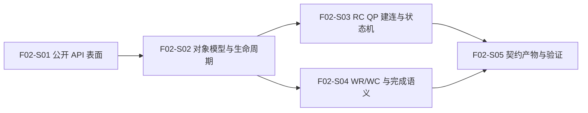

# F02_API 契约与对象模型 功能文档

**所属版本：** UGDR_v1

**所属版本文档：** [UGDR_v1 版本文档](../UGDR_v1_版本文档.md)

**功能标识：** F02

**功能名称：** API 契约与对象模型

## 一、功能目标

UGDR Client 使用者和 F03-F07 实现者能够依据一套已冻结的 v1 verbs-like 公开 API 完成编译期集成，并依据仓库契约文档实现和验证后续运行时。完成标志是 Client 可见的公开类型、枚举、函数签名与必要占位入口以代码呈现并可编译、链接；对象关系、RC QP 状态转换、错误、顺序、signaling 和 completion 等可观察语义在 `docs/contracts/` 中形成已审阅契约，并可对照 RDMA/libibverbs 验证。F02 不要求入口具备真实运行时能力。

## 二、背景与版本关系

F02 承接 UGDR v1 中“确认最小 verbs-like API 与对象模型”的版本目标，是 F01 完成后的唯一后继功能，也是 F03 控制面、F04 队列、F05 Loop Worker、F06 GPU Kernel 和 F07 端到端验收共同依赖的公开边界。F02 用代码固定 Client 必须编译依赖的 API 形状，用文档固定 Client 可观察语义；IPC、队列、worker 和 GPU 的内部实现仍由 F03-F06 决定。这样既避免把全部契约编码成过早的运行时结构，也避免内部 WQE/CQE、daemon 对象或 GPU 完成点泄漏为公开 verbs 行为。

## 三、功能范围

- 以代码定义 v1 Client 公开 API，覆盖 RC QP 建连以及 `rdma_write`、`rdma_write_with_imm` 所必需的 device/context、PD、MR、CQ、QP、连接信息交换、WR posting 与 WC polling 类型、枚举和函数签名。
- 定义参数、返回值、公开句柄、对象关系、生命周期、所有权和资源销毁约束。
- 定义 RC QP 的连接信息、状态集合、合法转换、操作前置条件和非法转换结果。
- 定义 Send/Receive WR、SGE、WC、opcode、work request 标识、immediate data、signaling 与 CQ 关联契约。
- 明确 RDMA Write 与 RDMA Write With Immediate 的差异，包括 Receive WR 消费、RNR 或等价错误、本地与远端 completion 行为；普通 RDMA Write 不消费远端 Receive WR，也不产生远端接收 WC。
- 定义已支持子集中的错误、顺序、失败传播和 completion 条件；WQE/CQE 只作为内部或 provider 层表示。
- 在 `docs/contracts/` 中形成 public-api、libibverbs-alignment、object-lifecycle、rc-qp-state-machine 和 wr-wc-semantics 等契约文档及索引，并把该目录加入 `AGENTS.md` 文档地图；同时提供公开 API 编译、链接、对齐与负向契约测试。

## 四、非目标

- 公开 API 的占位入口不实现 IPC、daemon session 或控制面对象注册、查询和销毁行为；这些属于 F03。需要链接占位时必须明确返回 unsupported 或 not implemented，不得返回成功或产生可误认为真实运行时的状态。
- 不实现 SQ/RQ 的 WR 存储与消费、CQ 的 WC 生成与 polling 行为或容量管理；这些属于 F04。
- 不实现 datagram、Loop Worker、目标 MR 定位、GPU copy 或真实 completion 数据路径；这些属于 F05-F06。
- 不支持 RC 之外的传输类型，不实现 RDMA Read、Send/Recv 数据操作、Atomic 等未列入 v1 的操作，也不宣称完整 libibverbs ABI 兼容。
- 不在公开契约中固定内部 WQE/CQE 布局、队列实现、线程模型、IPC 编码、datagram 结构或 GPU 元数据格式。

## 五、依赖与约束

- 前置依赖为已完成人工验收并合入 master 的 F01，以及 revision 117 的已审阅 UGDR_v1 版本文档。
- 已支持子集的公开 API、对象关系、术语、QP 状态转换、错误、顺序、signaling 和 completion 语义默认对齐 RDMA/libibverbs。
- 公开与设计边界使用 QP/SQ/RQ/CQ、WR/WC；WQE/CQE 仅用于内部或 provider 层表示，除非已审阅接口明确暴露。
- F02 的代码只冻结公开 API 形状并满足必要的编译、链接验证；运行时实现从 F03 开始。占位入口必须明确报告 unsupported 或 not implemented，契约测试不得用返回成功的 Mock 行为冒充 API 已实现。
- F02 的设计与契约验证不依赖 RDMA 网卡或 GPU；真实 GPU buffer 和端到端数据正确性由 F06-F07 验收。
- daemon、队列或 GPU 架构导致的任何有意偏离必须写入已审阅设计、记录为持久决策，并由专项测试覆盖。

## 六、功能设计与模块边界

**公开 API 边界：** 对外只暴露 v1 必需的 verbs 风格类型、枚举、对象句柄和函数签名，并尽量沿用 RDMA/libibverbs 的名称、关系与可观察语义。公开头文件及必要的可链接占位入口构成 F02 的代码交付；占位入口不维护运行时状态，未实现能力必须显式失败。连接信息交换属于 UGDR 为 RC QP 建连提供的辅助契约，不伪装成标准 verbs 对象。

**对象模型：** Context 是对象树根；PD 约束 MR 与 QP 的保护域关系；CQ 可分别关联 QP 的发送侧与接收侧，也允许同一 CQ 承载两类完成；QP 包含 SQ/RQ 语义。父对象、关联对象及仍被引用对象的销毁必须受到生命周期规则约束，精确返回行为在 F02-S02 固化。

**状态与操作：** RC QP 只允许按契约定义的状态与前置条件转换；发送 WR、接收 WR 和完成查询只在允许的状态与对象关系下生效。RDMA Write 与 Write With Immediate、signaled 与 unsignaled、发送完成与接收完成的区别必须成为可测试的外部契约，运行时完成生成留给后续功能。

**错误边界：** 无效句柄、跨保护域关联、非法 QP 状态或转换、无效 flags/opcode、SGE 越界、无效 rkey 等输入必须产生确定且可观察的失败；F02 规定外部结果，不规定 daemon、队列或 worker 内部如何检测。

**契约文档边界：** 仓库新增 `docs/contracts/` 作为面向实现与测试的规范目录，包含 `README.md`、`public-api.md`、`libibverbs-alignment.md`、`object-lifecycle.md`、`rc-qp-state-machine.md` 和 `wr-wc-semantics.md`。飞书文档仍是设计与审阅来源；`docs/contracts/` 只承载已审阅结论，并在 `AGENTS.md` 文档地图中登记。契约只约束 Client 可观察行为，不规定 IPC 编码、内部队列布局、worker 算法或 GPU 元数据。

**待步骤内确认：** 具体 API 符号、字段类型与数值编码、返回值与错误码、占位入口的统一错误表达、零 SGE Receive WR 的支持方式、连接信息交换编码等仍为待定项，分别在 F02-S01 至 F02-S04 中审阅后固化，不在功能文档中提前代替实现设计。

## 七、步骤划分

将功能拆分为可独立设计、实现和验收的步骤。此处只定义步骤目标、交付、依赖和验收边界，不展开具体实现。

| 步骤编号 | 步骤名称 | 目标 | 依赖 | 完成标准 |
|-|-|-|-|-|
| F02-S01 | v1 公开 API 表面与对齐基线 | 以公开头文件、类型、枚举和函数签名确认最小 Client API，并建立 RDMA/libibverbs 对齐矩阵。 | 无（外部前置：F01、已审阅版本文档） | Client API 代码可编译；每项标明标准对齐、明确偏离、不支持或待定；必要占位入口显式失败，不实现运行时。 |
| F02-S02 | 对象模型与生命周期契约 | 定义 Context、PD、MR、CQ、QP 的关系、所有权、创建销毁与生命周期。 | F02-S01 | `docs/contracts/object-lifecycle.md` 固化对象图、生命周期约束与可观察错误结果；不规定运行时对象管理结构。 |
| F02-S03 | RC QP 建连与状态机契约 | 定义连接信息、QP 状态、转换前置条件与非法转换结果。 | F02-S02 | `docs/contracts/rc-qp-state-machine.md` 形成完整状态表与契约测试；不规定 IPC 或控制层实现。 |
| F02-S04 | WR/WC 与完成语义契约 | 定义 Send/Receive WR、SGE、WC、signaling、顺序、错误，以及 Write 与 Write With Immediate 语义。 | F02-S02 | `docs/contracts/wr-wc-semantics.md` 固化发送/接收完成、Receive WR 消耗、RNR、signaled/unsignaled 和错误语义；不规定队列实现。 |
| F02-S05 | 契约集成、占位入口与验证 Harness | 整合公开 API 代码与 `docs/contracts/` 契约集，更新 `AGENTS.md` 文档地图，并形成编译、链接、对齐与负向验证。 | F02-S03、F02-S04 | 公开 API 可编译、链接；契约目录与 `AGENTS.md` 文档地图一致；占位入口和不支持项明确失败；不以 mock 冒充运行时实现。 |

## 八、验证与功能验收标准

- F02 的 v1 Client 公开 API 以代码覆盖已确认对象和操作并通过编译、链接检查；每项都有 RDMA/libibverbs 对齐状态、支持边界及可追踪的待定或偏离说明。
- `docs/contracts/` 包含索引、公开 API、对齐矩阵、对象生命周期、RC QP 状态机和 WR/WC 语义文档，`AGENTS.md` 文档地图能够定位该目录；契约只约束 Client 可观察行为，不固定 F03-F06 的内部实现。
- 所有尚未实现的公开入口均显式返回 unsupported 或 not implemented，不返回成功或产生部分运行时状态；正向、负向与对齐测试不依赖 daemon、IPC、真实队列、worker、GPU 或 RDMA 硬件，也不把占位或 mock 表述为已实现运行时。

## 九、风险与待确认事项

| 类型 | 事项 | 处理方式 |
|-|-|-|
| 已确认 | v1 支持子集默认对齐 RDMA/libibverbs 的公开 API 与可观察语义。 | 任何有意偏离都必须在对齐矩阵中标明，并经审阅、决策记录与契约测试确认。 |
| 待定 | 具体 API 符号、字段类型、返回值、错误码、占位入口统一错误表达及 ABI 暴露范围。 | 在 F02-S01 中逐项确认并冻结。 |
| 待定 | 对象所有权、引用关系、销毁顺序和失败行为。 | 在 F02-S02 中以对象图和生命周期表确认。 |
| 待定 | RC 连接信息字段、交换编码和 QP 状态转换细节。 | 在 F02-S03 中以状态表和负向用例确认。 |
| 待定 | 零 SGE Receive WR、signaled/unsignaled、RNR、错误 WC 与顺序保证的精确边界。 | 在 F02-S04 中逐项对齐标准语义并确认。 |
| 风险 | 尚未实现的公开入口返回成功或产生部分状态，使 Client 或测试误判运行时能力已经存在。 | 占位入口统一显式返回 unsupported 或 not implemented；负向测试验证不成功且无副作用。 |
| 风险 | `docs/contracts/` 与已审阅飞书设计不一致，导致 Agent、实现或测试依据过期或未经确认的契约工作。 | 契约文档记录来源飞书文档及 revision，只同步已完成审阅的结论；契约发生变化时必须重新完成飞书审阅并同步本地文档。 |

## 十、变更记录

| 日期 | 变更 | 原因 | 影响 |
|-|-|-|-|
| 2026-07-20 | 基于已审阅版本文档创建 F02 功能草案，并确认五步拆分与依赖关系。 | 把 v1 API 契约与对象模型从后续运行时实现中独立出来，先冻结可验证的 RDMA/libibverbs 对齐边界。 | 约束 F02-S01 至 F02-S05，并作为 F03 至 F07 的共同公开契约输入。 |
| 2026-07-20 | 将 F02 交付调整为“公开 API 代码表面 + `docs/contracts/` 契约文档”，并增加显式失败的占位入口和 `AGENTS.md` 文档地图要求。 | Client 需要以代码依赖 API 形状，但对象、状态机和 WR/WC 契约不应通过运行时代码过早固定后续内部实现。 | 调整 F02-S01、F02-S02 至 F02-S05 的交付与验收边界；不改变步骤依赖 DAG。 |
