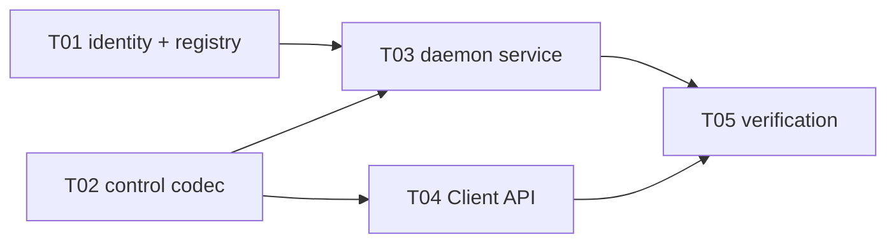

# F03-S02_类型化 generation handle 注册表与 Context 步骤文档

所属版本：UGDR_v1

所属版本文档：[UGDR_v1 版本文档](../UGDR_v1_版本文档.md)

所属功能文档：[F03_Daemon 控制面与对象生命周期 功能文档](F03_Daemon_控制面与对象生命周期_功能文档.md)

## 一、目标与完成条件

实现 daemon 侧 session/type/generation-safe 的 64-bit 对象身份与按资源类型隔离的 registry，并贯通可扩展 Device 枚举和 Context 生命周期。wrong-type、cross-session、stale、重复关闭及 slot 复用不得命中其他活对象；公开 API 保持 F02 的返回域与失败无副作用语义。

## 二、实现设计

v1 的 `DeviceCatalog` 默认暴露一个逻辑 Device，但响应和 Client 均按任意 N 个 Device 设计。Client 通过 `UGDR_DAEMON_SOCKET` 选择 socket，缺省使用 `/run/ugdr/ugdr.sock`；进程内控制请求串行复用一个 IPC Client。

| 文件 | 改动 |
|-|-|
| `src/control/object_identity.*`（新增） | 编码/解码 `[type:8][generation:32][slot:24]`；0 无效，generation 回绕则退役 slot。 |
| `src/control/object_registry.hpp`（新增） | 类型化分配、解析、销毁与 session 断连回收；每类资源独立 registry。 |
| `src/control/device_context.*`（新增）、`ipc_adapter.*` | Device catalog 与 LIST_DEVICES / CREATE_CONTEXT / DESTROY_CONTEXT codec、service。 |
| `src/api/api.cpp` | Client runtime、Device/Context proxy、tombstone 与公开 API；已打开 Context 不依赖 Device list。 |
| `apps/daemon/main.cpp`、CMake、边界清单、contracts/tests | 接入真实 service，补依赖、契约与验证。 |

**对象身份。** `object_identity` 位于 UGDR control payload，不属于通用 IPC envelope；Client 只把它当作不透明的 `uint64_t`。type 拒绝错类型，slot 定位对应类型 registry，generation 拒绝复用后的旧 handle；session 由连接携带并与 entry 的 `owner_session` 比对。

```cpp
GenerationRegistry<ContextRecord, ObjectType::Context> contexts;
GenerationRegistry<PdRecord,      ObjectType::Pd>      pds;

resolve(session, expected_type, id):
  parts = decode(id)
  require(parts.type == expected_type)
  entry = registry[parts.slot]
  require(entry.live && entry.generation == parts.generation)
  require(entry.owner_session == session)
  return entry
```

S02 实际启用 Context registry；PD/MR/CQ/QP 沿用同一模板在后续步骤接入，不建立 `std::variant` 大对象仓库。Device 属于 daemon catalog，不进入 session generation registry。

| API / 事件 | 行为 |
|-|-|
| `ugdr_get_device_list` | 返回 null 结尾数组；v1 默认 1 个，协议支持 N 个。失败返回 null、设置 `errno`，且不改写 `num_devices`。 |
| `ugdr_free_device_list` | 使该 list 及未打开 Device proxy 失效；已有 Context 继续有效。无效/重复 free 设置 `errno=EINVAL`。 |
| `ugdr_open_device` | 校验活 Device 后创建 daemon Context，成功返回 proxy；无效/stale 为 `EINVAL`。 |
| `ugdr_close_device` | 成功返回 0；无效/stale/重复关闭返回 -1、`errno=EINVAL`；存在子资源时返回 -1、`errno=EBUSY` 且不改状态。 |
| session 断连 | 回收该 session 的全部 Context；其他 session 不受影响。 |

**实现任务。**

| ID | 任务 | 依赖 |
|-|-|-|
| T01 | 对象身份与类型化 registry | — |
| T02 | Device/Context control codec | — |
| T03 | Device catalog 与 daemon service | T01、T02 |
| T04 | Client runtime、proxy 与公开 API | T02 |
| T05 | 契约、单元与集成验证 | T03、T04 |



初始并行前沿为 T01、T02。

## 三、验证与验收

| 验证 | 通过条件 |
|-|-|
| registry 单元测试 | 覆盖 wrong-type、cross-session、stale、重复销毁、slot 复用、断连回收与 generation 回绕退役。 |
| codec 单元测试 | N-device 列表及 Context 请求/响应往返无损；畸形 payload/fd 被拒绝。 |
| Client/server 集成 | v1 枚举 1 个 Device；free list 后 Context 仍可关闭；两 session 相互隔离。 |
| 契约测试 | C/C++ ABI 不变；`EINVAL`/`EBUSY`、输出不改写和失败无副作用符合 F02 与 libibverbs 对齐矩阵。 |
| 项目验证 | 文档治理、模块边界、构建及完整 CTest 全部通过。 |
