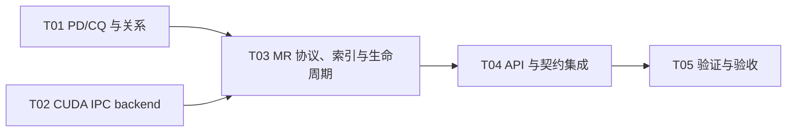

# F03-S03_PD、MR、CQ 元数据与严格生命周期 步骤文档

所属版本：UGDR_v1

所属版本文档：[UGDR_v1 版本文档](../UGDR_v1_版本文档.md)

所属功能文档：[F03_Daemon 控制面与对象生命周期 功能文档](F03_Daemon_控制面与对象生命周期_功能文档.md)

## 一、目标与完成条件

实现 PD、MR、CQ 的类型化元数据、所有关系与严格创建/销毁语义；MR 完成 CUDA device allocation 识别、跨进程 IPC open/close、地址转换、非零 key 分配，并同时提供按 identity、lkey 和 rkey 的查找入口。真实 CUDA IPC smoke、key 查找与回滚测试通过，公开 API/ABI 不变，F03 仍不接受 WR/WC 或实现数据路径。

## 二、实现设计

**已确认边界。** v1 只注册 `cudaMalloc` device allocation 的合法区间；一个逻辑 `ugdr0` 可管理多个物理 GPU。F03-S03 只建立控制面对象、关系和可供后续数据路径调用的 key 查找，不处理并发引用、UAF、WR/WC 或 payload。

### 数据组织

| 对象 | 关键字段 | 职责 |
|-|-|-|
| `PdRecord` | Context identity、MR 关系、`lkey`/`rkey` 索引 | 承载保护域所有关系和数据路径查找入口。 |
| `MrRecord` | PD/Context identity、GPU UUID、Client address、allocation size/offset、daemon mapped base、length、access、key | 保存 Client 快照与 daemon 地址转换元数据。 |
| `CqRecord` | Context identity、cqe、QP 引用计数 | 本步骤只保存容量和生命周期；QP 引用在 F03-S04 接入。 |
| `CudaDeviceRuntime` | GPU UUID、daemon ordinal、稳定 primary CUDA context | daemon 全局每个物理 GPU 一个，不隶属于 session、PD 或 MR。 |

MR 同时进入三类结构：类型化 MR identity registry 用于控制面生命周期；`Context → PD → MR` 用于所有关系；PD 内的 `local_key_index[lkey]` 与 `remote_key_index[rkey]` 映射到 MR identity。key 由 daemon 独立、非零、运行期间不复用地分配，不从 pointer、IPC handle 或裸槽位派生。

```python
resolve_lkey(session, pd_identity, lkey, address, length):
    mr_identity = pd.local_key_index[lkey]
    mr = mr_registry.resolve(session, mr_identity)
    validate mr belongs to pd
    validate address range inside mr.client range
    return mr.daemon_address + address - mr.client_address

resolve_rkey(session, pd_identity, rkey, address, length):
    mr_identity = pd.remote_key_index[rkey]
    mr = mr_registry.resolve(session, mr_identity)
    validate mr belongs to pd and allows REMOTE_WRITE
    validate address range inside mr.client range
    return mr.daemon_address + address - mr.client_address
```

后续发送侧由 QP 的 PD 调用 `resolve_lkey`，进入的 RDMA Write 由目标 QP 的 PD 调用 `resolve_rkey`。本步骤的 daemon 控制路径仍为单线程；并发查找、在途引用与 UAF 防护在真实数据路径接入时围绕这两个接口补充。

### CUDA IPC 与协议

| 位置 | 行为 | 约束 |
|-|-|-|
| Client | `cudaPointerGetAttributes` 确认 device memory 并获得 Client ordinal；`cudaMemGetAddressRange` 解析 allocation base/size/offset；查询 GPU UUID；对 base 执行 `cudaIpcGetMemHandle`。 | host、managed、array、任意 VMM 或越界区间返回 `EOPNOTSUPP` 或 `EINVAL`，不发送部分注册。 |
| `REG_MR` | 携带 PD identity、16-byte GPU UUID、Client address、allocation size/offset、length、access 和 opaque CUDA IPC handle bytes。 | 复用 F03-S01 的显式整数编码；不传进程内结构、pointer 或 Client ordinal。 |
| daemon | 按 UUID 定位自己的 ordinal/context，切换到对应 primary context 后执行 `cudaIpcOpenMemHandle`；保存返回 base 加 offset。 | 协议解析本身不切换 context；open/close 必须在 MR 所属 GPU context 中执行。 |
| `DEREG_MR` | 解析 MR identity，切换所属 GPU context 并 close mapping，成功后删除两个 key 索引、所有关系和 identity。 | close 失败保持 MR、key 和关系有效，允许重试。 |

```python
validate session, PD, payload, access and range
device = cuda_devices.find_by_uuid(request.gpu_uuid)
mapping = device.open_ipc(request.handle)
try:
    allocate nonzero lkey and rkey
    prepare MR identity, PD relation and both key indexes
    commit all metadata once
    return MR identity, lkey, rkey and accepted snapshot
except:
    device.close_ipc(mapping)
    publish nothing
    return error
```

### 公开行为

| 入口 | 本步骤行为 |
|-|-|
| `ugdr_alloc_pd` / `ugdr_dealloc_pd` | 创建/销毁 Context 子对象；仍有 MR 时返回 `EBUSY`，QP 关系由 F03-S04 接入。 |
| `ugdr_reg_mr` / `ugdr_dereg_mr` | 完成真实 CUDA IPC 注册与关闭；`mr->addr` 保持 Client 地址，`lkey/rkey` 直接可读，公开 `handle` 保持 Client-local opaque token。 |
| `ugdr_create_cq` / `ugdr_destroy_cq` | 要求 `cqe > 0`、`channel == nullptr`、`comp_vector == 0`；创建 Context 子对象，QP 引用由后续步骤维护。 |
| `ugdr_poll_cq` | 继续返回明确的 `EOPNOTSUPP`，不写 WC。 |

null、wrong-type、cross-session、stale、重复销毁和区间算术错误返回既定的 `EINVAL` 域；不支持的 memory kind 返回 `EOPNOTSUPP`。`REMOTE_WRITE` 要求同时具备 `LOCAL_WRITE`。session 断连按 MR、CQ/PD、Context 的逆序强制回收，其他 session 不受影响。

### 预计文件

| 位置 | 改动 |
|-|-|
| `src/control/pd_mr_cq.hpp/.cpp` | 新增 PD/MR/CQ registry、关系、key 索引、resolver 与 staged lifecycle。 |
| `src/gpu/cuda_ipc_memory.hpp/.cu` | 新增 Client allocation exporter、GPU UUID 解析、daemon per-GPU context manager 与 IPC mapping backend。 |
| `src/control/device_context.*`、`ipc_adapter.*` | 扩展 Context 子关系、控制方法和版本化 payload codec。 |
| `src/api/api.cpp`、`apps/daemon/main.cpp` | 接入 Client proxy/API 与 daemon backend 组合。 |
| `CMakeLists.txt`、`tools/module-boundaries.json`、repository skeleton | 登记新源文件、测试和 `ugdr_api → ugdr_gpu` 依赖，并同步生成架构段。 |
| `docs/contracts/public-api.md`、`object-lifecycle.md`、`libibverbs-alignment.md` | 同步 CUDA-only 能力、错误与 MR lookup/lifecycle 约束；`include/ugdr/api.hpp` ABI 不改。 |
| `tests/unit/pd_mr_cq_test.cpp`、`tests/integration/cuda_ipc_mr_test.cpp` | 新增 fake-backend 单元测试与真实跨进程 CUDA IPC smoke。 |

### 实现任务

| 任务 | 交付 | 依赖 |
|-|-|-|
| T01 | PD/CQ registry、所有关系与公开错误语义 | 无 |
| T02 | Client CUDA exporter 与 daemon per-GPU context/mapping backend | 无 |
| T03 | REG_MR codec、MrRecord、key 索引、resolver 和 staged lifecycle | T01、T02 |
| T04 | 公开 API、daemon 组合、契约和模块边界同步 | T03 |
| T05 | 单元、集成与真实 GPU 验收 | T04 |



## 三、验证与验收

| 验证动作 | 预期结果 | 失败判定 |
|-|-|-|
| PD/CQ/MR service 单元测试，使用 fake CUDA backend 注入 open、key、identity、关系和 close 失败 | 合法路径状态一致；每个失败点无 partial mapping、key、identity 或关系；父对象 busy 与 stale/wrong-type/cross-session 结果正确。 | 失败后残留资源，或公开错误域与契约不符。 |
| REG_MR codec round-trip、截断、长度、UUID 和 opaque handle 边界测试 | 合法 payload 无损往返；未知版本、截断、超长和非法字段确定失败且不调用 backend。 | 越界解析、接受歧义 payload 或产生副作用。 |
| `resolve_lkey` / `resolve_rkey` 测试 | 正确 PD/key/range 返回对应 daemon address；错误 key、跨 PD、权限不足、下溢、上溢和注销后的旧 key 均失败。 | 错误 MR 被解析，或旧 key 命中新 MR。 |
| 公开 PD/CQ/MR Client/daemon 集成与 C/C++ ABI 测试 | 公开返回域、`mr->addr/length/lkey/rkey` 快照和 child-first 生命周期符合 F02；`ugdr_poll_cq` 仍 unsupported。 | API/ABI 改形、失败写输出或公开销毁级联。 |
| 真实 GPU 跨进程 smoke：`cudaMalloc → export → daemon open → dereg/close → Client free` | daemon 在 UUID 对应 context 中访问正确完整 allocation 或子区间；多 GPU 环境额外验证不同 UUID 路由到各自 context。 | open/close 失败、路由错误、地址转换错误或 Client free 前未关闭 mapping。 |
| 非 CUDA memory、managed、越界、非法 access 与 CUDA open 失败测试 | 返回 `EOPNOTSUPP` 或 `EINVAL`，且无 MR、mapping 或 key。 | 报告成功、泄漏资源或错误码不稳定。 |
| `cmake -S . -B build`、`cmake --build build`、`ctest --test-dir build --output-on-failure` 及项目治理检查 | 全量构建、测试、模块边界、文档治理与项目状态校验通过。 | 任一命令失败，或模块边界与生成架构段不同步。 |

真实 CUDA IPC smoke 是本步骤功能验收的必要证据；无 GPU 环境可以运行 fake-backend 测试，但不能据此宣称 F03-S03 已完成验收。
