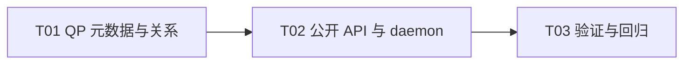

# F03-S04_QP、SQ、RQ 所有权与 CQ 关联 步骤文档

所属版本：UGDR_v1

所属版本文档：[UGDR_v1 版本文档](../UGDR_v1_版本文档.md)

所属功能文档：[F03_Daemon 控制面与对象生命周期 功能文档](F03_Daemon_控制面与对象生命周期_功能文档.md)

## 一、目标与完成条件

实现 RC QP 的创建与销毁：daemon 保存 QP、内嵌 SQ/RQ 容量元数据、PD 所有权及 send_cq/recv_cq 引用，Client 获得 generation-safe QP 代理。合法的同 CQ 或双 CQ 关系可创建；非法字段、跨 Context 或无效对象不产生 partial QP；QP 存活时 PD/CQ 准确返回 `EBUSY`。

## 二、实现设计

**边界。** 本步骤只激活 `ugdr_create_qp` 与 `ugdr_destroy_qp`。SQ/RQ 是 QP 内部元数据，没有独立公开 handle；不分配真实队列内存、不传 fd、不保存 WR、不生成 WC。QP 查询、状态转换、`qp_num`/`endpoint_id` 和 connect 留给 F03-S05，真实 SQ/RQ/CQ 队列留给 F04。

### 对象与关系

| 对象 | 关键字段 | 关系 |
|-|-|-|
| `QpRecord` | Context/PD/send CQ/recv CQ identity、RC 类型、`sq_sig_all`、RESET 初态 | 进入类型化 QP registry；由 PD 拥有并引用一个或两个 CQ。 |
| `SqMetadata` | `max_send_wr`、`max_send_sge` | 由 QP 内嵌拥有，不单独注册或销毁。 |
| `RqMetadata` | `max_recv_wr`、`max_recv_sge` | 由 QP 内嵌拥有，不单独注册或销毁。 |

PD 的 `qp_count` 统计子 QP；CQ 的 `qp_references` 统计引用该 CQ 的 QP 数，而不是 send/recv 边数。因此 `send_cq == recv_cq` 时只增减一次。所有关系都由 daemon identity 建立，不使用 Client 指针、裸槽位或未校验对象号。

### 创建、销毁与协议

```python
create_qp(session, pd_id, payload):
    decode versioned payload; require no fd
    validate RC, sq_sig_all in {0, 1}, all WR/SGE capacities nonzero
    pd = resolve PD in session
    send_cq, recv_cq = resolve CQs in session
    require pd and both CQs share one Context
    prepare QpRecord with embedded SQ/RQ metadata and RESET state
    publish QP identity, then add one PD relation and deduplicated CQ references
    return identity

destroy_qp(session, qp_id):
    resolve live QP in session
    remove PD and deduplicated CQ relations
    erase QP identity together with SQ/RQ metadata
    produce no WC
```

`CREATE_QP` 使用显式版本化 payload 编码 send/recv CQ identity、四个容量/SGE 字段、QP 类型与 `sq_sig_all`；PD identity 放在请求对象字段中，整数沿用 IPC adapter 的固定宽度和网络字节序，不发送 C/C++ struct、pointer 或 fd。非零 `uint32_t` 请求容量在本步骤按原值接受，不模拟 provider 调整或资源上限。

Client 先做 null、live、connection epoch、字段和同 Context 快速校验，daemon 再做 session/type/generation 与关系权威校验。成功创建不改写调用方 `init_attr`；Client 代理保存 PD、两个 CQ、创建属性、daemon identity 和 connection epoch。Client 代理分配失败时回滚 daemon QP。销毁成功才使代理失效；stale、wrong-type、cross-session 与重复销毁返回 `EINVAL`。

公开销毁无级联：QP 存活时 `ugdr_dealloc_pd` 与 `ugdr_destroy_cq` 返回 `EBUSY`。session 断连则按 QP、MR、CQ/PD、Context 的依赖逆序强制回收。`ugdr_modify_qp`、`ugdr_query_qp`、`ugdr_query_qp_conn_info`、`ugdr_connect_qp`、post 与 poll 继续返回既定的未支持结果且无副作用。

### 预计文件

| 位置 | 改动 |
|-|-|
| `src/control/qp.hpp/.cpp` | 新增 QP payload codec、QpRecord/SQ/RQ 元数据、类型化 registry、创建/销毁 service 与 Client helper。 |
| `src/control/pd_mr_cq.hpp/.cpp`、`device_context.hpp` | 提供受控 PD/CQ 关系操作，登记 QP opcode，并把断连回收顺序扩展到 QP。 |
| `src/api/api.cpp`、`apps/daemon/main.cpp` | 新增 QP Client proxy，激活 create/destroy，daemon 组合 QP service；公开头文件 ABI 不变。 |
| `CMakeLists.txt` | 登记新增控制源文件与测试目标。 |
| `tests/unit/qp_test.cpp`、`tests/integration/qp_client_server_test.cpp`、现有 API contract 测试 | 覆盖 codec、关系、回滚、公开返回域及 Client/daemon 生命周期。 |

### 实现任务

| 任务 | 交付 | 依赖 |
|-|-|-|
| T01 | QP codec、记录、registry 与 PD/CQ 原子关系 | 无 |
| T02 | Client proxy、公开 create/destroy 与 daemon 组合 | T01 |
| T03 | 单元、集成、ABI 和治理回归 | T02 |



## 三、验证与验收

| 验证动作 | 预期结果 | 失败判定 |
|-|-|-|
| QP codec 与 service 单元测试 | 合法 QP 创建参数经过序列化再反序列化后，send/recv CQ identity、四个容量与 SGE 字段、QP 类型和 `sq_sig_all` 均与输入一致。每个 QP 对每个关联 CQ 只建立一份生命周期引用：send CQ 与 recv CQ 相同时，该 CQ 的 `qp_references` 增加 1；两者不同时，两个 CQ 各增加 1。destroy 对称移除 QP 对 PD 和 CQ 的关系；截断、未知版本、fd、零容量、零 SGE、非法类型/`sq_sig_all`、跨 Context、wrong-type、stale、cross-session 均无 partial QP 或关系。 | 非法输入被接受、关系计数漂移、旧 identity 命中新对象或失败后残留状态。 |
| 公开 Client/daemon 集成测试 | 同 CQ 和双 CQ 创建成功；QP 存活时 PD/CQ 为 `EBUSY`；destroy 后父对象可释放；重复销毁为 `EINVAL`；`init_attr` 保持不变。 | 返回域不符、公开级联销毁、代理提前失效或父关系未释放。 |
| 范围与断连测试 | 查询/modify/connect/post/poll 仍 unsupported；断连先清 QP，再清 MR、CQ/PD 和 Context；其他 session 不受影响。 | 提前实现后续语义、产生 WC、残留对象或跨 session 影响。 |
| `cmake -S . -B build`、`cmake --build build`、`ctest --test-dir build --output-on-failure` 与项目治理检查 | 全量构建、测试、模块边界、文档治理和项目状态校验通过。 | 任一门禁失败。 |
