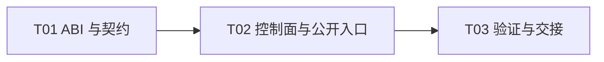

# F03-S05_QP 查询、状态转换与原子建连 步骤文档

**所属版本文档：** [UGDR_v1 版本文档](../UGDR_v1_版本文档.md)

**所属功能文档：** [F03_Daemon 控制面与对象生命周期 功能文档](F03_Daemon_控制面与对象生命周期_功能文档.md)

**所属版本：** v1

**功能标识：** F03-Daemon 控制面与对象生命周期

**步骤标识：** F03-S05-QP 查询、状态转换与原子建连

# 一、目标与完成条件

实现 QP 查询、RESET→INIT/ERR 状态转换和同一 daemon 内的原子建连，并将公开连接信息收敛为单一 `qp_num`。完成时 `qp_num` 可跨 session 查找且在 daemon 生命周期内不复用，失败不会暴露部分状态、peer 或 retry 属性。

# 二、实现设计

**已确认边界。** `ugdr_qp_conn_info` 只保留 `uint32_t qp_num`。`qp_num` 由 daemon 全局分配，0 保留；同一 daemon 进程生命周期内不复用、不回绕，耗尽时创建 QP 返回 `ENOSPC`。daemon 重启后可重新分配；该记录不是持久标识或网络 wire format。

应用负责带外交换连接信息。v1 只解析同一 daemon 控制域内的 `qp_num`；不定义交换通道、序列化或多机寻址。未来多机连接使用独立协议，不在当前 ABI 中预留 endpoint 对象。

| 位置 | 改动 |
|-|-|
| `include/ugdr/api.hpp` | 从 `ugdr_qp_conn_info` 删除 `endpoint_id`，保留 `qp_num`。 |
| `src/control/device_context.hpp`、`src/control/qp.hpp/.cpp` | 增加 query/modify/connect 控制操作、QP 状态与 retry 元数据、daemon 全局 `qp_num` 分配器和活 QP 索引。 |
| `src/api/api.cpp` | 把公开查询、修改和建连入口接入控制请求；成功后才更新 Client 代理快照。 |
| `docs/contracts/`、`docs/decisions/0003-atomic-rc-connect-helper.md` | 同步单字段 ABI、状态机、错误优先级和同 daemon 限制。 |
| `tests/unit/`、`tests/integration/qp_client_server_test.cpp` | 覆盖 ABI、状态矩阵、跨 session 查找、销毁失效、不复用和失败原子性。 |

**QP 记录与索引。** `QpRecord` 保存 `qp_num`、创建属性、state、access、可选 peer identity 和四个 retry 字段。类型化 QP registry 继续负责生命周期；独立的 `qp_num → QP identity` 索引用于数据路径和跨 session 查找。销毁或 session 断连时先让索引失效，再释放记录；编号不回收到分配器。

| 操作 | 成功 | 失败 |
|-|-|-|
| `ugdr_query_qp` | 按 mask 返回同一次快照中的 state/current/access，并返回创建属性。 | 非法句柄、空输出或未知 mask 返回 `EINVAL`；输出不变。 |
| `ugdr_query_qp_conn_info` | 仅写入非零 `qp_num`。 | 非法或已销毁句柄返回 `EINVAL`；输出不变。 |
| `ugdr_modify_qp` | 支持 RESET→INIT，以及 RESET/INIT/RTR/RTS→ERR。 | SQD/SQE 返回 `EOPNOTSUPP`；其他非法组合返回 `EINVAL`；状态不变。 |
| `ugdr_connect_qp` | 精确接受 TIMEOUT、RETRY_CNT、RNR_RETRY、MIN_RNR_TIMER mask；解析远端 `qp_num` 后一次提交 peer、retry 属性和 RTS。 | 未知或已销毁 `qp_num` 返回 `ENOENT`；peer 冲突返回 `EBUSY`；其他非法输入或状态返回 `EINVAL`。 |

```python
validate_local_inputs_and_retry_mask()
if local_qp.has_different_peer(remote_info.qp_num): return EBUSY
require(local_qp.state == INIT, EINVAL)
remote_qp = qp_num_index.find(remote_info.qp_num)
require(remote_qp is live, ENOENT)
require(remote_qp.type == RC and remote_qp.state in {INIT, RTR, RTS}, EINVAL)
stage(peer=remote_qp.identity, retry=validated_retry, state=RTS)
commit_once()
return 0
```

建连只修改本地 QP，远端 QP 由对端独立建连。任何失败均保持本地状态、已有 peer、retry 属性、远端 QP 和调用者输出不变。

| 任务 | 交付 | 依赖 |
|-|-|-|
| T01 ABI 与契约 | 删除 `endpoint_id`，同步契约、决策和 ABI 测试。 | 无 |
| T02 控制面与公开入口 | 实现 qpn 分配/索引、query/modify/connect 和错误原子性。 | T01 |
| T03 验证与交接 | 完成单元、双 Client/单 daemon 集成和项目门禁。 | T02 |



# 三、验证与验收

| 验证动作 | 预期结果 | 失败判定 |
|-|-|-|
| ABI/契约测试 | `ugdr_qp_conn_info` 只有 `qp_num`；仓库不再把 endpoint 当公开对象。 | 仍存在公开 `endpoint_id` 或契约不一致。 |
| 状态与错误矩阵 | 查询、RESET→INIT、ERR 和 INIT→RTS 结果符合契约；输出与状态失败原子。 | 出现部分 peer、retry、RTR、远端修改或错误码漂移。 |
| qpn 生命周期测试 | 不同 session 可按活 `qp_num` 查找；销毁/断连后立即 `ENOENT`；后续 QP 不复用旧编号。 | 旧编号命中新 QP、编号为 0 或分配器回绕。 |
| 项目门禁 | format/lint、build、完整测试和文档治理检查通过。 | 任一命令失败。 |

本步骤不创建真实 WR/WC，不定义多机交换协议，也不实现数据传输。
