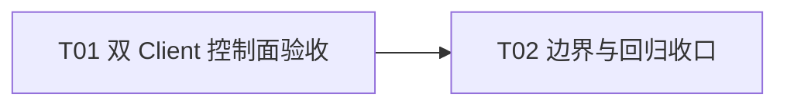

# F03-S06_公开 API 集成与控制面验收 步骤文档

**所属版本文档：** [UGDR_v1 版本文档](../UGDR_v1_版本文档.md)

**所属功能文档：** [F03_Daemon 控制面与对象生命周期 功能文档](F03_Daemon_控制面与对象生命周期_功能文档.md)

**所属版本：** v1

**功能标识：** F03-Daemon 控制面与对象生命周期

**步骤标识：** F03-S06-公开 API 集成与控制面验收

# 一、目标与完成条件

完成 F03 已实现控制面的公开 API 端到端收口验收。真实 daemon、两个独立 Client、CUDA IPC MR、断连回收与错误边界全部通过时完成；不新增公开 ABI 或数据路径能力。

# 二、实现设计

**已确认边界。** S06 只收口 S01–S05 已审阅语义，不新增 opcode、对象、状态或公开 ABI。device/context、PD/MR/CQ/QP 相关入口不得再返回占位结果；`ugdr_post_send`、`ugdr_post_recv` 与 `ugdr_poll_cq` 仍明确 unsupported，并保持调用者输出不变。

| 位置 | 改动 |
|-|-|
| `tests/integration/control_plane_acceptance_test.cpp` | 新增真实 daemon、两个独立 Client 的公开 API 综合验收。 |
| `tests/integration/CMakeLists.txt` | 注册测试并传入 `ugdr_daemon` 可执行文件。 |
| 现有 API、control 与测试文件 | 仅在验收暴露已审阅语义偏差时做 F03 范围内修正，不扩展接口。 |

| 场景 | 必须观察到的结果 |
|-|-|
| 两个 Client 建立独立 session | 各自完成 Context、PD、CQ、RC QP 创建与 RESET→INIT。 |
| 带外交换 `qp_num` 后双向 connect | 两个本地 QP 独立进入 RTS，远端不会被对方调用推进。 |
| 一个 Client 不逐对象 destroy 而断连 | 其对象、key 与 QP lookup 立即失效；另一 session 继续可用，旧 QPN 不复用。 |
| MR 与数据路径边界 | 真实 GPU smoke 覆盖 CUDA IPC open/close；post/poll 返回 unsupported 且不写输出。 |

```python
start_real_daemon()
a = spawn_client(); b = spawn_client()
a_qpn, b_qpn = create_and_init_qps(a, b)
exchange_qpn_out_of_band(a_qpn, b_qpn)
require(connect_both() == 0 and query_both() == RTS)
disconnect_without_public_destroy(a)
require(b_remains_live())
require(connect_new_b_qp(a_qpn) == ENOENT)
require(new_qpn() != a_qpn)
close_b_child_first(); stop_daemon()
```

普通控制面测试不依赖 RDMA 设备或真实数据路径。CUDA MR 保留独立真实 GPU smoke；本步骤不把本地 IPC 协议解释为未来多机 wire format。

| 任务 | 交付 | 依赖 |
|-|-|-|
| T01 双 Client 控制面验收 | 综合测试覆盖公开生命周期、QP 建连、错误矩阵与断连隔离。 | 无 |
| T02 边界与回归收口 | 复核 CUDA smoke、unsupported 输出不变和完整项目门禁；仅修复已审阅语义偏差。 | T01 |



# 三、验证与验收

| 验证动作 | 预期结果 | 失败判定 |
|-|-|-|
| `ctest -R ugdr_control_plane_acceptance` | 真实 daemon 与两个 Client 完成双向建连、断连隔离和 child-first 收尾。 | 跨 session 串扰、旧 QPN 命中新对象或任何部分状态。 |
| `ctest -R ugdr_cuda_ipc_mr` | 宿主机真实 GPU smoke 通过 CUDA allocation export、daemon open/close 与非法 memory kind。 | 最终验收时跳过、映射泄漏或失败请求报告成功。 |
| API 契约与错误矩阵测试 | F03 入口均为真实结果；仅 post/poll unsupported 且输出不变。 | 占位返回、错误码漂移或失败改写输出。 |
| `tools/ugdr format --check`、`tools/ugdr lint`、build、完整 `ctest` | 全部项目门禁通过，普通控制面测试不要求 RDMA 设备。 | 任一命令失败或新增 F03/F04 边界外能力。 |
