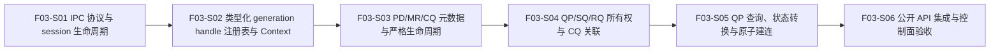

# F03_Daemon 控制面与对象生命周期 功能文档

所属版本：UGDR_v1

所属版本文档：[UGDR_v1 版本文档](../UGDR_v1_版本文档.md)

## 一、功能目标

UGDR Client 使用者能够通过本机 IPC 建立独立 session，并使用 F02 已冻结的公开 API 创建、查询、转换和销毁 daemon 管理的 Context、PD、MR、CQ 与 QP；其中 CUDA device MR 在注册成功后已通过 CUDA IPC 映射到 daemon 进程。完成时，两侧独立 Client 进程可以在同一 daemon 控制域内完成严格对象生命周期和 RC QP 原子建连；所有可观察结果对齐已审阅 F02 契约，且不以真实 WR、WC 或 RDMA 数据传输冒充本功能交付。

## 二、背景与版本关系

F02 已冻结 v1 verbs-like API 形状、对象关系、MR key 访问方式、RC QP 状态机和错误语义，但公开入口仍是无运行时状态的占位实现。F03 是 UGDR v1 的第一层运行时能力：把 Client 可见对象映射到 daemon 控制面，为后续 F04 的 SQ/RQ/CQ 队列语义提供稳定的对象、容量与关联元数据。

F03 直接依赖 F02，并继续受 F01 的构建、测试、状态和模块边界治理约束。F04 只在本功能的 session、句柄、对象关系和 QP 状态可稳定使用后启动；F05-F07 不得绕过本功能直接维护另一套控制面状态。

## 三、功能范围

- 提供基于 Unix Domain `SOCK_SEQPACKET` 的本机 Client-daemon 控制通道；每条已接受连接对应一个独立 session，请求与响应具备可关联的操作身份、协议版本和确定错误结果。
- Client 侧公开 opaque handle 使用本地代理对象；daemon 侧使用包含 session、对象类型、槽位或对象号与 generation 的类型化注册表进行解析。Client 指针不得作为 daemon handle 或跨 IPC 传递。
- 实现 Context、PD、MR、CQ 和 QP 的创建、注册、查询与关闭；除控制面元数据外，MR 注册还必须完成 CUDA IPC 导出、daemon 导入映射和对应资源生命周期，保持 F02 规定的父子关系、引用关系、同 Context 约束和无效句柄结果。
- v1 的 `ugdr_reg_mr` 只接受 `cudaMalloc` device allocation 内的合法区间。Client 解析 allocation base 与注册 offset，对 base 创建 `cudaIpcMemHandle_t` 并经 IPC 发送；daemon 在稳定的对应 GPU CUDA context 中 open handle，保存 daemon-local mapped base、Client 注册地址、offset、length 与 access，再分配非零 `lkey`/`rkey`。全部步骤成功后才返回公开 `ugdr_mr` 快照，调用方直接读取 `mr->lkey` 与 `mr->rkey`。
- QP 创建时维护 RC 类型、SQ/RQ 请求容量与 SGE 上限、`sq_sig_all`、send_cq/recv_cq 关联、状态、daemon 生命周期内不复用的非零 `qp_num`，以及 peer/retry 元数据；send_cq 与 recv_cq 可以相同。
- 实现 F02 支持的 QP 查询、RESET→INIT、进入 ERR，以及同 daemon 范围内的原子 INIT→RTR→RTS 建连。建连只推进本地 QP，不隐式修改远端 QP。
- 单对象公开销毁保持严格 child-first、无级联语义；session 断连直接构成 session destroy，daemon 按依赖逆序强制销毁该 session 的全部资源，且不得使旧 handle、key 或 `qp_num` 在后续 session 中重新生效。

## 四、非目标

- 不实现 SQ/RQ 中的 WR 存储、提交、顺序、容量消耗或 flush；不实现 CQ 中的 WC 生成、排队和 polling。`ugdr_post_send`、`ugdr_post_recv` 与 `ugdr_poll_cq` 在 F03 结束时仍明确返回未支持结果且无副作用。
- 不解析、复制或传输数据面 payload，不实现内部 datagram、本地 datagram queue、Loop Worker、copy task/completion meta 或 GPU kernel。
- 不实现多机或跨 daemon 建连，不引入 GID、LID、MTU、PSN、IP、端口、字节序或网络可靠性语义；本地 IPC 消息不是未来网络 wire format 承诺。
- 不扩展 F02 公开 API，不支持 RC 之外的 QP 类型、RDMA Read、Send/Recv 数据操作、atomic、SRQ、completion event 或完整 libibverbs。
- v1 不注册 host、managed、CUDA array 或任意 VMM allocation；尤其不为任意 `malloc` 地址引入 huge page、shared-memory allocator、FD 传递或 host pin/map 路径。非 `cudaMalloc` device allocation 的注册返回空指针并设置 `errno=EOPNOTSUPP`，不得创建 MR、key 或 daemon 映射。
- 不在功能文档中固定文件、类、函数、线程模型、注册表字段布局或协议二进制编码；这些实现选择在对应步骤设计中确认。
- 不以生产级安全隔离、持久化、daemon crash 恢复、peer disconnect 故障注入或性能阈值作为 F03 验收条件。

## 五、依赖与约束

- 依赖已验收的 F01 开发 Harness，以及 F02 已审阅的公开 API、libibverbs 对齐、对象生命周期、RC QP 状态机和 WR/WC 契约。v1 保持 `ugdr_reg_mr(pd, addr, length, access)` 的公开 API/ABI 形状以及 `mr->lkey/rkey` 访问方式不变，但支持能力限定为 `cudaMalloc` device allocation 合法区间；其他 memory kind 返回 `EOPNOTSUPP`。该版本级能力约束需同步到 F02 契约快照与对齐矩阵，不把函数重新分类为非 verbs API。
- 公开边界使用 Context、PD、MR、CQ、QP、SQ、RQ、WR、WC 等 conventional verbs 术语；WQE/CQE 只可作为后续内部表示。
- IPC 固定为 Linux 本机 Unix Domain `SOCK_SEQPACKET`。每条连接是一个 session，消息边界由 socket 类型保持；协议必须拒绝不支持的版本、未知操作和结构不完整的请求，且失败不产生部分对象。
- 两个 Client 是独立进程；daemon 管理模块与后续 Loop Worker 同进程但保持逻辑和依赖边界。本功能只向后续队列层提供经验证的对象、容量、关联、状态和已导入 MR 映射，不执行 WR/WC 或 RDMA 数据路径。
- CUDA IPC MR 集成依赖 Linux、支持 CUDA IPC/UVA 的真实 NVIDIA GPU、Client 创建的 `cudaMalloc` allocation，以及 daemon 中可被后续 worker/kernel 复用的稳定 CUDA context。单元测试可注入 CUDA mapping backend，但功能验收必须包含真实跨进程 open/close smoke。
- 公开 destroy 继续严格 child-first：依赖仍存在时按 F02 返回 `EBUSY`，null、wrong-type、stale 或 repeated handle 按既定返回域报告 `EINVAL`，失败保持全部状态不变。
- session 断连直接视为该 session 的 destroy：daemon 不等待 Client 逐个调用公开 destroy，而是按依赖逆序强制销毁整棵 session 资源树，并使代理、类型化 handle、MR key 与 QP lookup 全部失效。它是 session 级 destroy；单对象公开 `ugdr_destroy_*`/`ugdr_dereg_mr` 仍保持 child-first、`EBUSY` 与无级联语义。

## 六、功能设计与模块边界

**Client API 与代理对象。** 公开 `ugdr_*` 入口负责本地参数前置检查、请求构造、响应到标准返回域的映射，以及 Client 代理对象的创建和失效。公开 MR 保存 Client address、length、PD/Context、opaque handle 与 daemon 分配的 key；`mr->addr` 始终是 Client 地址，不伪装成 daemon CUDA pointer。

**IPC 协议与 session。** daemon 接受 `SOCK_SEQPACKET` 连接后建立 session；连接本身决定 session 归属，消息不得自报或切换到其他 session。协议使用显式逻辑 envelope：magic、协议主次版本、opcode、flags、request_id 与 payload_length；响应回显 request_id，并携带 status、errno 语义与按 opcode 定义的 payload。整数宽度、字节序、长度和可选字段兼容规则由 F03-S01 固化；不得直接发送带 padding、虚表或进程指针的 C/C++ 对象内存。一次请求可以在内部经历多步处理，但对外只能完整成功或确定失败。连接关闭即触发该 session 的 destroy：停止接收新请求并按依赖逆序强制销毁其全部对象。

**类型化 generation handle 注册表。** daemon 解析 identity 时依次验证 session、对象类型、槽位或对象号、generation 与存活状态。槽位复用必须推进 generation；wrong-type、cross-session、stale 和 repeated handle 均不能解析到其他活对象。具体位宽和编码留给 F03-S02，不成为 Client ABI。

**对象与关系存储。** Context 是 session 内对象树根；PD 管理 MR/QP 保护域关系；CQ 记录容量并被 QP 的 send_cq/recv_cq 引用；QP 拥有 SQ/RQ 容量元数据并记录创建属性、状态、`qp_num`、peer 与 retry 属性。引用计数或等价关系索引必须支持 F02 的 `EBUSY` 判断，但不得改变公开无级联语义。

**CUDA IPC MR 注册协议。** Client 对注册区间解析 `cudaMalloc` allocation base、allocation size 与 offset，并对 allocation base 导出 `cudaIpcMemHandle_t`。`REG_MR` 请求携带经类型化协议编码的 PD identity、Client address、allocation size、allocation offset、length、access、CUDA device identity 和 opaque handle bytes；CUDA IPC handle 只作为不透明字节载荷传输，不能解释成指针。daemon 先验证消息长度、session/PD、device、区间与 access，再在稳定 CUDA context 中 `openMemHandle`。open、关系登记、identity 与非零 key 分配全部成功后，`REG_MR_OK` 才返回 MR identity、`lkey`、`rkey` 与已接受的 MR 快照；失败响应不暴露任何部分 MR、mapping 或 key。

**地址与 key。** daemon 实际访问内存时只使用 `openMemHandle` 得到的 daemon-local allocation base 加已校验 offset；Client virtual address 仅用于保持公开 MR/WR 地址语义，并将请求地址换算为注册区间内 offset。两进程地址可以不同，协议既不要求也不检查数值相等；验收只判断目标 allocation 的正确区间是否被访问。后续数据路径先用 `lkey/rkey` 解析活 MR，再完成 access、下溢、上溢和 length 边界检查。key 由 daemon 独立分配，不从 CUDA IPC handle、Client pointer 或槽位裸值派生。

**MR 关闭。** `DEREG_MR` 请求先解析 session 内的 MR identity 并检查活依赖；daemon 关闭对应 CUDA IPC mapping 后，才使 MR handle、`lkey/rkey` 与 PD 关系失效。session destroy 对遗留 MR 执行同样的 child-first 强制关闭流程，但不要求逐个公开 destroy，也不把某个对象的公开 `ugdr_dereg_mr` 改成级联操作。

**控制流与原子性。** 原子性指 Client 可观察状态的全有或全无，不要求内部只执行一条操作。创建、销毁、MR 注册和 connect 可以内部多步执行，但必须先在临时状态中完成验证与资源准备，再以单一提交点发布 identity、关系、key 或 QP 状态；提交前失败按逆序回滚全部临时资源。MR open 后若 key 分配失败，必须 close mapping 且不占用 MR 槽位；connect 在 peer 或 retry 属性提交前失败，QP 仍保持原状态且不得暴露 RTR。查询只在成功响应后写调用者输出。

**QP 编号与建连。** QP 创建后处于 RESET，并获得 daemon 全局分配的非零 `qp_num`。该编号在 daemon 进程生命周期内不复用，并通过专用活 QP 索引支持跨 session 查找；销毁或断连后立即失效。`ugdr_connect_qp` 按 F02 的错误优先级验证本地 QP、retry mask、既有 peer、远端 `qp_num`、类型和状态；全部检查及 INIT→RTR→RTS staged transition 成功后才一次提交本地 peer、retry 属性和 RTS。远端 QP 不被推进，另一 Client 必须独立调用 connect。

**边界。** F03 可创建 SQ/RQ/CQ 的容量与关联元数据，但不创建可消费 WR/WC 内容。进入 ERR 时因为 F03 不接受 WR，不存在需要生成的 flush WC；F04 接入真实队列后再实现已冻结的 flush completion 语义。

## 七、步骤划分

F03 按控制通道、身份基础、对象元数据、QP 关系、状态与建连、公开 API 集成逐层推进。下表中的直接依赖是步骤依赖的唯一事实源；六个步骤严格线性执行。

| 步骤标识 | 步骤名称 | 目标与交付 | 依赖 | 验收边界 |
|-|-|-|-|-|
| F03-S01 | IPC 协议与 session 生命周期 | 建立 Unix Domain SOCK_SEQPACKET 控制通道、协议 envelope、版本协商、请求响应关联和一连接一 session 的启停边界。 | F02 | 独立 Client 可完成确定的控制往返；版本不兼容、未知操作、截断消息和断连均不产生部分 session 对象。本步骤不创建 verbs 对象。 |
| F03-S02 | 类型化 generation handle 注册表与 Context | 实现 daemon 侧 session/type/generation-safe 对象身份解析，并贯通 device list、Device 与 Context 的首组公开代理生命周期。 | F03-S01 | wrong-type、cross-session、stale、重复释放和槽位复用均不能命中其他对象；Context 创建、查询所需快照与无子对象关闭符合 F02。 |
| F03-S03 | PD/MR/CQ 元数据与严格生命周期 | 实现 PD、MR、CQ 的创建与关系索引；MR 覆盖 CUDA allocation 识别、REG_MR/DEREG_MR 协议、IPC handle 导出传递、daemon open/close、地址转换元数据、key 分配与 Client 快照；同步 v1 CUDA-only 能力约束，公开 API/ABI 不变。 | F03-S02 | 真实跨进程 CUDA IPC smoke 证明 daemon 可 open/close Client allocation；合法子区间及 `mr->lkey/rkey` 可用，非 CUDA memory 明确 unsupported；注册/关闭失败无 partial MR、mapping 或 key，公开销毁不级联。 |
| F03-S04 | QP/SQ/RQ 所有权与 CQ 关联 | 创建 RC QP 及其 SQ/RQ 容量元数据，维护 PD 所有权与 send_cq/recv_cq 引用，分配本地 QP identity。 | F03-S03 | 同一或不同 CQ 关联均可验证；跨 Context、零容量、非法类型和非法 SGE 上限无部分 QP；CQ/PD busy 关系准确。 |
| F03-S05 | QP 查询、状态转换与原子建连 | 实现 query/modify、daemon 生命周期内不复用的 `qp_num` 分配与查找、retry 属性及同 daemon 原子 connect。 | F03-S04 | RESET→INIT、进入 ERR、INIT→RTS 与查询快照符合 F02；失败不暴露 RTR、部分 peer、部分属性或远端修改。 |
| F03-S06 | 公开 API 集成与控制面验收 | 将 F03 控制面能力接入冻结的公开入口，完成两 Client/一 daemon 集成、错误矩阵、CUDA IPC MR、断连回收和回归门禁。 | F03-S05 | F03 范围内入口不再返回占位结果；post/poll 仍明确 unsupported；除 CUDA IPC MR smoke 需要真实 GPU 外，其余控制面测试不依赖 RDMA 设备或真实数据路径。 |

## 八、验证与功能验收标准

- daemon 与两个独立 Client 进程通过 Unix Domain `SOCK_SEQPACKET` 建立各自 session，并能够从公开 API 完成 device/context、PD、MR、CQ、QP 的创建、查询、合法状态转换、原子 connect 和 child-first 关闭。
- Client 对 `cudaMalloc` allocation 的完整区间或合法子区间调用 `ugdr_reg_mr` 后，daemon 已成功 open CUDA IPC handle，并保存 Client address、allocation offset、daemon-local mapped base、length 与 access；公开 `ugdr_mr` 的字段形成一致快照，调用方直接读取 `mr->lkey/rkey`。host、managed、CUDA array、任意 VMM allocation 和越界区间注册失败且无 partial mapping/MR/key；deregister 后旧 identity 与 key 不得命中新 MR。
- Context、PD、MR、CQ、QP 的父子与引用矩阵符合 F02：依赖存在返回 `EBUSY`，null、wrong-type、cross-session、stale 与 repeated handle 返回 `EINVAL`，跨 Context QP 关系无部分创建。
- QP 创建属性、RESET 初态、查询快照、RESET→INIT、进入 ERR、`qp_num`、retry 属性和原子 INIT→RTR→RTS 行为符合已审阅状态机；未知或已销毁 `qp_num` 返回 `ENOENT`，peer 冲突返回 `EBUSY`，所有失败无状态和输出副作用。
- 单对象公开销毁不级联；断开某个 session 等价于执行该 session 的 destroy，daemon 按依赖逆序强制销毁整棵资源树。其他 session 不受影响，旧代理、typed handle、key 与 QP lookup 无法在重连后重新解析，旧 `qp_num` 不得分配给新 QP。
- format/lint、build、协议与对象单元测试、QP 状态/错误矩阵及两 Client/一 daemon 集成测试均通过；普通控制面测试不依赖 RDMA 网卡，CUDA mapping backend 可注入。另有真实 GPU 跨进程 smoke 覆盖 `cudaMalloc`→Client export→daemon open→dereg/close→Client free 的正常路径，以及非法 memory kind、越界和 open 失败不得报告注册成功。
- F03 不接受或消费 Send/Receive WR，不生成或轮询 WC，不搬运 payload；`ugdr_post_send`、`ugdr_post_recv`、`ugdr_poll_cq` 保持明确 unsupported 并且不写 `bad_wr` 或 `wc`。

## 九、风险与待确认事项

| 类型 | 内容 | 影响 | 状态 |
|-|-|-|-|
| 风险 | `REG_MR` 未定义独立、可版本化的 payload，而是直接发送进程内对象或裸结构内存。 | padding、位宽、版本演进或指针字段会造成协议歧义和越界解析。 | 已确认约束 |
| 风险 | daemon 把 Client virtual address 或 CUDA IPC handle 当作可直接访问的 pointer，而不是使用 `openMemHandle` 返回地址加 offset。 | 可能访问错误 allocation 或越过注册区间。 | 已确认约束 |
| 风险 | 对象 identity 解析缺少 session、type、generation 或存活状态校验。 | wrong-type、跨 session 或 stale handle 可能命中其他活对象。 | 已确认约束 |
| 风险 | MR 注册、销毁或 connect 的内部多步流程缺少 staged commit 与逆序 rollback。 | 失败时可能泄漏 mapping/对象、留下半绑定 peer 或暴露 RTR。 | 已确认约束 |
| 同步项 | v1 CUDA-only MR 能力约束尚未同步到 F02 契约快照与 libibverbs 对齐矩阵。 | API/ABI 形状不变，但 supported memory kind 与 `EOPNOTSUPP` 行为必须一致可见。 | 已确认，待同步 |
| 已排除 | 为 v1 host MR 引入 huge page、shared-memory allocator 或 FD 传递。 | 会形成第二套 MR backend 并扩大部署和生命周期范围。 | v1 不支持 |
| 已排除 | 把本地 IPC envelope 当作未来跨机 wire format，或为验证控制面提前实现 WR/WC。 | 会过早固化网络承诺或越过 F03/F04 边界。 | 已排除 |

## 十、变更记录

| 日期 | 变更内容 | 变更原因 | 影响范围 |
|-|-|-|-|
| 2026-07-21 | 基于已审阅 UGDR_v1 版本文档与 F02 契约创建 F03 功能草案，确认六步线性拆分、SOCK_SEQPACKET session、typed generation handle、严格公开生命周期、断连内部回收与原子 connect。 | 将已冻结的 Client 可观察契约落到第一层真实运行时，并保持控制面与 F04 队列/后续数据路径的清晰边界。 | 约束 F03-S01 至 F03-S06，并作为 F04-F07 的控制面输入。 |
| 2026-07-21 | 将 MR 从纯元数据登记提升为 CUDA IPC 真实导出、daemon open/close 与地址转换资源；v1 限定为 `cudaMalloc` device allocation 合法区间，明确排除 host、managed、CUDA array 与任意 VMM MR。 | daemon 必须在注册阶段真正获得 Client GPU memory 的本进程映射，同时避免为 host memory 引入 huge page/shared-memory/FD 第二路径。 | 更新 F03 范围、依赖、设计、F03-S03/S06 验收和风险；后续需同步 F02 契约与 libibverbs 对齐分类。 |
| 2026-07-21 | 补充版本化 CUDA IPC MR 协议语义，明确 daemon 仅使用 `openMemHandle` 后的地址与 offset；将断连定义为 session destroy，并以 staged commit/rollback 描述多步原子性；删除提前释放 allocation 的非实质风险项。 | 按用户审阅结论消除地址、identity、destroy 与原子性表述歧义，并把 CUDA-only MR 定位为 v1 支持能力约束而非 API/ABI 变化。 | 更新依赖约束、功能设计、F03-S03、验收标准和风险表；步骤依赖 DAG 不变。 |
| 2026-07-21 | 删除公开 `endpoint_id` 和 endpoint 对象；连接信息仅保留 daemon 生命周期内不复用的 `qp_num`。 | loop worker 是过渡阶段，不让本机寻址辅助字段泄漏到公开 ABI 或未来多机协议。 | F02-S03 契约、F03-S05 设计、F03 验收与后续控制面实现。 |
