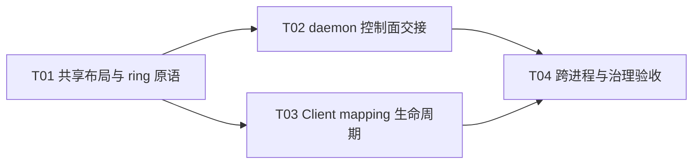

# F04-S01 共享队列与映射边界

所属版本：[UGDR_v1 版本文档](../UGDR_v1_版本文档.md)

所属功能：[F04 SQ、RQ、CQ 队列系统](F04_SQ、RQ、CQ_队列系统_功能文档.md)

## 一、目标与完成条件

定义并接入可跨独立进程映射的版本化 SPSC ring、直接 descriptor slot 和 CQ/QP 创建时的 fd 交接。完成时，Client 与 daemon 能以不同映射地址双向验证 SQ、RQ、CQ 的 empty、full、wrap-around 与内存可见性，失败路径无部分对象、fd 或 mapping 泄漏；公开 post/poll 仍保持未支持。

## 二、实现设计

F04 功能文档已确认：数据面不走逐 WR IPC；SQ/RQ/CQ 为共享 SPSC ring；同一 QP/CQ 的多调用线程由 Client 本地锁串行；每个 CQ 只有一个 Worker producer；slot 直接保存 descriptor，不使用 pool、索引间接层或 freelist。本步骤只建立 ring 与映射边界，不实现 post、poll 或 Mock completion。

### 共享布局与模块改动

| 位置 | 改动 | 职责 |
|-|-|-|
| `src/queue/shared_ring.hpp/.cpp` | 新增 `ugdr_queue` 核心 | checked layout sizing、memfd 创建、mmap/munmap、header 校验和 SPSC reserve/publish/peek/release。 |
| `src/queue/descriptors.hpp` | 新增共享 descriptor 布局 | 定义固定宽度 SGE、Send/Receive WQE header 与 CQE；WQE slot 尾随本 QP 上限数量的内联 SGE。 |
| `src/control/pd_mr_cq.*` | 修改 CQ 创建与记录 | daemon 创建 CQ ring；成功响应携带 1 个 CQ fd，CqRecord 持有 daemon mapping。 |
| `src/control/qp.*` | 修改 QP 创建与记录 | daemon 分别创建 SQ、RQ ring；成功响应按 SQ、RQ 顺序携带 2 个 fd，QpRecord 持有两份 mapping。 |
| `src/api/api.cpp` | 修改 Client proxy | 创建成功后校验并映射响应 fd；映射完成后才发布公开 CQ/QP，销毁成功后解除映射。 |
| `CMakeLists.txt`、`tools/module-boundaries.json`、`docs/architecture/repository-skeleton.md` | 新增 target 与依赖边界 | `ugdr_queue` 不依赖其他生产 target；api、control 和后续 worker 可依赖它，Client 不引入 DPDK。 |
| `tests/unit/shared_ring_test.cpp`、`tests/integration/shared_queue_mapping_test.cpp` 及测试 CMake | 新增测试 | 覆盖 ring 原语、fd 交接、独立进程双向访问、异常回收与控制面回归。 |

共享 header 只含固定宽度整数：magic、layout version、queue kind、header bytes、mapping bytes、capacity、slot stride、producer position、consumer position 和保留字段。不得出现进程地址、公开 WR 链表指针、C++ 容器、mutex 或虚函数对象。producer 与 consumer 游标各自独占 cache line，并通过 `std::atomic_ref<uint64_t>` 访问；构建时静态确认 64 位原子始终 lock-free。

| 队列 | producer | consumer | slot |
|-|-|-|-|
| SQ | Client | owner Worker | Send WQE header + `max_send_sge` 个内联共享 SGE；stride 按 cache line 对齐。 |
| RQ | Client | owner Worker | Receive WQE header + `max_recv_sge` 个内联共享 SGE；stride 按 cache line 对齐。 |
| CQ | owner Worker | Client | 固定宽度 CQE；字段不含 Client pointer。 |

capacity 使用公开创建参数的精确值，不静默扩容；总 mapping 大小、slot stride 与 offset 均执行溢出检查并按页对齐。共享布局只用于同一 Linux 主机、同一 UGDR 构建的数据面，采用主机原生字节序；它不是网络 wire ABI，不在热路径做 hton/ntoh。magic、版本、queue kind、尺寸和保留字段用于拒绝错误或不兼容映射。

### 并发与 fd 生命周期

```python
producer_reserve():
    produced = load(producer_pos, relaxed)
    consumed = load(consumer_pos, acquire)
    if produced - consumed == capacity:
        return FULL
    return slot_at(produced % capacity)

producer_publish():
    store(producer_pos, produced + 1, release)

consumer_peek():
    consumed = load(consumer_pos, relaxed)
    produced = load(producer_pos, acquire)
    if produced == consumed:
        return EMPTY
    return slot_at(consumed % capacity)

consumer_release():
    store(consumer_pos, consumed + 1, release)
```

只有 producer 写入尚未发布的 slot，只有 consumer 读取已发布且尚未释放的 slot。游标为 64 位单调计数，full 判定使用差值，slot 仅在 consumer release 后复用；S01 测试需覆盖游标跨 capacity 多次回绕，但不把自然的 64 位溢出作为 v1 运行期目标。

| 阶段 | 动作 | 失败语义 |
|-|-|-|
| daemon create | `memfd_create`、checked `ftruncate`、`MAP_SHARED`、零化并初始化 header，增加 `F_SEAL_SHRINK \| F_SEAL_GROW \| F_SEAL_SEAL`，不加 `F_SEAL_WRITE`。 | 保留系统 errno；大小溢出返回 `EOVERFLOW`。任何失败按逆序 unmap/close，不登记对象。 |
| 控制面响应 | CQ 响应只允许 fd index 0；QP 响应只允许 index 0=SQ、1=RQ。operation-specific opaque payload 携带版本化 queue descriptor，fd 仍由通用 IPC/adapter 传输。 | dup、编码或发送前准备失败，不发布部分对象；断连后由 session destroy 回收已提交对象。 |
| Client map | 校验 fd 数量与顺序、`fstat` 大小、header、版本、kind、capacity 与 stride，再 mmap；映射成功后关闭接收 fd。 | 缺失、额外、错序或畸形响应返回 `EPROTO`；版本不支持返回 `EPROTONOSUPPORT`，并补偿 destroy daemon 对象。 |
| destroy | daemon 在对象关系允许销毁时释放自身 mapping；Client 仅在成功响应后失效 proxy 并 unmap。S01 尚无 Worker 并发访问。 | 公开 child-first 与 `EBUSY` 语义不变；session 断连仍强制回收该 session 全部 mapping。 |

`ugdr_post_send`、`ugdr_post_recv` 与 `ugdr_poll_cq` 在 S01 后继续返回 F03/F02 规定的未支持结果；创建出的 rings 只通过内部测试接口验证，不提前生成 WR、WC 或成功 completion。

### 实现任务

| Txx | 任务 | 交付 | 依赖 |
|-|-|-|-|
| T01 | 共享布局与 ring 原语 | `ugdr_queue`、descriptor 布局、RAII mapping、内存序与单元测试。 | 无 |
| T02 | daemon 控制面交接 | CQ/QP ring 创建、记录持有、版本化响应和 fd rollback。 | T01 |
| T03 | Client mapping 生命周期 | 响应校验、proxy mapping、补偿 destroy 与 unmap。 | T01 |
| T04 | 跨进程与治理验收 | 独立进程双向测试、异常矩阵、CMake/module boundary 与全量回归。 | T02、T03 |



当前可并行前沿只有 T01；T01 完成后 T02 与 T03 可并行，二者完成后进入 T04。

## 三、验证与验收

| 验证动作 | 预期结果 | 失败判定 |
|-|-|-|
| `ugdr_shared_ring_test` 覆盖 capacity 1/非 2 次幂、empty、full、release 后复用、长期 wrap-around 和 producer/consumer 两线程压力。 | FIFO 数据无损；full 不覆盖未消费 slot，empty 不读取未发布 slot；游标和可见性稳定。 | 丢失、重复、乱序、越界访问或卡死。 |
| 同一 memfd 建立两个同时存在且数值地址不同的 mapping，并用 SQ/RQ 与 CQ 方向分别交换 descriptor。 | 所有访问只依赖 header offset 和 slot stride；任一映射写入的数据可由另一映射按 acquire/release 读到。 | 依赖相同虚拟地址、出现进程指针或 descriptor 损坏。 |
| `ugdr_shared_queue_mapping_test` 启动独立 Client/daemon 进程，经现有 `SOCK_SEQPACKET`/`SCM_RIGHTS` 接收 CQ 的 1 个 fd 与 QP 的 2 个 fd。 | Client 生产 SQ/RQ、daemon 消费；daemon 生产 CQ、Client 消费。进程退出、显式销毁和断连均无 fd/mapping 泄漏。 | fd 角色错位、跨进程不可见、泄漏、double unmap 或 session 间串用。 |
| 注入截断文件、错 magic/version/kind/capacity/stride、缺失/额外 fd、size overflow、memfd/ftruncate/mmap/dup 失败。 | 分别得到确定的 `EPROTO`、`EPROTONOSUPPORT`、`EOVERFLOW` 或系统 errno；daemon registry、关系、fd 和 mapping 无 partial state。 | 错误响应仍发布对象，Client proxy 可用，或后续 destroy 命中残留资源。 |
| 运行 `cmake --build build --target ugdr_shared_ring_test ugdr_shared_queue_mapping_test` 与 `ctest --test-dir build --output-on-failure`。 | 新增专项测试和全部既有测试通过；F03 对象生命周期、fd adapter 与 Client ABI 无回归。 | 任一构建、专项测试或全量回归失败。 |
| 运行 `python3 tools/check_module_boundaries.py --root . --build-dir build`、`python3 tools/check_project_docs.py --root .` 和 Client contract 检查。 | `ugdr_queue` target、允许依赖、生成文档段和受审阅契约保持一致。 | 边界漂移、文档治理失败或公开 API/占位语义变化。 |

验收证据写入 `docs/progress/F04-S01.md`，至少记录构建配置、专项/全量测试结果、跨进程 fd 数与角色、异常矩阵和资源清理结果。本步骤不以 Mock Worker、真实 payload 搬运或 400 Gbps benchmark 作为通过条件。
