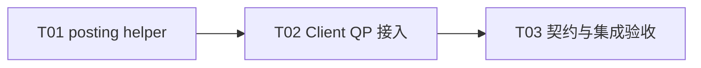

# F04-S02 SQ、RQ posting 快路径

所属版本：[UGDR_v1 版本文档](../UGDR_v1_版本文档.md)

所属功能：[F04 SQ、RQ、CQ 队列系统](F04_SQ、RQ、CQ_队列系统_功能文档.md)

## 一、目标与完成条件

实现 `ugdr_post_send` 与 `ugdr_post_recv` 的 Client 侧共享内存快路径：按链表顺序校验并复制 WR/SGE，批量发布到 QP 的 SQ/RQ。完成时合法链按序入队；首个非法或容量不足 WR 通过 `bad_wr` 精确返回且成功前缀不回滚；post 热路径无 IPC、每 WR syscall 和堆分配。

## 二、实现设计

F04 功能文档已确认：post 只访问 QP 的共享 SPSC ring；同一 QP 的多个调用线程由 Client 本地串行；slot 直接保存 WQE 与内联 SGE。本步骤不消费 WQE、不生成 WC、不解析 lkey/rkey，也不实现 MR busy、ERR flush 或真实 payload 操作。

### 文件与职责

| 位置 | 改动 | 职责 |
|-|-|-|
| `src/api/wr_posting.hpp/.cpp` | 新增内部 posting helper | WR 立即校验、slot 编码、分段 batch reserve/publish 与错误映射。 |
| `src/api/api.cpp` | 修改 Client QP proxy 与公开入口 | 增加 per-QP post mutex 和缓存状态；成功的 modify/connect 同步状态；destroy 与 post 互斥。 |
| `docs/contracts/public-api.md`、`wr-wc-semantics.md`、`tools/client-contracts.json` | 更新当前能力来源 | posting 从占位切换为已实现；poll 仍保持占位。 |
| `tests/unit/wr_posting_test.cpp` 与既有 contract tests | 新增/修改单元测试 | 覆盖校验、copy、batch、prefix、`bad_wr` 和并发。 |
| `tests/integration/qp_posting_client_server_test.cpp` 与 CMake | 新增公开 API 集成 | 在现有控制面创建/建连 QP 后，从 daemon mapping 检查 SQ/RQ descriptor。 |

### 行为约定

| 条件 | 结果 |
|-|-|
| `qp`、首个 WR 或 `bad_wr` 为空 | 返回 `EINVAL`；没有可指向 WR 时不改写输出。 |
| Send QP 非 RTS；Receive QP 非 INIT/RTR/RTS | 返回 `EINVAL`，`*bad_wr` 指向当前 WR。 |
| `num_sge` 为负、超过 QP capability，或非零但 `sg_list` 为空 | 当前 WR 失败；零 SGE Receive WR 合法。 |
| Send opcode/flag 含 v1 未支持值 | 仅接受 RDMA Write、RDMA Write With Immediate 和 `UGDR_SEND_SIGNALED`；否则 `EINVAL`。 |
| WR 立即校验通过 | 复制标量字段及恰好 `num_sge` 个 SGE；不把 `next`、`sg_list` 或其他 Client pointer 写入共享区。普通 Write 的 immediate 字段写零。 |
| ring 无可用 slot | 将内部 `EAGAIN` 映射为 `ENOMEM`；当前 WR 及后缀不入队，已发布前缀保留。 |
| lkey/rkey、地址或长度执行期非法 | 本步骤只复制 descriptor，不提前解析；后续 Worker 按 F02 契约生成 execution error。 |

post 持有 per-QP mutex 处理整条 WR 链，避免把 SPSC ring 扩成 MPSC。该锁同时与成功状态变更和 destroy 协调；post 不持有进程级 `ClientRuntime` mutex，不调用 ControlClient。不同 QP 可独立推进。

```python
lock(qp.post_mutex)
validate qp lifetime and cached state
current = first_wr
while current is not None:
    status, slots = ring.producer_reserve(ring.capacity)
    if status == EAGAIN:
        set bad_wr to current
        return ENOMEM
    accepted = 0
    for slot in slots:
        if current is None:
            break
        if immediate_validation(current) fails:
            ring.producer_publish(accepted)
            set bad_wr to current
            return EINVAL
        encode current and its SGEs directly into slot
        accepted += 1
        current = current.next
    ring.producer_publish(accepted)
return 0 without modifying bad_wr
```

reserve 返回的 first/second spans 都按逻辑顺序填充，因此 wrap-around 不改变 FIFO。未使用的尾随 SGE 空间不要求清零，consumer 只能按 `sge_count` 读取；header reserved 字段始终写零。

### 实现任务

| Txx | 任务 | 交付 | 依赖 |
|-|-|-|-|
| T01 | posting helper | Send/Receive 校验、WQE copy、batch reserve/publish 及单元测试。 | 无 |
| T02 | Client QP 接入 | per-QP 锁、缓存状态、公开 post 入口及控制操作协调。 | T01 |
| T03 | 契约与集成验收 | 公开 API 集成、contract 更新、并发/热路径检查和全量回归。 | T02 |



当前可启动任务为 T01。

## 三、验证与验收

| 验证动作 | 预期结果 | 失败判定 |
|-|-|-|
| `ugdr_wr_posting_test` 覆盖两种 opcode、signaling、零/多 SGE、copy 后修改原 WR/SGE、full、wrap-around 和跨 two-span batch。 | daemon 侧看到的 descriptor 与 post 时快照一致，FIFO 与 count 正确；普通 Write 的 immediate 字段为零。 | 共享区出现 Client pointer、字段丢失/污染、顺序错误或覆盖未消费 slot。 |
| 覆盖空指针、非法状态、负数/超限 SGE、空 `sg_list`、未知 opcode/flag，以及链中间失败。 | 返回 `EINVAL` 或容量对应的 `ENOMEM`；`bad_wr` 指向首个失败 WR；成功前缀保留，后缀不入队；全成功不要求改写 `bad_wr`。 | 错误码、失败位置或队列效果偏离 F02 契约。 |
| 同一 QP 多线程分别提交带序号的 WR 链，同时让 consumer 推进；另以多个 QP 并行提交。 | 每条链内部连续有序，所有已接受 descriptor 恰好一次；无 ring 损坏、死锁或跨 QP 全局串行。 | 丢失、重复、链内乱序、数据竞争或卡死。 |
| `ugdr_qp_posting_client_server_test` 经公开 API 创建、INIT/建连并 post SQ/RQ，再从 daemon mapping 消费检查。 | Send 仅 RTS 可提交，Receive 在 INIT/RTR/RTS 可提交；post 前后控制面请求计数不变。 | post 触发 IPC、依赖相同映射地址，或公开入口仍返回占位结果。 |
| 对代表性单 WR与 batch post 循环统计分配，并检查调用路径。 | 稳态 post 无堆分配、Unix Socket 调用或每 WR syscall；本步骤只记录吞吐样本，不设置 400 Gbps 硬阈值。 | 热路径出现分配、控制面调用或 descriptor 间接池。 |
| 运行专项 build/test、`ctest --test-dir build --output-on-failure`、模块边界、文档治理和 Client contract 检查。 | 新增专项与全部既有测试通过；`ugdr_poll_cq` 仍保持 S03 前的占位语义。 | 任一检查失败或 F02/F03/S01 回归。 |

验收证据写入 `docs/progress/F04-S02.md`，记录成功前缀、`bad_wr`、并发结果、无 IPC/分配证据及完整命令结果。
