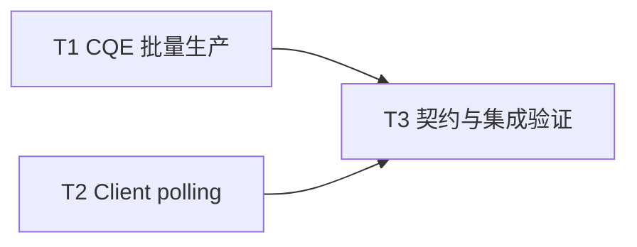

# F04-S03 CQ 生产与 polling 快路径

所属版本：[UGDR_v1 版本文档](../UGDR_v1_版本文档.md)

所属功能：[F04 SQ、RQ、CQ 队列系统](F04_SQ、RQ、CQ_队列系统_功能文档.md)

## 一、目标与完成条件

实现唯一 owner Worker 向 CQ ring 批量写入内部 CQE，以及 Client 通过 `ugdr_poll_cq` 批量取出 WC。生产与 polling 只访问共享映射；同一 CQ 的并发 poll 不重复消费，不同 CQ 独立推进。

完成时，CQE 字段按 F02 WC 契约转换，FIFO 与容量恢复正确；空 CQ 返回 0，失败不改写调用方输出；相同 `send_cq`/`recv_cq` 不会让同一个 completion 被重复投递，不同 CQ 只收到各自目标 completion。

## 二、实现设计

### 已确认边界

- CQ ring 是 SPSC：唯一 owner Worker 生产，Client 消费；同一 CQ 的多线程 poll 由 Client 本地 per-CQ mutex 串行化。
- CQE 直接存入固定 slot，poll 后才释放容量；不引入 descriptor pool、index indirection、freelist、IPC、syscall 或热路径堆分配。
- 本步骤只提供 CQE 传输、路由入口和 polling。signaling、Write/Write With Immediate、ERR flush 等 completion 生成条件属于 F04-S04。
- 一个已生成 completion 只选择一个目标 CQ：发送 completion 进入 `send_cq`，接收 completion 进入 `recv_cq`。两者指向同一 CQ 时仍只投递该 completion 一次；若业务产生发送与接收两个不同 completion，则分别按各自语义入队。

### 接口与流程

queue 模块增加内部批量生产函数：

```cpp
int produce_completions(SharedRing &ring, const CompletionEntry *entries,
                        int num_entries) noexcept;
```

返回值为本次实际发布的 CQE 数；0 表示输入为空或 CQ 已满，负值表示参数、ring 类型或共享布局错误。容量不足时发布可容纳的 FIFO 前缀，调用方保留剩余项并重试。函数只接受 completion ring，复制完 slots 后一次 publish。

`ugdr_poll_cq` 先校验句柄、数量和输出指针，再持有该 CQ 的 poll mutex，直接从本地映射批量 peek。空 CQ 返回 0；有数据时先把内部 CQE 逐项转换到连续 `ugdr_wc`，未支持字段清零，再一次 release 并返回数量。该路径不调用 `ensure_connected`，不持有全局 control mutex。

CQ 销毁与 poll 使用相同 per-CQ mutex 协调：destroy 在停止 daemon owner、控制面销毁成功后，持锁标记对象失效并解除映射；稳定的 CQ proxy registry 负责拒绝伪造或已销毁句柄，避免 poll 与 unmap 并发。

### 文件与任务

| 任务 | 预计文件 | 交付 |
|-|-|-|
| T1 CQE 批量生产 | `src/queue/completion_queue.hpp/.cpp`、`CMakeLists.txt` | completion ring 校验、FIFO 前缀复制与批量 publish。 |
| T2 Client polling | `src/api/api.cpp` | per-CQ poll mutex、WC 转换、批量 release、destroy 协调和无 IPC 快路径。 |
| T3 契约与集成验证 | `tests/unit/completion_queue_test.cpp`、`tests/integration/cq_polling_client_server_test.cpp`、现有 CQ/API 测试与 CMake 清单 | 字段、批量、并发、路由、错误输出和跨进程映射验证。 |



T1 与 T2 可并行，完成后进入 T3。

## 三、验证与验收

| 验证动作 | 预期结果 | 失败判定 |
|-|-|-|
| unit 覆盖空、满、wrap-around、批量跨两段、容量恢复、FIFO、非法 ring，以及 `CompletionEntry` 到 `ugdr_wc` 的逐字段转换。 | CQE 按 FIFO 发布和移除，容量可恢复，WC 支持字段准确且其他字段清零。 | 顺序、容量、字段或错误码偏离契约。 |
| daemon 侧映射作为唯一 producer 注入 CQE，Client 经公共 API 批量 poll。 | 数据面期间控制面请求计数不变，映射地址不同仍可工作。 | poll 触发 IPC、syscall、堆分配或依赖相同映射地址。 |
| 同一 CQ 多线程 poll；不同 CQ 分别注入不同 `wr_id`；`send_cq` 与 `recv_cq` 指向同一 CQ。 | 每个 `wr_id` 恰好出现一次，各 CQ 只返回目标项，同一 completion 不重复入队。 | 丢失、重复、串扰、ring 损坏或死锁。 |
| 无效句柄、非法数量或共享布局错误。 | 返回契约规定的负 errno，调用方 WC 缓冲区保持原值。 | 失败改写输出或返回错误语义不一致。 |
| 运行专项测试、配置后的全量 `ctest`、模块边界、文档治理和项目状态校验。 | 新增专项与全部既有测试通过；不新增 F04-S04 completion 业务语义或性能阈值。 | 任一门禁失败或既有能力回归。 |

验收证据写入 `docs/progress/F04-S03.md`。
