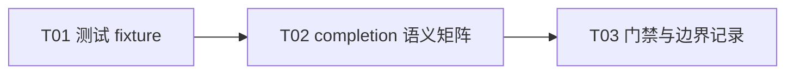

# F04-S04 Mock Worker 与 completion

所属版本：[UGDR_v1 版本文档](../UGDR_v1_版本文档.md)

所属功能：[F04 SQ、RQ、CQ 队列系统](F04_SQ、RQ、CQ_队列系统_功能文档.md)

## 一、目标与完成条件

实现仅用于测试的、可确定推进的 Mock Worker fixture，串联测试创建的 SQ/RQ/CQ：按 F02 契约模拟普通 Write、Write With Immediate、signaling 和 ERR flush completion，但不接入 daemon、不访问 payload、不实现 RNR/retry，也不把 Mock 成功解释为真实远端可见。

完成时，专项测试能够稳定复现 WR 消费与 WC 生成规则；unsignaled 成功发送 WC 被抑制，接收、错误与 flush WC 不被抑制；CQ 背压、descriptor 回收和 MR 引用回调顺序可观察。

## 二、实现设计

### 边界与文件

Mock Worker 是测试 fixture，不是 daemon 组件：不放入 `apps/daemon/main.cpp`，不修改 `src/worker/*` 或 `src/control/*`，也不启动线程。真实 Worker、daemon 调度、MR registry 接入和 payload 路径从 F05 开始实现。

fixture 直接使用生产侧 `SharedRing`、WQE/CQE descriptor、posting helper 和 completion queue helper；测试自行构造两端 QP/CQ 拓扑，并通过显式 `progress_once` 控制每一步，避免把测试模型变成公开或生产接口。

| 位置 | 预计改动 | 职责 |
|-|-|-|
| `tests/unit/mock_worker_test.cpp` | 新增测试内 Mock Worker fixture 与专项用例 | 创建 SQ/RQ/CQ ring，模拟 QP peer、signaling、CQ reservation、completion、ERR flush 和生命周期回调。 |
| `tests/unit/CMakeLists.txt` | 新增 `ugdr_mock_worker_test` target | 只链接现有 `ugdr_api` 与 `ugdr_queue`；不进入任何 production target。 |
| `docs/contracts/wr-wc-semantics.md` | 更新 current implementation boundary | 记录已有 Mock 语义测试，但明确 daemon 尚未消费 WR，真实 MR busy、执行错误和成功可见性仍未实现。 |

### Mock 行为

| 条件 | fixture 动作 | 预期 completion |
|-|-|-|
| 普通 Write | 消费一个 SQ WR，不查看 peer RQ。 | 仅 `sq_sig_all` 或 `UGDR_SEND_SIGNALED` 时生成一个 send WC。 |
| Write With Immediate 且 peer RQ 非空 | 消费一个 SQ WR 和一个 FIFO Receive WR。 | send WC 遵守 signaling；recv CQ 始终得到一个带 Receive `wr_id`、network-order immediate 和发送 SGE 总长度的 WC。 |
| Write With Immediate 但 peer RQ 为空 | 不消费 SQ/RQ。 | 不生成 WC；fixture 返回无进展，不模拟 RNR。 |
| 任一目标 CQ 空间不足 | 取消全部 peek/reservation，不释放 SQ/RQ slot。 | 不部分发布；释放 CQ 容量后重试只完成一次。 |
| fixture 将 QP 置为 ERR | 按各自 FIFO flush 测试 SQ/RQ。 | 每个未完成 WR 恰好一个 flush WC，包括 unsignaled Send；已有 CQE 保留。 |
| fixture teardown | 丢弃剩余 WR并触发生命周期 release 回调。 | 不新增 WC。 |

MR 生命周期在本步骤用测试计数器或回调验证 acquire 发生在模拟执行前，release 发生在 success、flush 或 teardown 处理后；不调用真实 `ugdr_dereg_mr`，不声称已实现 daemon 侧 MR 引用保护。真实 `EBUSY` 接线和 post/dereg 竞争留给 F05 的实际 Worker。

**设计伪代码：**

```python
def progress_once(qp):
    if qp.err:
        return flush_one_when_target_cq_has_space(qp)
    send = qp.sq.peek_one()
    if send is empty:
        return 0
    recv = None
    if send.opcode == WRITE_WITH_IMM:
        recv = qp.peer.rq.peek_one()
        if recv is empty:
            cancel_peek(send)
            return 0
    completions = build_expected_mock_completions(send, recv)
    if not reserve_all_target_cq_slots(completions):
        cancel_all_peeks_and_reservations()
        return 0
    mr_tracker.acquire(send, recv)
    publish_all(completions)
    release_consumed_wqes()
    mr_tracker.release(send, recv)
    return 1
```

### 实现任务

| Txx | 任务 | 交付 | 依赖 |
|-|-|-|-|
| T01 | 测试 fixture | 测试侧 QP/CQ 拓扑、显式 progress 和生命周期 tracker。 | 无 |
| T02 | completion 语义矩阵 | 两种 opcode、signaling、CQ 背压、RQ 消费和 ERR flush 用例。 | T01 |
| T03 | 门禁与边界记录 | CMake 登记、全量回归和 current implementation boundary 更新。 | T02 |



当前可启动任务为 T01。

## 三、验证与验收

| 验证动作 | 预期结果 | 失败判定 |
|-|-|-|
| 组合普通 Write 的 `sq_sig_all`、signaled 与 unsignaled，并检查测试 payload 前后字节。 | SQ FIFO 消费；仅需要的 send WC 出现；payload 完全不变。 | unsignaled 成功产生 WC、应有 WC 缺失、读取/改写 payload 或顺序错误。 |
| Write With Immediate 配一个 FIFO Receive WR，分别使用相同和不同 send/recv CQ。 | 恰好消费一个 SQ 和一个 RQ；send/recv 两个不同 WC 各生成一次，字段和目标 CQ 正确。 | 重复/遗漏 WC、消费错误 RQ、CQ 串扰或 immediate/byte_len/wr_id 错误。 |
| peer RQ 为空或目标 CQ 空间不足后再次 progress。 | 第一次不消费、不部分发布；补充 RQ 或容量后只完成一次。 | 伪造 RNR、部分 completion、提前回收、丢失或重复。 |
| 留下多条 SQ/RQ WR 后令 fixture 进入 ERR，包含 unsignaled Send 和已有 CQE。 | 每个未完成 WR 恰好一个 flush WC；已有 WC 保留；各方向 FIFO。 | flush 被 signaling 抑制、旧 WC 丢失或重复/遗漏。 |
| 记录 MR tracker 的 acquire/release，并执行 success、flush、teardown。 | 引用顺序和计数平衡，descriptor 处理前不 release；不调用真实 MR registry。 | 引用泄漏、提前 release，或测试错误宣称真实 `dereg_mr` 已接通。 |
| 运行专项测试、完整 `ctest`、模块边界、文档治理、项目状态和 Client contract 检查。 | 新增与既有测试全部通过；production target、公开 ABI 和 daemon main 均不改变。 | 任一门禁失败，或 Mock Worker 被链接进 production/daemon。 |

验收证据写入 `docs/progress/F04-S04.md`。
