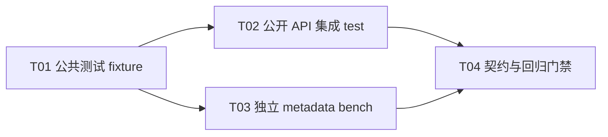

# F04-S05 公开 API 集成与性能观测

所属版本：[UGDR_v1 版本文档](../UGDR_v1_版本文档.md)

所属功能：[F04 SQ、RQ、CQ 队列系统](F04_SQ、RQ、CQ_队列系统_功能文档.md)

## 一、目标与完成条件

完成 F04 的公开数据面 API 集成验收，并将正确性测试与性能观测物理分离：跨进程 test 必须确定性验证 `ugdr_post_send`、`ugdr_post_recv`、显式推进的 Mock Worker 与 `ugdr_poll_cq` 的完整元数据链路；独立 bench 在 Release 构建中输出 MWR/s、cycles/WR、P50/P99 与 400 Gbps 等效带宽对照。完成时 test 与全量回归全部通过，bench 只形成带环境和 payload 假设的观测结果，且热路径没有逐 WR IPC、syscall、堆分配或 freelist。

## 二、实现设计

**边界。** 本步骤只集成 F04 已实现的共享 SQ/RQ/CQ、公开 post/poll 与测试侧 Mock completion。Mock Worker fixture、集成 test 和 benchmark 均不得链接进 production target；不访问 payload，不实现真实 MR busy、RNR/retry、datagram、GPU copy 或远端可见性，也不改变 F02 已审阅的公开 ABI 和 completion 语义。生产代码没有计划改动；若 test 暴露普通可定位缺陷，只允许在既有契约内有界修复。

| 位置 | 改动 | 职责 |
|-|-|-|
| `tests/support/mock_worker_fixture.hpp/.cpp` | 从 S04 单元测试抽取公共测试 fixture，形成非 production 的 `ugdr_test_support` target。 | 封装测试 QP/CQ 拓扑、显式 `progress_once`、completion reservation、ERR flush 与生命周期 tracker；不启动线程，不访问 payload。 |
| `tests/unit/mock_worker_test.cpp` | 改为复用公共 fixture。 | 保留 S04 已有 signaling、路由、背压、flush、teardown 与 tracker 专项矩阵，防止抽取时改变语义。 |
| `tests/integration/queue_api_client_server_test.cpp` | 新增 `ugdr_queue_api_client_server_test`，CTest 名称为 `ugdr_queue_api_client_server`。 | 独立 Client/daemon 进程完成控制面创建与 fd 映射；Client 只调用公开 post/poll，daemon 侧显式推进公共 Mock Worker fixture，验证完整元数据链路与清理。 |
| `benchmarks/` | 新增独立 benchmark 目录；把现有 ring/post benchmark 移入并保留原 target 名，新增 `ugdr_queue_metadata_benchmark`。 | 将 benchmark 与 CTest 物理分离；新 target 复用公共 fixture，测量 post→Mock Worker→CQ→poll 完整元数据链路。 |
| `CMakeLists.txt`、`tests/unit/CMakeLists.txt`、`tests/integration/CMakeLists.txt`、`benchmarks/CMakeLists.txt` | 登记 test support、确定性 test 与非 CTest benchmark。 | CTest 只运行正确性门禁；benchmark 由显式 Release 命令运行，不设置性能通过阈值。 |
| `docs/contracts/public-api.md`、`docs/contracts/wr-wc-semantics.md`、`tools/module-boundaries.json`、`docs/architecture/repository-skeleton.md` | 更新当前实现边界、benchmark 区域和生成的模块边界。 | 记录完整 Mock 元数据集成已经覆盖，但真实 Worker、payload、MR busy 与远端可见性仍未实现；保持机器清单和架构文档同步。 |

### 确定性 test 行为

| 场景 | 执行 | 判定 |
|-|-|-|
| 普通 Write | 通过公开 API post 单条与链式 WR，覆盖 `sq_sig_all`、显式 signaled 与 unsignaled。 | SQ FIFO；只有需要的成功 send WC 出现；payload 不读写。 |
| Write With Immediate | 预提交 Receive WR，覆盖相同和不同 send/recv CQ。 | 恰好消费一个 FIFO Receive WR；send/recv WC 字段、目标 CQ、immediate 与 byte_len 正确。 |
| 背压与恢复 | 制造 peer RQ 空、目标 CQ 满和 wrap-around，再补充容量并推进。 | 第一次不消费、不部分发布；恢复后只完成一次，无丢失、重复或 slot 提前复用。 |
| 并发与边界 | 复用 per-QP post 与 per-CQ poll 锁，记录控制请求数和 warmed allocation count。 | 多线程结果恰好一次；数据面不增加控制请求或堆分配；公开错误域和 `bad_wr` 不变。 |
| ERR 与销毁 | 显式令 fixture 进入 ERR，随后销毁公开对象并等待子进程退出。 | 未完成 WR 各得到一个 flush WC，旧 WC 保留，teardown 不新增 WC，映射与对象按依赖顺序释放。 |

```python
client = create_public_context_pd_cqs_and_connected_qps()
daemon = map_all_queue_fds_from_control_responses()

for case in deterministic_matrix:
    post_with_public_api(case)
    while case.requires_progress:
        daemon.mock_worker.progress_once()
    completions = poll_with_public_api(case)
    assert_contract(case, completions)

assert control_request_count == setup_and_teardown_only
destroy_children_before_parents()
```

### Benchmark 矩阵与输出

benchmark 在 setup 和 warm-up 后开始计时，至少覆盖 batch 1/32、1/4 个 SGE、每 WR signaling 与每 32 WR signaling。每个 case 输出迭代数、completed WR 数、环境、MWR/s、cycles/WR、端到端延迟 P50/P99、给定 payload 的等效 Gbps，以及达到 400 Gbps 所需的最小 payload 字节数；周期性 signaling 的 completed WR 以 Mock Worker 实际消费数统计，不能把 WC 数当作 WR 数。

| 指标 | 计算 | 约束 |
|-|-|-|
| MWR/s | `completed_wr / elapsed_seconds / 1e6` | 只统计测量窗口内成功消费且满足 Mock completion 条件的 WR。 |
| cycles/WR | `(cycle_end - cycle_begin) / completed_wr` | 使用构建环境支持的单调 cycle counter；不把 setup、warm-up 或结果格式化计入窗口。 |
| P50/P99 | 对 post→显式 progress→poll 的端到端样本排序取分位数。 | 报告采样粒度和 batch；不声称为真实网络或 payload 延迟。 |
| 等效带宽 | `completed_wr_s * payload_bytes * 8` | 报告 payload 假设；结果不作为 v1 关闭阈值。 |
| 400 Gbps 最小 payload | `50_000_000_000 / completed_wr_s` 字节 | 只是元数据速率对照，不代表 F05-F07 真实路径能力。 |

```python
for batch in [1, 32]:
    for num_sge in [1, 4]:
        for signaling in ["every_wr", "every_32_wr"]:
            setup_public_objects_and_independent_mappings()
            warm_up()
            samples = run_post_progress_poll_window()
            print_metrics(samples, environment, payload_assumptions)
            teardown()
```

### 实现任务

| Txx | 任务 | 交付 | 依赖 |
|-|-|-|-|
| T01 | 公共测试 fixture | 抽取 test-only Mock Worker support，S04 单元测试复用且语义不变。 | 无 |
| T02 | 公开 API 集成 test | 跨进程确定性 CTest，覆盖完整 post/progress/poll、背压、并发与清理。 | T01 |
| T03 | 独立 metadata bench | 独立 `benchmarks/`、迁移既有 benchmark、完整链路矩阵与指标输出。 | T01 |
| T04 | 契约与回归门禁 | 更新契约、CMake、模块边界和架构文档，执行完整验证。 | T02、T03 |



当前可启动任务为 T01；T01 完成后，T02 与 T03 构成可并行前沿，二者完成后再执行 T04。

## 三、验证与验收

| 验证动作 | 预期结果 | 失败判定 |
|-|-|-|
| 构建并运行 `ugdr_mock_worker` 与 `ugdr_queue_api_client_server`。 | S04 专项无回归；跨进程公开 API 链路覆盖普通 Write、Write With Immediate、signaling、背压、并发、ERR flush 与销毁，全部通过。 | 语义变化、丢失/重复 completion、部分发布、错误 CQ、控制请求增加、分配增加或资源泄漏。 |
| 检查 test/bench CMake 注册和 production target 链接。 | 正确性 test 进入 CTest；三个 benchmark 只在 `benchmarks/` 显式构建运行；`ugdr_test_support`、fixture 和 benchmark 不进入 production target。 | benchmark 被当成 CTest 门禁，或测试支持代码链接进 Client、daemon 或生产库。 |
| Release 配置构建并至少运行三次 `ugdr_shared_ring_benchmark`、`ugdr_wr_posting_benchmark` 和 `ugdr_queue_metadata_benchmark`。 | 每个 case 输出稳定可解析的环境、矩阵参数和 MWR/s；完整链路另输出 cycles/WR、P50/P99、等效 Gbps 与 400 Gbps 最小 payload。 | 指标缺失、公式或 completed WR 口径错误、把 WC 数误作 WR 数，或把结果描述为真实数据路径能力。 |
| 检查 warmed hot path 的控制请求、allocation counter 与调用路径。 | post/progress/poll 测量窗口无 Unix Socket IPC、每 WR syscall、堆分配、descriptor pool 或 freelist；setup、计时采样和结果输出不计入热路径约束。 | 任一数据面 WR 触发控制请求、系统调用或堆分配，或新增间接 descriptor 生命周期。 |
| 运行 `tools/ugdr format --check`、`tools/ugdr lint`、完整 build、`ctest --test-dir build --output-on-failure`、Client contract、模块边界、文档治理和项目状态检查。 | 格式、静态检查、专项与既有测试、契约、架构生成区和机器状态全部通过。 | 任一必需命令失败，或 `tools/module-boundaries.json` 与 repository skeleton 不同步。 |
| 记录 `docs/progress/F04-S05.md`。 | Source、Delivered、Verification、Deviations/Remaining 包含 test/bench 分离、运行环境和观测结果；Acceptance 留空等待人工验收。 | 缺少可复现实证、提前填写 Acceptance，或从测试结果推断人工验收。 |
