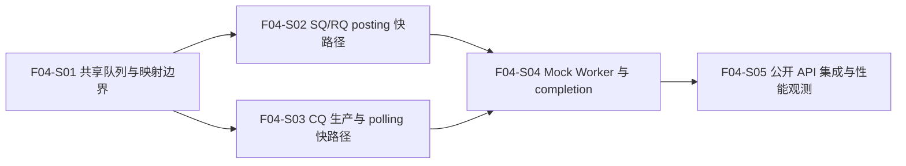

# F04_SQ、RQ、CQ 队列系统 功能文档

所属版本：UGDR_v1

所属版本文档：[UGDR_v1 版本文档](../UGDR_v1_版本文档.md)

## 一、功能目标

Client 应用能够通过已冻结的 verbs-like API，在不经过逐次 IPC 的数据面快路径上向 QP 的 SQ/RQ 提交 WR，并从 CQ 轮询 WC；daemon 侧 Mock Worker 能按已审阅契约消费 WR、生成可重复验证的 Mock WC。完成时队列容量、顺序、线程安全、completion 与 flush 语义均可观察，且不以 Mock completion 冒充真实数据搬运完成。

## 二、背景与版本关系

F03 已实现 IPC/session、Context、PD、CUDA MR、CQ、QP 及状态与关系，但 SQ/RQ 只有容量元数据，post/poll 仍是占位。F04 直接依赖 F03，把 F02 冻结的 WR/WC 契约落成真实共享队列，为 F05 Loop Worker 与 datagram 数据路径提供稳定的数据面入口；真实目标校验、RNR、GPU 任务和最终成功 completion 条件仍由 F05-F06 承接。

## 三、功能范围

- CQ/QP 创建仍走控制面 IPC；daemon 创建队列共享内存并一次性传递 fd，Client 与 daemon 建立各自映射。`post_send`、`post_recv` 与 `poll_cq` 不发送 IPC 请求。
- SQ、RQ、CQ 使用 UGDR 自有、版本化、无进程指针的共享 SPSC ring。SQ/RQ 由 Client 生产、owner Worker 消费；CQ 由唯一 owner Worker 生产、Client 消费。
- 同一 QP 的多线程 posting 由 Client 本地 per-QP 锁串行化；同一 CQ 的多线程 polling 由 Client 本地 per-CQ 锁串行化。不同 QP/CQ 可独立推进。
- SQ/RQ slot 直接保存复制后的内部 WQE 与 SGE 描述，CQ slot 直接保存内部 CQE；不传递公开链表指针，不引入 descriptor pool、index indirection 或 freelist。
- 实现 WR 链成功前缀、立即校验、`bad_wr`、队列容量、FIFO、descriptor 生命周期、未完成 WR 的 MR 引用保护，以及批量 CQ polling。
- Mock Worker 验证 signaling、普通 Write 与 Write With Immediate 的成功队列语义、相同或不同 send_cq/recv_cq 的 completion 路由，以及进入 ERR 后的 flush WC。
- 增加队列性能 benchmark，记录 MWR/s、cycles/WR、post/poll 延迟和按假定 payload 换算的等效带宽。

## 四、非目标

- 不让 `post_send`、`post_recv` 或 `poll_cq` 经过 Unix Socket IPC、动态分配或其他每 WR 系统调用。
- 不实现真实 datagram、DPDK 数据路径、目标 rkey/MR 定位、payload 访问或 GPU copy；Client 不初始化 EAL，也不作为 DPDK secondary process。
- 不实现 RNR/retry、真实传输错误或真实远端可见性；F04 的成功 WC 仅为 Mock 队列验证结果。
- 不为 CQ 引入 MPSC、MPMC、多 Worker shard 或其他未来扩展；v1 CQ producer 由一个 Worker 独占。
- 不以 F04 元数据 benchmark 代替 F05-F07 的真实数据路径性能结论，也不增加 v1 关闭所需的硬带宽阈值。

## 五、依赖与约束

- 直接依赖已审阅 F03 对象生命周期、QP/CQ 关联、fd 传输能力，以及 F02 的 WR/WC、`bad_wr`、signaling、ordering、polling、ERR flush 与 MR busy 契约。
- 运行环境为 Linux 本机独立 Client/daemon 进程；共享映射地址可以不同，共享布局不得包含进程本地指针或 C++ 动态对象。
- 共享 ring 使用有界容量、单调索引和明确的 acquire/release 发布关系；热路径不得依赖 IPC、堆分配或 freelist。
- 每个 QP 与 CQ 在 daemon 数据面有唯一 owner Worker。控制线程不与 Worker 并发生产 CQE；控制面触发的 flush 由 owner Worker 完成。
- 同一 QP/CQ 的并发 API 调用保证线程安全，但不宣称同一对象的公开操作 lock-free；峰值并行吞吐通过不同 QP/CQ 扩展。
- 性能测试只形成环境相关观测。等效带宽按 completed WR/s × payload bytes × 8 计算，真实 400 Gbps 能力需在后续完整路径验证。

## 六、功能设计与模块边界

**控制面与数据面。** CQ/QP 创建和销毁沿用 F03 IPC 与严格生命周期；创建成功响应携带共享队列 fd，双方完成映射后才发布公开对象。数据面 post/poll 只访问映射内存，销毁必须先停止 owner Worker 对队列和未完成 WR 的访问，再解除映射与对象关系。

**队列与并发。** 共享 ring 仅保存固定宽度元数据、索引和 slots。Client 在本地对象锁内处理一次 API 调用的完整 WR 链，复制成功前缀后批量发布；Worker 以唯一 consumer 顺序取出。CQ 由唯一 Worker 顺序生产，Client 在本地 CQ 锁内批量 poll。相同 CQ 可承载多个来源，只保证各来源内部顺序与因果关系。

**Descriptor 与生命周期。** 公开 WR 链在 post 返回前被展平并复制为内部 WQE，SGE 随 WQE 保存；Client pointer、`next` 和 `sg_list` 不进入共享区。slot 在对应 WR 完成、flush 或销毁处理结束前不得复用，未完成 WR 对活 MR 的引用继续阻止 deregistration。CQE 被 poll 后才释放 CQ 容量。

**Mock completion 边界。** Mock Worker 只模拟队列消费与 completion 路由：普通 Write 不消费远端 RQ，Write With Immediate 的成功场景消费一个 FIFO Receive WR 并生成带 immediate data 的接收 WC；发送 WC 遵守 signaling，错误与 flush 不受 signaling 抑制。缺少 Receive WR 的 RNR/retry 和所有真实数据可见性留给 F05-F06。

**性能观测。** benchmark 分离 ring 原语与 post→Mock Worker→CQ→poll 完整元数据链路，覆盖单 WR/批量 WR、不同 SGE 数和 signaling 模式。预计新增共享队列模块及测试，修改控制面 CQ/QP fd 交接、公开 post/poll、Mock Worker、构建与模块边界；具体文件在步骤文档中确认。

## 七、步骤划分

步骤表是依赖关系的唯一事实源。S01 完成后，S02 与 S03 可以并行；S04 汇合二者，S05 完成集成验收。

| 步骤标识 | 步骤名称 | 目标与交付 | 依赖 | 验收边界 |
|-|-|-|-|-|
| F04-S01 | 共享队列与映射边界 | 定义并实现可跨进程映射的版本化 SPSC ring、直接 descriptor slot、所有权与 fd 交接边界。 | F03 | 独立进程可映射并双向验证 SQ/RQ/CQ ring；wrap-around、full/empty、内存可见性和异常清理确定，无进程指针。 |
| F04-S02 | SQ/RQ posting 快路径 | 接入 Send/Receive WR posting、同 QP 多线程串行、WR/SGE copy、成功前缀、容量与 `bad_wr`。 | F04-S01 | 合法链按序提交；首个非法或容量不足 WR 准确返回，已提交前缀不回滚；post 热路径无 IPC 和动态分配。 |
| F04-S03 | CQ 生产与 polling 快路径 | 实现 owner Worker CQE 生产、同 CQ 多线程安全 polling，以及相同/不同 send_cq/recv_cq 的路由。 | F04-S01 | WC 按契约入队和批量移除；共享 CQ 不重复 completion，不同 CQ 分别得到各自 completion；失败不改写输出。 |
| F04-S04 | Mock Worker 与 completion | 以 Mock Worker 串联 SQ/RQ/CQ，验证 signaling、Write/Write With Immediate 成功语义、未完成 WR 生命周期与 ERR flush。 | F04-S02、F04-S03 | 消费和 completion 可重复，unsignaled 成功 WC 被抑制而 error/flush 不被抑制；不访问 payload、不实现 RNR。 |
| F04-S05 | 公开 API 集成与性能观测 | 完成 post/poll 公开入口、跨进程集成、回归门禁和队列元数据性能 benchmark。 | F04-S04 | F04 契约测试与全量回归通过；输出 MWR/s、cycles/WR、P50/P99 和 400 Gbps 等效带宽对照，热路径无 IPC、syscall 和堆分配。 |

## 八、验证与功能验收标准

- 独立 Client/daemon 进程通过控制面获得并映射队列 fd；数据面 post/poll 不产生 IPC 请求，映射地址不同仍能正确处理 ring 与 descriptor。
- 覆盖 SQ/RQ/CQ empty、full、wrap-around、容量恢复、FIFO、链表成功前缀、`bad_wr`、descriptor copy 和完成前不可复用。
- 同一 QP 多线程 post、同一 CQ 多线程 poll 保持线程安全；不同 QP/CQ 可独立推进，无队列损坏、重复消费或重复 completion。
- 覆盖 signaling、unsignaled、普通 Write、Write With Immediate 成功 RQ 消费、相同或不同 CQ 路由、ERR flush、销毁与 MR busy 生命周期。
- 性能 benchmark 覆盖单 WR 与批量 WR、代表性 SGE 数和 signaling 模式，记录 MWR/s、cycles/WR、P50/P99，并按 completed WR/s × payload bytes × 8 输出等效带宽及 400 Gbps 所需最小 payload；结果用于观测，不作为 v1 关闭硬阈值。
- 专项检查确认热路径无 Unix Socket IPC、每 WR syscall、堆分配和 freelist；format/lint、build、单元测试、跨进程集成测试及完整配置测试集通过。
- 不得因 Mock Worker 报告真实数据已写入、提前实现 DPDK/GPU 数据路径，或改变 F02 已审阅的公开 API、错误和 completion 语义。

## 九、风险与待确认事项

| 类型 | 内容 | 影响 | 状态 |
|-|-|-|-|
| 已确认 | post/poll 是数据面快路径，只使用共享映射；IPC 仅用于资源创建、fd 交接和生命周期控制。 | 避免每 WR socket 往返成为延迟与吞吐瓶颈。 | 设计约束 |
| 已确认 | SQ/RQ/CQ ring 使用 SPSC；同一 QP/CQ 的多个调用线程在 Client 本地串行，CQ producer 由一个 Worker 独占。 | 保持 verbs 线程安全，同时避免 MPSC/MPMC 热点与过度设计。 | 设计约束 |
| 已确认 | 内部 descriptor 直接进入定长 slot，不使用 descriptor pool、index indirection 或 freelist。 | 减少指针追踪、ABA、额外原子操作和生命周期复杂度。 | 设计约束 |
| 风险 | 共享布局、内存序或 slot 回收错误导致跨进程不可见、覆盖未完成 WR 或重复 completion。 | 以版本化布局、明确所有权、边界测试和长时间压力测试持续控制。 | 持续控制 |
| 风险 | 同一 QP 多线程竞争会在本地锁上串行。 | 记录竞争 benchmark；峰值并行吞吐通过多个 QP 扩展，不在 F04 引入 MPSC。 | 已接受 |
| 风险 | 队列元数据 benchmark 的等效带宽被误解为真实 400 Gbps 数据路径能力。 | 报告必须注明 payload 假设和测试环境；真实结论留给 F05-F07 完整路径。 | 持续控制 |

## 十、变更记录

| 日期 | 变更内容 | 变更原因 | 影响范围 |
|-|-|-|-|
| 2026-07-21 | 基于已审阅 v1 版本文档和 F02/F03 契约创建 F04 草案，确认共享 SPSC 数据面、Client 本地线程串行、单 Worker CQ、直接 descriptor slot、Mock completion 边界和 400 Gbps 等效性能观测。 | 避免逐 WR IPC 和通用并发队列成为未来低延迟、高带宽路径瓶颈，同时保持 F04 范围精简。 | 约束 F04-S01 至 F04-S05，并为 F05 数据路径提供队列接口。 |
