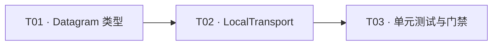

# F05-S01_逻辑 Datagram 与 Local Transport 步骤文档

所属版本：v1

所属版本文档：[UGDR_v1 版本文档](../UGDR_v1_版本文档.md)

所属功能文档：[F05_Loop Worker 与本地 Datagram 数据路径 功能文档](F05_Loop_Worker_与本地_Datagram_数据路径_功能文档.md)

步骤标识：F05-S01-逻辑 Datagram 与 Local Transport

## 一、目标与完成条件

定义仅供 F05 本地数据路径使用的 `RequestDatagram`、`ResponseDatagram` 和被动式 `LocalTransport`，交付两个容量独立的单线程有界 FIFO。两类消息按值无损往返，FIFO、空/满、容量恢复、方向独立和失败无副作用均由单元测试固定，即视为本步骤完成；本步骤不接入 Loop Worker、Mock GPU 或 WC。

## 二、实现设计

### 1. 已确认边界

- `LocalTransport` 只承载进程内的类型化对象；“封包/解包”指构造和取回逻辑 Datagram，不定义序列化、wire header、协议版本、MTU、分片、重传或可靠网络行为。
- Transport 是被动容器，不创建线程，不提供 `progress_once()`，也不把 Worker 入队、Mock GPU 处理或 Worker 出队封装成一个操作。
- 请求方向与响应方向各使用一个普通的 `std::deque` 有界 FIFO，容量分别配置、状态相互独立；本步骤不使用 SPSC、原子变量或互斥锁，也不承诺并发安全。
- S01 只固定后续步骤需要的逻辑字段、队列行为和结果分类。Worker、in-flight、GPU task/completion、WC 生成以及双线程 bench 分别留给后续步骤。

### 2. 文件与模块改动

| 文件 | 责任 |
|-|-|
| `src/worker/local_transport.hpp` | 定义 Datagram、结果枚举、源段结构和 `LocalTransport` 接口。 |
| `src/worker/local_transport.cpp` | 实现两个有界 FIFO 的非阻塞 push/pop。 |
| `tests/unit/local_transport_test.cpp` | 覆盖字段往返、FIFO、空/满、恢复、方向独立和失败无副作用。 |
| `CMakeLists.txt`、`tests/unit/CMakeLists.txt` | 将实现加入既有 Worker 模块，并登记单元测试；不新增生产模块或跨层依赖。 |

### 3. 类型与字段

#### ResolvedSourceSegment

| 字段 | 类型 | 语义 |
|-|-|-|
| `daemon_address` | `std::uint64_t` | 发送端 Worker 已通过本地 lkey 解析得到的 daemon 可访问地址。 |
| `length` | `std::uint32_t` | 该段有效字节数，与既有 SGE 长度类型对齐。 |

#### RequestDatagram

| 字段 | 类型 | 语义 |
|-|-|-|
| `request_id` | `std::uint64_t` | Transport 往返关联键，由发送端分配。 |
| `source_qp_num` / `target_qp_num` | `std::uint32_t` | 逻辑发送 QP 与目标 QP。 |
| `opcode` | `DatagramOpcode` | 仅允许 RDMA Write 与 RDMA Write With Immediate。 |
| `remote_address` | `std::uint64_t` | 接收端用于 rkey 与范围校验的目标地址。 |
| `rkey` | `std::uint32_t` | 接收端远程访问校验键。 |
| `immediate_data` | `std::uint32_t` | 仅 Write With Immediate 有效；普通 Write 不读取该值。 |
| `total_length` | `std::uint64_t` | 所有已解析源段长度之和，供后续目标范围校验和完成计数使用。 |
| `source_segments` | `std::vector<ResolvedSourceSegment>` | 按原 SGE 顺序保存已解析 daemon 地址与长度。 |

发送端 Worker 在构造请求前完成本地 lkey、地址和长度校验；本地校验失败时不得入队，也不产生 `ResponseDatagram`。`wr_id`、signaling/send flags、重试计数、in-flight 状态和最终 Send WC 状态留在发送端状态中，不进入 Datagram。

#### ResponseDatagram

| 字段 | 类型 | 语义 |
|-|-|-|
| `request_id` | `std::uint64_t` | 回显请求关联键。 |
| `result` | `DatagramResult` | `success`、`rnr`、`remote_invalid_request`、`remote_access_error`、`remote_operation_error` 或 `backend_error`。 |
| `rnr_delay` | `std::uint8_t` | 仅 `rnr` 有效，携带接收端 QP 的 `min_rnr_timer`；其他结果置零且不读取。 |

不增加独立 `retryable` 字段：`rnr` 本身表示后续发送路径可重试，其余错误均为终止结果。Transport 不生成、解释或映射这些结果；接收端生成结果和发送端映射 WC 由 S03/S04 与 S02 完成。

### 4. LocalTransport 接口与行为

| 接口 | 约定 |
|-|-|
| `LocalTransport(std::size_t request_capacity, std::size_t response_capacity)` | 分别固定两个方向的最大元素数。 |
| `bool try_push_request(const RequestDatagram& request)` | 请求队列未满时复制到队尾并返回 true；已满返回 false，队列不变。 |
| `bool try_pop_request(RequestDatagram& request)` | 非空时把队首写入输出、删除队首并返回 true；为空返回 false，输出保持不变。 |
| `bool try_push_response(const ResponseDatagram& response)` | 响应队列未满时复制到队尾并返回 true；已满返回 false，队列不变。 |
| `bool try_pop_response(ResponseDatagram& response)` | 非空时把队首写入输出、删除队首并返回 true；为空返回 false，输出保持不变。 |

```python
def try_push(queue, capacity, value):
    if len(queue) >= capacity:
        return False
    queue.push_back(value)
    return True

def try_pop(queue, output):
    if queue.empty():
        return False
    output = queue.front()
    queue.pop_front()
    return True
```

实现不在 Transport 内做字段合法性检查、目标查找、错误分类、重试或完成推进；它把两类 Datagram 当作不可解释的类型化值。成功 pop 后容量立即恢复，另一个方向的满/空状态不受影响。

### 5. 实现任务

| 任务 | 内容 | 完成判据 |
|-|-|-|
| T01 | 定义 `ResolvedSourceSegment`、`RequestDatagram`、`ResponseDatagram`、`DatagramOpcode` 与 `DatagramResult`。 | 字段、默认值和枚举范围与本节一致，类型可按值构造和比较测试。 |
| T02 | 实现 `LocalTransport` 的两个独立有界 FIFO 与四个 try 接口。 | 接口无阻塞、无后台推进，失败路径无副作用。 |
| T03 | 补齐单元测试和 CMake 登记，运行项目门禁。 | 本步骤测试、模块边界检查和完整配置测试集通过。 |



当前可并行前沿：T01。T02 依赖 T01 的类型和接口，T03 依赖 T02 的可执行行为。

## 三、验证与验收

| 验证项 | 方法 | 通过条件 |
|-|-|-|
| Request 字段往返 | 构造包含两个源段和 Write With Immediate 全字段的请求，push 后 pop 并逐字段比较。 | 所有字段、源段顺序和 immediate data 保持一致。 |
| Response 字段往返 | 分别往返 success、rnr 和各终止错误；RNR 使用非零 `rnr_delay`。 | `request_id`、结果和适用的延迟值保持一致。 |
| FIFO 与容量恢复 | 连续压入多个可区分元素，按序弹出；满队列弹出一个后再次压入。 | 弹出顺序等于压入顺序，释放一个槽位后恰可再接受一个元素。 |
| 空/满与失败无副作用 | 对空队列 pop、对满队列 push，并在失败前后比较输出哨兵和已有队列内容。 | 均返回 false；空 pop 不改输出，满 push 不改元素数量、顺序或内容。 |
| 方向独立 | 让一个方向达到满或空，同时在另一方向执行 push/pop。 | 两个方向的容量和状态互不影响。 |
| 范围门禁 | 构建并运行 `local_transport_test`；随后执行模块边界检查与完整 `ctest`。 | 全部通过；测试中没有线程、Worker、Mock GPU 或真实 GPU 依赖。 |

失败判定包括：任一字段丢失或重排、队列超过容量、失败操作改变状态、方向互相干扰、Transport 主动推进业务状态，或引入序列化/并发/GPU 依赖。实现证据记录在本步骤对应的代码变更、测试输出和后续进度记录中。
