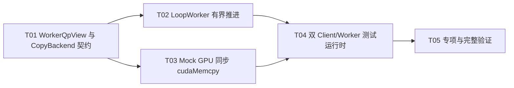

# F05-S02_Loop Worker API 串联与 Mock backend 闭环 步骤文档

所属版本：v1

所属版本文档：[UGDR_v1 版本文档](../UGDR_v1_版本文档.md)

所属功能文档：[F05_Loop Worker 与本地 Datagram 数据路径 功能文档](F05_Loop_Worker_与本地_Datagram_数据路径_功能文档.md)

步骤标识：F05-S02-Loop Worker API 串联与 Mock backend 闭环

## 一、目标与完成条件

实现两个不绑定线程、可显式推进的 QP-bound Loop Worker，通过 F05-S01 Local Transport 和可替换 CopyBackend，把公开 `post_send`、`post_recv`、真实 SQ/RQ、同步 GPU copy、Send/Receive CQ 与 `poll_cq` 串成可分段观察的本地闭环。

步骤完成必须同时满足：

- 两个逻辑 Client 创建并连接真实 QP；两个 Loop Worker 由同一个数据面 loop 线程顺序调用。
- RDMA Write 与 RDMA Write With Immediate 能完成正确的 SQ/RQ 消费、signaling 和 CQ 路由。
- backend 接受任务不等于完成；只有显式推进同步 device-to-device `cudaMemcpy` 成功并由 Worker 消费 completion 后，才允许出现成功 WC。
- Transport、backend 或 CQ 暂不可用时不丢失、不重复提交、不提前完成。
- 本步骤不引入线程管理、正式 daemon Worker 生命周期、网络协议、RNR 重试、QP/WQE 状态机或 benchmark。

## 二、实现设计

### 已确认边界

两个 Loop Worker 是两个逻辑处理对象，不是两个线程。S02 的测试运行时明确组合两个 Worker、一个双向 Local Transport 和一个接收端 Mock GPU backend；正式 `apps/daemon/main.cpp` 不增加 QP 枚举、QP pair 路由或 Worker 自动创建销毁。

`CopyBackend` 只固定语义接口，不固定 F06 CUDA kernel 的 task/completion queue 类型、元素布局或调度方式。Mock GPU backend 使用真实同步 CUDA copy；无 GPU 的逻辑测试不得用主机内存拷贝冒充数据路径。

### 文件与模块改动

| 位置 | 改动 | 职责与边界 |
|-|-|-|
| `src/control/qp.hpp/.cpp` | 增加内部 `WorkerQpView` 与按 `qp_num` 获取视图的接口 | 提供当前调用所需 SQ、RQ、CQ、session、PD、peer 和 signaling 元数据；对象仍归 Control 所有。 |
| `src/worker/worker.hpp/.cpp` | 替换 placeholder，定义 `CopyBackend`、backend 请求/完成对象和 `LoopWorker` | 实现有界扫描、地址解析、in-flight 关联、背压暂存和 WC 生成。 |
| `tests/support` | 增加 scripted backend、同步 cudaMemcpy Mock GPU backend 和双 Client/Worker 测试运行时 | scripted backend 只验证控制流且不搬数据；Mock GPU backend 在真实 CUDA 地址上执行拷贝。 |
| `tests/unit` | 增加 Loop Worker 确定性语义测试 | 覆盖有界推进、signaling、RQ/CQ 路由、暂停恢复、背压和普通 Write 失败闭环。 |
| `tests/integration` | 增加公开 API 闭环和 GPU copy 集成测试 | 通过真实 IPC、QP、SQ/RQ/CQ 和 CUDA IPC 地址验证完整链路；GPU 不可用时返回 77。 |
| `CMakeLists.txt`、测试 CMake | 注册新增源码、测试支持和 CTest | 不新增 benchmark；除非实现检查证明必要，不改变既有生产 target 依赖方向。 |

### 接口与数据

| 名称 | 输入或字段 | 输出 | 约束 |
|-|-|-|-|
| `WorkerQpView` | SQ、RQ、Send CQ、Receive CQ；session/PD identity；本地/对端 qp_num；sq_sig_all | 当前 QP 的非 owning 视图 | 只在一次 `progress_once` 调用内有效，不跨调用保存内部指针。 |
| `BackendRequest` | request_id、resolved source segments、target daemon address、total length | 一项完整 copy task | 整个 WR 的 SGE 列表作为整体提交；Immediate data 和 Receive WR 不进入 backend 契约。 |
| `BackendCompletion` | request_id、result | 成功或 backend_error | 只表示已提交任务的执行结果。 |
| `CopyBackend::try_submit` | BackendRequest | accepted 或 busy | accepted 不代表完成；busy 无副作用。 |
| `CopyBackend::try_pop_completion` | 输出引用 | 有 completion 或 none | none 无副作用。 |
| `LoopWorker::progress_once` | 构造时绑定 QpService、qp_num、LocalTransport、CopyBackend | 本轮是否发生进展 | 单次有界扫描；不启动线程、不阻塞等待。 |
| `MockGpuBackend::progress_once` | 本次期望 result | 本轮是否推进一个已接受任务 | success 时按 SGE 顺序同步调用 device-to-device cudaMemcpy，全部成功后才发布 completion；failure 时不拷贝。 |

### 单次推进流程

一次 Worker 调用按固定顺序扫描四个阶段；每阶段最多推进一个 WR 对应的逻辑请求，因此一次调用可以推进处于不同阶段的多个请求，但不会在任一阶段内部循环。

```python
def progress_once():
    progressed = False

    progressed |= try_backend_completion_to_response_and_receive_cq(limit=1)
    progressed |= try_response_to_send_cq(limit=1)
    progressed |= try_request_to_backend(limit=1)
    progressed |= try_send_wr_to_request(limit=1)

    return progressed
```

确定性成功路径为：发送端 Worker 推进 SQ 到 Request；接收端 Worker 提交 backend；Mock GPU 显式执行 cudaMemcpy 并产生 completion；接收端 Worker 产生必要的 Receive WC 和 Response；发送端 Worker 产生或抑制 Send WC。

### 操作语义

| 条件 | 动作 | 可观察结果 |
|-|-|-|
| 普通 RDMA Write | 解析源 lkey 与目标 rkey，提交完整 copy task；不查看或消费 RQ。 | 成功 response 后按 sq_sig_all 或 SEND_SIGNALED 决定是否产生 Send WC；接收端无 WC。 |
| Write With Immediate 且存在 Receive WR | 保存 Receive WR 的通知元数据并提交 copy task。 | GPU copy 成功后无条件产生 Receive WC；发送端仍按 signaling 规则产生或抑制 Send WC。 |
| Write With Immediate 且无 Receive WR | 接收端暂存该 Request，后续推进时重试。 | 不提交 backend、不发送 Response、不生成 WC；`post_recv` 后可恢复。S02 不产生 RNR。 |
| Mock GPU 普通 Write 失败 | 不执行 copy，产生 backend_error；接收端返回失败 Response。 | 发送端产生不受 signaling 抑制的 `UGDR_WC_GENERAL_ERR`；不迁移 QP、不 flush 其他 WR。 |

### 背压与所有权

| 边界 | 下游不可用时 | 成功转移时 |
|-|-|-|
| SQ → Transport | Send WR 留在 SQ 队首。 | Transport 接受 Request 后释放 SQ，并记录 requester in-flight 元数据。 |
| Transport → backend | Worker 最多暂存一个已取出的 Request。 | backend accepted 后只按 request_id 保存完成所需元数据，不重复提交。 |
| backend completion → Response/Receive CQ | Worker 最多暂存一个 completion，等待所需下游容量。 | 所需输出均可提交后再清除暂存。 |
| Response → Send CQ | Worker 最多暂存一个 Response。 | 成功产生或按 signaling 抑制 WC 后清除 requester in-flight。 |

pending 使用单项 optional；in-flight 使用 request_id 关联，并受 QP/Transport/backend 的既有有界容量约束。它们只表达异步串联的数据所有权，不定义 QP 或 WQE 状态机。

### 实现任务

| Txx | 任务 | 交付 | 依赖 |
|-|-|-|-|
| T01 | WorkerQpView 与 CopyBackend 契约 | Control 内部 QP 视图、backend 请求/完成对象及非阻塞接口。 | 无 |
| T02 | LoopWorker 有界推进 | 四阶段扫描、地址解析、操作差异、pending/in-flight 与 CQ 生成。 | T01 |
| T03 | Mock GPU 同步 cudaMemcpy | 显式接受、延迟、成功/失败与多 SGE device-to-device copy。 | T01 |
| T04 | 双 Client/Worker 测试运行时 | 真实 QpService/IPC、两个逻辑 Client、两个 QP-bound Worker、一个 Transport 和一个 backend 的单 loop 组合。 | T02、T03 |
| T05 | 专项与完整验证 | 单元测试、公开 API 集成测试、GPU 数据可见性测试和完整 CTest 结果。 | T04 |



## 三、验证与验收

| 验证动作 | 预期结果 | 失败判定 |
|-|-|-|
| scripted backend 单元测试：逐次调用两个 Worker 与 backend progress | 可停在 SQ、Transport、backend、Response、CQ 任一边界；submit 前后不提前出现成功 WC。 | 阶段不可区分，或出现丢失、重复提交、提前完成。 |
| 普通 Write：signaled、unsignaled、sq_sig_all | RQ 不被消费；成功 Send WC 严格服从 signaling；目标 CQ 正确。 | 错误消费 RQ、错误生成/抑制 WC 或 CQ 路由错误。 |
| Write With Immediate：预先 post_recv | 成功 GPU completion 后生成携带 wr_id、imm_data、byte_len 的 Receive WC；发送端按 signaling 完成。 | Receive WR/WC 缺失、提前消费或字段错误。 |
| Write With Immediate：先缺少 Receive WR，再 post_recv | 请求暂停且无 backend submit/Response/WC；post_recv 后恢复并只完成一次。 | 产生 RNR 状态机、丢请求、重复 copy 或提前完成。 |
| Transport、backend、CQ 容量恢复 | 上游所有权和单项 pending 按约定保留；容量释放后继续推进。 | 丢失、重复、覆盖 pending 或永久停滞。 |
| 普通 Write backend failure | 不执行 copy；发送端获得不受 signaling 抑制的 GENERAL_ERR；无 QP 状态迁移和 flush。 | 出现成功 WC、错误被抑制或扩张为 QP 错误状态机。 |
| GPU 集成测试：公开 API、多 SGE CUDA IPC memory | cudaMemcpy 推进前无成功 WC；成功 WC 可见时目标 GPU 数据与源 SGE 拼接内容一致。 | 使用主机 memcpy、数据不可见/错误、completion 时机错误；无 GPU 时未按返回码 77 跳过。 |
| 文档治理、module boundaries、format/lint/build 与完整 CTest | 全部通过，且未新增 benchmark 或非审阅范围依赖。 | 任一检查失败或实现超出 S02 边界。 |

建议验证顺序：先运行 Worker 专项单元测试，再运行双 Client 公开 API 集成测试，然后运行可跳过的 GPU copy 测试，最后执行仓库完整配置测试集。GPU 测试属于正确性测试，不创建性能阈值或 benchmark。
