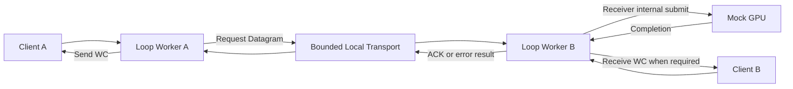
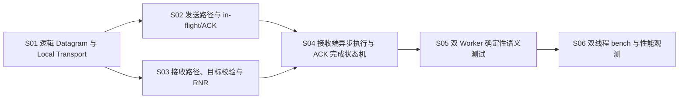

# F05_Loop Worker 与本地 Datagram 数据路径 功能文档

所属版本：UGDR_v1

所属版本文档：[UGDR_v1 版本文档](../UGDR_v1_版本文档.md)

## 一、功能目标

UGDR v1 的两个逻辑 Client 能通过各自的 Loop Worker，在单机本地 Datagram Transport 上完成 RDMA Write 与 RDMA Write With Immediate 的请求发送、接收端 Mock GPU 处理、完成响应和 WC 闭环。以真实 SQ/RQ 被正确消费、成功与失败完成时机符合已审阅 verbs 契约，且关键错误路径可重复验证作为实现判据。

## 二、背景与版本关系

本功能承接 F04 已实现的真实 SQ、RQ、CQ 队列语义，将此前只生成 Mock WC 的 Worker 替换为可驱动的 Loop Worker，并补齐本地 Datagram、接收端目标校验、Mock GPU 执行和完成响应。它是 F06 Persistent GPU Kernel 与真实 GPU Copy 的直接前置层：F05 固定控制流、状态变化和完成语义，F06 只替换接收端 Mock GPU backend，不重新定义 Client 可见的 verbs 行为。

## 三、功能范围

- 提供两个逻辑 Client 和两个 Loop Worker 实例；两个 Worker 使用同一功能模型，Worker 实例与操作系统线程不绑定。
- 提供有界、双向的本地 Datagram Transport，承载请求与完成响应的逻辑封包、入队、出队和解包，并体现队列满与背压。
- 发送端 Worker 消费真实 SQ 中的 Send WR，形成请求并维护 in-flight，收到接收端完成响应后按 signaling 契约生成 Send WC。
- 接收端 Worker 完成目标 QP、MR、rkey、范围和状态校验。RDMA Write With Immediate 必须检查并消费一个 Receive WR，缺少 Receive WR 时产生 RNR 或契约定义的等价错误；普通 RDMA Write 不消费 RQ。
- 接收端 Worker 将 GPU→GPU submit 作为内部处理行为交给 Mock GPU backend；只有成功 completion 被接收端 Worker 消费后，才生成必要的 Receive WC 并返回成功 ACK。
- 覆盖无效目标、RNR、Mock GPU 失败、队列满、延迟完成和必要顺序约束；失败不得报告成功 WC，也不得修改错误目标。
- 语义测试通过单线程显式推进两个 Worker、Transport 和 Mock GPU；性能 bench 可将两个 Worker 分别运行在线程中，观察吞吐、队列深度和背压。

## 四、非目标

- 不实现真实 NIC、跨主机网络传输或生产级网络协议。
- 不固定 wire format，不处理 MTU、分片、重组、重传、可靠性、拥塞控制或连接恢复。
- 不实现 persistent GPU kernel、真实 GPU copy，也不固定 GPU task/completion queue 的元素类型、内存布局或 kernel 调度方式；这些属于 F06。
- 不实现多 Worker 分片、负载均衡、生产级线程调度或跨 Worker 共享状态优化。
- 不扩展 v1 已支持的 verbs 操作集，不宣称完整 libibverbs 兼容。
- 性能数据只用于观测，不在 F05 设置带宽、延迟或消息大小矩阵的关闭阈值。

## 五、依赖与约束

- 直接依赖 F04 的真实 SQ/RQ posting、WR 消费、CQ 生产与 polling；对象所有权、QP 状态和连接关系沿用 F03，公开行为沿用 F02 已审阅契约。
- v1 仅覆盖 RC QP 下的 RDMA Write 与 RDMA Write With Immediate；普通 Write 与 Write With Immediate 的 RQ 消耗和远端 WC 差异必须保持。
- 公开与设计边界使用 QP、SQ、RQ、CQ、WR、WC；Datagram、GPU task 和 completion 只属于内部数据路径表示。
- 本地 Datagram 只固定逻辑字段和行为，不形成未来网络的二进制兼容承诺。
- Mock GPU backend 只提供可控的接收端执行与完成结果，不决定 F06 的实际队列类型或 kernel 协议。
- 两个 Worker 在测试中必须可被确定性显式推进；线程化运行属于 bench 驱动方式，不改变 Worker 语义。

## 六、功能设计与模块边界

功能由 Client 队列边界、Loop Worker、本地 Datagram Transport 和接收端执行 backend 四部分组成。两个 Client 分别持有已建连 QP 及其 SQ、RQ、CQ；同一个 Loop Worker 功能模型实例化两次。发送端 Worker 从 SQ 获取可执行 WR，构造逻辑 Request Datagram 并在 Transport 可接受时建立 in-flight；接收端 Worker 从 Transport 取得请求，解析并校验目标对象，必要时消费 RQ，再把 GPU→GPU submit 作为内部行为交给 Mock GPU backend。

Mock GPU completion 只是接收端内部执行完成事件，不直接暴露给 Client。接收端 Worker 消费成功 completion 后，先使远端结果和必要的 Receive WC 可观察，再通过反向 Transport 返回成功 ACK；发送端 Worker 消费 ACK 后，按 signaling 契约生成 Send WC。校验失败、RNR 或执行失败形成错误结果，任何失败路径都不得提前生成成功 WC 或修改无效目标。

Local Transport 对 Worker 只提供非阻塞的逻辑发送与接收能力，并以有界容量表达背压；它不承诺未来 NIC 的 queue 类型或 wire layout。Client 对外仍只观察 post WR、poll CQ 和既有错误语义，Datagram、ACK、Mock GPU submit/completion 均为内部边界。

**已确认：**采用两个逻辑 Client、两个 Loop Worker、一个有界双向 Local Transport 和一个接收端 Mock GPU；测试以单线程显式推进，bench 才按需运行两个线程；GPU→GPU submit 不暴露为 Client 或发送端语义。

**待确认：**F05 内部逻辑 Datagram 的最小字段集合；错误完成响应是否需要区分可重试与不可重试类别。步骤划分及各步骤验收边界已确认。

## 七、步骤划分

将功能拆分为可独立设计、实现和验收的步骤。此处只定义步骤目标、交付、依赖和验收边界，不展开具体实现。

| 步骤标识 | 步骤名称 | 目标与交付 | 依赖 | 验收边界 |
|-|-|-|-|-|
| F05-S01 | 逻辑 Datagram 与 Local Transport | 定义请求与完成响应的逻辑 Datagram 边界，交付有界、双向、非阻塞的本地 Transport，覆盖封包、入队、出队、解包、空队列和满队列行为。 | 无（F04 为功能级前置） | 两个逻辑端点可交换类型化请求和完成响应；容量与背压可观察；不固定网络 wire format、NIC queue 或二进制兼容布局。 |
| F05-S02 | 发送路径与 in-flight/ACK | 实现发送端 Worker 消费真实 SQ、构造请求、建立和推进 in-flight、消费完成响应，并按 signaling 与错误契约产生或抑制 Send WC。 | F05-S01 | 请求只提交一次；ACK 前不得产生成功 Send WC；Transport 满时不丢失或重复请求；成功、失败及 signaled/unsignaled 行为符合 F02 契约。 |
| F05-S03 | 接收路径、目标校验与 RNR | 实现接收端 Worker 接收并解析请求，校验目标 QP、MR、rkey、范围和状态，并形成可执行接收操作或错误结果；落实 Write 与 Write With Immediate 的 RQ 差异。 | F05-S01 | 无效目标不得进入执行 backend 或修改目标；Write With Immediate 正确消费一个 Receive WR，缺少时产生 RNR 或契约定义的等价错误；普通 Write 不消费 RQ。 |
| F05-S04 | 接收端异步执行与 ACK 完成状态机 | 建立接收端内部执行语义边界和 in-flight 状态，交付可显式推进的 Mock GPU；将 completion、必要的 Receive WC、ACK 或错误结果串成可重试推进且不重复完成的闭环。 | F05-S02、F05-S03 | submit 或任务接受时不得提前完成；只有 Mock completion 被 Worker 消费后才产生必要的 Receive WC 与成功 ACK；backend 满、ACK 通道满和执行失败均可恢复推进且不重复提交、消费 RQ 或生成 WC；不固定 F06 的 task/completion queue 布局。 |
| F05-S05 | 双 Worker 确定性语义测试 | 交付单线程显式推进 Harness，按确定顺序驱动两个 Worker、Local Transport 和 Mock GPU，覆盖端到端成功、背压、延迟完成与错误路径。 | F05-S04 | RDMA Write 与 Write With Immediate、RNR、无效目标、signaling、完成时机、队列满和失败传播均有可重复测试；测试不依赖调度时序或真实 GPU。 |
| F05-S06 | 双线程 bench 与性能观测 | 交付将两个 Worker 分别运行在线程中的 bench 驱动与观测，记录吞吐、延迟、队列深度和背压现象，不改变 Worker 语义。 | F05-S05 | bench 可稳定运行并输出约定观测项，结果与语义测试的完成计数一致；性能只记录不设关闭阈值，bench 不承担语义正确性判定。 |

## 八、验证与功能验收标准

- 两个逻辑 Client 与两个 Loop Worker 能通过有界双向 Local Transport 完成 RDMA Write 和 RDMA Write With Immediate 的请求、接收端处理、ACK 与 WC 闭环；真实 SQ/RQ 按操作语义消费，Send WC 和必要的 Receive WC 进入 QP 所关联的正确 CQ。
- 普通 RDMA Write 不消费远端 Receive WR 且不产生远端 Receive WC；RDMA Write With Immediate 正确消费一个 Receive WR 并携带正确 immediate data，缺少 Receive WR 时产生 RNR 或契约定义的等价错误。无效 rkey、越界长度、失效 MR、错误 QP 状态、Mock GPU 失败和必要错误路径不得报告成功 WC，也不得修改错误目标。
- 提交请求、接受 Mock GPU 操作或任务入队均不得提前产生成功 completion；只有接收端 Worker 消费成功 Mock completion 后才生成必要的 Receive WC 并返回成功 ACK，发送端消费 ACK 后才按 signaling 契约生成 Send WC。队列满、backend 满、ACK 通道满和延迟完成不得导致丢失、重复提交、重复消费 RQ 或重复 WC。单线程显式推进测试、双线程 bench、format/lint、build 和完整配置测试集通过；bench 输出吞吐、延迟、队列深度和背压观测，但不设置性能关闭阈值。

## 九、风险与待确认事项

| 类型 | 内容 | 影响 | 状态 |
|-|-|-|-|
| 风险 | 本地 Datagram 过早固定成网络 wire protocol，使 F05 被 MTU、分片、重传或 NIC queue 约束拖大。 | 会浪费 v1 时间并限制未来网络实验；F05 只固定逻辑字段、方向和完成语义，不承诺二进制兼容。 | 边界已确认，持续控制 |
| 风险 | Mock GPU 的接口或内部容器被误当成 F06 task/completion queue 契约。 | 可能迫使真实 kernel 适配测试替身；F05 只保留接收端异步提交与完成的语义边界，Mock 存储结构不进入功能契约。 | 边界已确认，持续控制 |
| 风险 | 双线程 bench 的驱动模型被误认为生产级 Worker 分片或线程调度方案。 | 可能造成不必要的共享状态和调度设计；bench 只观测当前两实例模型，不形成生产线程架构承诺。 | 边界已确认 |
| 待确认 | 逻辑 Request Datagram 与完成响应的最小字段集合。 | 影响 F05-S01 的内部契约与后续步骤输入，但不得扩展成 wire format。 | F05-S01 步骤设计前确认 |
| 待确认 | 错误完成响应是否需要在内部区分可重试与不可重试类别，以及如何映射 F02 已确认的错误语义。 | 影响发送端 in-flight 的终止条件和 RNR 等错误的表达；不在 F05 引入网络重传机制。 | F05-S01/S02 步骤设计前确认 |

## 十、变更记录

| 日期 | 变更内容 | 变更原因 | 影响范围 |
|-|-|-|-|
| 2026-07-22 | 创建 F05 功能草稿，落实版本文档中的 Loop Worker、本地 Datagram、目标校验、Mock GPU 与 WC 边界。 | 从 UGDR_v1 版本文档拆出 F05 功能设计。 | 功能目标、范围、非目标、依赖和模块边界。 |
| 2026-07-22 | 确认采用两个逻辑 Client、两个 Loop Worker、有界双向 Local Transport 和接收端 Mock GPU；确认六个步骤，并将 S04 明确为接收端异步执行与 ACK 完成状态机。 | 既要真实验证接收端 RQ、RNR、远端 WC 和 ACK 时机，又避免提前设计网络协议与 F06 GPU queue 布局。 | 功能设计、步骤划分、DAG、验收标准和风险。 |
