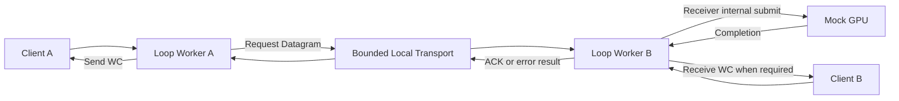
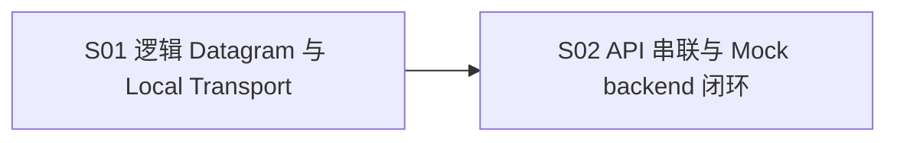

# F05_Loop Worker 与本地 Datagram 数据路径 功能文档

所属版本：UGDR_v1

所属版本文档：[UGDR_v1 版本文档](../UGDR_v1_版本文档.md)

## 一、功能目标

通过可显式推进的 Loop Worker，把 F04 已实现的 `post_send`、`post_recv`、SQ/RQ、CQ 和 `poll_cq` 与一个可替换的接收端 backend 串成完整本地闭环，为 F06 调试和接入 CUDA kernel 提供稳定基座。完成时，RDMA Write 与 RDMA Write With Immediate 能从公开 API 进入真实队列，经 Local Transport 和 Mock backend 返回 completion，并从正确 CQ 被 poll；整条链路可以确定推进和分段观察。

## 二、背景与版本关系

F04 已经交付真实 SQ/RQ/CQ、公开 posting 和 polling，但数据面仍由测试侧 Mock Worker 直接生成 completion。F05 将这段捷径替换为轻量的 Loop Worker、Local Transport 和可替换 backend，把公开 API 到 backend completion 的控制流串通；F06 只需接入并调试 CUDA kernel backend，不再重新搭建外围队列和完成闭环。

## 三、功能范围

- 提供两个逻辑 Client 和两个可显式推进的 Loop Worker 实例；两个实例使用同一轻量模型，不与操作系统线程绑定。
- 复用 F05-S01 的 Request/Response Datagram 和有界 Local Transport，串联请求、backend completion 与完成响应，并保留可观察的队列背压。
- 发送侧从真实 SQ 取得 Send WR，在 Transport 接受请求后消费 SQ，以轻量 `request_id` 关联多条未完成请求；收到响应后按 signaling 生成或抑制 Send WC。
- 接收侧只完成 backend 调用所需的目标地址解析和基本合法性检查；普通 Write 不消费 RQ，Write With Immediate 使用预提交的 Receive WR，并在成功 completion 后生成 Receive WC。
- 定义最小 backend 替换边界，Mock GPU backend 可控制接受、延迟、成功和失败；显式 `progress_once` 使用同步 device-to-device `cudaMemcpy` 执行实际 GPU copy，`cudaMemcpy` 成功返回后才产生 backend completion。
- 通过公开 `post_send`、`post_recv`、`poll_cq` 和单线程显式推进测试完整闭环，并能判断链路停在 SQ、Transport、backend、响应或 CQ 哪一阶段。

## 四、非目标

- 不实现真实 NIC、跨主机网络、wire format、MTU、分片、重组、可靠性或协议级重传。
- 不实现 RNR timer、retry budget、QP ERR/flush、WQE 状态机或完整 verbs 错误恢复。
- 不实现 MR busy、WR 引用计数、注销竞争或新的对象生命周期机制。
- 不实现 persistent GPU kernel、stream/event 异步完成或生产级 GPU 调度；S02 只用同步 device-to-device `cudaMemcpy` 建立真实 GPU copy 基线，也不固定 F06 的 task/completion queue 元素类型、内存布局或 kernel 调度方式。
- 不实现生产级线程调度、多 Worker 分片、负载均衡或跨 Worker 共享状态优化。
- 不以双线程 bench、带宽、延迟或消息大小矩阵作为 F05 交付或关闭条件。

## 五、依赖与约束

- 直接依赖 F04 的真实 SQ/RQ posting、WR 消费、CQ 生产与 polling；F05 不重新定义公开 API 或共享队列布局。
- 复用 F03 已有的 QP、CQ、MR 元数据和地址查询能力，只做 backend 调用所需的读取，不扩展对象生命周期。
- 保留 F02 已确认的成功 signaling 规则以及普通 Write 与 Write With Immediate 的 RQ/WC 差异；F05 不负责关闭完整运行期错误状态机。
- Datagram 只是本地模块交接对象，不是未来网络协议、wire format 或二进制兼容承诺。
- Mock GPU backend 只固定可替换的提交、显式推进和完成语义；其中同步 `cudaMemcpy` 仅作为 F05 的 GPU copy 基线，不决定 F06 CUDA kernel 的真实队列、内存布局或调度实现。
- 正确性测试必须能够在一个线程中显式推进；backend 接受、Transport 入队和成功 completion 是三个可区分阶段。

## 六、功能设计与模块边界

功能只包含 Client 队列边界、两个轻量 Loop Worker、Local Transport 和可替换 backend。发送侧 Worker 从 SQ 读取一条 Send WR，构造 Request；只有 Local Transport 接受后才释放 SQ，并保存完成关联所需的最小信息。Transport 满时 SQ 队首保持不动，后续显式推进重试。

接收侧 Worker 取出 Request，完成 backend 所需的地址解析，并按操作类型决定是否使用 Receive WR。请求交给 backend 后不产生成功 completion；Mock GPU 只有在显式 `progress_once` 中完成同步 device-to-device `cudaMemcpy` 后才产生成功 completion，接收侧随后生成必要的 Receive WC 和 Response，发送侧再按 signaling 生成或抑制 Send WC。

in-flight 只是 `request_id` 到 `wr_id`、目标 CQ 和 signaling 信息的有界关联，不定义 QP 或 WQE 状态机。Mock backend 与 Worker 均提供确定推进和阶段结果，使测试能够停在任一边界观察 SQ、Transport、backend、Response 与 CQ；F06 用 CUDA kernel backend 替换 Mock backend 时保留外围流程。

**已确认：**F05 是公开 API 到可替换 backend 的串联与调试基座；只保留 F05-S01 和 F05-S02 两个步骤。采用两个逻辑 Client、两个显式推进的 Loop Worker、一个有界双向 Local Transport 和一个接收端 Mock backend；不引入协议、QP/WQE 状态机或性能 bench。

**待确认：**无。backend 的具体接口、单次 progress 行为和最小测试矩阵在 F05-S02 步骤文档中确认。

## 七、步骤划分

F05 只拆为 Transport 基础和完整 API 串联两个步骤，避免把轻量数据路径继续拆成协议、接收状态机或独立性能阶段。

| 步骤标识 | 步骤名称 | 目标与交付 | 依赖 | 验收边界 |
|-|-|-|-|-|
| F05-S01 | 逻辑 Datagram 与 Local Transport | 定义请求与完成响应的逻辑对象，交付有界、双向、非阻塞的 Local Transport，固定 FIFO、空满、背压和失败无副作用。 | 无（F04 为功能级前置） | 两个逻辑端点可无损交换 Request 与 Response；容量和方向独立可验证；不形成 wire protocol 或并发 queue 契约。 |
| F05-S02 | Loop Worker API 串联与 Mock backend 闭环 | 实现两个显式推进的 Loop Worker 和可替换 Mock GPU backend，把 `post_send`、`post_recv`、真实 SQ/RQ、Local Transport、同步 `cudaMemcpy`、backend completion、Send/Receive CQ 与 `poll_cq` 串成完整闭环，并提供阶段级调试观察。 | F05-S01 | RDMA Write 与 Write With Immediate 的成功路径、signaling、RQ/CQ 路由、GPU 数据可见性和 completion 时机可重复验证；Transport 或 backend 暂不可用时不丢失、不重复、不提前成功；backend 可在 F06 被 CUDA kernel 实现替换，且未引入协议、QP/WQE 状态机或性能 bench。 |

## 八、验证与功能验收标准

- 两个逻辑 Client 通过公开 `post_send`、`post_recv` 和 `poll_cq`，与两个 Loop Worker、Local Transport 和 Mock backend 完成 RDMA Write 与 RDMA Write With Immediate 的本地闭环；真实 SQ/RQ 被按操作差异消费，Send WC 和必要的 Receive WC 进入正确 CQ。
- 请求入 Transport、backend 接受或 submit 均不产生成功 completion；只有 Worker 消费 Mock backend 成功 completion 后才返回成功 Response 并生成相应 WC。Transport 满、backend 暂不可用、延迟 completion 和 CQ 背压不得导致请求、Receive WR 或 WC 丢失、重复或提前完成。
- 测试可以单线程逐步推进并观察每个阶段，覆盖 signaling、普通 Write 与 Write With Immediate、基本失败和容量恢复；GPU 集成测试验证 `cudaMemcpy` 完成前无成功 WC、成功 WC 可见时目标 GPU 数据已可见；Mock GPU backend 能在 F06 被 CUDA kernel backend 替换。专项测试、format/lint、build 和完整配置测试集通过，不要求性能 bench 或完整错误状态机。

## 九、风险与待确认事项

| 类型 | 内容 | 影响 | 状态 |
|-|-|-|-|
| 风险 | 把本地串联误扩展为网络协议、RNR 重试、QP/WQE 状态机或完整错误恢复。 | 会掩盖 F05 为 CUDA kernel 调试打基础的核心目标；上述能力全部列为非目标。 | 边界已确认，持续控制 |
| 风险 | 把 Mock backend 的接口或内部容器固定成 F06 CUDA task/completion queue 契约。 | 可能限制 kernel 实验；F05 只固定可替换的提交、推进和完成语义。 | 边界已确认，持续控制 |
| 风险 | 闭环只能整体运行，无法判断停在 SQ、Transport、backend、Response 还是 CQ。 | 会降低后续 CUDA kernel 调试效率；S02 必须提供确定推进和阶段级可观察结果。 | 纳入 S02 验收 |
| 范围说明 | F05 不关闭 F02 定义的完整运行期错误和对象生命周期语义。 | F05 只声明已实现并验证的轻量串联子集，不以 Mock 闭环冒充完整 verbs 数据路径。 | 已确认 |

## 十、变更记录

| 日期 | 变更内容 | 变更原因 | 影响范围 |
|-|-|-|-|
| 2026-07-22 | 创建 F05 功能草稿，落实版本文档中的 Loop Worker、本地 Datagram、目标校验、Mock GPU 与 WC 边界。 | 从 UGDR_v1 版本文档拆出 F05 功能设计。 | 功能目标、范围、非目标、依赖和模块边界。 |
| 2026-07-22 | 确认采用两个逻辑 Client、两个 Loop Worker、有界双向 Local Transport 和接收端 Mock GPU；原设计拆为六个步骤。 | 初步分离发送、接收、异步完成、测试和性能观察。 | 功能设计、步骤划分、DAG、验收标准和风险。 |
| 2026-07-22 | 将 F05 大幅收缩为 API 串联与 CUDA kernel 调试基座，只保留 S01 Transport 基础和 S02 完整闭环；删除协议化重试、QP/WQE 状态机、MR 生命周期和性能 bench。 | F05 的本质是串联 `post_send`、`post_recv`、`poll_cq` 与可替换 backend，为 F06 CUDA kernel 调试夯实外围基础，不承担本地 RC 协议实现。 | 功能目标、范围、非目标、设计边界、步骤划分、DAG、验收和风险；原人工审阅结论失效。 |
| 2026-07-22 | 将 S02 Mock GPU backend 的执行基线改为显式推进的同步 device-to-device `cudaMemcpy`。 | 用户确认 F05 不做主机内存模拟，需要用真实 GPU copy 为后续 CUDA kernel 调试建立可比较基线。 | 功能范围、非目标、约束、模块边界、S02 验收和 GPU 集成测试；需重新完成功能审阅。 |
