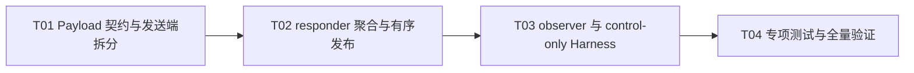

# F06-S01_Payload 拆分、完成聚合与 F05 全链路性能 Harness 步骤文档

所属版本：v1

所属版本文档：[UGDR_v1 版本文档](../UGDR_v1_版本文档.md)

所属功能文档：[F06_Persistent GPU Kernel 与真实 GPU Copy 功能文档](F06_Persistent_GPU_Kernel_与真实_GPU_Copy_功能文档.md)

步骤标识：F06-S01-Payload 拆分、完成聚合与 F05 全链路性能 Harness

## 一、目标与完成条件

本步骤为 F05 Loop Worker 数据路径增加默认 8 KiB、内部可配置的 payload 拆分和 parent WR 完成聚合，并建立不执行 GPU copy 的 control-only 全链路性能 Harness。

完成判定是：普通 Write 与 Write With Immediate 的 WR 级公开语义保持不变；多 SGE、尾部 payload、背压、乱序 task completion 和失败路径可确定验证；Harness 能持续供给 payload task，并输出 parent MWR/s、payload MTask/s、逻辑 payload GB/s 与 WR P50/P99，且不调用 CUDA Runtime、`cudaMemcpy` 或其他 GPU copy。

## 二、实现设计

### 已确认约束

本设计下沉自 F06 功能文档 revision 29。公开完成单位仍是 WR，每个 payload 是一个 backend task；payload 上限默认 8 KiB、可由内部 Harness 配置，但不进入公开 API。S01 只建立控制路径与任务供给基线，不执行真实 GPU copy，也不为性能设置关闭阈值。

| 位置 | 改动 | 职责 |
|-|-|-|
| `src/worker/local_transport.hpp` | 把 `RequestDatagram` 调整为单 payload 契约。 | 在 Local Transport 上传递 parent 标识、payload 序号、逻辑偏移和单段连续源区间。 |
| `src/worker/worker.hpp`、`src/worker/worker.cpp` | 增加可配置拆分游标、parent 聚合状态、顺序发布队列和可选 completion observer。 | 完成发送端拆分、接收端 task 提交、乱序完成聚合和 WR-level Response。 |
| `tests/support/loop_worker_fixture.hpp`、`tests/support/loop_worker_fixture.cpp` | 扩展 scripted/control-only backend。 | 不访问 payload 地址即可有界接收 task，并按测试脚本产生成功、失败和乱序 completion。 |
| `tests/unit/local_transport_test.cpp`、`tests/unit/loop_worker_test.cpp` | 增加 payload 契约、拆分、聚合、顺序、背压和错误测试。 | 确定验证 S01 行为。 |
| `tests/integration/loop_worker_cuda_test.cpp` | 适配 per-payload backend 契约。 | 保留既有 F05 GPU 正确性回归；它不是 S01 性能 Harness。 |
| `benchmarks/loop_worker_payload_benchmark.cpp`、`benchmarks/CMakeLists.txt` | 新增 `ugdr_loop_worker_payload_benchmark`。 | 复用 posting、SQ/RQ/CQ、两个 Loop Worker、Local Transport 和 parent Response 闭环测量 control-only 全链路。 |

### Payload 与聚合契约

| 对象或字段组 | 内容 | 约束 |
|-|-|-|
| `RequestDatagram` parent 身份 | `parent_request_id`、opcode、source/target QP、rkey、immediate data。 | 同一 parent 的所有 payload 完全一致。 |
| `RequestDatagram` payload 身份 | `payload_index`、`payload_count`、`payload_offset`、`payload_length`、`parent_total_length`。 | index 从 0 连续编号；offset 按 WR 逻辑字节流计算。 |
| `RequestDatagram` 地址 | 一个连续 `source_daemon_address` 和 parent remote base。 | payload 不跨 SGE；目标地址为 remote base 加 payload offset。 |
| `BackendRequest` | parent request ID、payload index/count、连续源地址、连续目标 daemon 地址和长度。 | 一次成功的 `try_submit` 只接受一个 payload task。 |
| `BackendCompletion` | parent request ID、payload index 和 result。 | 允许不同 payload 乱序返回；重复或未知 completion 不得产生重复 WR completion。 |
| requester inflight | WR ID、signaled 状态、parent 字节数和 payload 数。 | 一个 WR 只等待一个 WR-level Response。 |
| responder aggregate | parent 元数据、已提交数、terminal bitmap/count、各 payload result、Receive WR 元数据和发布状态。 | 只有所有 payload 到达终态后 parent 才进入可发布状态。 |
| completion observer | 可选的内部 observer，在 requester 永久消费 WR-level Response 后收到 WR ID、result、逻辑字节数和 payload 数。 | 默认空指针，不改变公开 API；Harness 用它统计所有 WR，而不是以 WC 数代替完成数。 |

### 行为规则

| 条件 | 动作 | 可观察结果 |
|-|-|-|
| 发送端取得新 Send WR | 先沿用 F05 规则完整校验 opcode、SGE、lkey 和总长度，再建立拆分游标。 | 本地校验失败仍只产生一个 WR 级错误 WC，不发送部分 payload。 |
| 拆分非空 WR | 按 `min(剩余 SGE 长度, payload 上限)` 切分；遇 SGE 边界立即结束当前 payload。 | 每个 task 只有一个连续源区间，所有 payload 长度之和等于 WR 总长度。 |
| request transport 满 | 保留当前 payload 和拆分游标，后续 `progress_once` 重试。 | 不释放 SQ、不跳过 payload、不穿插同一 QP 的下一 WR。 |
| 一个 parent 的全部 payload 已进入 transport | 释放该 Send WQE，并允许处理下一 WR；parent inflight 保留到 Response 被消费。 | 多个 parent 可以同时等待 backend，但发送顺序明确。 |
| responder 收到 parent 的首个 payload | 一次性校验完整目标 MR 范围；Write With Immediate 只 peek/消费一个 Receive WR，并建立 parent aggregate。 | 普通 Write 不消费 RQ；With Immediate 不按 payload 重复消费 RQ。 |
| `backend.try_submit` 返回 false | 保留当前 RequestDatagram，既不标记 terminal 也不继续消费后续 request。 | backend 背压不会丢失或重复 task。 |
| payload completion 到达 | 按 parent ID 和 payload index 更新 bitmap/result；重复 completion 作为内部错误处理，不增加 terminal count。 | 乱序 completion 不提前完成 parent。 |
| 任一 payload 失败 | 继续接收并等待该 parent 的其余已声明 task 到达终态；最终结果按最小失败 payload index 确定。 | 结果不依赖 completion 到达顺序；执行期可保留已发生的部分写入语义。 |
| parent 全部 payload terminal | 标记为 ready；只允许 QP parent 顺序队列的队首发布一个 Response。 | 同一 QP 的 WR-level Response、Send WC 和 With Immediate Receive WC 保序且各至多一次。 |
| response transport 或 CQ 满 | 保留 ready parent 并重试，成功提交后才删除 aggregate、调用 observer。 | 不会因下游背压重复 Response、WC 或 observer 事件。 |

零长度 WR 沿用 F05 的合法性判断；若合法，则不提交 backend task，并在 parent 级校验完成后直接进入有序 Response 流程。

**设计伪代码：发送端拆分**

```python
if active_parent is None:
    send = sq.peek()
    resolved_segments, total = validate_and_resolve_whole_wr(send)
    active_parent = make_parent(send, resolved_segments, total, payload_limit)
    requester_inflight.insert(active_parent.metadata)

payload = active_parent.current_payload()
if payload is not None:
    if not transport.try_push_request(payload):
        return no_progress
    active_parent.advance()

if active_parent.finished():
    sq.release()
    active_parent = None
return progressed
```

**设计伪代码：接收端完成聚合**

```python
while backend.try_pop_completion(completion):
    parent = aggregates.find(completion.parent_request_id)
    parent.mark_terminal_once(completion.payload_index, completion.result)

head = parent_order.front()
if head.all_payloads_terminal():
    if reserve_required_wc(head) and transport.try_push_response(head.result):
        publish_required_wc(head)
        erase_head_parent()

request = pending_request or transport.try_pop_request()
parent = find_or_create_and_validate_parent(request)
if not backend.try_submit(make_backend_task(parent, request)):
    retain_pending_request()
else:
    consume_request_once()
    clear_pending_request()
```

### Control-only 性能 Harness

Harness 使用 fake MR 元数据和不解引用地址的有界 control-only backend。数据路径从 `ugdr::api::post_send_chain` 进入真实 SQ，经过 requester Loop Worker、Local Transport、responder Loop Worker、per-payload backend completion、parent 聚合、WR-level Response 和 requester 消费；它不链接或调用 CUDA Runtime，不使用 `MockGpuBackend`，也不执行 `cudaMemcpy`。

| 类别 | 字段 | 口径 |
|-|-|-|
| 矩阵参数 | `wr_bytes`、`payload_bytes`、`sge_count`、`queue_depth`、`signaling_interval`、warmup、iterations、build type。 | 每行结果完整打印，默认 payload 为 8192 bytes。 |
| parent 吞吐 | `completed_parent_wr`、`parent_MWR_per_s`。 | 以 completion observer 事件计数，不能以 WC 数计数。 |
| task 吞吐 | `completed_payload_tasks`、`payload_MTask_per_s`。 | 以 control-only backend 的 payload terminal 数计数。 |
| 逻辑吞吐 | `logical_payload_GB_per_s`。 | 成功完成的逻辑 payload 字节数除以测量时间，不表示实际 GPU 带宽。 |
| 延迟 | `wr_p50_us`、`wr_p99_us`、sample count。 | 从 WR 成功 post 到对应 observer 事件，覆盖 signaled 与 unsignaled WR。 |

### 实现任务

| 任务 | 交付 | 依赖 |
|-|-|-|
| T01 Payload 契约与发送端拆分 | 单 payload Datagram/BackendRequest 契约、默认 8 KiB 可配置拆分游标、SQ 背压行为。 | 无 |
| T02 responder 聚合与有序发布 | per-parent aggregate、乱序 terminal 去重、确定错误结果、单次 Receive WR/WC 和顺序 Response。 | T01 |
| T03 observer 与 control-only Harness | 内部 completion observer、fake MR 持续负载源、control-only backend、指标输出和 CMake target。 | T02 |
| T04 专项测试与全量验证 | 拆分矩阵、背压、错误、乱序、顺序、signaling、指标口径和现有回归测试适配。 | T03 |



## 三、验证与验收

| 验证动作 | 预期结果 | 失败判定 |
|-|-|-|
| `cmake --build build --target ugdr_local_transport_test ugdr_loop_worker_test ugdr_loop_worker_payload_benchmark` | 受影响单元测试和新 benchmark target 编译成功。 | 任一 target 编译或链接失败。 |
| `ctest --test-dir build --output-on-failure -R 'ugdr_(local_transport\|loop_worker)'` | Local Transport、Loop Worker 及现有 GPU 正确性回归通过；无 GPU 环境继续遵守既有 skip 语义。 | 非预期失败、崩溃、超时或错误 skip。 |
| 运行 `./build/benchmarks/ugdr_loop_worker_payload_benchmark` 的默认矩阵。 | 每组输出完整参数、parent MWR/s、payload MTask/s、逻辑 payload GB/s、WR P50/P99 和计数；进程成功退出。 | 缺字段、计数不守恒、结果非有限值、死锁或非零退出。 |
| 检查 benchmark target 的源码和链接依赖。 | 不包含 CUDA Runtime、`cudaMemcpy`、真实 GPU buffer 访问或 `MockGpuBackend`。 | 发现任一 GPU copy 调用或 CUDA 运行时依赖。 |
| `ctest --test-dir build --output-on-failure` | 完整已配置测试集通过，允许环境契约规定的 GPU skip。 | 出现新增回归。 |
| `python3 tools/check_project_docs.py --root .` 与 `python3 tools/project_state.py validate --root .` | 文档治理和项目状态均返回成功。 | 任一检查失败。 |

专项测试至少覆盖：WR 长度小于、等于和大于 payload 上限；非整除尾部；多 SGE 且 payload 不跨 SGE；普通 Write 与 Write With Immediate；signaled、unsignaled 和 `sq_sig_all`；request/backend/response/CQ 背压；多个 parent 并发等待时的 QP 顺序；payload 乱序完成、重复/未知 completion、单个或多个 task 失败，以及每个 parent 只产生一次最终结果。

验收时同时核对守恒关系：成功 WR 的 payload 长度之和等于 parent 总长度；每个已接受 payload 恰有一个 terminal；每个 parent 恰有一个 observer 事件和一个 Response；Send WC 数只由 signaling 或错误语义决定，不能用于替代 completed parent WR 数。性能数据只作为后续 S02 的任务供给基线，不设置通过阈值。
