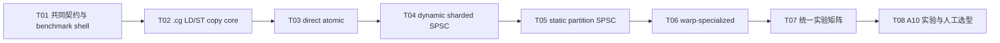

# F06-S02_Persistent Kernel 模型实验与选型 步骤文档

所属版本：v1

所属版本文档：[UGDR_v1 版本文档](../UGDR_v1_版本文档.md)

所属功能文档：[F06_Persistent GPU Kernel 与真实 GPU Copy 功能文档](F06_Persistent_GPU_Kernel_与真实_GPU_Copy_功能文档.md)

步骤标识：F06-S02-Persistent Kernel 模型实验与选型

## 一、目标与完成条件

在 NVIDIA A10（SM 8.6、CUDA Toolkit 12.3）上实现并比较四种基于 LD/ST128 的 persistent copy kernel：direct atomic、dynamic sharded SPSC、static partition SPSC 和单 CTA warp-specialized。所有候选共享相同逻辑 task/completion 契约与 copy core，但各自拥有与访问模式匹配的物理队列。

完成判定是：四种模型先通过确定性数据正确性、队列回绕/背压、启动/停止/排空和对齐退化验证，再用同一矩阵输出 MTask/s、实际 copy GB/s、任务 P50/P99、资源占用与 Host 开销；人工依据 A10 证据明确选择最终模型及参数。选择结果回写并重新审阅 F06 功能文档后，才允许进入 F06-S03。

## 二、实现设计

### 已确认约束与输入

本设计下沉自 F06 功能文档 revision 29，并复用已审阅、已实现的 F06-S01 payload 契约和 `ugdr_loop_worker_payload_benchmark` 供给基线。每个不超过 8 KiB 的 payload 是一个 kernel task；S02 只做候选 kernel、物理 meta queue 和独立 A10 实验，不把候选接入正式 `CopyBackend`，正式端到端替换留给 S03。

| 主题 | 已确认规则 | 边界 |
|-|-|-|
| 实现粒度 | T01 至 T08 严格串行；每个 T 完成局部验证后形成独立 commit，commit 不混入下一 T 的改动。 | 前一 T 未提交或未验证，不开始后一 T；禁止最后一次性合并实现。 |
| copy 指令 | 不使用 `cp.async`，也不建立 `cudaMemcpy` 性能基线；测量窗口只统计 persistent kernel copy。 | 初始化和结果读回可在测量窗口外使用 CUDA Driver API，不得计入候选性能。 |
| 缓存策略 | 16-byte 对齐主体使用 `.cg` 的 128-bit global load/store；不对齐头尾使用安全窄 `.cg` 访问。 | `.cg` 绕过 L1、保留 L2；不测试 L2 bypass 或 cache-policy 矩阵。 |
| 对齐安全 | 只有源地址、目标地址和当前区间同时满足 16-byte 条件时才走 128-bit 路径。 | 禁止地址向下取整后越界读取或写入；窄路径必须只触及 task 指定范围。 |
| 队列内存序 | Host 与 GPU meta queue 使用完成 SPSC/SPMC/MPSC 正确性所需的 system-scope 发布/获取；CTA 内部队列使用 block-scope slot sequence。 | 此处只保证 benchmark 自身的 meta queue；不声称解决 NIC DMA 写入与并发 kernel 的 payload 可见性。 |
| GPUDirect 输入 | 本机 A10 查询为 `GPU_DIRECT_RDMA_WRITES_ORDERING=NONE`、Host flush 支持、stream memops flush 不支持。 | S02 假设 payload 在 task 发布前已可见；真实 NIC 路径由 S03 在 NIC CQ batch 后执行 Host flush，再 release-publish 对应 task。 |

### 文件与模块改动

| 位置 | 改动 | 职责 |
|-|-|-|
| `src/gpu/persistent_copy.hpp`、`src/gpu/persistent_copy.cu` | 新增逻辑描述符、mapped Host memory 封装、共同 LD/ST copy core、四种候选 kernel 和启动/停止接口。 | 生产目录承载可复用实验实现，但不在 S02 接入正式 Worker backend。 |
| `benchmarks/persistent_copy_benchmark.cpp`、`benchmarks/CMakeLists.txt` | 新增 `ugdr_persistent_copy_benchmark`，复用 S01 的持续任务供给与指标口径。 | 以模板/静态分派选择模型，测量热路径不引入虚函数分派。 |
| `tests/integration/persistent_copy_test.cpp`、测试 CMake | 新增 A10 可执行的 correctness、queue、lifecycle 和 alignment 集成测试。 | GPU 不可用时沿用项目 exit 77 skip；A10 验收环境不得 skip。 |
| `docs/progress/F06-S02.md` | T08 记录环境、命令、模型配置、原始摘要、flush 属性与人工选择。 | 只保存执行证据；设计规则仍以本步骤文档为准。 |

### 共同逻辑契约

T01 只建立候选之间可比较的逻辑语义和 benchmark shell，不建立“通用物理队列”，更不提前实现四套队列。物理 ring 数量、slot 元数据、原子操作和 Host 访问模式由对应模型任务自行实现。

| 对象 | 最小字段 | 约束 |
|-|-|-|
| `CopyTask` | task ID、parent request ID、payload index、source address、target address、length。 | 不包含 ring ID、lane ID、warp ID 或模型专属 sequence。 |
| `CopyCompletion` | task ID、parent request ID、payload index、result。 | 只表达一个 payload task 的终态；parent WR 聚合沿用 S01，不放进 kernel。 |
| 总 outstanding capacity | 每个实验 case 固定同一总 slot 数。 | dynamic 模型按 lane 分摊总容量，不能给每个 lane 一份完整容量后宣称公平。 |
| 测量输入 | 同一 source/destination 数据、payload 序列、warmup、iterations 和 batch。 | 每行结果打印真实模型参数、ring 数、Host meta bytes、原子次数和 shared-memory 用量。 |

### 四种物理队列与访问模型

| 模型 | task/completion 物理结构 | Host 边界 | GPU 协作与预期代价 |
|-|-|-|-|
| `direct_atomic` | 一个 Host-visible task ring 和一个 completion ring；copy warps 以 system-scope atomic claim/reserve。 | task 为 Host→warps 的 SPMC，completion 为 warps→Host 的 MPSC。 | 无专用 ingress/egress warp；直接比较 PCIe 原子和争用成本。 |
| `dynamic_sharded_spsc` | 每个 copy warp 独立一对 Host-visible task/completion SPSC lane。 | Host 知道 lane/warp 数并选择或负载均衡 lane。 | 避免跨 warp 原子争用，但增加 ring 数、Host 状态和调度复杂度。 |
| `static_partition_spsc` | Host 只见一个逻辑 task ring 和一个逻辑 completion ring；warp 固定负责 `idx % num_copy_warps` 的 slot。 | Host 不知道 warp 数，按全局 head 顺序回收；不支持跨 warp 乱序回收。 | GPU 内静态分区，无动态 claim；慢 slot 会造成有意保留的 head-of-line blocking。 |
| `warp_specialized` | 外部一对 SPSC ring；CTA 内另有 shared-memory task SPMC queue 与 completion MPSC queue。 | Host 只对接 ingress/egress warp，不感知 copy warp 数。 | 单 CTA：1 个 ingress warp、N 个纯 copy warp、1 个 egress warp；每 slot sequence 同步，不做每 task 全 CTA `__syncthreads()`。 |

**设计伪代码：static partition SPSC**

```python
owned = warp_id
while not stop:
    published_tail = system_acquire(task_tail)
    if owned < published_tail and task_slot[owned].sequence == owned + 1:
        copy_cg(task_slot[owned])
        system_release(completion_slot[owned].sequence, owned + 1)
        owned += num_copy_warps

# Host 只检查全局 completion_head：
while completion_slot[completion_head].sequence == completion_head + 1:
    reclaim_in_order(completion_head)
    completion_head += 1
```

**设计伪代码：warp-specialized 单 CTA**

```python
ingress_warp:
    acquire external SPSC tasks in order
    publish tasks into shared-memory slots using block-scope sequence

copy_warps:
    claim ready shared-memory slots
    run common .cg LD/ST copy core
    publish terminal records into internal completion slots

egress_warp:
    consume internal terminals
    preserve required external completion order
    release-publish one external SPSC completion per task

all warps:
    on stop, stop accepting new tasks, drain accepted work, publish terminals, then exit
```

### 共同 copy core

**设计伪代码：安全 LD/ST128 退化**

```python
remaining = task.length
src = task.source
dst = task.target

while remaining != 0 and ((src | dst) & 0xF) != 0:
    width = largest_safe_cg_width(src, dst, remaining)  # 1/2/4/8 bytes
    cg_load_store(src, dst, width)
    src += width
    dst += width
    remaining -= width

while remaining >= 16:
    cg_load_store_128(src, dst)
    src += 16
    dst += 16
    remaining -= 16

while remaining != 0:
    width = largest_safe_cg_width(src, dst, remaining)
    cg_load_store(src, dst, width)
    src += width
    dst += width
    remaining -= width
```

若源地址与目标地址的低四位不同，则二者无法通过等量前进同时达到 16-byte 对齐，该 task 全程使用安全窄路径。该行为属于正确性退化，不得通过向下取整扩大访问范围。

### 实验矩阵与判定

| 维度 | 最低覆盖 | 记录方式 |
|-|-|-|
| 模型 | 四种候选全部运行；每种使用独立物理队列实现。 | model、ring count、Host warp awareness、copy warp 数、CTA 数。 |
| payload | 默认 8 KiB、至少一个更小 payload、非 16-byte 尾部和跨 8 KiB parent WR。 | payload bytes、parent WR bytes、task count。 |
| 对齐 | correctness 穷举 source/destination offset 0 至 15，并覆盖长度 1、15、16、17、8191、8192。 | offset pair、length、128-bit 与窄访问字节计数。 |
| 批量与容量 | Host batch 32、64；至少覆盖 ring 回绕、空、满和持续高水位。 | batch、总 outstanding capacity、各 lane capacity。 |
| 生命周期 | start、steady state、stop accepting、drain、kernel exit，可重复启动。 | accepted、completed、drained、重复/丢失计数。 |
| 性能 | 确定性正确后才统计 MTask/s、实际 copy GB/s、task P50/P99、Host CPU、寄存器、shared memory、occupancy。 | 不设置关闭阈值；保留同机同配置横向对照。 |

### GPUDirect RDMA 可见性边界

本机查询结果表明 A10 不为正在运行的 kernel 原生排序 GPUDirect RDMA writes。无 pending RDMA writes 时，`cuFlushGPUDirectRDMAWrites(CU_FLUSH_GPU_DIRECT_RDMA_WRITES_TARGET_CURRENT_CTX, CU_FLUSH_GPU_DIRECT_RDMA_WRITES_TO_OWNER)` 的两次观测约为平均 657 ns、P50 610–611 ns、P99 约 621 ns；按 batch 32/64 仅可视为约 20.5/10.3 ns 每 task 的 API 下限，不能替代真实 NIC 压测。

S02 不接 NIC，也不在候选 kernel 内实现 flush。S03 的真实路径必须遵守：消费一批 NIC CQ completion，执行一次覆盖该批 payload 的 Host flush，flush 成功后再以 release 语义发布对应 task；同时使用 batch 上限与时间阈值，避免低流量无限等待。

### 实现任务与独立 commit 门禁

| 任务 | 交付 | 独立 commit 与进入下一 T 的门禁 | 依赖 |
|-|-|-|-|
| T01 共同契约与 benchmark shell | 逻辑 descriptor、mapped pinned Host memory、payload buffer/correctness oracle、模型配置、结果 schema、start/stop shell；不实现任何模型物理队列。 | 只提交 T01；common smoke 与资源清理验证通过。 | 无 |
| T02 `.cg` LD/ST copy core | 安全 128-bit 主体、窄头尾退化、对齐/长度专项测试和访问字节计数。 | 只提交 T02；0–15 offset 与边界长度 correctness 通过。 | T01 |
| T03 direct atomic | 单 task/completion ring、system-scope SPMC/MPSC claim/publish、生命周期与局部性能输出。 | 只提交 T03；该模型专项 queue/copy 测试通过并记录一次 A10 smoke。 | T02 |
| T04 dynamic sharded SPSC | N 对 SPSC lane、Host lane 选择、总容量公平分摊和模型专项输出。 | 只提交 T04；不得顺带修改 T03 架构，专项验证通过。 | T03 |
| T05 static partition SPSC | 单逻辑 ring、`idx % num_copy_warps` 静态所有权、Host 无感和全局顺序回收。 | 只提交 T05；明确验证 head-of-line blocking 且无乱序回收。 | T04 |
| T06 warp-specialized | 单 CTA ingress/copy/egress 分工、shared-memory slot sequence、外部一对 SPSC。 | 只提交 T06；无 per-task 全 CTA barrier，drain/stop 无死锁。 | T05 |
| T07 统一 correctness/performance matrix | 同一输入、总容量、batch、warmup、iterations 与指标，静态分派运行四模型并检查公平性字段。 | 只提交 T07；四模型 deterministic correctness 全过后才保留性能结果。 | T06 |
| T08 A10 实验与人工选型交付 | 完成可复现 A10 运行，写入 `docs/progress/F06-S02.md`，整理性能、资源和复杂度对照，等待人工选择。 | 人工明确选择模型及关键参数后提交 T08 证据 commit；随后回写并重新审阅 F06 功能文档。 | T07 |



## 三、验证与验收

| 验证动作 | 预期结果 | 失败判定 |
|-|-|-|
| 每个 T 的目标构建与专项测试；检查 `git diff` 后提交独立 commit。 | commit 只包含当前 T 的交付和必要测试；工作树不夹带下一 T。 | 跨 T 混改、未验证即提交，或把多个模型压成一个大 commit。 |
| 构建 `ugdr_persistent_copy_benchmark` 与 persistent copy 集成测试。 | CUDA SM 8.6 目标编译、链接成功；模型由静态配置选择。 | 编译/链接失败，或测量热路径通过虚函数间接分派。 |
| 运行 copy core offset/length matrix，并在目标区前后布置 canary。 | 所有结果与 oracle 一致，task 范围外字节不变；不对齐时安全退化。 | 数据错误、越界、向下取整访问或错误使用 128-bit 路径。 |
| 分别运行 direct atomic、dynamic sharded、static partition、warp-specialized 专项队列测试。 | 回绕、空/满、背压、持续高水位、stop/drain 均无丢失、重复、提前 completion 或死锁。 | 计数不守恒、sequence 错误、重复/丢失、无法 drain 或 kernel 无法退出。 |
| 验证 static partition：人为延迟全局 head 所属 warp。 | 后续 slot 可在 GPU 完成，但 Host 必须等待 head 后按全局顺序回收；Host 配置不包含 warp 数。 | Host 需要 lane/warp 信息，或发生跨 warp 乱序回收。 |
| 验证 warp-specialized：压力运行 ingress/copy/egress 和 stop/drain。 | 外部始终为一对 SPSC；CTA 内 slot sequence 正确，无每 task 全 CTA barrier。 | 外部暴露 SPMC/MPSC、发生 barrier 死锁或 completion 顺序不满足契约。 |
| 在 A10 上按同一矩阵运行四模型，Host batch 使用 32 与 64。 | 每行输出完整配置、MTask/s、copy GB/s、P50/P99、Host CPU、寄存器、shared memory、occupancy；计数守恒。 | 缺少公平性字段、测量包含初始化/结果读回，或在 correctness 失败时仍报告性能结论。 |
| 源码审查：搜索 `cp.async`、`cudaMemcpy` benchmark 路径和 cache-policy 分支。 | 候选实现不含 `cp.async`，不提供 `cudaMemcpy` 对照，不引入 L2 bypass/cache-policy 矩阵。 | 出现任一被排除方案或将 setup copy 计入测量窗口。 |
| `ctest --test-dir build --output-on-failure`，以及项目状态和文档治理检查。 | 完整已配置测试集通过；`project_state.py validate` 与 `check_project_docs.py` 成功。 | 新增回归、错误 skip 或治理检查失败。 |
| 审阅 `docs/progress/F06-S02.md` 并由人工选择。 | 证据包含环境、命令、完整矩阵摘要、flush 查询、复杂度比较和明确最终选择；F06 功能文档完成回写与重新审阅。 | 仅凭峰值带宽选择、证据不可复现、选择未获人工确认或未回写功能文档。 |

验收不设性能关闭阈值。候选排序必须先满足确定性正确性，再综合 payload MTask/s、实际 copy GB/s、P50/P99、Host CPU、GPU 资源占用、Host 是否感知 warp 数、单 CTA 限制、head-of-line blocking 和实现维护复杂度。

## 四、待确认事项

| 待确认项 | 所需证据 | 决定时点 |
|-|-|-|
| 最终 kernel 模型与 Host queue 组织。 | 四模型同矩阵 correctness、性能、资源和复杂度对照。 | T08 人工选择。 |
| 最终 copy warp 数、warp-specialized shared stage 数。 | A10 参数扫描与 occupancy/延迟/吞吐结果。 | T08 人工选择。 |
| 是否需要多 CTA 后续扩展。 | 单 CTA 模型与非 specialized 模型的带宽差距及资源限制。 | T08 先决定 S03 是否需要；不是 S02 默认实现范围。 |
