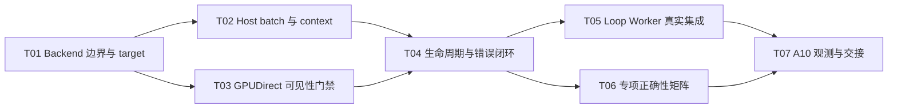

# F06-S03_真实 CUDA Backend 集成与端到端验收 步骤文档

所属版本：v1

所属版本文档：[UGDR_v1 版本文档](../UGDR_v1_版本文档.md)

所属功能文档：[F06_Persistent GPU Kernel 与真实 GPU Copy 功能文档](F06_Persistent_GPU_Kernel_与真实_GPU_Copy_功能文档.md)

步骤标识：F06-S03-真实 CUDA Backend 集成与端到端验收

## 一、目标与完成条件

将 F06-S02 人工选定的 `warp_specialized_pipeline` kernel 封装为生产级 CUDA CopyBackend，接入 F05 Loop Worker 的 payload task/completion 闭环，并通过公开 API 验证真实 GPU copy。完成时，所选 kernel 配置、Host 批处理、GPUDirect RDMA Host flush 顺序、WR 级完成语义、背压、错误和生命周期均有确定性测试与 A10 端到端观测；性能数据仅作记录，不设关闭阈值。

## 二、实现设计

F06 功能文档 revision 45 已完成审阅，F06-S02 已完成人工选型。本步骤的代码级布局随 revision 14 完成审阅，作为实现依据。

| 约束 | 本步骤固定行为 |
|-|-|
| Kernel | 只集成 `warp_specialized_pipeline`：单 CTA，1 ingress warp、30 copy warps、1 egress warp，device batch 16，per-copy-warp shared queue depth 16，38,400 B static shared memory。 |
| Host queue | 一个 task SPSC 与一个 completion SPSC；容量为 2 的幂；Host 不感知 copy warp 数量。目标 batch 为 64，同时设置有限的时间触发，尾批次不得无限等待。 |
| Copy task | `CopyTask` 保持 task_id、target_address、length、relative_offset；source 由 backend 绑定的已知 stage buffer base 与 relative_offset 得出。默认 payload 上限 8 KiB，多 SGE 在 SGE 边界继续拆分。 |
| Copy access | 源与目标同时满足 16 B 自然对齐且长度足够时使用绕过 L1 的 LD/ST128；头尾或不同对齐偏移安全降级为窄访问，禁止向下取整地址。 |
| 完成语义 | backend 接受和 payload completion 都不是 WR completion。Loop Worker 只有在 parent WR 全部 payload 到达终态后才发布一个 WR-level Response；signaling、Write 与 Write With Immediate 语义保持 F02/F05 契约。 |
| 可见性 | A10 ordering 为 NONE、Host flush 可用、stream-memops flush 不可用。每批相关源数据 ready 后、task release-publication 前，在当前 CUDA context 上完成 `cuFlushGPUDirectRDMAWrites(CURRENT_CTX, TO_OWNER)`；失败时禁止发布该批 task。 |
| 版本边界 | F06 建立正式 backend 并在公开 API 集成测试服务中替换 Mock；常规 `ugdr_daemon` 的全数据面组合及无关键路径 Mock 的版本验收属于 F07。 |

### 文件与模块改动

| 位置 | 改动 | 职责 |
|-|-|-|
| `src/worker/copy_backend.hpp` | 从 `worker.hpp` 提取 BackendRequest、BackendCompletion 与 CopyBackend 接口；`worker.hpp` 继续包含该头文件。 | 为真实 CUDA adapter 提供最小、稳定的 worker 边界，不改变现有调用语义。 |
| `src/gpu/persistent_copy_backend.hpp/.cu` | 新增 `PersistentCudaCopyBackend`、配置、task context ring、Host batch 与生命周期。 | 把 BackendRequest 转为 CopyTask，驱动选定 queue/kernel，并把 CopyCompletion 映射回 BackendCompletion。 |
| `src/gpu/gpudirect_visibility.hpp/.cu` | 封装设备 ordering/flush capability 查询和 Host flush；保留可注入的测试边界。 | 保证 flush 完成严格先于 task release-publication，并将 capability 或调用失败转换为 backend error。 |
| `src/gpu/persistent_copy.hpp/.cu` | 复用并按需收窄 `WarpSpecializedQueue::allocate_pipeline/start_pipeline/try_submit_batch/try_poll` 的生产入口。 | 不复制 kernel；生产 backend 固定调用已选模板实例。 |
| `CMakeLists.txt`、module boundary 文件 | 新增 `ugdr_cuda_backend` 组合 target，依赖 `ugdr_gpu` 与 `ugdr_worker`；同步机器规则和生成文档。 | 避免让 Client 使用的基础 `ugdr_gpu` 反向携带整个 Worker 数据面。 |
| `tests/unit`、`tests/integration` | 增加 batch/sidecar/flush 顺序专项测试；把 `loop_worker_cuda_test` 的 MockGpuBackend 替换为真实 backend。 | 覆盖 Host 状态机、A10 kernel、公开 API 与 WR/WC 语义。 |
| `benchmarks`、`docs/progress/F06-S03.md` | 增加真实 backend 端到端观测入口并记录环境、参数、结果和限制。 | 输出 parent MWR/s、payload MTask/s、逻辑 GB/s、WR P50/P99；不设性能门槛。 |

### 接口与状态

| 名称 | 输入或字段 | 约束与结果 |
|-|-|-|
| `PersistentCudaCopyBackendConfig` | device ordinal、stage buffer base/bytes、queue capacity、host batch=64、有限 max batch delay。 | queue capacity 必须为 2 的幂；stage buffer 范围非空；max batch delay 必须大于零；kernel 参数固定为 30/16/16。 |
| `PersistentCudaCopyBackend::start` | validated config 与 visibility gate。 | 选择设备/context，检查 ordering 与 Host flush 能力，分配并启动 pipeline queue；失败时保持 stopped。 |
| `try_submit` | 一个 BackendRequest。 | 只有总 outstanding 容量不足或 backend 不接受新任务时返回 false。已接受但本地校验失败的请求进入确定的 backend_error completion，不得永久阻塞。 |
| `try_pop_completion` | BackendCompletion 输出。 | 先触发到期尾批次，再轮询 device completion；按 task_id 精确查找 context slot，成功或错误均只释放一次。 |
| `request_stop / wait` | 无新任务、尾批次、device inflight 和 completion context。 | accepting → draining → stopped；draining 必须发布尾批次、回收全部已接受任务，再停止 kernel。重复或非法状态返回确定错误。 |
| `TaskContextSlot` | task_id、parent_request_id、payload_index、slot state。 | 以 `task_id & capacity_mask` 定位并校验完整 task_id；容量约束防止未回收 slot 被覆盖。 |

### Host 提交与 flush 门禁

以下为设计伪代码：

```python
def try_submit(request):
    if state != ACCEPTING or outstanding == capacity:
        return False
    if request is outside bound stage buffer or invalid:
        accept_context_and_enqueue_backend_error(request)
        return True
    task_id = reserve_context(request)
    pending.append(make_copy_task(task_id, request))
    if len(pending) == 64:
        publish_pending()
    return True

def progress_host_batch(now):
    if pending and now - first_pending_time >= max_batch_delay:
        publish_pending()

def publish_pending():
    # source-ready boundary is already consumed before backend submission
    status = visibility_gate.flush_current_context_to_owner()
    if status != SUCCESS:
        complete_every_pending_task_as_backend_error()
        return
    # try_submit_batch performs the queue's release-publication
    submit_as_many_tasks_as_queue_accepts()
    keep_unpublished_tail_pending_without_reordering()
```

### Completion 与 WR 聚合边界

以下为设计伪代码：

```python
def try_pop_completion(out):
    progress_host_batch(clock.now())
    if local_error_completions:
        return pop_local_error(out)
    copy_completion = queue.try_poll()
    if not copy_completion:
        return False
    context = lookup_and_validate(copy_completion.task_id)
    out.parent_request_id = context.parent_request_id
    out.payload_index = context.payload_index
    out.result = SUCCESS if copy_completion.result == SUCCESS else BACKEND_ERROR
    release_context_once(context)
    return True

# Existing Loop Worker remains the WR completion authority:
# all payload terminal -> one parent Response -> signaled/error Send WC;
# Write With Immediate success -> one Receive WC; ordinary Write -> no Receive WC.
```

### 错误与可观察行为

| 条件 | 动作 | 可观察结果 |
|-|-|-|
| Host pending 或 device queue 达容量 | 停止接受更多 request，保留既有 pending/inflight。 | Loop Worker 重试；不丢失、不重复、不越过当前 payload。 |
| stage buffer 范围、长度或 task context 非法 | 不访问 GPU；为已接受 payload 生成 backend_error。 | parent WR 最终错误；错误 WC 不受 signaling 抑制。 |
| Host flush capability 不满足或调用失败 | 不 release-publish 对应 task；该批生成 backend_error。 | GPU 不消费未经可见性门禁的数据；错误可由测试 gate 确定重现。 |
| kernel/queue start 或运行失败 | start 失败或进入 draining；不再接受新任务。 | 已接受任务全部到达终态后才能 stop；不得伪造成功。 |
| 任一 payload copy 失败 | 映射为 BackendCompletion::backend_error。 | parent WR 只完成一次且失败；已经发生的目标写入不回滚。 |

### 实现任务

每个 Txx 单独提交 commit，完成验证后再进入后继任务。

| Txx | 任务 | 交付 | 依赖 |
|-|-|-|-|
| T01 | 生产 Backend 边界与 target | 提取最小 CopyBackend 头文件；建立 `ugdr_cuda_backend`、配置校验和同步后的 module boundary。 | 无 |
| T02 | Host batch 与 task context | BackendRequest→CopyTask、64 目标 batch、有限时间触发、power-of-two context ring、completion 映射。 | T01 |
| T03 | GPUDirect 可见性门禁 | capability 查询、Host flush 实现、可注入 recorder 与 flush-before-publish 测试。 | T01 |
| T04 | 生命周期与错误闭环 | start、accepting、draining、stop；队列满、invalid、flush/kernel 错误均确定终结。 | T02、T03 |
| T05 | Loop Worker 真实 Backend 集成 | 公开 API 集成测试服务替换 MockGpuBackend，保持 parent WR 聚合与 verbs-like completion 语义。 | T04 |
| T06 | 专项正确性矩阵 | Write、Write With Immediate、多 SGE、对齐退化、signaling、背压、尾批、错误、生命周期和数据可见性测试。 | T04 |
| T07 | A10 端到端观测与交接 | 真实 backend benchmark、全套验证、`docs/progress/F06-S03.md` 与验收交接。 | T05、T06 |



## 三、验证与验收

| 验证动作 | 预期结果 | 失败判定 |
|-|-|-|
| Backend 配置与 Host 状态机单元测试 | 只接受合法 stage range、2 的幂容量和有限 batch delay；count=64 与时间到期均触发，尾批可 drain。 | 无界等待、覆盖 context slot、重复/漏 completion，或 backpressure 后丢任务。 |
| Flush 顺序 recorder 测试 | 每个已发布 batch 都满足 source-ready → Host flush 完成 → release-publish；flush 失败时没有 task publication。 | 顺序反转、失败后仍发布、同批未确定终结。 |
| `ugdr_persistent_copy_backend` GPU 集成测试 | A10 上以 30/16/16 启动单 CTA；对齐走 LD/ST128，非对齐/头尾安全退化；copy 数据和 guard 正确。 | 参数漂移、越界访问、数据或 guard 错误、kernel 无法 drain/stop。 |
| 公开 API Loop Worker 集成测试 | 普通 Write 与 Write With Immediate、多 SGE、非整除尾部、signaled/unsignaled 均使用真实 backend；每个 parent WR 只有一次最终结果。 | 关键 copy 路径仍使用 Mock/cudaMemcpy，提前 WC，Receive WR/WC 语义错误，或 WR completion 重复。 |
| 背压与错误注入 | Host pending、device queue、CQ/transport 满时可重试且不越序；invalid、flush、kernel 错误最终映射为正确错误 WC。 | 请求永久卡住、静默成功、错误受 signaling 抑制，或已接受 task 无终态。 |
| A10 capability 与真实 Host flush 检查 | 记录 GPU_DIRECT_RDMA_WRITES_ORDERING、FLUSH_WRITES_OPTIONS；ordering=NONE 时实际调用 Host flush 成功，且 stream-memops 不被依赖。 | 能力与分支不一致，或任务在 flush 完成前发布。 |
| Release 端到端观测 | 输出 parent MWR/s、payload MTask/s、逻辑 payload GB/s、WR P50/P99、payload/queue/batch 参数和环境；结果可复现但不作为关闭阈值。 | 将 payload completion/WC 误计为 parent WR，缺少参数，或仍执行 Mock/cudaMemcpy copy。 |
| `tools/ugdr format`、`tools/ugdr lint`、`tools/ugdr build`、`tools/ugdr test`、module/doc/state checks | 全套配置验证通过；CUDA 无设备环境按既有 77 规则跳过 GPU 测试。 | 任一确定性检查失败、module boundary 不同步或非 CUDA 失败被错误跳过。 |

验收证据写入 `docs/progress/F06-S03.md`，包含 commit、命令、A10/CUDA 环境、能力查询、矩阵参数、结果和已知限制。步骤实现完成后仍需人工验收；Agent 不自行勾选“已实现”。

## 四、待确认事项

| 待确认点 | 建议解释 | 影响 |
|-|-|-|
| F06 不实现真实 NIC，但上层文档要求验证 NIC completion 后的 flush 顺序。 | F06-S03 把 Local Transport 已交付 request 视为 source-ready 边界，通过 recorder 确定验证 ready → Host flush → task release-publication，并在 A10 调用真实 `cuFlushGPUDirectRDMAWrites`。真实 NIC CQ 与 buffer 关联由未来网络传输步骤接入同一 gate，不在本步骤伪造 NIC。 | 若不接受此解释，需要先修改 F06 的“真实 NIC 非目标”边界，不能直接实现。 |
