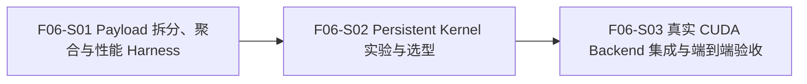

# F06_Persistent GPU Kernel 与真实 GPU Copy 功能文档

所属版本：v1

所属版本文档：[UGDR_v1 版本文档](../UGDR_v1_版本文档.md)

## 一、功能目标

使用 UGDR verbs-like API 的单机双 Client 应用和调试 GPU 数据路径的开发者，能够通过 persistent GPU kernel 完成真实 GPU buffer copy。目标数据正确可见，且一个 WR 拆出的全部 payload task 完成并由 Loop Worker 聚合后，才允许产生该 WR 的成功 completion。

## 二、背景与版本关系

F05 已交付公开 posting、真实 SQ/RQ/CQ、Local Transport、两个可显式推进的 Loop Worker 和可替换 CopyBackend，并以同步 device-to-device `cudaMemcpy` 建立正确性基线。F06 直接依赖 F05，在保持公开 WR/WC 契约的前提下，把完整 WR 拆成模拟真实网络载荷的 payload task，比较 persistent kernel 模型并用选定实现替换 Mock GPU backend；F07 再从公开 API 入口完成无关键路径 Mock 的完整验收。

## 三、功能范围

- 为 F05 数据路径增加可配置 payload 拆分和 WR completion 聚合；默认 payload 上限为 8 KiB，每个 payload 是一个 CUDA kernel task。
- 建立 control-only 持续负载 Harness，使用少量大型 MR 元数据的不同 offset 批量 post WR，在不执行 GPU copy 的情况下观测 parent MWR/s、payload MTask/s、逻辑 payload GB/s 和 WR 端到端延迟。
- 实现并比较多种基于 LD/ST128 的 persistent kernel；至少覆盖非 warp-specialized 模型与单 block warp-specialized SPSC 模型，并由人工依据确定性、性能和复杂度确认最终选择。
- 将选定 kernel 封装为真实 CopyBackend，接入 F05 的 Loop Worker、Local Transport 和 completion 闭环，替换 Mock GPU backend。
- 覆盖普通 Write、Write With Immediate、多 SGE、对齐与非对齐、signaling、背压、错误完成、kernel 生命周期和真实 GPU 数据可见性。

## 四、非目标

- 不采用 `cp.async`，不把 shared-memory staging 作为 F06 copy 主路径。
- 不实现跨主机传输、真实 NIC、wire protocol、MTU、可靠传输协议或生产级网络重传。
- 不重新定义公开 API、QP/SQ/RQ/CQ、MR 生命周期或 WR/WC 的 Client 可观察契约。
- 不扩展完整 verbs 错误恢复、QP ERR/flush、RNR timer 或 retry budget。
- 不实现生产级多 Worker 调度、负载均衡或复杂 GPU 调度策略；多 CTA 扩展只有在 S02 实验和人工确认后才进入最终模型。
- F06-S01 Harness 不执行 `cudaMemcpy` 或其他 GPU copy；真实 copy 性能仅在 F06-S02 和 F06-S03 测量。不以带宽、延迟、MWR/s 或消息大小矩阵作为 F06 关闭硬阈值，也不承担 F07 的完整公开 API 端到端验收。

## 五、依赖与约束

- 直接依赖 F05 的公开 posting、真实 SQ/RQ/CQ、Local Transport、Loop Worker 和 CopyBackend；继续遵守 F02 的 Write、Write With Immediate、signaling、顺序和 completion 语义。
- 基准平台为 NVIDIA A10、sm_86，工具链为 CUDA 12.3。当前执行环境未透传可用的 `/dev/nvidia` 设备；恢复 GPU 访问是 F06-S02 实测的前置条件。
- LD/ST128 只用于源地址、目标地址均满足 16 字节自然对齐且剩余长度充足的区域；头尾和不同对齐偏移必须安全降级，禁止向下取整地址。
- payload size 是内部可配置参数，默认上限为 8 KiB，不进入公开 API。多 SGE 在 SGE 边界继续切分，使每个 kernel task 使用一个连续源区间和连续目标区间。
- backend 接受 payload task 不代表完成；只有 parent WR 的全部 payload 到达终态并被 Loop Worker 聚合后，才能发布 WR-level Response 和成功 WC。
- 性能结果用于 kernel 选型和环境观测，不替代人工选择，也不形成版本关闭阈值。

## 六、功能设计与模块边界

发送端 Loop Worker 先按 F05 规则完整校验并解析一个 Send WR，将其 SGE 序列视为有序逻辑字节流，再按内部 payload size 切分。默认每个 payload 不超过 8 KiB；在 SGE 边界继续切分，以保证单个 payload task 只有一个连续源地址。每个 payload 携带 parent request_id、payload index、payload count、源地址、按 WR 逻辑偏移计算的连续目标地址和长度，经 Local Transport 交给接收端。

接收端按 parent WR 建立聚合状态，只为 Write With Immediate 消费一次 Receive WR，并将每个 payload 独立提交给 CUDA backend。task/completion meta queue 均有界；候选 kernel 共享相同 payload 契约，copy 主路径使用 LD/ST128 与安全窄访问退化。S02 比较直接由多个 copy warp 对接 Host queue 的非-specialized 模型，以及由 ingress warp、copy warps、egress warp 组成的单-block warp-specialized SPSC 模型。

**已确认：**公开完成单位仍是 WR；每个 payload 是一个 kernel task；只有 parent WR 的全部 payload 到达终态后才发布一个 WR-level 结果。普通 Write 不消费远端 RQ；Write With Immediate 对整个 WR 只消费一个 Receive WR，并在成功聚合后只产生一个携带完整 WR `byte_len` 和 immediate data 的 Receive WC。任一 payload 失败时 parent WR 最终失败；RDMA Write 不保证原子更新，执行期错误可能留下部分目标更新。同一 QP 的 WR completion 与目标写入顺序必须保持已审阅契约。

**待确认：**S02 在 A10 上实验后，由人工选择最终 kernel 模型、copy warp 数、shared stage 数、Host queue 组织和是否采用多 CTA。选择结果必须回写并重新审阅本功能文档后，才能进入最终集成。

## 七、步骤划分

将功能拆分为可独立设计、实现和验收的步骤。此处只定义步骤目标、交付、依赖和验收边界，不展开具体实现。

| 步骤标识 | 步骤名称 | 目标与交付 | 依赖 | 验收边界 |
|-|-|-|-|-|
| F06-S01 | Payload 拆分、完成聚合与 F05 全链路性能 Harness | 为 Loop Worker 增加默认 8 KiB、内部可配置的 payload 拆分和 parent WR completion 聚合；建立仅测控制路径和任务供给能力的持续 WR 负载源，不执行 `cudaMemcpy` 或其他 GPU copy。 | 无 | 普通 Write 与 Write With Immediate 的 WR 级语义保持不变；多 SGE、尾部 payload、背压和失败可确定验证；输出 parent MWR/s、payload MTask/s、逻辑 payload GB/s、P50/P99 和矩阵参数，且不执行 GPU copy、不把 WC 数当作 completed WR。 |
| F06-S02 | Persistent Kernel 模型实验与选型 | 实现并比较多种 LD/ST128 persistent kernel，验证 task/completion queue、对齐退化、启动停止、数据正确性和 Host 边界模型，在 A10 上形成可复现选型证据。 | F06-S01 | 至少比较非 warp-specialized 与单 block warp-specialized SPSC 模型；所有候选先满足确定性正确，再比较 MTask/s、GB/s、延迟、资源占用和复杂度；最终选择由人工明确确认。 |
| F06-S03 | 真实 CUDA Backend 集成与端到端验收 | 将人工确认的 kernel 封装为正式 CopyBackend，替换 F05 Mock GPU backend，并从公开 API 验证多 payload WR 的完整真实 GPU copy 链路。 | F06-S02 与人工选型确认 | 覆盖 Write、Write With Immediate、多 SGE、LD/ST128 退化、signaling、每 WR 单次 completion、背压、队列满、错误、kernel 生命周期和数据可见性；输出最终端到端观测且不设置性能关闭阈值。 |

## 八、验证与功能验收标准

- 一个 WR 被确定地拆成长度不超过配置上限的 payload task；默认上限为 8 KiB。多 SGE、非整除尾部和源/目标不同对齐偏移的数据均正确写入连续目标区域，且 parent WR 只产生一次最终结果。
- F06-S01 Harness 分别输出 parent MWR/s、payload MTask/s、逻辑 payload GB/s、WR P50/P99、payload size、queue depth、SGE 数和 signaling 间隔，且不执行 `cudaMemcpy` 或其他 GPU copy；S02 在可用 A10 上产生可复现的候选模型对照，S03 通过专项单元测试、GPU 集成测试、format/lint、build 和完整配置测试集。
- backend 接受、单个 payload 完成或部分 payload 完成均不得提前产生成功 WC。普通 Write 不消费 RQ 且无远端 WC；Write With Immediate 对 parent WR 只消费一个 Receive WR 并产生一个包含完整 `byte_len` 与 immediate data 的 Receive WC。背压不得导致 payload 丢失、重复、越序或重复 WR completion；错误 WC 不受 signaling 抑制，执行期部分写入按已审阅非原子语义处理。

## 九、风险与待确认事项

| 类型 | 内容 | 影响 | 状态 |
|-|-|-|-|
| 风险 | 单 block warp specialization 可能无法利用 A10 全部显存带宽。 | 可能限制大 WR GB/s；S02 必须与非-specialized 模型对照，并把性能与实现复杂度共同提交人工选择。 | 待实验 |
| 风险 | mapped Host task/completion queue 的 PCIe 访问可能成为小 payload 的 MTask/s 瓶颈。 | 可能使 ingress/egress 开销高于 copy；S02 分离纯 kernel 与 F05 全链路数据。 | 待实验 |
| 风险 | 只测单个大 WR 会偏向带宽，无法反映 Host queue、聚合和 completion 开销。 | 可能得出错误架构结论；矩阵必须同时覆盖连续小、中、大 WR 及不同队列深度。 | 控制中 |
| 阻塞 | 宿主 PCI 设备可见，但当前执行环境没有可用 NVIDIA 设备节点，`nvidia-smi` 无法访问驱动。 | 不阻塞文档和 S01 control-only Harness；阻塞 S02 A10 实测与 S03 GPU 验收。 | 待恢复设备透传 |
| 待确认 | 最终 kernel 模型、copy warp 数、shared stage 数、Host queue 组织和多 CTA 策略。 | 决定资源占用、Host 边界复杂度、MTask/s 与 GB/s。 | F06-S02 后人工确认 |

## 十、变更记录

| 日期 | 变更内容 | 变更原因 | 影响范围 |
|-|-|-|-|
| 2026-07-23 | 基于 UGDR_v1 版本文档和 F05 已审阅实现边界创建 F06 功能文档草稿，确定三步线性拆分。 | F05 已完成人工验收，F06 是版本依赖链中的下一功能。 | 功能目标、范围、依赖、设计、步骤 DAG、验收和风险。 |
| 2026-07-23 | 将 backend 粒度从整 WR 单任务调整为默认 8 KiB payload task，并增加 parent WR completion 聚合与 MWR/s、MTask/s、GB/s 分离口径。 | 模拟真实网络载荷，向 persistent kernel 提供持续任务，同时保持公开 WR/WC 完成语义。 | F06-S01 至 F06-S03、Loop Worker、Local Transport、CopyBackend、性能 Harness 和验收矩阵。 |
| 2026-07-23 | 排除 `cp.async`，固定 LD/ST128 主路径与安全窄访问退化；将 F06-S01 Harness 固定为 control-only，排除 `cudaMemcpy` benchmark；最终 warp specialization 模型留待 A10 实验和人工选择。 | `cp.async` 需要 shared-memory staging，不适合作为本功能纯 global-to-global copy 的首选路径；S01 只测 payload 拆分、聚合和 F05 control path，避免同步 GPU copy 污染任务供给基线。 | F06-S01 性能 Harness、F06-S02 候选模型、功能设计、依赖约束和风险。 |
