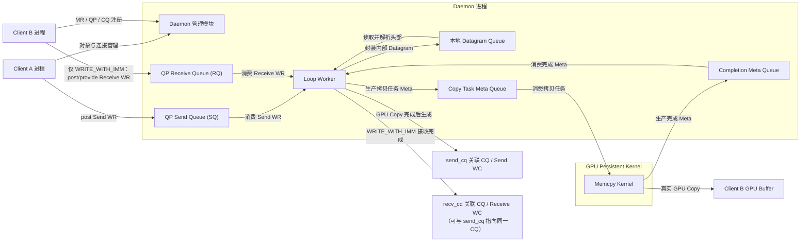
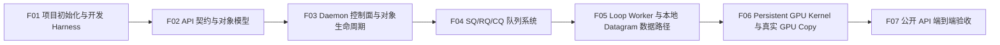

# UGDR_v1 版本文档

## 一、版本目标

UGDR v1 的目标是先建立可重复执行的项目初始化与开发 Harness，再在单机环境中验证软件 GPU Direct RDMA 的基础架构，并提供 RC QP 建连以及 rdma_write、rdma_write_with_imm 所必需的最小 verbs-like API。该版本通过两个 client 进程和一个 daemon 进程，跑通对象管理、QP 的 SQ/RQ、WR posting、CQ 与 WC、内部 datagram、本地 loop 数据路径以及真实 GPU buffer 拷贝；已支持子集的可观察行为默认对齐 RDMA/libibverbs。

daemon 进程内同时承载 daemon 管理模块和 Loop Worker，但两者职责严格分离：管理模块只负责 client session、context/PD/MR/CQ/QP 生命周期，以及 QP 的 SQ/RQ 与 send_cq/recv_cq 关联元数据；Loop Worker 只负责数据面工作。后续多机版本可以保留管理模块，并将 Loop Worker 替换或扩展为网络 transport 与协议处理模块。

版本完成的判断标准是：使用者可以通过 UGDR API 完成核心对象生命周期和 RC QP 连接管理，由 Client A 向 SQ post rdma_write 或 rdma_write_with_imm 的 Send WR，经过内部 datagram 封包、本地队列、解包、copy task meta queue 和持续运行的 GPU kernel，将数据正确写入 Client B 的真实 GPU buffer。GPU kernel 回传 completion meta 后，按 signaling 契约在 send_cq 关联 CQ 产生发送 WC；rdma_write_with_imm 还必须消费 Client B 在 RQ 预提交的 Receive WR，并在 recv_cq 关联 CQ 产生携带 immediate data 的接收 WC，普通 rdma_write 不产生该远端接收 WC。

## 二、背景与问题

UGDR 项目的长期目标是在没有 RDMA 网卡硬件能力的环境下，以软件方式提供接近 GPU Direct RDMA 的跨机通信能力，并降低对特定厂商硬件栈和上层通信库改造的依赖。传统 RDMA、TCPX 和 DeviceMemoryTCP 等方案提供了可参考路径，但多机传输、协议可靠性、性能优化和硬件适配会显著扩大首个版本的验证范围。

UGDR v1 先解决一个更基础的问题：在不引入真实网络传输的情况下，验证 verbs-like API、控制面对象模型、队列边界、内部 datagram 语义和真实 GPU 拷贝能否形成完整闭环。v1 使用单机双 client 的 loop 数据路径确认架构可执行，并为后续替换为多机 transport 与协议处理模块保留清晰边界。

## 三、版本范围

- 首先完成项目初始化与开发 Harness：建立可编译的仓库骨架和模块边界、面向 Agent 的简洁入口与文档导航、独立的项目状态与进度交接载体、可复用工作流，以及 bootstrap、环境诊断、format/lint、build、test 和 smoke check 的统一执行入口；具体目录树、文件名和工具选型由 F01 确认。
- 提供 UGDR v1 的最小 verbs-like API，只覆盖 RC QP 建连以及 rdma_write、rdma_write_with_imm 所必需的 device/context、PD、MR、CQ、QP、连接信息交换、Work Request（WR）提交与 Work Completion（WC）查询能力；在已支持子集内，API 命名、对象关系、QP 状态转换、错误、顺序和 completion 行为默认对齐 RDMA/libibverbs，具体 API 清单和参数由 F02 确认。
- 支持 RC 模式下的 rdma_write 和 rdma_write_with_imm；其他传输类型和操作语义不进入本版本范围。
- rdma_write_with_imm 按标准接收语义处理：Client B 向 QP 的 Receive Queue（RQ）预提交 Receive WR；成功完成时目标 MR 已写入，消费一个 Receive WR，并在接收端 CQ 产生携带 immediate data 的 WC；缺少可消费 Receive WR 时产生 RNR 或等价错误。普通 rdma_write 不消费远端 Receive WR，也不产生远端接收 WC。具体 Receive WR 提交契约由 F02 确认，内部 WQE 表示由 F04 确认。
- 使用两个独立 client 进程模拟通信双方，并使用一个 daemon 进程承载 daemon 管理模块和 loop worker。
- daemon 管理模块负责 client session，以及 context、PD、MR、CQ、QP 等控制面对象和元数据；QP 持有 SQ/RQ，并分别关联 send_cq 与 recv_cq，两者允许指向同一个 CQ。管理模块不负责数据传输。
- Loop Worker 从 QP 的 Send Queue（SQ）读取已提交的 Send WR（内部可表示为 WQE），封装为 UGDR 内部 datagram，写入本地 datagram queue，再从队列读出并解析头部，定位目标 MR 并提交 GPU 拷贝任务；不得直接从 WR 跳过封包和解包进入 memcpy。
- 实现 QP 的 Send Queue（SQ）和 Receive Queue（RQ）以及 Completion Queue（CQ）的基础语义：向 SQ/RQ post Send/Receive WR，队列层消费 WR，并向 QP 关联的 send_cq/recv_cq 生成可轮询的 WC；send_cq 与 recv_cq 是关联角色，不是不同类型的 CQ。
- 使用持续运行的 GPU kernel 处理真实 GPU buffer 拷贝。loop worker 通过 copy task meta queue 生产拷贝任务，GPU kernel 完成任务后通过 completion meta queue 将结果反馈给 loop worker。
- 建立单机 v1 harness，覆盖格式检查、构建、接口验证、队列验证、datagram 封包解包、错误路径和双 client 集成验证；性能数据只做观测和记录。
- 形成 v1 功能拆分、功能文档和步骤文档目录结构，并保留人工确认关卡。

## 四、非目标

- v1 不接入 NCCL；NCCL 是项目后续方向，不作为本版本完成条件。
- v1 不支持 RC 之外的传输类型，不覆盖完整 libibverbs API，也不实现 read、Send/Recv 数据操作、atomic 等未列入范围的操作；但在已支持子集内必须对齐 verbs 语义，并提供 rdma_write_with_imm 所需的 Receive WR posting 与接收 WC 能力。
- v1 不实现多机传输，不使用 IP、UDP、MLX5 或 DPDK 构建网络数据路径。
- v1 不承诺可供未来网络直接复用的线格式，不定义网络序列化、MTU、分片、重传、可靠性和拥塞控制。
- v1 不承诺生产级稳定性、容错、运维和安全隔离，也不要求完整 CI/CD、daemon crash 或 peer disconnect 故障注入。
- v1 不要求双机 benchmark，不设置版本关闭所需的带宽或延迟阈值。
- v1 不在版本文档中固定 datagram 的 C/C++ struct、字段布局、队列实现、线程模型、文件、类或函数；这些内容下沉到功能文档和步骤文档。

## 五、约束与原则

- 初始化前置原则：F01 是后续功能的前置能力；在仓库骨架、开发 Harness 和基础验证入口通过验收前，不进入 F02-F07 的正式工作。F02 只定义契约与对象模型，运行时实现从 F03 开始。
- 仓库知识原则：仓库内可版本化内容是 Agent 执行时的知识来源。AGENTS.md 保持简短，只提供项目地图、关键约束和验证入口；详细架构、设计、计划和决策放入结构化文档并通过链接渐进披露。
- 状态分离原则：长期有效的规则、当前状态、执行进度和临时计划分别维护。可变状态与进度不得堆入 AGENTS.md；新的 Agent 会话应能结合状态载体、计划记录和 git 历史恢复当前阶段与下一步。
- 可执行反馈原则：bootstrap、环境诊断、format/lint、build、test 和 smoke check 必须有稳定入口、确定退出状态和可操作的失败信息；关键架构边界优先通过 lint、结构测试或其他机械检查约束。
- Agent 中立原则：目录、文档、状态和验证脚本构成通用项目 Harness；Codex 配置、Skills 或其他 Agent 专属适配只能作为附加入口，不得成为项目知识或执行能力的唯一载体。
- 硬件约束：v1 不依赖 RDMA 网卡完成数据路径验证，但版本验收必须使用真实 GPU buffer。
- RDMA 语义对齐原则：v1 只提供 RC QP 建连以及 rdma_write、rdma_write_with_imm 所必需的 verbs-like API；在已支持子集内，公开 API、对象关系、术语、QP 状态转换、错误、顺序、signaling 和 completion 语义默认对齐 RDMA/libibverbs。F02 确认具体 API，不宣称完整 ibverbs 兼容；daemon、队列或 GPU 架构导致的有意偏离必须在已审阅设计中显式记录并由专项测试覆盖。MR 注册保持 `ugdr_reg_mr(pd, addr, length, access)` 的 API/ABI 形状和公开 `lkey/rkey` 语义，但 v1 支持能力只覆盖 `cudaMalloc` device allocation 的合法区间；host、managed、CUDA array 与任意 VMM allocation 返回 `EOPNOTSUPP`，该内存类型限制属于版本能力边界。
- WRITE_WITH_IMM 接收原则：接收端必须向 RQ 预提交可消费的 Receive WR；成功时消费一个 Receive WR，并在 recv_cq 关联的 CQ 中产生携带 immediate data 的 WC；缺少 Receive WR 时产生 RNR 或等价错误。普通 RDMA Write 不消费远端 Receive WR，也不产生远端接收 WC。是否允许零 SGE 等公开契约由 F02 确认，WQE 仅作为内部实现表示。
- 进程原则：两个 client 分别运行在独立进程中；daemon 管理模块和 loop worker 运行在同一个 daemon 进程中，但保持清晰的逻辑边界。
- 控制面原则：daemon 管理模块负责 IPC、连接、session，以及 context、PD、MR、CQ、QP 等对象的句柄、元数据与生命周期；SQ/RQ 是 QP 的组成部分，send_cq/recv_cq 是 QP 到 CQ 的关联。控制面不实现真实队列行为，也不解析或搬运数据面 payload。
- 数据面原则：F04 负责 SQ/RQ/CQ 的真实队列语义，包括 post WR、队列容量与顺序、WR 消费、WC 生成和 CQ polling；F05 的 Loop Worker 消费 SQ/RQ 中的 WR，并负责内部 datagram、本地 datagram queue、目标校验、GPU 拷贝任务编排以及 WC 生成条件。
- GPU 协作原则：loop worker 是 copy task meta 的生产者和 completion meta 的消费者；持续运行的 GPU kernel 是 copy task meta 的消费者和 completion meta 的生产者。
- 完成语义原则：UGDR v1 仅在 GPU kernel 已完成真实 GPU copy、并由 Loop Worker 收到成功 completion meta 后，才向相应 CQ 生成成功 WC（内部可表示为 CQE）；任务入队或 GPU copy 提交均不代表 verbs completion。失败结果必须产生可观察的错误 WC 或等价错误状态，不得报告成功。
- transport 解耦原则：内部 datagram 只定义 v1 所需的头部语义和封包解包边界，不承诺网络线格式；后续可将本地 queue 替换或扩展为网络 transport。
- 路径完整性原则：RC write 必须经过封包、入队、出队和解包，不允许以直接 WR 到 memcpy 的捷径替代。
- 正确性原则：真实 GPU buffer 的数据正确性和错误路径可观察性是 v1 必过项；stream 同步、队列内存序和 kernel 通知细节下沉到对应功能文档。
- 性能原则：v1 可以记录延迟、带宽和消息大小观测结果，但不设置版本关闭阈值；测试矩阵和观测口径在功能文档中确定。
- 协作原则：飞书文档面向人确认，Markdown 面向 agent 执行。所有版本、功能、步骤文档必须先经人工确认，再同步为 Markdown。
- 执行原则：Agent 可以提出拆分和修改建议，但不得自行扩大目标、改变已确认范围或跳过人工验收关卡。

## 六、整体架构

运行时架构之前存在一个开发前置层：F01 项目初始化与开发 Harness。该层负责仓库骨架、模块边界、仓库内文档与状态导航、Agent 可发现的工作流、统一命令入口和基础质量门禁，使人和新的 Agent 会话都能在不依赖聊天历史的情况下定位当前阶段、启动环境并验证修改。该层不属于 UGDR 运行时，因此不进入下方数据路径图。

UGDR v1 的宏观架构由两个 client 进程和一个 daemon 进程组成。daemon 进程内部包含 daemon 管理模块和 Loop Worker：管理模块处理 IPC、连接、session，以及 context、PD、MR、CQ、QP 等对象的元数据与生命周期；QP 包含 SQ/RQ，并通过 send_cq/recv_cq 关联 CQ。真实 SQ/RQ/CQ 行为由队列层提供，Loop Worker 消费 WR 并处理内部 datagram、本地 datagram queue、copy task meta、completion meta 和 WC 生成。两个模块同进程部署，但职责和接口边界保持分离。

数据路径从 Client A 的 post_send 开始。Send WR 进入 QP 的 SQ 后，Loop Worker 将其封装为 UGDR 内部 datagram 并写入本地 datagram queue；接收侧逻辑从队列读出 datagram、解析头部、通过 daemon 管理模块维护的元数据定位 Client B 的目标 MR。rdma_write_with_imm 还必须确认并消费 Client B 在 RQ 中预提交的 Receive WR，缺少 Receive WR 时产生 RNR 或等价错误；普通 rdma_write 不消费远端 Receive WR。Loop Worker 将 copy task meta 写入任务队列，持续运行的 GPU kernel 消费任务并执行真实 GPU buffer 拷贝，再将 completion meta 写回完成队列。Loop Worker 仅在消费到成功 completion meta 后向 Client A 的 send_cq 关联 CQ 生成发送 WC；对于 rdma_write_with_imm，同时向 Client B 的 recv_cq 关联 CQ 生成携带 immediate data 的接收 WC。

内部 datagram 是 v1 数据面模块之间的逻辑契约，只要求表达 opcode、端点与目标内存定位、长度、work request 标识、immediate data 和必要状态。v1 不固定 C/C++ struct、字段布局、序列化和网络可靠性规则；后续多机版本可以保留该语义边界，将本地 datagram queue 替换或扩展为网络 transport 与协议处理模块。

## 七、功能划分

UGDR v1 采用以下功能划分。F02 只冻结公开 API 契约与对象模型；F03 至 F06 按控制面、队列、Loop Worker/Datagram、GPU Kernel 逐层实现；F07 从公开 API 入口执行无关键路径 Mock 的端到端验收。此处只定义功能级职责、边界和直接依赖，不固定步骤级文件、类、函数或实现参数。

| 功能标识 | 功能名称 | 职责 | 边界 | 直接依赖 |
|-|-|-|-|-|
| F01 | 项目初始化与开发 Harness | 建立可编译仓库骨架、模块边界、项目文档与状态治理，以及 bootstrap、环境诊断、format/lint、build、test 和 smoke check 的稳定入口。 | 不实现 UGDR API、daemon 或数据路径功能；不在版本文档固定目录树、构建工具和状态 schema。 | 版本文档与本机环境 |
| F02 | API 契约与对象模型 | 确认 v1 API 清单，定义参数与返回值、句柄、对象关系、QP 状态转换、错误、顺序、signaling 和 completion 契约；已支持子集默认对齐 RDMA/libibverbs。 | 不实现 API 运行时行为；不实现 IPC、daemon 对象注册、真实队列、datagram 或 GPU copy；不宣称完整 ibverbs 兼容。 | F01 |
| F03 | Daemon 控制面与对象生命周期 | 实现 IPC/session，以及 context、PD、MR、CQ、QP 等对象元数据的注册、创建、查询、合法状态转换和关闭；QP 持有 SQ/RQ，并通过 send_cq/recv_cq 关联 CQ。 | 只管理队列句柄、容量与关联元数据，不实现 SQ/RQ 的 WR 存储消费、CQ 的 WC 生成轮询或数据路径。 | F02 |
| F04 | SQ/RQ/CQ 队列系统 | 实现向 QP 的 SQ/RQ post Send/Receive WR、队列容量与顺序、WR 消费，以及向关联 CQ 生成和轮询 WC 的语义；send_cq 与 recv_cq 可指向同一或不同 CQ。以 Mock Loop Worker 消费 WR 并生成可验证的 Mock WC。 | WQE/CQE 仅作为内部表示；不实现真实 datagram、目标 MR 定位、Loop Worker 数据路径或 GPU copy。 | F03 |
| F05 | Loop Worker 与本地 Datagram 数据路径 | 消费真实 SQ/RQ 中的 WR，定义内部 datagram 的封包、入队、出队与解包，完成目标校验、Mock copy task/completion 串联，并在满足 verbs 完成条件时生成 WC。 | GPU 执行仍使用 Mock backend；不实现真实 persistent kernel，也不引入多机网络传输。 | F04 |
| F06 | Persistent GPU Kernel 与真实 GPU Copy | 实现 copy task/completion meta 队列、persistent GPU kernel 和真实 GPU buffer copy，与 F05 数据路径集成并替换 Mock GPU backend。 | 不扩展多机传输，不重新定义公开 API、控制面、SQ/RQ/CQ 或 datagram 契约。 | F05 |
| F07 | 公开 API 端到端验收 | 从公开 API 入口验证 API→IPC→控制面→SQ/RQ/CQ→datagram→Loop Worker→GPU kernel 的完整链路，以及 RDMA 对象、操作、错误和 completion 语义。 | 关键路径不允许 Mock；不包含双机 benchmark、完整 CI/CD、生产级故障注入或性能关闭阈值。 | F06 |

**功能依赖 DAG：**功能表中的“直接依赖”是唯一事实源。功能按 F01 → F02 → F03 → F04 → F05 → F06 → F07 严格线性推进；F01 已完成后，当前唯一可启动功能为 F02。

## 八、版本验收标准

- F01 在干净 workspace 中能够通过统一入口完成 bootstrap 或环境诊断，并执行 format/lint、基础 build、test 和 smoke check；仓库骨架、模块边界、项目地图、状态与进度载体均可机械验证。
- F02 明确 v1 最小 API 清单与对象模型，覆盖 RC QP 建连、rdma_write、rdma_write_with_imm 所需的参数与返回值、句柄、对象关系、QP 状态转换、错误、顺序、signaling 和 completion 契约；已支持子集通过对照 RDMA/libibverbs 的契约测试验证，但不要求 API 具备运行时功能。
- F03 的 client 能够通过 IPC 注册并管理 session、context、PD、MR、CQ、QP 等对象元数据，完成创建、查询、合法 QP 状态转换和关闭；QP 持有 SQ/RQ，并可将 send_cq/recv_cq 关联到同一或不同 CQ。此阶段不以真实 WR 提交、WC 生成或数据传输作为验收条件。
- F04 实现 SQ/RQ/CQ 的真实队列语义：向 SQ/RQ post Send/Receive WR，验证容量、顺序、消费与队列满行为，并向 QP 关联的 CQ 生成和轮询 WC；Mock Loop Worker 能够消费 WR 并生成可重复验证的 Mock WC。
- F05 的 Loop Worker 能够消费真实 SQ/RQ 中的 WR，完成内部 datagram 的封包、入队、出队、解包、目标校验和 WC 生成；GPU 执行使用 Mock backend。rdma_write_with_imm 缺少 Receive WR 时产生 RNR 或等价错误，普通 rdma_write 不消费远端 Receive WR。
- F05 对无效 rkey、越界长度、失效 MR、错误 QP 状态和其他必要错误路径不得报告成功 WC，也不得修改错误目标；失败必须通过符合已支持 verbs 契约的错误 WC（内部可表示为 CQE）或等价错误状态观察。
- F06 实现 copy task/completion meta 队列和持续运行的 GPU kernel，真实消费任务、完成 GPU buffer copy 并回写 completion meta；F05 的 Mock GPU backend 被真实实现替换。
- 对于已请求 signaling 的 Send WR，成功发送 WC 只能在真实 GPU copy 完成且成功 completion meta 已被 Loop Worker 消费后产生，不能在任务入队或 GPU copy 提交时提前产生；未请求 signaling 时按 F02 确认的 verbs 契约处理。
- rdma_write_with_imm 必须消费一个接收端 RQ 中的 Receive WR；GPU copy 完成后，接收端在 recv_cq 关联 CQ 中获得携带正确 immediate data 的 WC。普通 rdma_write 不产生该远端接收 WC。
- F07 从公开 API 入口覆盖 API→IPC→控制面→SQ/RQ/CQ→datagram→Loop Worker→persistent GPU kernel 的完整链路；验证对象关系、QP 状态转换、WR posting、signaling、WC polling、错误和 RDMA Write/Write With Immediate 差异，两个 client 与 daemon 的单机集成关键路径不允许 Mock。
- SQ/RQ 的 Send/Receive WR posting 与消费、CQ 的 WC 生成与 polling、共享或分离 send_cq/recv_cq、datagram、copy task/completion meta、RNR、signaled/unsignaled 和必要错误路径均有可重复执行的测试；format/lint、build 和完整配置测试集通过。
- 性能数据可以被观测和记录，但带宽、延迟和消息大小矩阵不作为 v1 关闭阈值；具体口径在对应功能文档确认。
- 版本下的功能文档和步骤文档按照目录规则创建，并经过人工确认后再同步 Markdown 进入实现。

## 九、风险与待确认事项

| 类型 | 内容 | 影响与处理 | 状态 |
|-|-|-|-|
| 已确认 | v1 只覆盖 RC QP 建连以及 rdma_write、rdma_write_with_imm 所需的 verbs-like API；在已支持子集内尽量完整对齐 RDMA/libibverbs 的 API 与语义。 | F02 明确 API、对象关系、QP 状态转换、错误、顺序、signaling 和 completion 契约；F03-F06 分层实现，F07 从公开入口对照验收。项目不宣称完整 ibverbs 兼容。 | 持续约束 |
| 已确认 | 公开与设计边界统一使用 QP/SQ/RQ/CQ、WR/WC；WQE/CQE 只表示内部或 provider 层队列项。 | 避免把应用提交的 WR 与内部 WQE、CQ 关联角色与 CQ 类型混淆；术语偏离必须有明确接口理由。 | 术语已修正 |
| 已确认方向 | rdma_write_with_imm 要求接收端向 RQ 预提交 Receive WR，完成后消费一个 WR，并在 recv_cq 关联 CQ 产生携带 immediate data 的 WC；普通 rdma_write 不消费远端 Receive WR，也不产生远端接收 WC。 | F02 定义契约；F03 管理 QP/SQ/RQ/CQ 关系；F04 实现 WR/WC 队列语义；F05 实现 RNR 与数据路径；F06 完成真实 copy；F07 验收。 | 分层落实 |
| 已确认 | F03 只实现 daemon 控制面、IPC 与对象生命周期；SQ/RQ 属于 QP，send_cq/recv_cq 是 QP 到 CQ 的关联。 | 真实 WR 存储消费、WC 生成和 CQ polling 归属 F04，避免把队列建模为不符合 verbs 的独立公开对象。 | 边界已确认 |
| 已确认 | Mock 只作为逐层替身：F04 使用 Mock Loop Worker 验证真实 SQ/RQ/CQ；F05 使用 Mock GPU backend 验证 Loop Worker 与 datagram；F06 替换 Mock GPU backend。 | F07 的公开 API 端到端验收关键路径不得保留 Mock。 | 边界已确认 |
| 已确认 | 对于按契约需要产生 WC 的 Send WR，成功发送 WC 在真实 GPU copy 完成且 Loop Worker 消费成功 completion meta 后产生。 | 任务入队和 GPU copy 提交均不是 verbs completion；signaled/unsignaled、失败 WC 与 CQ polling 按 F02 契约和专项测试处理。 | F06/F07 验证 |
| 已确认 | F02-F07 采用严格线性直接依赖：F02 API 契约与对象模型→F03 控制面→F04 SQ/RQ/CQ→F05 Loop Worker/Datagram→F06 GPU Kernel→F07 公开 API 端到端验收。 | 每一层以明确 Mock 边界形成可独立验收的增量。 | 已修正 |
| 风险 | 文档、代码或测试沿用非标准术语，或 daemon/GPU 扩展无意改变 verbs 行为。 | 有意偏离必须写入已审阅设计和持久决策，并由专项测试覆盖；持续检查 WR/WC、对象关系、状态、错误、顺序与 completion 语义。 | 持续控制 |

## 十、变更记录

| 日期 | 变更内容 | 变更原因 | 影响范围 |
|-|-|-|-|
| 2026-07-18 | 基于模板创建并填写 UGDR_v1 版本文档草稿。 | 形成可人工确认的版本级目标、范围、架构和功能划分。 | 版本文档及后续功能、步骤文档。 |
| 2026-07-18 | 将 v1 收敛为单机双 client 的 loop 数据路径；daemon 管理模块与 Loop Worker 同进程部署但职责分离，并要求真实 GPU buffer 验证。 | 降低首个版本的多机 transport 和协议复杂度，同时保留后续替换边界。 | 目标、范围、架构、功能划分与验收。 |
| 2026-07-18 | 明确 v1 最小 API 边界、WRITE_WITH_IMM 的 Receive WR/WC 语义、GPU copy 完成后的 WC 时机，以及 Loop Worker 与 persistent GPU kernel 的双向生产者/消费者模型。 | 消除实现阶段对接收通知和完成点的歧义。 | API、队列、数据路径、GPU kernel 与验收。 |
| 2026-07-18 | 新增 F01“项目初始化与开发 Harness”，原 F01-F06 顺延为 F02-F07。 | 先建立人和 Agent 都能读取、执行、验证和持续交接的工程基础。 | 功能编号及后续全部文档。 |
| 2026-07-20 | 修正 F02-F07 职责：F02 仅定义 API 契约；F03 实现控制面与对象生命周期；F04 实现真实 SQ/RQ/CQ 并以 Mock Worker 验证；F05 实现 Loop Worker/Datagram 并以 Mock GPU 验证；F06 接入真实 persistent GPU kernel；F07 从公开 API 端到端验收。依赖调整为严格线性。 | 避免把强依赖下游能力的 API 运行时实现错误归入 F02，并消除原 F05 与 F06 的循环依赖。 | 约束与原则、整体架构、功能划分、DAG、验收和风险；需重新人工审阅。 |
| 2026-07-20 | 新增 RDMA/libibverbs 语义对齐约束；统一 QP/SQ/RQ/CQ、WR/WC 术语，明确 WQE/CQE 仅为内部表示；修正 QP 与 CQ 关系、Write/Write With Immediate、signaling 和 completion 语义。 | 避免以内部队列术语替代公开 verbs 契约，确保 daemon 与 GPU 实现不改变已支持 RDMA API 的可观察行为。 | 版本范围、约束与原则、整体架构、F02-F07 职责、验收标准、风险项和架构/依赖画板；需重新人工审阅。 |
| 2026-07-21 | 新增 v1 MR memory-kind 能力约束：公开注册 API/ABI 与 `lkey/rkey` 语义保持不变，只支持 `cudaMalloc` device allocation 合法区间；host、managed、CUDA array 与任意 VMM allocation 返回 `EOPNOTSUPP`。 | daemon 通过 CUDA IPC 打开 Client GPU allocation；host memory 不在 v1 引入第二套共享映射机制。 | 版本约束、F02 契约同步与 F03 MR 实现依据；需重新人工审阅。 |
| 2026-07-21 | 删除公开 `endpoint_id` 和 endpoint 控制对象；连接信息仅保留 daemon 生命周期内不复用的 `qp_num`。 | 本机 loop worker 是过渡阶段，不让本地寻址辅助字段进入公开 ABI 或约束未来多机连接协议。 | F02-S03 契约、F03 功能与 F03-S05 实现设计；需重新人工审阅。 |
