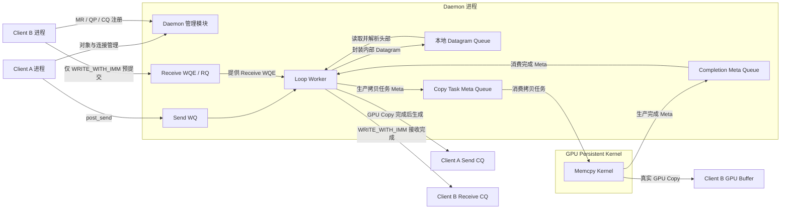

# UGDR_v1 版本文档

## 一、版本目标

UGDR v1 的目标是先建立可重复执行的项目初始化与开发 Harness，再在单机环境中验证软件 GPU Direct RDMA 的基础架构，并提供 RC QP 建连以及 rdma_write、rdma_write_with_imm 所必需的最小 verbs-like API。该版本通过两个 client 进程和一个 daemon 进程，跑通对象管理、发送 WQ、接收 WQE、发送端与接收端 CQ、内部 datagram、本地 loop 数据路径以及真实 GPU buffer 拷贝。

daemon 进程内同时承载 daemon 管理模块和 loop worker，但两者职责严格分离：管理模块只负责 client session、对象生命周期及 MR/QP/CQ/endpoint 元数据；loop worker 只负责数据面工作。后续多机版本可以保留管理模块，并将 loop worker 替换或扩展为网络 transport 与协议处理模块。

版本完成的判断标准是：使用者可以通过 UGDR API 完成核心对象生命周期和 RC QP 连接管理，由 Client A 提交 rdma_write 或 rdma_write_with_imm，经过发送 WQ、内部 datagram 封包、本地队列、解包、copy task meta queue 和持续运行的 GPU kernel，将数据正确写入 Client B 的真实 GPU buffer。GPU kernel 回传 completion meta 后，Client A 获得发送 completion；rdma_write_with_imm 还必须消费 Client B 预提交的 receive WQE，并产生携带 immediate data 的接收 completion。

## 二、背景与问题

UGDR 项目的长期目标是在没有 RDMA 网卡硬件能力的环境下，以软件方式提供接近 GPU Direct RDMA 的跨机通信能力，并降低对特定厂商硬件栈和上层通信库改造的依赖。传统 RDMA、TCPX 和 DeviceMemoryTCP 等方案提供了可参考路径，但多机传输、协议可靠性、性能优化和硬件适配会显著扩大首个版本的验证范围。

UGDR v1 先解决一个更基础的问题：在不引入真实网络传输的情况下，验证 verbs-like API、控制面对象模型、队列边界、内部 datagram 语义和真实 GPU 拷贝能否形成完整闭环。v1 使用单机双 client 的 loop 数据路径确认架构可执行，并为后续替换为多机 transport 与协议处理模块保留清晰边界。

## 三、版本范围

- 首先完成项目初始化与开发 Harness：建立可编译的仓库骨架和模块边界、面向 Agent 的简洁入口与文档导航、独立的项目状态与进度交接载体、可复用工作流，以及 bootstrap、环境诊断、format/lint、build、test 和 smoke check 的统一执行入口；具体目录树、文件名和工具选型由 F01 确认。
- 提供 UGDR v1 的最小 verbs-like API，只覆盖 RC QP 建连以及 rdma_write、rdma_write_with_imm 所必需的 device/context、PD、MR、CQ、QP、连接信息交换、work request 提交与 completion 查询能力；具体 API 列表和参数由 F02 确认。
- 支持 RC 模式下的 rdma_write 和 rdma_write_with_imm；其他传输类型和操作语义不进入本版本范围。
- rdma_write_with_imm 按标准接收语义处理：Client B 预提交 receive WQE，成功完成时目标 MR 已写入且接收侧 completion 携带 immediate data；缺少可消费的 receive WQE 时返回 RNR 或等价错误。具体接收提交 API 与 WQE 形式由 F02 确认。
- 使用两个独立 client 进程模拟通信双方，并使用一个 daemon 进程承载 daemon 管理模块和 loop worker。
- daemon 管理模块负责 client session、对象生命周期以及 MR、QP、CQ、endpoint 等控制面元数据，不负责数据传输。
- loop worker 从发送 WQ 读取 work request，封装为 UGDR 内部 datagram，写入本地 datagram queue，再从队列读出并解析头部，定位目标 MR 并提交 GPU 拷贝任务；不得直接从 work request 跳过封包和解包进入 memcpy。
- 实现发送 WQ、接收 WQE/RQ 以及发送端和接收端 CQ 的基础队列语义，支撑 work request 提交、WRITE_WITH_IMM 接收通知和 completion 查询。
- 使用持续运行的 GPU kernel 处理真实 GPU buffer 拷贝。loop worker 通过 copy task meta queue 生产拷贝任务，GPU kernel 完成任务后通过 completion meta queue 将结果反馈给 loop worker。
- 建立单机 v1 harness，覆盖格式检查、构建、接口验证、队列验证、datagram 封包解包、错误路径和双 client 集成验证；性能数据只做观测和记录。
- 形成 v1 功能拆分、功能文档和步骤文档目录结构，并保留人工确认关卡。

## 四、非目标

- v1 不接入 NCCL；NCCL 是项目后续方向，不作为本版本完成条件。
- v1 不支持 RC 之外的传输类型，不覆盖完整 libibverbs API，也不实现 read、Send/Recv 数据操作、atomic 等未列入范围的操作；但必须提供 rdma_write_with_imm 所需的 receive WQE 提交与接收 completion 能力。
- v1 不实现多机传输，不使用 IP、UDP、MLX5 或 DPDK 构建网络数据路径。
- v1 不承诺可供未来网络直接复用的线格式，不定义网络序列化、MTU、分片、重传、可靠性和拥塞控制。
- v1 不承诺生产级稳定性、容错、运维和安全隔离，也不要求完整 CI/CD、daemon crash 或 peer disconnect 故障注入。
- v1 不要求双机 benchmark，不设置版本关闭所需的带宽或延迟阈值。
- v1 不在版本文档中固定 datagram 的 C/C++ struct、字段布局、队列实现、线程模型、文件、类或函数；这些内容下沉到功能文档和步骤文档。

## 五、约束与原则

- 初始化前置原则：F01 是后续功能实现的前置能力；在仓库骨架、开发 Harness 和基础验证入口通过验收前，不进入 F02-F07 的正式实现。
- 仓库知识原则：仓库内可版本化内容是 Agent 执行时的知识来源。AGENTS.md 保持简短，只提供项目地图、关键约束和验证入口；详细架构、设计、计划和决策放入结构化文档并通过链接渐进披露。
- 状态分离原则：长期有效的规则、当前状态、执行进度和临时计划分别维护。可变状态与进度不得堆入 AGENTS.md；新的 Agent 会话应能结合状态载体、计划记录和 git 历史恢复当前阶段与下一步。
- 可执行反馈原则：bootstrap、环境诊断、format/lint、build、test 和 smoke check 必须有稳定入口、确定退出状态和可操作的失败信息；关键架构边界优先通过 lint、结构测试或其他机械检查约束。
- Agent 中立原则：目录、文档、状态和验证脚本构成通用项目 Harness；Codex 配置、Skills 或其他 Agent 专属适配只能作为附加入口，不得成为项目知识或执行能力的唯一载体。
- 硬件约束：v1 不依赖 RDMA 网卡完成数据路径验证，但版本验收必须使用真实 GPU buffer。
- 接口范围原则：v1 只提供 RC QP 建连以及 rdma_write、rdma_write_with_imm 所必需的 verbs-like API；具体 API 名称、参数和对象状态转换由 F02 确认，不宣称完整 ibverbs 兼容。
- WRITE_WITH_IMM 接收原则：接收端必须预提交可消费的 receive WQE；成功时接收 completion 携带 immediate data，缺少 receive WQE 时产生 RNR 或等价错误。接收 API 与 WQE 是否允许零 SGE 等细节由 F02 确认。
- 进程原则：两个 client 分别运行在独立进程中；daemon 管理模块和 loop worker 运行在同一个 daemon 进程中，但保持清晰的逻辑边界。
- 控制面原则：daemon 管理模块只负责连接、session、对象生命周期和 MR/QP/CQ/endpoint 元数据，不解析或搬运数据面 payload。
- 数据面原则：loop worker 负责发送 WQ、接收 WQE、内部 datagram、本地 datagram queue、目标 MR 定位、GPU 拷贝任务以及发送端和接收端 completion。
- GPU 协作原则：loop worker 是 copy task meta 的生产者和 completion meta 的消费者；持续运行的 GPU kernel 是 copy task meta 的消费者和 completion meta 的生产者。
- 完成语义原则：UGDR v1 仅在 GPU kernel 已完成真实 GPU copy、并由 loop worker 收到成功 completion meta 后生成成功 CQE；任务入队或 GPU copy 提交均不代表完成。失败结果必须生成错误 CQE，不得报告成功。
- transport 解耦原则：内部 datagram 只定义 v1 所需的头部语义和封包解包边界，不承诺网络线格式；后续可将本地 queue 替换或扩展为网络 transport。
- 路径完整性原则：RC write 必须经过封包、入队、出队和解包，不允许以直接 WR 到 memcpy 的捷径替代。
- 正确性原则：真实 GPU buffer 的数据正确性和错误路径可观察性是 v1 必过项；stream 同步、队列内存序和 kernel 通知细节下沉到对应功能文档。
- 性能原则：v1 可以记录延迟、带宽和消息大小观测结果，但不设置版本关闭阈值；测试矩阵和观测口径在功能文档中确定。
- 协作原则：飞书文档面向人确认，Markdown 面向 agent 执行。所有版本、功能、步骤文档必须先经人工确认，再同步为 Markdown。
- 执行原则：Agent 可以提出拆分和修改建议，但不得自行扩大目标、改变已确认范围或跳过人工验收关卡。

## 六、整体架构

运行时架构之前存在一个开发前置层：F01 项目初始化与开发 Harness。该层负责仓库骨架、模块边界、仓库内文档与状态导航、Agent 可发现的工作流、统一命令入口和基础质量门禁，使人和新的 Agent 会话都能在不依赖聊天历史的情况下定位当前阶段、启动环境并验证修改。该层不属于 UGDR 运行时，因此不进入下方数据路径图。

UGDR v1 的宏观架构由两个 client 进程和一个 daemon 进程组成。daemon 进程内部包含 daemon 管理模块和 loop worker：管理模块处理连接、session、对象生命周期及 MR/QP/CQ/endpoint 元数据；loop worker 处理发送 WQ、接收 WQE、内部 datagram、本地 datagram queue、copy task meta、completion meta 以及发送端和接收端 completion。两个模块同进程部署，但职责和接口边界保持分离。

数据路径从 Client A 的 post_send 开始。work request 进入发送 WQ 后，loop worker 将其封装为 UGDR 内部 datagram 并写入本地 datagram queue；接收侧逻辑从队列读出 datagram、解析头部、通过 daemon 管理模块维护的元数据定位 Client B 的目标 MR。rdma_write_with_imm 还必须确认并消费 Client B 预提交的 receive WQE，缺少 WQE 时产生 RNR 或等价错误。loop worker 将 copy task meta 写入任务队列，持续运行的 GPU kernel 消费任务并执行真实 GPU buffer 拷贝，再将 completion meta 写回完成队列。loop worker 仅在消费到成功 completion meta 后生成 Client A 的发送 completion；对于 rdma_write_with_imm，同时生成携带 immediate data 的 Client B 接收 completion。

内部 datagram 是 v1 数据面模块之间的逻辑契约，只要求表达 opcode、端点与目标内存定位、长度、work request 标识、immediate data 和必要状态。v1 不固定 C/C++ struct、字段布局、序列化和网络可靠性规则；后续多机版本可以保留该语义边界，将本地 datagram queue 替换或扩展为网络 transport 与协议处理模块。

## 七、功能划分

UGDR v1 采用以下功能划分。此处只定义功能级职责、边界和依赖，不固定项目目录树、构建工具、状态文件 schema、datagram struct、队列实现、线程模型、文件、类或函数等功能与步骤级细节。

| 功能标识 | 功能名称 | 职责 | 边界 | 依赖 |
|-|-|-|-|-|
| F01 | 项目初始化与开发 Harness | 建立可编译的仓库骨架和模块边界；提供简洁 AGENTS.md 导航、结构化项目文档、独立的状态与进度交接载体、仓库级可复用工作流，以及 bootstrap、环境诊断、format/lint、build、test 和 smoke check 的稳定入口与基础质量门禁。 | 不实现 UGDR API、daemon 或数据路径功能；不在版本文档中固定目录树、构建工具和状态 schema；不把完整项目知识堆入 AGENTS.md，也不让 Codex 或其他单一 Agent 的专属配置成为唯一入口。 | UGDR_v1 版本文档；项目工作明细；本机编译与 GPU 环境。 |
| F02 | API 与对象模型 | 定义并实现 RC QP 建连以及 rdma_write、rdma_write_with_imm 所必需的 UGDR v1 API，包括对象生命周期、连接信息交换、发送请求、WRITE_WITH_IMM 所需的 receive WQE 提交和 completion 查询。 | 不实现完整 ibverbs；不覆盖 read、Send/Recv 数据操作、atomic 及与 v1 无关的属性。具体 API 名称、参数、状态转换、接收 WQE 形式和是否允许零 SGE 在 F02 功能文档确认。 | F01 初始化与开发 Harness；v1 API 设计。 |
| F03 | Daemon 管理与控制面 | 管理两个 client 的连接与 session、对象生命周期以及 MR/QP/CQ/endpoint 元数据，为数据面提供目标对象和接收队列查询。 | 不处理数据面 payload、datagram 封包解包、GPU 拷贝和生产级鉴权或故障恢复。 | F01；F02 API 与对象模型；daemon 进程。 |
| F04 | WQ/RQ/CQ 队列系统 | 提供发送 work request、接收 WQE、发送端与接收端 completion，以及 loop worker 与 GPU kernel 间 copy task meta 和 completion meta 的基础队列语义。 | 不在版本文档中确定队列实现、内存序、容量、共享内存布局和线程同步细节。 | F01、F02；供 F05 loop worker 与 F06 GPU kernel 使用。 |
| F05 | Loop Worker 与本地 RC Write 数据路径 | 实现 rdma_write 和 rdma_write_with_imm 的 WR 读取、内部 datagram 封包、本地队列、解包、目标 MR 定位、receive WQE 校验与消费、拷贝任务提交、完成 meta 消费和 CQE 生成。 | 不实现 IP/UDP、MLX5/DPDK 网络传输、网络线格式、分片或可靠性协议，也不支持 read、Send/Recv 数据操作和 atomic。 | F01、F02、F03、F04；F06。 |
| F06 | Persistent Memcpy Kernel 与 GPU Buffer | 持续运行的 GPU kernel 消费 copy task meta，对真实 GPU buffer 执行拷贝，并生产包含成功或失败结果的 completion meta 供 loop worker 消费。 | 不在版本文档中确定 kernel 实现、stream 同步、队列内存序、通知机制和性能优化参数。 | F01、F04、F05；可用 GPU 验证环境。 |
| F07 | 单机运行时 Harness 与结果回写 | 建立两个 client 进程加一个 daemon 进程的验证集合，覆盖 build、最小 API、WQ/RQ/CQ、datagram、RNR 与错误路径、persistent kernel 协作、真实 GPU correctness 和结果回写。 | 不包含双机 benchmark、完整 CI/CD、生产级故障注入和性能关闭阈值。 | 项目工作明细；F01-F06 的验收标准。 |

## 八、版本验收标准

- F01 在干净 workspace 中能够通过统一入口完成 bootstrap 或环境诊断，并能够执行 format/lint、基础 build、test 和 smoke check；命令具有稳定退出状态，失败信息能够指出缺失依赖或修复方向。
- 项目仓库具有与 v1 功能边界一致的可编译骨架，模块依赖方向和允许的目录边界有文档说明，并至少通过基础 lint 或结构测试进行机械验证。
- 仓库包含简洁的 AGENTS.md 项目地图、结构化的架构与设计文档入口、独立的当前状态与进度交接载体，以及可发现的仓库级工作流；可变进度不写入 AGENTS.md，Agent 专属配置不是唯一知识来源。
- 新的 Agent 会话在不依赖历史聊天的情况下，能够从仓库识别当前版本与阶段、找到下一项工作、执行基础验证并报告结果；F01 通过人工验收后才进入 F02-F07 的正式实现。
- F02 明确并实现 RC QP 建连以及 rdma_write、rdma_write_with_imm 所必需的最小 API；接口能够编译、完成基础调用，并对核心对象生命周期和状态转换提供可验证行为。
- daemon 管理模块能够同时管理两个 client 的 session、MR、QP、CQ、endpoint 和接收队列映射，并向 loop worker 提供正确的目标对象元数据。
- Client B 能够为 rdma_write_with_imm 预提交 receive WQE，并通过接收侧 CQ 观察完成事件和 immediate data。
- Client A 提交 rdma_write 后，work request 必须经过发送 WQ、内部 datagram 封包、本地队列入队与出队、头部解析和目标 MR 定位，不允许直接从 WR 跳到 memcpy。
- loop worker 必须将 copy task meta 写入任务队列；持续运行的 GPU kernel 消费任务、完成真实 GPU buffer 拷贝并写回 completion meta；loop worker 必须消费该 completion meta 后才能完成请求。
- Client A 的成功发送 completion 只能在 GPU copy 完成且成功 completion meta 已被 loop worker 消费后产生，不能在任务入队或 GPU copy 提交时提前产生。
- rdma_write_with_imm 必须走相同数据路径并消费一个接收侧 receive WQE；GPU copy 完成后，Client B 获得携带正确 immediate data 的接收 completion。缺少 receive WQE 时必须产生 RNR 或等价错误，不得执行或报告成功操作。
- 无效 rkey、越界长度、失效 MR 或 GPU 拷贝失败时不得报告成功 completion，也不得修改错误目标；失败结果必须可由对应 CQE 或错误状态观察。
- 发送 WQ、接收 WQE/RQ、发送端与接收端 CQ、copy task meta queue、completion meta queue、内部 datagram 封包解包和必要错误路径均有可重复执行的测试。
- v1 harness 必须通过 format/lint、build、最小 API 测试、队列测试、datagram 测试、RNR 与错误路径测试，以及单机双 client 真实 GPU 集成测试。
- 性能数据可以被观测和记录，但带宽、延迟和消息大小矩阵不作为 v1 关闭阈值；具体矩阵与口径在对应功能文档确认。
- 版本下的功能文档和步骤文档按照目录规则创建，并经过人工确认后再同步 Markdown 进入实现。

## 九、风险与待确认事项

| 类型 | 内容 | 影响 | 状态 |
|-|-|-|-|
| 已确认方向 | v1 在业务功能前先完成项目初始化与开发 Harness，包括仓库骨架、Agent 上下文、状态与进度交接、统一命令入口和基础质量门禁。 | F01 成为 F02-F07 的前置功能；具体目录树、构建工具、状态 schema 和检查项由 F01 功能文档确认。 | F01 细化 |
| 风险 | AGENTS.md 过大、文档与代码漂移，或状态与规则混写，会挤占上下文并使新 Agent 获得错误信息。 | 采用简短导航、结构化文档、独立状态载体和机械检查；F01 验收必须验证新会话可恢复上下文并执行基础检查。 | F01 控制 |
| 已确认 | v1 的 verbs-like API 只覆盖 RC QP 建连以及 rdma_write、rdma_write_with_imm 所必需的接口，不以完整 ibverbs 兼容为目标。 | 版本范围已经收敛；具体 API 列表、参数和对象状态转换由 F02 功能文档确认。 | 已确认 |
| 已确认方向 | rdma_write_with_imm 按标准语义要求接收端预提交 receive WQE，并在操作完成后由接收 CQE 携带 immediate data；缺少 WQE 时产生 RNR 或等价错误。 | F02 必须提供满足该语义的接收提交与 completion 查询能力；具体 API、WQE 字段和是否允许零 SGE 仍在 F02 细化。 | F02 细化 |
| 已确认 | UGDR v1 的发送端成功 CQ completion 在真实 GPU copy 完成、且 loop worker 收到成功 completion meta 后产生。 | 任务入队和 GPU copy 提交均不是完成点；失败可以传播为错误 CQE，且上层不会在数据落入目标 GPU buffer 前观察到成功。 | 已确认 |
| 已确认方向 | loop worker 与持续运行的 GPU kernel 使用双向生产者/消费者模型：copy task meta 从 loop worker 流向 kernel，completion meta 从 kernel 流向 loop worker。 | 角色边界已经固定；GPU 环境、stream 同步、队列内存序和通知机制由 F04/F06 功能文档细化。 | F04/F06 细化 |
| 已下沉 | 性能测试环境、消息大小矩阵以及延迟和带宽的观测口径。 | 不阻塞 v1 功能关闭；由 F05、F06 和 F07 功能文档按实现与运行时 harness 条件确认。 | 功能文档确认 |
| 已确认 | v1 运行时 harness 采用单机双 client 加一个 daemon 进程，并要求真实 GPU 集成验证；不要求双机 benchmark。 | 固定 v1 运行时验收成本和版本关闭条件，并与 F01 开发 Harness 区分。 | 已确认 |
| 已确认 | 功能划分采用 F01-F07：F01 负责初始化与开发 Harness，F02-F06 负责 API、控制面和数据路径，F07 负责单机运行时 Harness。 | 作为后续功能目录和功能文档的创建依据；原 F01-F06 顺延为 F02-F07。 | 已确认 |

## 十、变更记录

| 日期 | 变更内容 | 变更原因 | 影响范围 |
|-|-|-|-|
| 2026-07-18 | 基于模板创建并填写 UGDR_v1 版本文档草稿。 | 进入版本文档编写阶段，需要先形成可人工确认的版本级目标、范围、架构和功能划分。 | 版本文档；后续功能文档和步骤文档。 |
| 2026-07-18 | 将 v1 收敛为单机双 client 的 loop 数据路径；daemon 管理模块与 loop worker 同进程部署但职责分离，并要求真实 GPU buffer 验证。 | 降低首个版本的多机 transport 和协议复杂度，同时保留后续替换为网络工作模块的边界。 | 版本目标、范围、非目标、约束、整体架构、功能划分、验收标准和风险事项。 |
| 2026-07-18 | 明确 v1 最小 API 边界、WRITE_WITH_IMM 的 receive WQE 与接收 CQE 语义、GPU copy 完成后的 CQ 时机，以及 loop worker 与 persistent GPU kernel 的双向生产者/消费者模型。 | 将已确认的 RC write 语义和 GPU 执行模型写入版本级约束，消除实现阶段对接收通知和完成点的歧义。 | 版本范围、约束与原则、整体架构、API、队列、loop worker、GPU kernel、运行时 Harness、验收标准和风险状态。 |
| 2026-07-18 | 新增 F01“项目初始化与开发 Harness”，原 F01-F06 顺延为 F02-F07；初始化覆盖仓库骨架、Agent 上下文、状态与进度交接、统一命令入口和基础质量门禁。 | 当前 workspace 尚无项目代码，需要先建立人和 Agent 都能读取、执行、验证和持续交接的工程基础，再进入 API 与数据路径实现。 | 版本目标、范围、约束与原则、整体架构说明、功能划分、验收标准、风险状态及后续全部功能编号。 |
